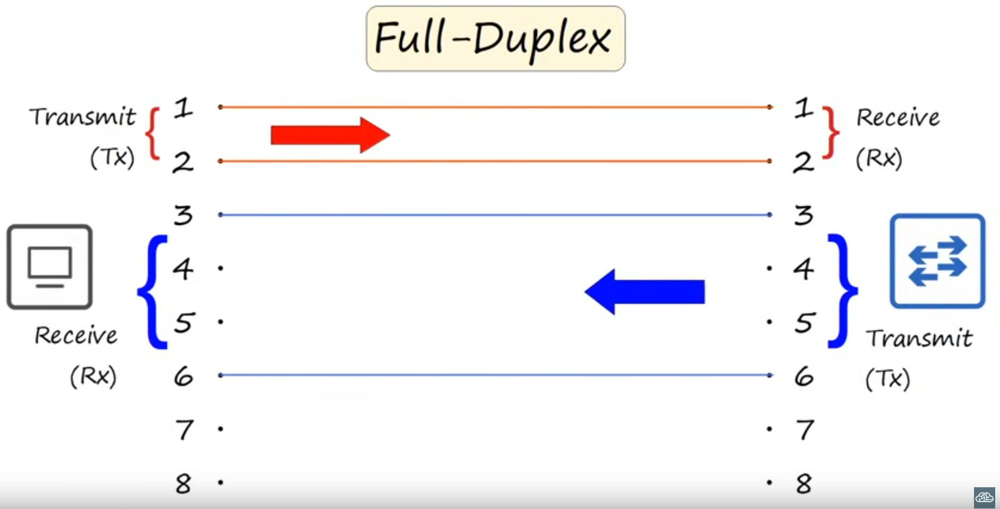
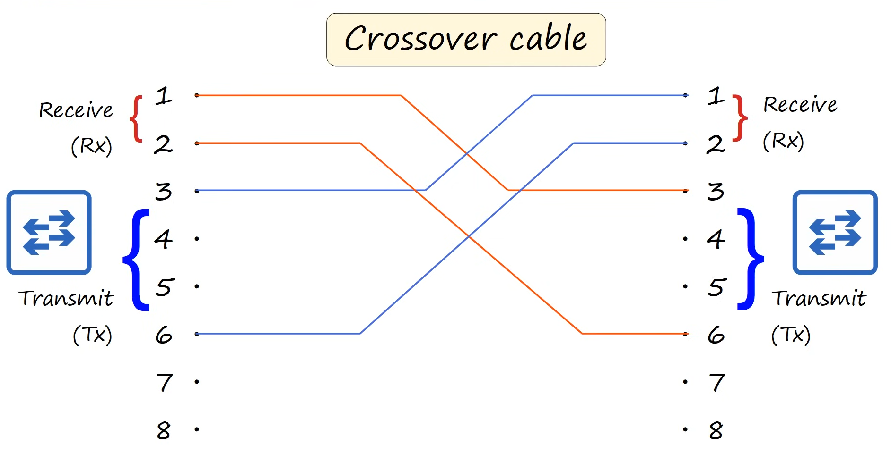
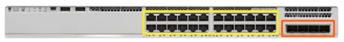
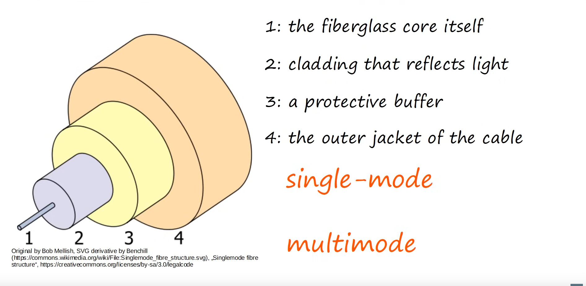
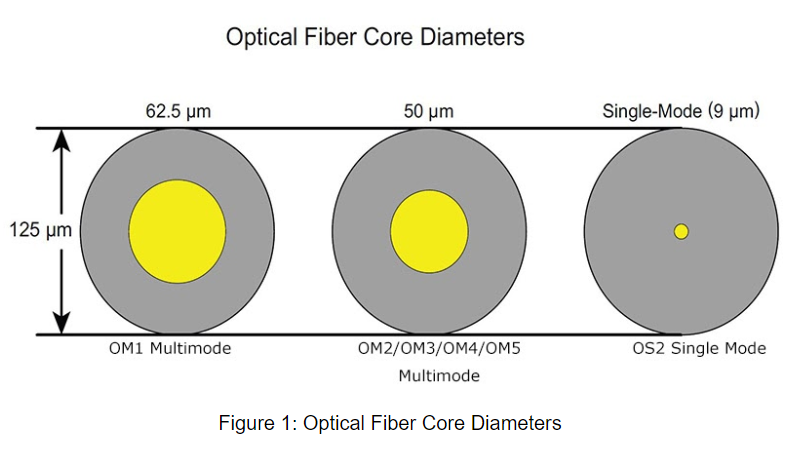
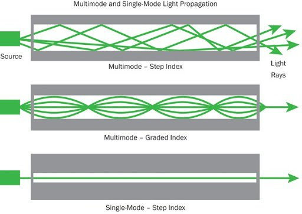

# Day 2 - Iterfaces and Cables

-   RJ-45 (RJ = Registered Jack)
    -   copper ethernet cabble

## Binary

When communicating through a copper network cable, a variation in the electrical signal is received by the interpreting device as a 0 or a 1.

-   A byte is 8 bits

-   **Speed** is measured in **bits per second** (Kbps, Mbps, Gbps, etc) and not bytes per second.

-   1 Kb = 1000 b
-   1 Mb (Mega) = 1 \* 106 bits
-   1 Gb (Giga) = 1 \* 109 bits
-   1 Tb (Tera) = 1 \* 1012 bits
-   1 Pb (Peta) = 1 \* 1015 bits
-   1 (Exa) = 1 \* 1018 bits

## Ethernet

-   **Ethernet** is a collection of network protocols/standards.

### Ethernet Standards

-   Defined in the **IEEE** (Intitute of Electrical and Eletronics Engineers) **802.3** standard in 1983

### Copper Cables

| Speed    | Common Name      | IEEE Standard | Informal name | Maximum Length |
| -------- | ---------------- | ------------- | ------------- | -------------- |
| 10 Mbps  | Ethernet         | 802.3i        | 10BASE-T      | 100 m          |
| 100 Mbps | Fast Ethernet    | 802.3u        | 100BASE-T     | 100 m          |
| 1 Gbps   | Gigabit Ethernet | 802.3ab       | 1000BASE-T    | 100 m          |
| 10 Gbps  | 10 Gig Ethernet  | 802.3an       | 10GBASE-T     | 100 m          |

The copper cables used in Ethernet Standards are **UTP Cables** (Unshielded Twisted Pair). - **Unshielded** - The wires have no shield, which can make them vulnerable to eletrical interference - **Twisted** - There are 4 pairs of cables twisted together. The twisting helps protecting against electromagnetical interference or EMI

**RJ-45** has 8 pins, however not all the ethernet standards make use of all the wires.

#### 4 wires

10BASE-T (Ethernet) = 2 pairs (4 wires)
100BASE-T (Fast Ethernet) = 2 pairs (4 wires)

-   This allows for **full duplex transmission**
-   **Full Duplex Transmission**: both devices can send and receive data at the same time.
    -   no collisions will occur because they use separate wires to transmit (Tx) and receive (Rx) data

##### Straight-Through Cable

-   A router transmits and receives data on the same pins a computer does (tx: 1,2 ; rx: 3, 6).

-   The cable above is called a **straight-through cable** (each pin connects to the same pin on the opposite side).

    -   This works fine for example for connections pc-switch and router-switch.

##### Crossover Cable

-   To connect devices that **transmit** and **receive** data **on the same pins** (router-pc, pc-pc, router-router, switch-switch, etc.) we need to use a **Crossover Cable**

##### Devices and Pins

| Device Type | Transmit (Tx) Pins | Receive (Rx) Pins |
| ----------- | ------------------ | ----------------- |
| Router      | 1 and 2            | 3 and 6           |
| Firewall    | 1 and 2            | 3 and 6           |
| PC          | 1 and 2            | 3 and 6           |
| Switch      | 3 and 6            | 1 and 2           |

##### Auto MDI-X

Auto MDI-X allows devices to check which pins their neighbor is trasmitting data on and decide accordingly which pins they use to transmit data. They can then exchange data normally.

#### 8 wires

1000BASE-T (Gigabit Ethernet) = 4 pairs (8 wires)
10GBASE-T (10 Gig Ethernet) = 4 pairs (8 wires)

-   Pairs **4,5** and **7,8** are now **used**.
-   **Each pair** is **bidirectional** and not specialized.

### Fiber-Optic Cable

-   The ports in **yellow** are the ports for **RJ-45 connectors** to which you would connect a **Copper UTP Cabble**.

-   The ports in red could be used for Fiber-Optic Connections.

-   In these ports you connect a **SFP Transceiver (Small Form-Factor Pluggable)**

-   You connect a **fiber-optic cable** to this:

-   Rather than an eletrical signal over wire, **these cables send** **light over glass fibers**.

-   2 connectors on each end:
    -   one connector to transmit data
    -   one connector to receive data
    -   each cable connects to the opposide (rx-tx tx-rx)

#### Multimode Fiber

-   Core **diameter** is **wider** than single-mode fiber

-   Allows **multiple angles** (modes) of light waves to enter the fiber glass core

-   Allows **longer** cables **than UTP**, but **shorter** cables **than** **single-mode fiber**

-   **Cheaper** than single-mode fiber (due to cheaper LED-based SFP transmitters).

### Single-mode fiber

-   Core **diameter** is **narrower than multimode** fiber.

-   Light enters at a **single angle (mode)** from a **laser-based transmitter**.

-   Allows **longer cables** **than** both **UTP** and **multimode fiber**.

-   **More expensive** than multimode fiber (due to more expensive laser-based SFP transmitters).

#### Fiber-Optic cable Standards

| Informal Name | IEEE Standard | Speed   | Cable Type              | Maximum Length       |
| ------------- | ------------- | ------- | ----------------------- | -------------------- |
| 1000BASE-LX   | 802.3z        | 1 Gbps  | Multimode or Singe-Mode | 550m (MM) / 5km (SM) |
| 10GBASE-SR    | 802.3ae       | 10 Gbps | Multimode               | 400m                 |
| 10GBASE-LR    | 802.3ae       | 10 Gbps | Singe-Mode              | 10km                 |
| 10GBASE-ER    | 802.3ae       | 10 Gbps | Singe-Mode              | 30km                 |

### UTP vs Fiber-Optic Cabling

| UTP                                                                                   | Fibre-Optic                                                                                 |
| ------------------------------------------------------------------------------------- | ------------------------------------------------------------------------------------------- |
| **Lower cost** than fiber-optic                                                           | **Higher cost** than UTP                                                                        |
| **Shorter maximum distance** than fiber-optic (~100m)                                     | **Longer maximum distance** than UTP                                                            |
| Can be **vulnerable to EMI** (Eletromagnetic Interference)                                | **No vulnerability to EMI**                                                                     |
| **RJ45 ports** used **with UTP** are **cheaper** than SFP ports.                                  | **SFP ports** are **more expensive** than RJ45 ports (single-mode is more expensive than multimode) |
| Emit (**leak**) a **faint signal** outside of the cable, which can be copied (**=security risk**) | D**oes not emit any signal outside** of **the cable** (**=no security risk**)                           |
