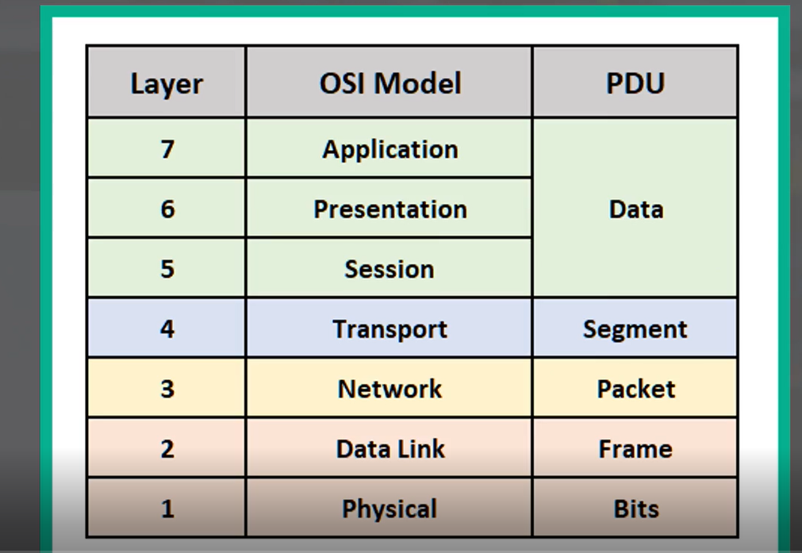

# Day 3 - OSI Model & TCP/IP Suite

-   Networking **models** categorize and provide a structure for networking **protocols**.
    -   **protocols** (logical): a set of rules defining how network devices and software should work.

## OSI MODEL

-   '**Open Systems Interconnection**' model
-   A **conceptual model** that categorizes and standardizes different functions in a network
-   Created by the 'International Organization for Standardization' (ISO)
-   Functions are divided into **7 'Layers'**
-   These **layers work together** to make the network work.

-   **P**lease **D**o **N**ot **T**hrow **S**ausages **P**izzas **A**way

| OSI Model    |
| ------------ |
| Application  |
| Presentation |
| Session      |
| Transport    |
| Network      |
| Data Link    |
| Physical     |

### Layer 7 - Application Layer

-   The layer is **closest to the user**.
-   Interacts with software application, for example your web browser (Brave, Firefox, Chrome, etc.)
-   e.g. HTTP, HTTPS

-   Function of layer 7 are:
    -   Identifying communication partners.
    -   Synchronizing communication

### Layer 6 - Presentation Layer

-   Data in the application layer is **in 'application format'**.
-   It **needs to be 'translated' to a different format** to be sent over the network.
-   The Presentation Layer's job is to translate between application and network formats.

-   e.g. **encryption** of data as it is sent, and **decryption** of data as it is received.
-   Also **translates between different Application** **Layer formats**.

### Layer 5 - Session Layer

-   **Controls dialogues** (sessions) **between** communication **hosts**.
-   **Establishes, manages and terminates connections** **between** the **local** application (e.g. your web browser) **and** the **remote application** (e.g. youtube).

### Layer 4 - Transport Layer

-   **Segments and reassembles data** for communications between end hosts
-   **Breaks larger pieces** of data **into smaller segments** which can be more easily sent over the network and are less likely to cause trasmission problems if errors occur.
-   Provides **host-to-host** communication

-   Data + **L4 Header** => **Segment**

### Layer 3 - Network Layer

-   Provides connectivity between end hosts on different networks.
-   Provides **logical addressing** (IP Addresses)
-   Provides path selection between source and destination.
-   Routers operate at Layer 3.
-   Data + L4 Header + **L3 Header** (e.g. src, dst) => **Packet**

### Layer 2 - Data Link Layer

-   Provides **node-to-node connectivity** and **data transfer** (e.g. PC to switch, switch to router, router to router).
-   **Defines how data is formatted** **for transmission over** a **physical medium** (e.g. copper UTP cables)
-   Detects and (possibly) corrects Physical Layer errors.
-   Uses **Layer 2 addressing** separate from Layer 3 addressing.
-   Switches operate at Layer 2.
-   **L2 Trailer** + Data + L4 Header + L3 Header + **L2 Header** => **Frame**

### Layer 1 - Physical Layer

-   Defines physical characteristics of the medium used to transfer data between devices.

    -   e.g. voltage levels, max transmission distances, physical connector, cable specs, etc.

-   Digital bits are converted into eletrical (for wired connections) or radio (for wireless connections) signals.

### Protocol Data Units (PDUs)

## TCP/IP

-   **Conceptual model** and **set of communications protocols** used in the internet and other networks.
-   Known as TCP/IP because those are two of the foundational protocols in the suite.
-   Developed by the United States Department of Defense through DARPA (Defense Advanced Research Projects Agency).
-   Similar to OSI but with fewer layers.
-   This is the **model** actually **in use** **in modern networks**.
-   Note: OSI model still influences how network engineers think and talk about networks.

| TCP/IP      |
| ----------- |
| Application |
| Transport   |
| Internet    |
| Link        |
