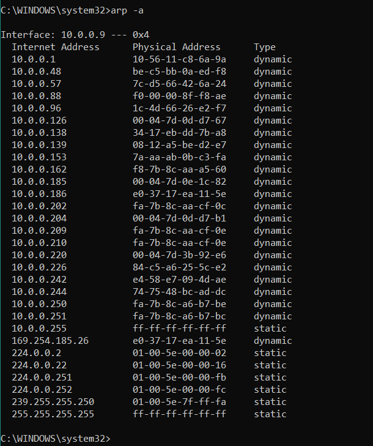

# Ethernet LAN Switching

## LAN (Local Area Network)

A **LAN** is a network contained within a relatively small area (office floor, home network, ...)

-   Routers are used to connect different LANs

## Ehternet Frame


- The minimum size of an Ethernet frame (Header + [Packet] + Trailer) is 64 bytes
    - 64 bytes - 18 bytes = 46 bytes
        - the preamble and sfd are usually not considered part of the header
        - if the **payload** is **less than 46 bytes**, **padding** is **added**

### Ethernet Header

-   **Preamble:**
    -   **7 bytes**
    -   alternating 1's and 0's (10101010...)
    -   allows devices to **synchronize** their **receiver clocks**
-   **SFD (Start Frame Delimiter):**
    -   **1 byte**
    -   pattern: 10101011
    -   indicates the end of the preamble and the begin of the rest of the frame
-   **Destination:**
    -   **6 bytes** (MAC)
    -   layer 2 address (MAC) to which the frame is being sent
-   **Source:**
    -   **6 bytes** (MAC)
    -   layer 2 address (MAC) of the device which sent the frame
-   **Type / Length:**
    -   **2 bytes**
    -   A value of **1500 or less** indicates the length of the encapsulated packet (in bytes)
        -   e.g. if 1400 => the encapsulated packet is 1400 long (in bytes)
    -   A value of **1536 or greater** indicates the type of the encapsulated packet (usually IPv4 or IPv6)
        -   e.g. IPv4 = 0x800 aka 2048 in decimal
        -   e.g. IPv6 = 0x86DD aka 34525
        -   the length is determined via other methods
    -   Indicates the Layer 3 protocol used in the encapsulated packet (e.g. IPv4, IPv6).
    -   can be a **length field** depending on the version of internet

### Ethernet Trailer

-   **FCS (Frame Check Sequence):**
    -   **4 bytes**
    -   **Detects corrupted data** by running a **CRC (Cyclic Redundancy Check)** algorithm over the received data
        -   **Cyclic** refers to cyclic codes
        -   **Redundancy** refers to the bits being added to the end and adding no new information
        -   **Check** refers to the fact that it verifies data for errors

### MAC Address

-   **MAC** = **Media Access Controll**
-   **12 hexadecimal** characters
-   **6 byte** (48-bit) **address of the physical device**
-   Assigned to the device when it is made (burned-in-address)
-   **globally unique** (there are exceptions, but let's not consider them)
-   the **first 3 bytes** are the **OUI (Organizationally Unique Identifier)**, which is assigned to the company making the device
-   The **last 3 bytes** are **unique to the device itself**

#### MAC Address Table
- To view the mac address table on **Cisco IOS**, you can type `mshow mac address-table`

- **aging:** if the switch doesn't see traffic in 5 minutes, it will remove the mac address entry.
- you can also manually remove mac addresses manually:
    - `clear mac address-table dynamic`: removes all of the dynamic mac addresses
    - `clear mac address-table dynamic address <mac-address>`: removes the mac address specified
    - `clear mac address-table dynamic interface <interface>`: removes the mac address entries for a specific interface

### Flow

#### Terminology

- **Unicast Frame:** A frame destined for a single target.

- **Unknown Unicast Frame:** A frame for which the switch doesn't have an entry in its MAC address table. (=FLOOD)

- **Known Unicast Frame:** A frame for which the switch has an entry in its MAC address table. (=FORWARD)

- **Dynamically Learned MAC Address:** MAC address put into the MAC Address Table without being manually put.

#### Step 1: Initial State

When a switch is powered on, its MAC address table is empty. The switch doesn't know which devices are connected to which ports.

#### Step 2: Receiving a Frame

When a switch receives an Ethernet Frame on one of its ports, it inspects the frame's source MAC address and the port on which it was received.

#### Step 3: Learning the Source MAC Address

The switch adds the source MAC address and the corresponding port number to its MAC address table. This process is known as "learning". For example, if a frame with a source MAC address of `AA:BB:CC:DD:EE:FF` is received on port 1, the switch records this in its table.

| MAC               | Interface |
| ----------------- | --------- |
| AA:BB:CC:DD:EE:FF | F0/1      |
| ...               | ...       |

-   This is known as a **Dynamically learned** MAC Address or **Dynamic** MAC address, since it was not manually put on the switch.

#### Step 4: Checking the Destination MAC Address

The switch then checks the destination MAC address in the Ethernet frame against its MAC address table to determine how to forward the frame.

#### Step 5: Forwarding Decision

1. If the destination MAC address is found in the MAC address table:

    - The switch forwards the frame out of the port associated with the destination MAC address. For instance, if the destination MAC address is 11:22:33:44:55:66 and it is found in the table with an associated port of 3, the switch sends the frame out of port 3.

2. If the destination MAC address is not found in the MAC address table:
    - The switch floods the frame out of all ports except the port on which it was received. This ensures the frame reaches its destination if the destination device is connected to the network.

#### Step 6: Aging Process

MAC addresses are not stored indefinitely in the MAC address table. Each entry has a timer known as the "aging timer". If the switch does not receive any frames from a particular MAC address within a specified period (typically 300 seconds), it removes the MAC address from the table. This process is called "aging".

- **NOTE:** **In CISCO switches**, dynamic **mac addresses** are **removed** from the MAC Address Table **after 5 minutes** of **inactivity**.

#### Step 7: Updating the MAC address Table

Whenever the switch receives new frames, it continuously updates the MAC address table. If a frame is received with a source MAC address already in the table, but on a different port, the switch updates the table to reflect this new port. This helps the switch to adapt to changes in the network topology.


## ARP (Address Resolution Protocol) 

- ARP is used to discover the Layer 2 adress (MAC Address) of a known Layer 3 address (IP Address)
- Consists of two messages:
    - **ARP Request**
    - **ARP Reply**

- **ARP Request** is **broadcast** => sent to all hosts on the network.
- **ARP Reply** is **unicast** => sent only to one host (the host that sent the request)

```
ARP REQUEST
Src IP: 192.168.1.1
Dst IP: 192.168.1.3
Src MAC: 0C2F.B011.9D00
Dst MAC: FFFF.FFFF.FFFF (Broadcast MAC Address)
```

```
ARP REQUEST
Src IP: 192.168.1.3
Dst IP: 192.168.1.1
Src MAC: 0C2F.B064.3900
Dst MAC: 0C2F.B011.9D00
```

### ARP Table



- **Internet Address** = IP Address (Layer 3 Address)
- **Physical Address** = MAC Address (Layer 2 Address)
- **Type**
    - **static:** default entry
    - **dynamic:** learned via ARP

- To view the arp table you can run:
    - `arp -a`: Windows / Linux
    - `show arp`: Cisco IOS

## Ping (ICMP)
- ICMP = Internet Control Message Protocol 
- A network utility that is used to test reachability
- Measures round-trip time
- Uses two messages:
    - ICMP Echo Request
    - ICMP Echo Reply

- `ping (ip-address)`

## CISCO IOS REVIEW

- **MAC ADDRESS TABLE:** `show mac address-table`
    - Contains VLAN, MAC-address, Type, Ports fields
- **ARP TABLE:** `show arp`

- **Manually removing mac address table entries:**
    - `clear mac address-table dynamic`: r`moves all of the dynamic mac addresses
    - `clear mac address-table dynamic address <mac-address>`: removes the mac address specified
    - `clear mac address-table dynamic interface <interface-id>`: removes the mac address entries for a specific interface