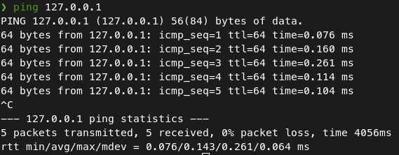

# IPv4 Addressing

## Review

#### Layer 3 - Network

-   Provides connectvity between end hosts on different networks (ie. outside of the LAN)
-   Provides logical addressing (IP addresses)
-   Provides path selection between source and destination
-   Routers operate at Layer 3

## IPv4 Address Classes

| Class | First Octet | First Octet Numeric Range |
| ----- | ----------- | ------------------------- |
| A     | 0xxxxxxx    | 0 - **126** (~~127~~)     |
| B     | 10xxxxxx    | 128 - 191                 |
| C     | 110xxxxx    | 192 - 223                 |
| D     | 1110xxxx    | 224 - 239                 |
| E     | 1111xxxx    | 240 - 255                 |

-   **Class D:** Multicast Addresses
-   **Class E:** Reserved (Experimental)

### Loopback Addresses

-   **127** is reserved for loopback addresses.

-   **Address Range:** 127.0.0.0 - 127.255.255.255

-   Used to test the "network stack" (e.g OSI / TCP/IP) on the local device

| Class | First Octet | First Octet Numeric Range | Prefix Length |
| ----- | ----------- | ------------------------- | ------------- |
| A | 0xxxxxxx | 0 - 127 | /8 | 
| B | 10xxxxxx | 128 - 191 | /16 | 
| C | 110xxxxx | 192 - 223 | /24 | 

### Netmasks

- Cisco devices still use a **dotted decimal mask** for netmasks (a older more difficult way)

- **Class A:** / 8 <->  256.0.0.0 (11111111 00000000 00000000 00000000)
- **Class B:** / 8 <->  256.256.0.0 (1... 1... 0... 0...)
- **Class C:** / 8 <->  256.256.256.0 (1... 1... 1... 0...)

- **MAX Hosts per network = 2n - 2** (where n = numbers of host bits)

## CISCO IOS

- `show ip interface brief` ( on privileged EXEC mode)
    - fields: confirm the status of each interface of a device, as well as their status
        - **Interface:** network interfaces of the device 
        - **IP-Address:** ip address of each interface (unassigned if they're not assigned yet)
        - **OK?** - if the ip is valid or not
        - **Method**
        - **Status**: layer 1 status of the interface
            - if the interface isok, there is a cabled to another device
            - **administratively down (default on routers):** Interface has been disabled with the `shutdown` command
            - **note:** administratively down is not the default on switch interfaces  (they will be either **up** or **down**)
        - **protocol:** layer 2 status of the interface
            - if the **status** is down, **protocol** will never be up, however the reverse may be possible

### Interface Configuration 

- Must be first in **Global Configuration Mode** (configure terminal)

#### Entering Interface Configuration Mode

- `interface <name of the interface>` to enter interface configuration mode (e.g. `interface gigabitethernet 0/0`)
    - you can also type without spaces (e.g. `interface gigabitethernet0/0`) 
    - **shortcut:** in g0/0
    - You will see something like: `R1 (config-if)#`

#### Setting IP Address

- `ip address <ip-address> <subnet-mask>`
    - **subnet mask** needs to be in dotted decimal

#### Enabling the interface 

- `no shutdown` - since cisco device interface's have the shutdown applied by default, you cancel the command 

### Other commands

- `show interfaces`: displays a lot of information about all of the interfaces

- `show interfaces <interface>`
    - primarily shows information about layer 1 and 2, but also about layer 3
    - **GigabitEthernet0/0 is up** (layer 1), **line protocol is up** (layer 2)
        - this line is like the status and protocol columns of the `show ip interface brief` command
    - Hardware is iGbE (1gbit ethernet), address is <mac-addr\> (bia <burnt-in-addr\>)

- `show interfaces description`
    - **descriptions** are **optional** but can be used in identifying the purpose of each interface

- to configure a description run `description <description>` in interface configuration mode.