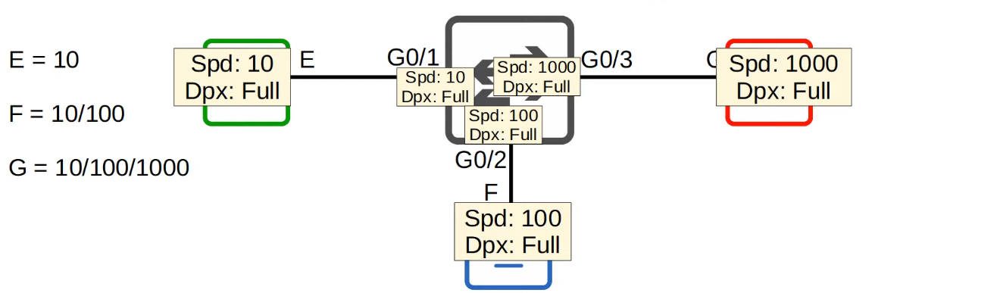
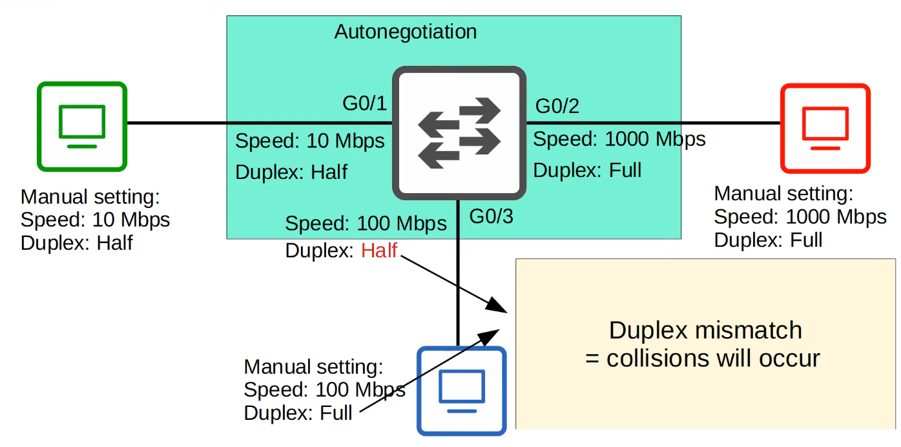
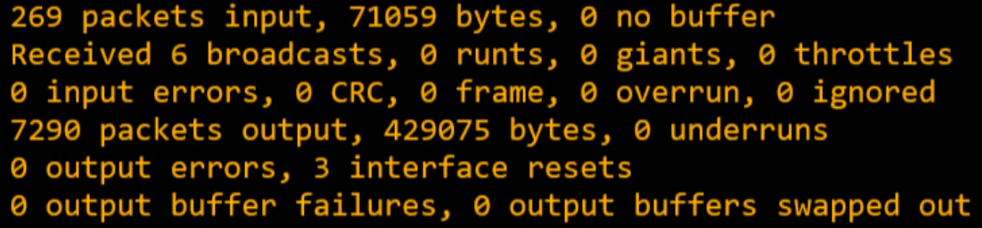

# Day 09 - Switch Interfaces

-   **down** / **down** (Status / Protocol) doesn't mean that the interfaces are shutdown (**administratively down**). It means they aren't connected to another device.

-   **Router** interfaces have the `shutdown` command applied by default => will be in `administratively down` / `down` state by default.

-   **Switch** interfaces **do NOT** have the `shutdown` command applied by default => will be in the `up` / `up` state if connected to another device **OR** in the `down` / `down` state if not connected to another device.

## `show ip interface status `

-   Useful command to check on switch interfaces

| Port | Name | Status | Vlan | Duplex | Speed | Type |
| ---- | ---- | ------ | ---- | ------ | ----- | ---- |
| Fa0/1 | | Connected | 1 | a-full | a-100 | 10/100BaseTX |

- **Port:**  Lists each interface
- **Name:** Description of the interface
- **Status:** status of the interface (different from `show ip interfaces brief`)
- **Vlan:** used to divide LANs into smaller LANs (default: 1)
- **Duplex:** whether the device is capable to send and receive data at the same time (full-duplex) - (auto by default)
    - a-full: (a stands for auto) and it means that it automatically negociated a duplex of full with the neighbor device
- **Speed:** (auto by default)
    - e.g. a-100: automatically negociated to the device they are connected to and using the fastest speed both devices are capable of (in this case, FastEthernet)
- **Type:** 
    - e.g. 10/100BaseTX

## Configuring interface speed and duplex

- **auto-negociation** works well, so usually we'll leave it be, however, for CCNA its useful to know how to configure these manually.

```
SW1#conf t

SW1(config)# int f0/1

SW1(config-if)# speed ?
10          Force 10Mbps operation
100         Force 100Mbps operation
auto        Enable AUTO speed configuration

SW1(config-if)# speed 100

SW1(config-if)# duplex
auto        Enable AUTO duplex configuration
full        Force full duplex configuration
half        Force half duplex configuration

SW1(config-if)# duplex full

SW1(config-if)# description ## to R1 ##
```

- **Duplex** will be **full** **instead** of **a-full**.
- **Speed** will be **100** instead of **a-100**.

- If interfaces will not be used, they should be disconnected, otherwise it might be a security concern.

### `interface range`

- To configure a range of interfaces at the same time you can do the following:

```
SW1(config)# interface range f0/5 - 12

SW1(config-if-range)# description ## not in use ##

SW1(config-if-range)# shutdown

... changed state to administratively down

```

- **interface config range mode**

- ranges don't have to be consecutive:
    - `int range config f0/5 - 6, f0/9 - 12`

### Full vs Half Duplex

- **Full Duplex:** The device **can** send and receive data at the same time. it does not have to wait.

- **Half Duplex:** The device cannot send and receive data at the same time. If it is receiving a frame, it must wait before sending a frame.

### CSMA/CD
- **C**arrier **S**ense **M**ultiple **A**ccess with **C**ollision **D**etection
- Before sending frames, devices "listen" to the collision domain until they detect that other devices are not sending.
- If a collision occurs, the device sends a jamming signal to inform other devices that a collision happened.
- Each device will wait a random period of time before sending frames again
- The process repeats


- For **hubs** (simple repeaters that operate at layer 1)

- Redacted by switches, which operate at layer 2 (using MAC Addresses) to send frames to specific hosts.
    - won't try to send 2 frames to the same host at once.

- Devices attached to a **hub** must operate in **half duplex**
- Devices attached to a **switch** can operate in **full duplex**

### Speed/Duplex Auto-Negotiation

- Interfaces that can run at different speeds have default settings of **speed auto** and **duplex auto**
- Interfaces "advertise" their capabilities to the neighboring device, and they negotiate the best **speed** and **duplex** settings they are both capable of.



- if autonegotiation is disbales on the device:
    - **SPEED:** the switch will try to sense the speed that the other device is operating at. If it fails to sense the speed, it will use the slowest supported speed (e.g. 10Mbps on a 10/100/1000 interface)
    - **DUPLEX:** 
        - If the **speed is 10 or 100 Mbps**, the switch will use **half-duplex**
        - Otherwise, half-duplex


 
### `show interfaces <interface>` errors



- **Runts:** Frames that are smaller than the minimum frame size (64 bytes)
- **Giants:** Frames that are bigger than the maximum frame size (1518 bytes)
- **CRC:** Frames that failed the CRC check (in the Ethernet FCS trailer)
- **Frame:** Frames that have an incorrect format due to an error
- **Input Errors:** Total of various counters, such as the above four
- **Output Errors:** Frames the switch tried to send, but failed due to an error