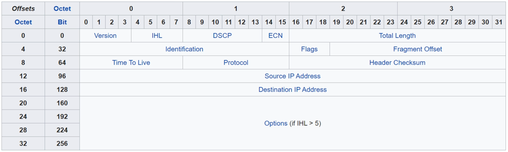

# Day 10 - IPv4 Header

- left to right, top to bottom

- **Version:**
    - **4 bits**
    - **identifies** the **version** of IP:
        - IPv4 = 4 (0100)
        - IPv6 = 6 (0110)

- **Internet Header Length (IHL):**
    - **4 bits**
    - The final field of the IPv4 (Options) is variable in length, so this field is necessary to indicate the total length of the header.
    - Identifies the length of the header **in 4-byte increments**.
    - e.g. 5 = 5 * 4-bytes = 20 bytes
    - minimum value is 5 (=20 bytes)
        - this is the value if options does not exist
    - maximum value is 15 (15 * 4-bytes = 60 bytes)

- **`Note:`** **MINIMUM IPv4 HEADER LENGTH = 20 BYTES**
- **`Note:`** **MAXIMUM IPv4 HEADER LENGTH = 60 BYTES**

- **Differentiated Services Code Point (DSCP):**
    - **6 bits**
    - Used for QoS (Quality of Service)
    - Used to prioritize delay-sensitive data (streaming voice, video, etc.)

- **Explicit Congestion Notification (ECN)**
    - **2 bits**
    - Provides end-to-end (between 2 endpoints) notification of network congestion **without dropping packets**
    - Optional field that requires both endpoints, as well as the underlying network to support it.

- **Total Length Field:**
    - **16 bits**
    - Indicates the **total length of the packet** (**L3 header** **+ L4 segment**)
    - **Measured in bytes** (not 4-byte increment like IHL)
    - **Minimum** value of **20** (=IPv4 header with no encapsulated data)
    - **Maximum** value of **65535** (maximum 16-bit value)

- **Identification field:**
    - **16 bits**
    - **If** a **packet is fragmented** due to being too large, this field is **used to identify which packet the fragment belongs to** (so it can be reassembled).
    - All fragments of the same packet will have their own IPv4 header with the same value in this field.
    - **Packets** are **fragmented** **if larger than the MTU** (Maximum Transmission Unit)
        - The **MTU** is usually **1500 bytes**
    - Fragments are reassembled by the receiving host

- **Flags:**
    - **3 bits**
    - Used to **control/identify fragments**
    - **Bit 0:**
        - reserved
        - always set to 0
    - **Bit 1:**
        - **Don't Fragment (DF bit)**, used to indicate a packet that should not be fragmented
    - **Bit 0:**
        - **More Fragments (MF bit)**, set to **1 if** there are **more fragments in the packet**, set to **0** for **the last framgent**
        - Unfragmented packets will always have their MF bit set to 0

- **Fragment Offset:**
    - **13 bits**
    - Used to indicate the position of the fragment within the original, unfragmented IP packet
    - Allows fragmented packets to be reassembled even if the fragments arrive out of order

- **Time to Live (TTL):**
    -  **8 bits**
    - A **router** will **drop a packet with a TTL of 0**.
    - Used to **prevent infinite loops**
    - Originally designed to indicate the packet's maximum lifetime in seconds
    - In practice indicates a **"hop count"**: each time the packet arrives at a router, the router **decreases TTL by 1**.
    - Recommended **default TTL** is **64**.

- **Protocol:**
    - **8 bits**
    - Indicates the protocol of the encapsulated Layer 4 PDU
        - **1: ICMP**
        - **6: TCP**
        - **17: UDP**
        - **89: OSPF (dynamic routing protocol)**

- **Header Checksum:**
    - A calculated checksum used to **check for errors in the IPv4 header**.
    - When a router receives a packet, it calculates a checksum of the header and compares it to the one it this field of the header.
        - If they do not match, the router drops the packet (error occurred).
    - Used to check for errors only in the IPv4 header.
    - IP relies on the encapsulated protocol to detect errors in the encapsulated data.
    - Both **TCP and UDP have their own checksum fields to detect errors** in the encapsulated data.

- **Source IP Address:**
    - **32 bits**
    - IPv4 Address of the sender of the packet

- **Destination IP Address:**
    - **32 bits**
    - IPv4 Address of the receiver of the packet

- **Option Fields:**
    - **0 - 320 bits**
    - Rarely used
    -    If the **IHL** is **greater than 5**, it means options are present.