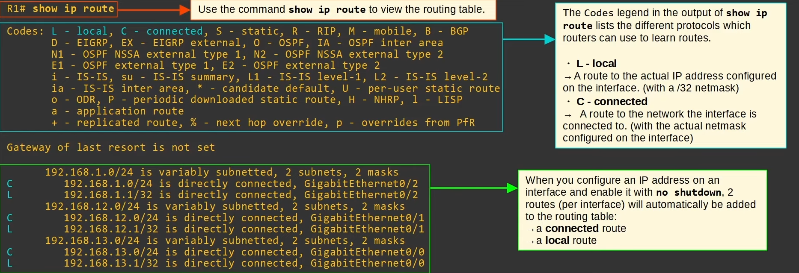
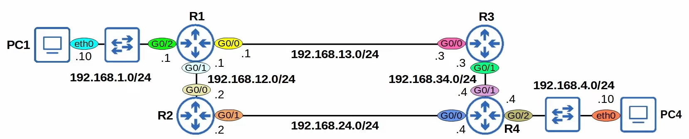

# Day 11 - Routing fundamentals

# Part 1

## What is routing?

- **Routing** is the process that routers use to determine the path that IP packets should take over a network to reach their destination.
    - Routers store routes to all of their known destinations in a **routing table**.
    - When routers receive packets, they look in the **routing table** to find the best route to forward that packet.

- There are two main routing methods (methods that routers use to learn routes):
    - **Dynamic Routing:** Routers use dynamic routing protocols (i.e. OSPF) to share routing information with each other automatically and build their routing tables.
    - **Static Routing:** A network engineer/admin manually configures routes on the router.

- A **route** tells the router: to send packet to *destination X*, you should send the packet to **next-hop** Y.
    - or, if the destination is directly connected to the router, send the packet directly to the destination.
    - or, if the destination is the router's own IP address, receive the packet for yourself (don't forward it).

`next-hop` = the next router in the path to destination

#### Wide Area Network (WAN)
A network that extends over a large geographical area.

## Routing Table: `show ip route`

- `show ip route` displays the routing table

- The codes legend in the ouput of **show ip route** lists the different protocols which routers can use to learn routes.
    - **L - Local**
        - A route to the actual IP address configured on the interface. (with a /32 netmask)
    - **C - Connected**
        - A route to the network the interface is connected to. (with the actual netmask configured on the interface)

- When you configure an IP address on the interface and enable it with `no shutdown`, 2 routes (per interface) will automatically be added to the routing table.
    - a **connected** route
    - a **local** route



- A **connected route** is a route to the network the interface is connected to
    - It provides a route to all hosts in that network
    - e.g. "If I need to send a packet to any host in the *network X* I should send it out of `interface X`

- A **local route** is a route to the exact IP address configured on the interface
- A /32 netmask is used to specify the exact IP address of the interface (all bits are fixed)

- A route **matches** a packet's destination if the packet's destination IP address is part of the network specified in the route.


### Route Selection

If we have the following in `show ip route`:

```
    192.168.1.0/24 is variably subnetted, 2 subnets, 2 masks
C       192.168.1.0/24 is directly connected, GigabitEthernet0/2
L       192.168.1.1/32 is directly connected, GigabitEthernet0/2
```

- When R1 receives a packet destined for 192.168.1.1, it will select the route to 192.168.1.1/32.
    - R1 will receive the packet for itself, rather than forward it out of G0/2.

- **Local Route** = keep the packet, don't forward it.

- A packet destined for 192.168.1.1 is matched by both routes:
    - 192.168.1.0/24
    - 192.168.1.12/32

- Which route will R1 use for a packet destined for 192.168.1.1?
    - It will choose the **most specific** matching route.

- **Most specific matching route** => the matching route with the **longest prefix length**.


## Summary 

- Routers store information about destinations they know in their **routing table**.
    - When they receive packets, the look in the routing table to find the best route to forward the packet.

- Each **route** in the routing table is an instruction
    - To reach destination in network X, send the packet to **next-hop** Y (the next router in the path to the destination).
    - If the destination is directly connected (**Connected Route**) send the packet directly to the destination.
    - If the destination is your own IP address (**Local Route**) receive the packet for yourself.

- When you configure an IP address on an interface and enable the interfacec, two routes are automatically added to the routing table:
    - **Connected Route** (code C in the routing table): A route to the network connected to the interface.
    - **Local Route** (code L in the routing table): A route to the exact IP address configured on the interface.

- A route **matches** a destination if the packet's destination IP address is part of the network specified in the route.

- If a router receives a packet and it doesn't have a route that matches the packet's destination, it will drop the packet.
    - This is different than switches, which **flood** frames if they don't have a MAC table entry for the destination.

- If a router receives a packet and it has multiple routes that match the packet's destination, it will use the **most specific** matching route to forward the packet.
    - **Most specific** matching route = the matching route with the longest prefix.


# Part 2

## Routing Packets

### Default Gateway



- End hosts like PC1 and PC4 can send packets directly to to destinations in their connected network.
    - PC1 is connected to 192.168.1.0/24
    - PC4 is connected to 192.168.4.0/24

- To send packets outside of their local network, they must send the packets to their **default gateway**.

- The **default gateway** configuration is also called a **default route**.
    - It is a **route to 0.0.0.0/0** => all netmask bits set to 0. Includes all addresses from 0.0.0.0 to 255.255.255.255

- The **default route** is the **least specific route** possible, because it includes all IP addresses:
    - 0.0.0.0/0 = 4,294,967,296 IP addresses

#### Static Routes

```
Src. IP: 192.168.1.10
Dst. IP: 192.168.4.10
```

1) When R1 receives the frame from PC1, it will de-encapsulate it (remove L2 header/trailer) and look at the inside packet.

2) It will check the routing table for the most-specific matching route:
    - If there are no matching routes, the packet will be dropped.

- There are two possible routes that PC1 to PC4 can take:
    - PC1 -> R1 -> R3 -> R4 -> PC4
    - PC1 -> R1 -> R2 -> R4 -> PC4
    - it is possible to configure routers to **load-balance** between path 1) and 2) or to use one path as the main one and the other as backup.


3) Each router in the path needs two routes: a route to PC1's network and another to PC2's network.

    - this ensures **two-way reachability**.
    - routers don't need routes to all the networks in the path to the destination
    - R1 already has a Connected Route to PC1's Network, and R4 already has a Connected Route to PC2's Network. The others must be manually configures (**Static Routes**)

- Summing it up, we need to configure the following Routes:
    - R1 -> 192.168.4.0/24: 192.168.13.3
    - R3 -> 192.168.1.0/24: 192.168.13.1
    - R3 -> 192.168.4.0/24: 192.168.34.4
    - R4 -> 192.168.1.0/24: 192.168.34.3


4) Configuring the Static routes:

- The command to configure static routes is:
    - `ip route <ip-address> <netmask> <next-hop>`

So, we would need to do the following:

```
R1> en
R1# conf t
R1(config)# ip route 192.168.4.0 255.255.255.0 192.168.13.3
R1(config)# do show ip route

<...>
## The [1/0] displayed in static routes means:
##      - [Administrative Distance/Metric]
S   192.168.4.0/24 [1/0] via 192.168.13.3
<...>


R3> en
R3# conf t
R3(config)# ip route 192.168.1.0 255.255.255.0 192.168.13.1
R3(config)# ip route 192.168.4.0 255.255.255.0 192.168.34.4


R4> en
R4# conf t
R4(config)# ip route 192.168.1.0 255.255.255.0 192.168.34.3
```

5) Test connectivity

- `PC1:~$ ping 192.168.4.10`
    - If the ping is successful it means there is two-way reachability (PC1 can reach PC4 and PC4 can reach PC1)

#### Static Route Configuration with `exit-interface`

- You can also configure routes the following instead of putting next-hop:

- `ip route <ip-address> <netmask> <exit-interface>`

Configuring R2 would be:
- `R2(config)# ip route 192.168.1.0 255.255.255.0 g0/0`

- You can also specify both the `exit-interface` and the `next-hop`
- `R2(config)# ip route 192.168.1.0 255.255.255.0 g0/1 192.168.24.0`

- Static routes which you specify **only the exit-interface** rely on a feature called **Proxy ARP** to function.
- This is usually not a problem, but generally you can stick to *next-hop* or *exit-interface* *next-hop*
- Neither is better than the other: use which you prefer.

### How to configure a Default Route on a Cisco Router

- A default route is a route to 0.0.0.0/0
    - 0.0.0.0/0 is the least specific route possible; it includes every possible destination IP address

- If the router doesn't have any more specific routes that match a packet's destination IP address, the router will forward the packet using the default route.

- A default route is often used to direct traffic to the internet.
    - More specific routes are used for destinations in the internal corporate network.
    - Traffic to destinations outside of the internal network is sent to the internet.

- In Cisco IOS, if there's no default route, they say:
    - **Gateway of last resort is not set**
    - Gateway of last resort is another name for default gateway

- To configure it, you just need to do the following:
    - `ip route 0.0.0.0 0.0.0.0 <internet's address>` 