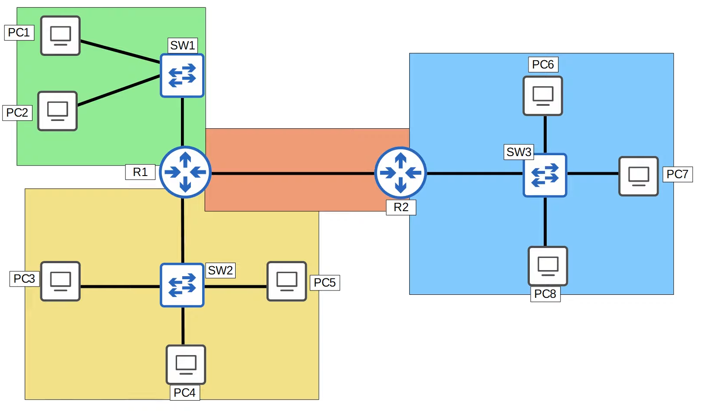
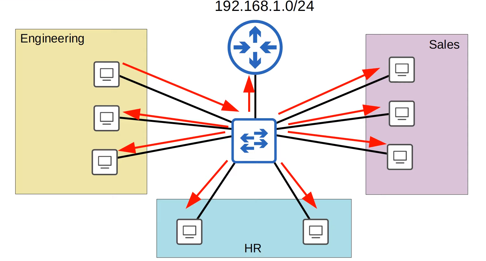
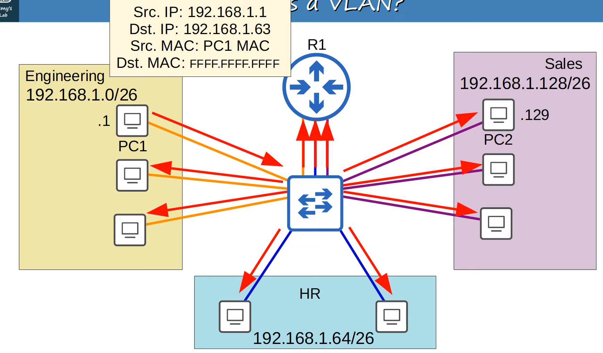
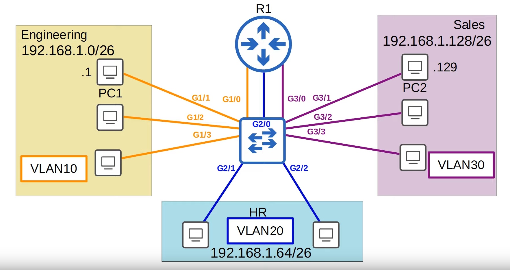
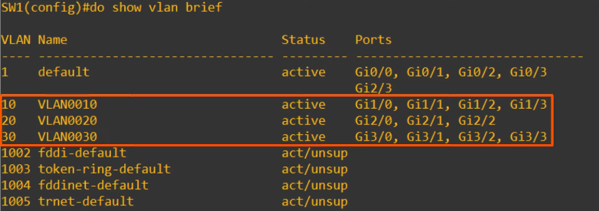

# VLANS - Part 1

## What is a LAN?

- A **LAN** is a **single broadcast domain**, including all devices in that broadcast domain.

- A **broadcast domain** is the group of devices which will receive a broadcast frame (destination MAC FFFF.FFFF.FFFF) sent by any one of the members.



## What is a VLAN?

### Problem



- If a computer in one department sends a broadcast message, the switch will flood it to all interfaces. **THIS IS A PROBLEM!!**
    - **Performance:** Lots of unnecessary broadcast traffic can reduce network performance.
    - **Security:** Even within the same office, you want to limit who has access to what. You can apply security policies on a router/firewall.
        - Since this is one LAN, PCs can reach others directly, without traffic passing through the router. So, even if you configure security policies, they won't have any effect.

### Solution (not really): Segmenting at Layer 3 (subnets)

- We assign a subnet for each department:
    - Engineering: 192.168.1.0/26
    - HR: 192.168.1.64/26
    - Sales: 192.168.1.128/26

- We connect one interface of the router per department and make the router the default gateway, so that traffic always goes through it before.

- **Problem:** if the frame is a **broadcast frame** or an **unicast frame**, the switch will flood it out of all interfaces.
    - Switches are only aware until Layer 2 (they don't know that the subnets even exist)



- Although we separated the three subnets (Layer 3), they are still in the same broadcast domain (Layer 2)

- We could buy a separate switch for each department, however, that is not very flexible and network equipment is expensive.

### Solution: Segmenting at Layer 2 (VLANS)

- We assign each department to a VLAN:
    - Engineering: VLAN10
    - HR: VLAN20
    - Sales: VLAN30

- We configure the vlans on the switch interfaces (we configure a specific switch interface to be on a certain vlan) => the end hosts connected to that interface will be on that vlan

- A **switch** **will not** **forward traffic between VLANs**, including broadcast/unknown unicast traffic

- The **switch does not perform inter-VLAN routing**. It must send traffic through the router.
    - switch will never perform traffic between two separate vlans

#### Review

- VLANs are configured on switches on a **per-interface** basis.
- **logically** separate end hosts at Layer 2
    - even if hosts are on the same broadcast domains we can use vlans to separate them and put them on different broadcast domains.

- Switches do not forward traffic directly between hosts in different VLANs.

## Configuration (Cisco IOS)



- `show vlan brief` displays the vlans that exist on a switch and which interfaces are in each vlan.

- *Note: even if you don't configure any VLAN, all interfaces will be configured on the "default" VLAN*
    - **VLANS 1 (default)** and **1002-1005 **exist by default and **cannot be deleted**

- `switchport mode access` configures the interface as an **access port**.
    - An **access port** is a switchport which **belongs to a single VLAN** and usually **connects to end hosts** like PCs

- **Switchports which carry multiple VLANS** are called **trunk ports**. 

- `switchport access vlan X` assigns the vlan to the port.
    - the interface must be configured as an access port before doing this. (you shouldn't rely on auto-negotiation)

```
SW1(config)# interface range g1/0 - 3
SW1(config-if-range)# switchport mode access
SW1(config-if-range)# switchport access vlan 10
% Access VLAN does not exist. Creating vlan 10


SW1(config-if-range)# interface range g2/0 - 2
SW1(config-if-range)# switchport mode access
SW1(config-if-range)# switchport access vlan 20
% Access VLAN does not exist. Creating vlan 20


SW1(config-if-range)# interface range g3/0 - 2
SW1(config-if-range)# switchport mode access
SW1(config-if-range)# switchport access vlan 30
% Access VLAN does not exist. Creating vlan 30
```

If you check the config after:



You can also change the names to more specific ones:

```
SW1(config)# vlan 10
SW1(config-vlan)# name ENGINEERING

SW1(config)# vlan 20
SW1(config-vlan)# name HR

SW1(config)# vlan 30
SW1(config-vlan)# name SALES
```

- if you ping `255.255.255.255` the ping **will only reach hosts on the same vlan**.