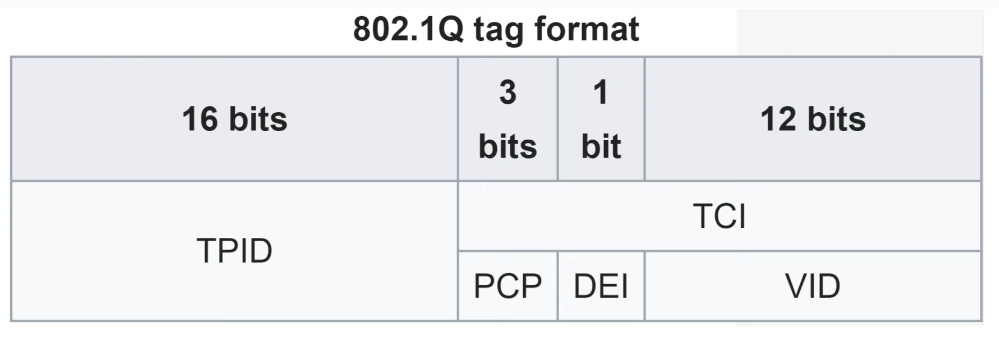
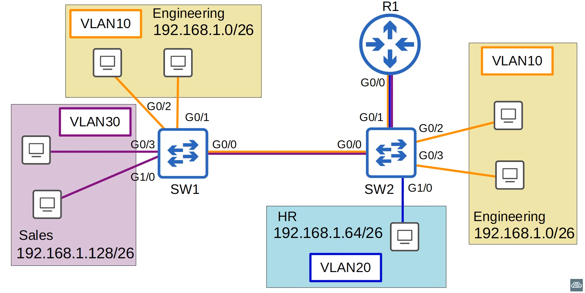
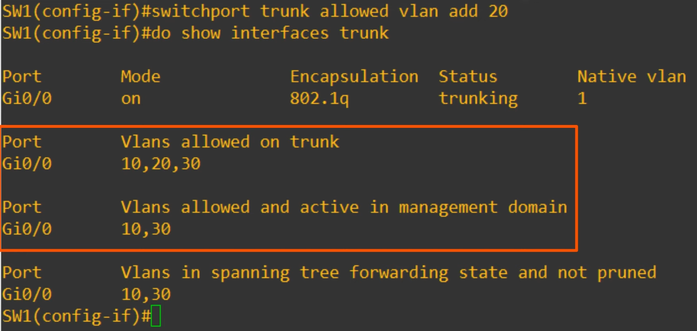
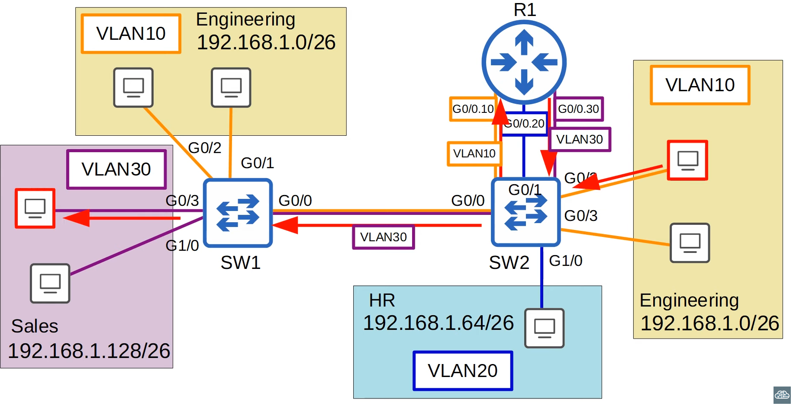

# VLANS - Part 2

## Trunk Ports

- In a small network with few VLANs, it is possible to use a separate interface for each VLAN when connecting switches to switches, and switches to routers

- However, when the number of VLANs increases, **this is not viable**. It will result in wasted interfaces, and then often routers won't have enough interfaces for each VLAN.

- You can use **Trunk Ports** to carry traffic from multiple VLANs over a single interface.

- **Switches will "tag"** all frames that they send over a trunk link. This allows the receiving switch to know which VLAN the frame belongs to.
    - Trunk Port <=> Tagged Port
    - Access Port <=> Untagged Port

## VLAN Tagging

- There are two main trunking protocols:
    - **ISL (Inter-Switch Link):** Cisco Proprietary protocol created before the industry standard IEEE 802.3q (not really relevant for CCNA)
    - **IEEE 802.1Q (dot1q):** industry standard protocol created by the IEEE (Institute of Eletrical and Eletronics Engineers)

### 802.1Q Tag


- The 802.1Q tag is inserted **between** the **Source Address** and the **Type/Length** fields of the Ethernet Frame.

- The tag is ***4 bytes (32 bits)*** in length.

- The tag consists of two main fields:
    - Tag Protocol Identifier (TPID)
    - Tag Control Information (TCI)
        - Consists of three subfields



- **TPID (Tag Protocol Identifier):**
    - **16 bits (2 bytes)**
    - **Always** set to a value of **0x8100**. This indicates that the frame is 802.1Q tagged.

- **PCP (Priority Code Point)**
    - **3 bits**
    - Used for **Class of Service (CoS)**, which prioritizes important traffic in congested networks.

- **DEI (Drop Eligible Indicator)**
    - **1 bit**
    - Used to indicate frames that can be dropped if the network is congested.

- **VID (VLAN ID)**
    - **12 bits (4096 total vlans)**
        - Vlans **0 and 4095** are **reserved**.
        - The actual vlan range is 1-4094.
    - Identifies the VLAN the frame belongs too

### VLAN Ranges

- The range of VLANS ( 1 - 4094 ) is divided into two sections:
    - **Normal VLANs:** 1 - 1005
    - **Extended VLANs:** 1006 - 4094

- Some older devices cannot use the extended VLAN range; however it's safe to expect that modern switches will support the extended VLAN range.


### Native VLAN

- The native VLAN is VLAN 1 by default on all trunk ports, however can be configured manually on each trunk port.

- The **switch does not add an 802.1Q tag to frames in the native VLAN**.

- When a switch receives an untagged frame on a trunk port, it assumes the frame belongs to the native VLAN.

- If there are native vlan mismatches things could go wrong (e.g. frames dropped).

### Trunk Configuration



```
SW1(config)# interface g0/0
SW1(config-if)# switchport mode trunk
Command rejected: an interface whose trunk encapsulation is "Auto" can not be configured to "trunk" mode
SW1(config-if)# switchport trunk encapsulation?
    dot1q   Interface uses only 802.1q trunking encapsulation when trunking
    isl   Interface uses only ISL trunking encapsulation when trunking
    negotiate  Device will negotiate trunking encapsulation with peer on interface

SW1(config-if)# switchport trunk encapsulation dot1q 
SW1(config-if)# switchport mode trunk 
```

- Many modern switches do not support Cisco's ISL at all. They only support 802.1Q (dot1q).

- However, switches that do support both (like the one above) have a trunk encapsulation of 'Auto' by default

- To manually configure the interface as a trunk port, you must first set the encapsulation to 802.1Q or ISL. On switches that only support 802.1Q, this is not necessary.

- After you set the encapsultation type, you can then configure the interface as a trunk.

- `show interfaces trunk` displays the trunk interfaces information.

```
SW1(config)# int g0/0 
SW1(config-if)# switchport trunk allowed vlan ?
    WORD    VLAN IDs of the allowed VLANs when this port is in trunking mode
    add     add VLANs to the current list
    all     all VLANs
    except  all VLAN except the following
    none    no VLANs
    remove  remove VLANs from the current list

SW1(config-if)# switchport trunk allowed vlan 10,30
SW1(config-if)# switchport trunk allowed vlan add 20
```


- `switchport trunk allowed vlan all` makes all vlans allowed (same as the default state).

- `switchport trunk allow vlan except 1-5,10` allows all vlans except 1,2,3,4,5 and 10.

- `switchport trunk allow vlan none` doesn't allow any vlan on the trunk (aka no traffic passes over the trunk)

- Only allowed vlans should be allowed on the trunk for security reasons and for performance so that we don't have unnecessary traffic filling the trunk.

#### Changing the native VLAN

- For security purposes it is best to change the **native VLAN** to an **unused VLAN** (network security will be explained more in-depth later in this course).
    - Also, make sure that the native VLAN matches between switches

- `switchport trunk native vlan 1001`

#### Viewing VLAN Tip!!!

- The `show vlan brief` command shows the access ports assigned to each VLAN. Not the trunk ports that allow each VLAN.

- Use the `show interfaces trunk` command instead to confirm trunk ports.


## Router on a Stick (ROAS)

- Perform inter-vlan routing with only 1 single interface.

- We can divide a single interface on logical sub-interfaces.
    - G0/0.10
    - G0/0.20
    - G0/0.30

- Don't forget that first, you must configure the respective switch interface as a regular trunk.

```
R1(config)# interface g0/0
R1(config-if)# no shutdown

R1(config-if)# interface g0/0.10
R1(config-subif)# encapsulation dot1q 10
R1(config-subif)# ip address 192.168.1.62 255.255.255.192

R1(config-if)# interface g0/0.20
R1(config-subif)# encapsulation dot1q 20
R1(config-subif)# ip address 192.168.1.126 255.255.255.192

R1(config-if)# interface g0/0.30
R1(config-subif)# encapsulation dot1q 10
R1(config-subif)# ip address 192.168.1.190 255.255.255.192
```

- this subinterfaces will appear in `show ip interface brief`

- Connected and Local routes will also be added to the subinterfaces (no route will be added to the actual interface itself)

- The subinterface number **does not** have to match the VLAN number. However, it is **highly recommended** that they do match, to make it easier to understand.


### ROAS - Review

- **ROAS** is **used to route between** multiple **VLANs** using a **single interface** on the router and switch.

- The **switch interface** is **configured as** a regular **trunk**.

- The **router interface** is **configured using subinterfaces**. You configure the VLAN tag and IP addresses on each subinterface.

- The router will behave as if frames arriving with a certain VLAN tag have arrived on the subinterface configured with that VLAN tag.

- The **router will tag frames** sent out of each subinterface **with** the **VLAN tag** configured on the subinterface.



## Review

#### What is a trunk port?
It is a switch interface that carries traffic over multiple VLANs

#### What is the purpose of trunk ports?
It allows switches to forward traffic from multiple VLANs over a single physical interface, instead of having to use a seaparate physical interface for each VLAN.

#### 802.1Q Encapsulation
Tag inserted into the Ethernet Frame and is used to identify which vlan the frame belongs to when sent over a trunk port.

