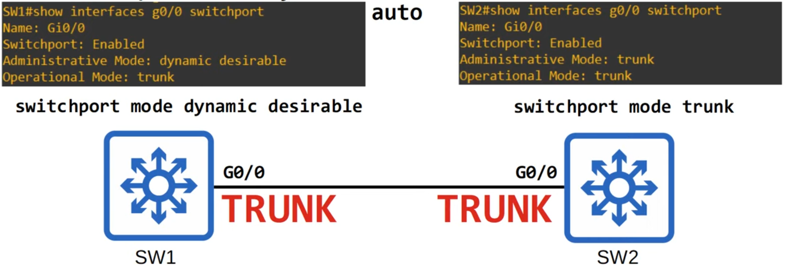
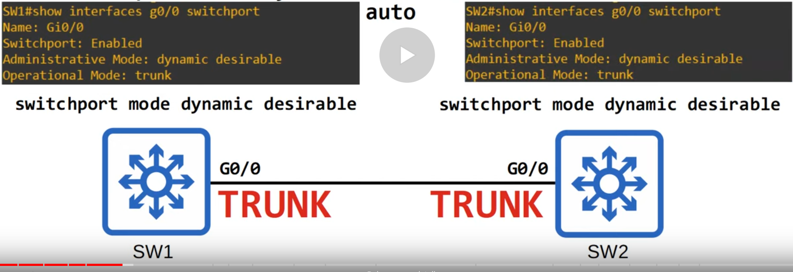
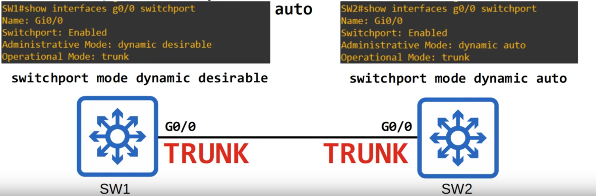
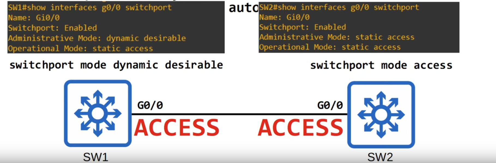
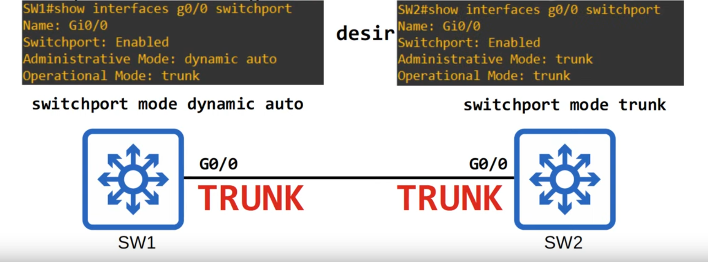
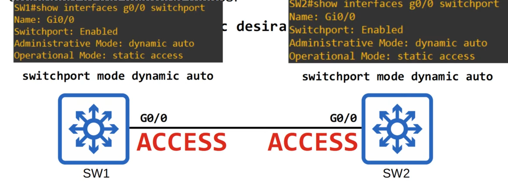
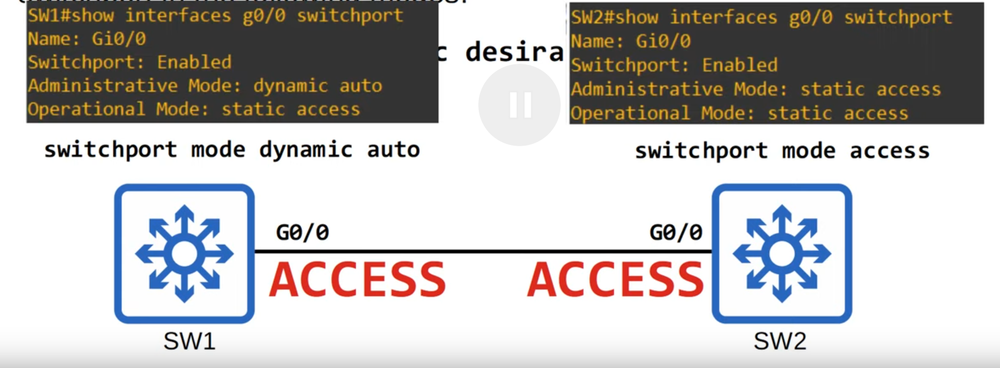
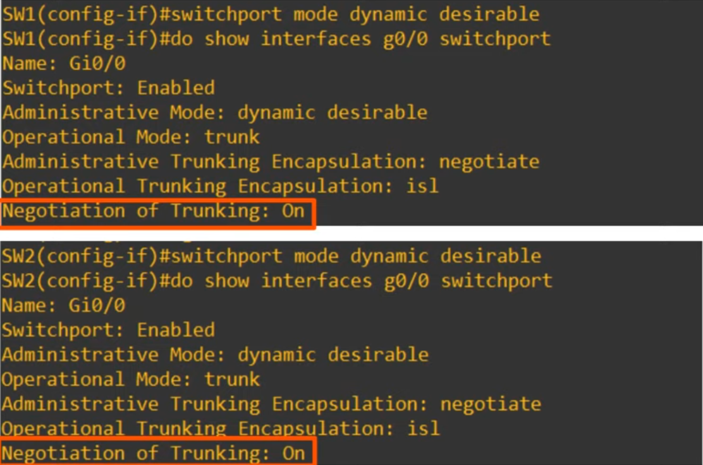

# Day 19 - DTP and VTP

## DTP (Dynamic Trunking Protocol)

-   DTP is a **Cisco proprietary protocol** that allows Cisco switches to **dynamically determine their interface status** (access or trunk) without manual configuration.

-   DTP is **enabled by default on all** Cisco **switch interfaces**.

-   So far, we have been manually configuring switchports using these commands:

    -   `switchport mode access` or `switchport mode trunk`

-   **For security purposes**, manual configuration is recommended. **DTP should be disabled on all switchports**.

-   `switchport mode dynamic auto/desirable` (DTP)

### Dynamic Desirable

-   A switchport in **dynamic desirable** mode will actively try to form a trunk with other Cisco switches. It will form a trunk if connected to another switchport in the following modes:
    -   `switchport mode trunk`
    -   `switchport mode dynamic desirable`
    -   `switchport mode dynamic auto`

#### DTP - Example 1 (Dyn. Des. - Trunk)

#### DTP - Example 2 (Dyn. Des. - Dyn. Des.)

#### DTP - Example 3 (Dyn. Des. Dyn. Auto)

-   Dynamic Auto mode is more passive: it forms a trunk if the other interface is actively trying to form a trunk but won't require to do so.

#### DTP - Example 4 (Dyn. Access)

-   If the other interface is in access mode it will not form a trunk (will be an access port)

-   **Static Access** means an access port that belongs to a single VLAN that doesn't change (unless you configure a single VLAN).

-   There also also **Dynamic Access** ports, in which a server automatically assigns the VLAN depending on the MAC address of the connected device.

### Dynamic Auto

-   A switchport in **dynamic auto** mode will not actively try to form a trunk with other Cisco switches, however it will form a trunk if the switch connected to it is actively trying to form a trunk. It will form a trunk with switchport in the following modes
    -   `switchport mode trunk`
    -   `switchport mode dynamic desirable`

#### DTP - Example 1 (Dyn. Auto - Trunk)

#### DTP - Example 2 (Dyn. Auto - Dyn. Des)

-   None is actively trying to form a trunk, so they stay both in access mode

-   They also have the same outputs in `show interfaces` command

#### DTP - Example 3 (Dyn. Auto - Access)

#### DTP - Example 4 (Manually Configured Trunk - Manually Configured Access)

-   They operate in a mismatch modes.
    -   This configuration does not work => Results in an error and traffic doesn't pass.

### Overview

| Administrative Mode | Trunk | Dynamic Desirable | Access | Dynamic Auto |
| ------------------- | ----- | ----------------- | ------ | ------------ |
| **Trunk** | Trunk | Trunk | X | Trunk |
| **Dynamic Desirable** | Trunk | Trunk | Access | Trunk |
| **Access** | X | Access | Access | Access |
| **Dynamic Auto** | Trunk | Trunk | Access | Access |

- **DTP will not form a trunk** with a **router, PC, etc.**
    - The switchport will be in access mode

- On older switches, **switchport mode dynamic desirable** is the default administrative mode.

- On newer switches, **switchport mode dynamic auto** is the default administrative mode.

- You can disable DTP negotiation on an interface with the command `switchport nonegotiate`.

- Configuring an access port with `switchport mode access` also disables DTP negotiation on an interface.
    - With `switchport mode trunk` you must still disable it manually.

- It is recommended that you disable DTP on all switchports and manually configure them as access or trunk ports.

### Trunk Encapsulation Negotiation via DTP

- Switches that support both 802.1Q and ISL trunk encapsulations can use DTP to negotiate the encapsulation they will use.

- This **negotiation is enabled by default**, as the default trunk encapsulation mode is `switchport trunk encapsulation negotiate`

- **ISL is favored over 802.1Q**, so if both switches support ISL it will be selected.

- **DTP frames** are **sent in VLAN1 when using ISL**, or in the **native VLAN** when **using 802.1Q** (the default native VLAN is VLAN1).

#### Example

- **Negotiation of Trunking**  shows wether DTP is enabled
    - Will be off when in **access mode** or using the `switchport nonegotiate` command.

## VTP (VLAN Trunking Protocol)

- VTP allows you to configure VLANs on a **central VTP server switch**, and **other switches** (VTP clients) will **synchronize their VLAN database** to the server.

- It is **designed for a large netowk with many VLANs**, so that you don't have to configure each VLAN on every switch.

- It is **rarely used**, and it is **recommended that you do not use it**.

- There are **three VTP versions**: 1, 2 and 3  

- There are three VTP modes: **server**, **client** and **transparent**.

- Cisco switches operate in VTP server mode by default.

### VTP Modes

#### VTP Servers

- Can **add/modify/delete VLANs**.
- Store the **VLAN database** in non-volatile RAM (**NVRAM**).
- Will increase the **revision number** every time a VLAN is added/modified/deleted.
- Will **advertise** the **latest version of the VLAN database on trunk interfaces**, and the **VTP clients will synchronize** their VLAN database to it.
- **VTP servers also function as VTP clients**.
- Therefore, a **VTP server will synchronize** **to another VTP server with a higher revision number**.

#### VTP Clients
- Cannot add/modify/delete VLANs.
- Do not store the VLAN database in NVMRAM. (in VTPv3 they do)
- Will **synchronize** their **VLAN database** **to** the **server with** the **highest revision number** **in their VTP domain**.
- Will **advertise their VLAN database**, and **forward VTP advertisements** **to** other **clients** **over** their **trunk ports**.

#### VTP Transparent

- **Does not participate in the VTP domain** (does not sync its VLAN database)
- **Maintains** its **own VLAN database in NVRAM**. It **can add/modify/delete VLANs**, but they **won't be advertised to other switches**.
- **Will forward VTP advertisements** that are **in the same domain** as it.

### VTP Configuration

- `show vtp status`
    - **VTP Version capable/running** - possible VTP versions and what version is actually running.
    - **VTP Domain Name** - for vtp to synchronize over various devices they must have the must VTP Domain Name (it can be null: the default)
    - **Configuration Revision** -  Revision Number. Used to check what database is the most recent.

- VTPv1/v2 do not support the extended VLAN range (1006-4094). Only VTPv3 supports them.

- `vtp domain <domain_name>` changes the domain name

- **Note:** If a switch with no VTP domain (domain NULL) receives a VTP advertisement with a VTP domain name, it will automatically join that VTP domain.
    - If a switch receives a VTP advertisement in the same VTP domain with a higher revision number, it will update it's VLAN database to match.

- **Changing the VTP domain to an unused domain** will **reset the revision number to 0**.
- **Changing the VTP mode to transparent** will also **reset the revision number to 0**.

- `vtp version <version number>` changes the version running. => changes the revision number and synchs with other switches.
    - VTP V2 is not much different than VTP V1. The major difference is that VTP V2 introduces support for Token Ring VLANs. If you use Token Ring VLANs, you must enable VTP V2. Otherwise, there is no reason to use VTP V2.
- transparemt

#### Problem!!

If you sync an old switch with a higher revision number to your network (and the VTP domain name matches), all switches in the domain will sync their VLAN database to that switch.

This could make all of the hosts on the network to loose connectivity, because the switches could sync to a completely different VLAN database and VLANs used would disappear.

This is why VTP isn't generally used nowadays.

### VTP - Summary

- **VTP allows** you **to configure VLANs on a central VTP server switch**, and other switches (**VTP clients**) **will synchronize their VLAN database** to the server.
- It is **designed for large networks with many VLANs**, **so** that **you** **don't have to configure each VLAN** **on every switch**.
- It is **rarely used**, and it is **recommended that you do not use it**.
- There are **three VTP versions**: 1, 2 and 3.
- There are three VTP modes: **server**, **client** and **transparent**.
- **Cisco switches** operate in **VTP server mode by default**.

## Review

### DTP (Dynamic Trunking Protocol)
DTP is a protocol that allows cisco switches to form trunk connections to other cisco switches without manual configuration. However, it is recommended that you disable this protocol for security purposes.

### VTP (VLAN Trunking Protocol)
VTP allows you to configure VLANs on switches that operate as "central VTP servers" which then advertise their VLAN database and VTP client switches sync their database to it. 
VTP only syncs the VLAN database. You still have to configure the interfaces on each switch separately.

- **Note:** If there is a password (set with `vtp password`), revisions will only be synched if passwords match.