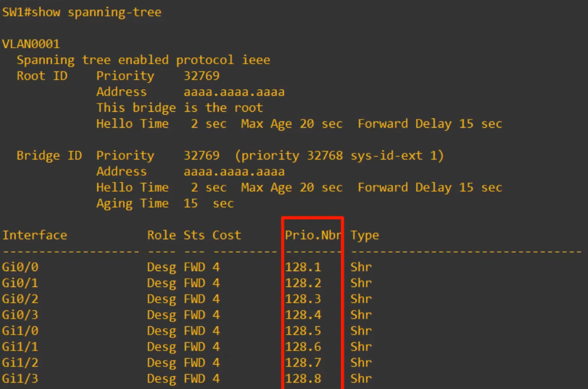

# Day 20 - Spanning Tree Protocol (Part 1)

## Network Redundancy

-   Redundancy is an essential part of network design.
-   Modern networks are expected to run 24/7/365. Even a short downtime can be disastrous for a business.
-   If one network component fails, you must ensure that other components will ake over with little or no downtime.
-   As much as possuble, you must implement redundancy at every possible point in the network.

-   Most PCs only have a single network interface card (NIC), so they can only be plugged into a single switch. However, important servers typically have multiple NICs, so they can be plugged into multiple switches for redundancy.

### Broadcast Storms

-   The Ethernet header **doesn't have a TTL field**. These broadcast frames will loop around the network indefinitely. If enough of these looped broadcasts accumulate in the network, the network will be too congested for legitimate traffic to use the network. This is called a **broadcast storm**.

#### MAC Address Flapping

-   Network congestion isn't the only problem. Each time a frame arrives on a switchport, the switch uses the source MAC address field to "learn" the MAC address and update its MAC address table. **When frames with the same source MAC address repeatedly arrive on different interfaces, the switch is continuously updating the interface in its MAC address table.** This is known as **MAC Address Flapping**.

## Spanning Tree Protocol

-   "Classic Spanning Tree Protocol" is IEEE **802.1D**.
-   Switches for **ALL vendors** run STP by default.
-   STP **prevents Layer 2 loops** by placing redundant ports in a blocking state, essentially disabling the interface.
-   **These interfaces** act as backups that **can enter a forwarding state if** **an active** (=currently forwarding) **interface fails**.
-   **Interfaces in a forwarding state behave normally**. They send and receive all normal traffic.
-   **Interfaces in a blocking state only send or receive STP messages** (Called **BPDUs** = Bridge Protocol Data Units)

-   By selecting which ports are **forwarding** and which ports are **blocking**, STP creates a single path to/from each point in the network. This prevents Layer 2 Loops.
-   There is a set process that STP uses to determine which ports should be forwarding and which should be blocking.
-   STP-enabled switches send/receive **Hello BPDUs** out of all interfaces:

    -   The **default timer is 2 seconds** (the switch will send a Hello BPDU out of every interface, once every 2 seconds)

-   If a switch receives an Hello BPDU on an interface, it knows that interface is connected to another switch (routers, PCs, etc. do not use STP, so they do not send Hello BPDUs).

-   Switches use one field in the STP BPDU, the **Bridge ID** field to elect a **root bridge** for the network.
-   The **switch with the lowest Bridge ID** becomes the **Root Bridge**.
-   **All ports on the root bridge** are put in **forwarding state**, and **other switches** in the topology **must have a path to reach the root bridge**.

#### STP BPDU

-   The **default bridge priority** is 32768 on all switches, so, by default the **MAC Address is the tie-breaker** (lowest MAC address becomes the root bridge).
    -   The **Bridge Priority is compared first**. **If they tie**, the **MAC address is then compared**.

#### Updated STP BPDU

. Cisco switches use a version of STP called **PVST (Per-VLAN Spanning Tree)**. - PVST runs a **separate STP "instance" in each VLAN**, so in each VLAN different interfaces can be forwarding/blocking.

#### Extended System ID

-   In the default VLAN of 1, the default bridge priority is actually 32769 (32768 + 1).

-   The **bridge priority** + **extended system ID** is a single field of the bridge ID, however, the extended system ID is set and cannot be changed (because it is determined by the VLAN ID).

Therefore, the you can only change the total bridge priority (bridge priority + extended ID) in units of 4096, the value of the least significant unit bit of the bridge priority. - The STP bridge priority can only be changed in units of 4096. - The valid values you can configure are: 0, 4096, 8192, ..., 61440 - The Extended System ID will then be added to this number to make the total bridge priority.

### Root Bridge

-   All interfaces on the root bridge are **designated ports**.
    -   **Designated Ports are in a forwarding state**.
-   When a switch is powered on, it assumes it is the root bridge.
-   It will only **give up** its **position** **if** it **receives** a **superior BPDU** (**lower bridge ID**).
-   Once the topology has converged and all switches agree on the root bridge, **only the root bridge sends BPDUs**.
-   **Other switches** in the network **will forward these BPDUs**, but **will not generate their own BPDUs**.

### Root Cost

- The root cost is the total cost of the outgoing interfaces along the path to the root bridge.

- The cost are pre-defined depending on the type of interface.

    | Speed    | STP Cost |
    | -------- | -------- |
    | 10 Mbps  | 100      |
    | 100 Mbps | 19       |
    | 1 Gbps   | 4        |
    | 10 Gbps  | 2        |

1) Switch 1 advertises the cost of 0 to its interfaces through a BPDU.
2) Switch 2 receives the BPDU and adds the cost of G0/1 interface (4) when it floods the BPDU out of its interfaces.
3) Switch 3 receives the BPDU and adds the cost of G0/0 interface (4) when it floods the BPDU out of its interfaces.
4) Switch 2 selects the G0/1 interface as its root port
    - SW2 was advertised a cost of 0 on G0/1. Since his interface cost is 4:
        - **Total Cost via G0/1 = 4**
    - SW2 was advertised a cost of 4 on G0/0. Since his interface costs 4:
        - **Total Cost via G0/1 = 8**
5) By the same logic as above, Switch 3 will choose G0/0 as its root port 

### Port ID

- `STP Port ID = port priority (default 128) + port number`

- Tip: usually you can just look at the port number

### Non-Designated Port Selection

**Every collision domain has a single STP designated port**

Criteria for choosing the designated port:

1) The switch with the **lowest root cost** will make its port designated.
2) If the root cost is the same, the switch with the **lowest bridge ID** will make its port designated.
3) The **other switch will make its port non-designated (blocking)**.

- So, in the case above, G0/0 will be the designated interface and G0/1 will be the blocking interface (to prevent L2 loops).

### STP Overview: Step-By-Step

1) One **switch is elected as the root bridge**. **All ports** on the root bridge are **designated ports** (forwarding state). 
    - Root bridge selection:
        1) Lowest bridge ID
        2) Lowest MAC Address

2) **Each remaining switch** will **select** ONE of its **interfaces** **to be** its **root port** (forwarding state). **Ports across from the root port are always designated ports.** 
    - Root port selection:
        1) Lowest root cost
        2) Lowest neighbor bridge ID
        3) Lowest neighbor port ID

3) Each **remaining collision domain** will select ONE interface to be a **designated port** (forwarding state). The other port in the collision domain will be **non-designated** (blocking).
    - Designated Port Selection:
        1) Interface on switch with **lowest root cost**
        2) Interface on switch with **lowest bridge ID**

