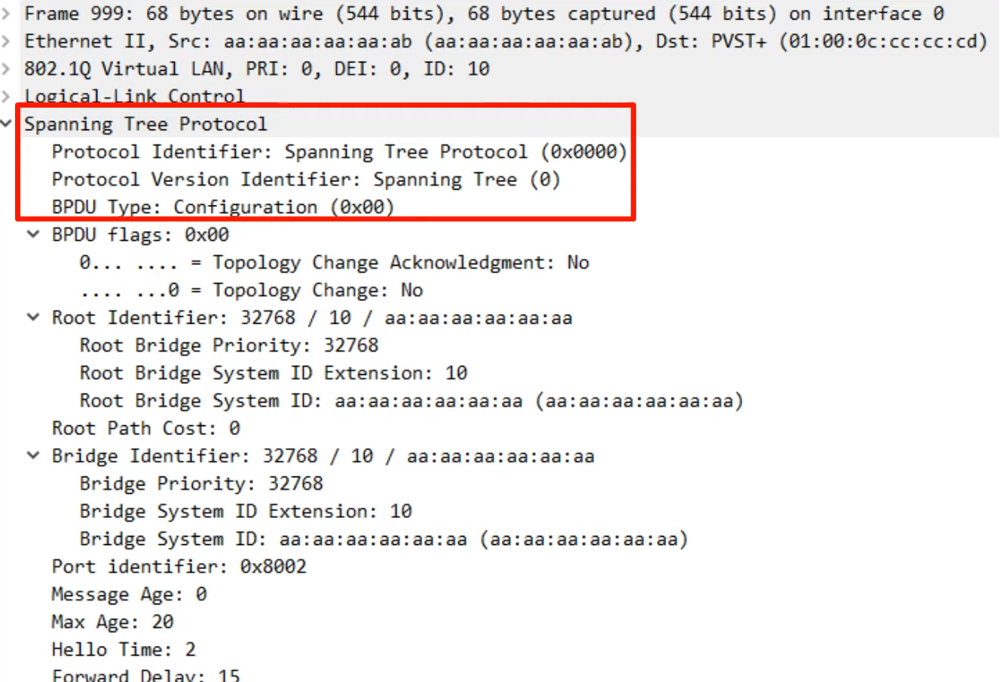
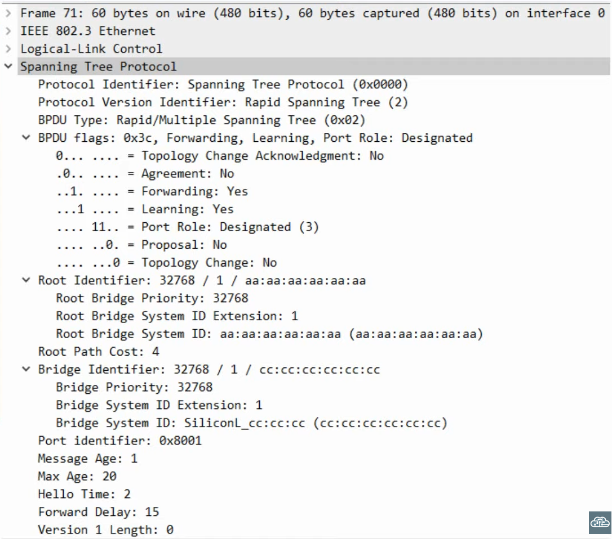

# Day 22 - Rapid Spanning Tree Protocol

## Industry Standards vs Cisco Versions

#### Spanning Tree Protocol (802.1D)

-   The original STP.
-   All VLANs share one STP instance.
-   Therefore, cannot load balance.

#### Per-VLAN Spanning Tree Plus (PVST+)

(actually, there was PVST before, which supported ISL instead of 802.1Q, but doesn't really matter)

-   Cisco's upgrade to 802.1D.
-   Each VLAN has its own STP instance.
-   Can load balance by blocking different ports in each VLAN.

---

#### Rapid Spanning Tree Protocol (802.1w)

-   Much faster at converging/adapting to network changes than 802.1D
-   All VLANs share one STP instance.
-   Therefore, cannot load balance.

#### Rapid Per-VLAN Spanning Tree Plus (Rapid PVST+)

-   Cisco's upgrade to 802.1w.
-   Each VLAN has its own STP instance.
-   Can load balance by blocking different ports in each VLAN.

---

#### Multiple Spanning Tree Protocol (802.1s)

-   Uses modified RSTP mechanics.
-   Can group multiple VLANs into different instances (i.e. VLANs 1-5 in instance 1, VLANS 6-10 in instance 2) to perform load balancing.

## RSTP

"RSTP is not a timer-based spanning tree algorithm like 802.1D. Therefore, RSTP offers an improvement over the 30 seconds or more that 802.1D takes to move a link to forwarding. The heart of the protocol is a new bridge-bridge handshake mechanism, which allows ports to move directly to forwarding."

### RSTP vs STP

-   RSTP server the same purporse as STP, blocking specific ports to prevent Layer 2 loops.
-   RSTP elects a root bridge with the same rules as STP.
-   RSTP elects root ports with the same rules as STP.
-   RSTP elects designated ports with the same rules as STP.

- **Note:** Rapid STP is compatible with Classic STP. The interface(s) on the Rapid STP-enabled switch connected to the Classic STP-enabled switch will operate in Classic STP mode (timers, blocking -> listening -> learning -> forwarding process, etc).

### RSTP Costs

| Speed     | STP Cost | RSTP Cost |
| --------- | -------- | --------- |
| 10 Mbps   | 100      | 2,000,000 |
| 100 Mbps  | 19       | 200,000   |
| 1 Gbps    | 4        | 20,000    |
| 10 Gbps   | 2        | 2000      |
| 100 Gbps  | X        | 200       |
| 1000 Gbps | X        | 20        |

### RSTP Port States

-   Blocking and Disabled States were combined into on (Discarding State) and the Listening state is not used.

| STP Port State | Send/Receive BPDUs | Frame forwarding (regular traffic) | MAC Address Learning | State/Transitional |
| -------------- | ------------------ | ---------------------------------- | -------------------- | ------------------ |
| **Discarding** | NO/YES | NO | NO | Stable |
| **Learning** | YES/YES | NO | YES | Transitional |
| **Forwarding** | YES/YES | YES | YES | YES | Stable |

- If a port is **administratively disabled** ( **shutdown** command) = discarding state.
- If a port is **enabled but blocking traffic** to prevent Layer 2 loops = discarding state

### RSTP Port Roles

- The **root port remains unchanged** in RSTP
    - The port that is closest to the root bridge becomes the root port for the switch.
    - The rot bridge is the only switch that doesn't have a root port.

- The **designated port role remains unchanged** in RSTP
    - The port on a segment (collision domain) that sends the best BPDU is that segment's designated port (only one per segment)

- The **non-designated port** was **split into two roles** in RSTP:
    - the **alternate port** role 
    - the **backup port** role 

#### Alternate Port Role

- The RSTP alternate port role is a **discarding port that receives a superior BPDU from another switch**.

- This is the same as what blocking ports in classic STP.

- Functions as a **backup to the root port**.

- **If** the **root port fails**, the **switch can immediately move** its **best alternate port to forwarding**.

- This immediate move to forwarding state functions like a classic STP optional feature called UplinkFast. Because it is built into RSTP, you do not need to activate UplinkFast when using RSTP/Rapid PVST+.

#### Backup Port Role

- The RSTP backup port role is a **discarding port that receives a superior BPDU from another interface on the same switch**.
- This only happens when **two interfaces are connected to the same collision doomain (via a hub)**.
- Hubs are not used in modern networksm so you will probably not encounter an RSTP backup port.
- Functions as a **backup for a designated port**.  

- The **interface with the lowest port ID will be selected as the designated port, and the other will be the backup port**. 

#### Backbone Fast Functionality
- One more **STP optional** feature that was **built into RSTP** is **BackboneFast**.
- BackboneFast allows a switch to expire the max age timers on its interface to rapidly forward the superior BPDUs to another switch (e.g. if the other switch lost its connection to the root bridge).
- This functionality is built into RSTP, so it does not need to be configured.

#### UplinkFast / BackboneFast Summary
- **UplinkFast** and **BackboneFast** are two optional features in classic STP. They must be configured to operate on the switch.
- Both features are built into RSTP, so if you do not have to congure them. They operate by default.
- **Basic purpose:** to help blocking/discarding ports rapidly move to forwarding.

### RSTP BPDU

#### STP BPDU

#### RSTP BPDU

- **Protocol Version Identifier**: RSTP has a **version of 2** instead of 0 (STP Version).
    - Also has a BPDU Type of 2

- **BPDU Flags:**
    - STP only uses two bits, however RSTP uses all 8 bits. This flags are used in the negotiation process that allows RSTP to converge much faster than STP.

- In classic STP, only the root bridge originated BPDUs, and other switches just forwarded the BPDUs they received.

- In Rapid STP, **ALL switches originate and send their own BPDUs from their designated ports**.

### RSTP Hello Timer

- **All switches** running RSTP **send their own BPDUs every hello time** (2 seconds).
- Switches age the BPDU information much more quickly. In classic STP, a switch waits 10 hello intervals (20 seconds). In rapid STP, a switch considers a **neighbor lost if it misses 3 BPDUs (6 seconds)**. **It will then flush all MAC addresses learned on that interface**.

### RSTP Link Types

- RSTP distinguishes between **three different link types**.

#### Edge

- A port that is connected to an end host. Moves directly to forwarding, without negotiation.

- Because there is no risk of creating a loop, they can move straight to the forwarding state.

- They function like a classic STP port with PortFast enabled.

- To configure it, you do like you normally would configure PortFast in STP: `spanning-tree portfast`

#### Point-to-Point

- A direct connection between to switches.

- Point-to-point ports connect directly to another switch.
- They function in full-duplex.
- You don't need to configure the interface as point-to-point (it should be detected).
    - however, if you want to do it, you can just do `spanning-tree link-type point-to-point`

#### Shared

- A connection to a hub. Must operate in half-duplex mode.

- Shared ports connect to another switch (or switches) via a hub.
- They function in half-duplex.
- You don't need to configure the interface as shared (it should be detected).
    - however, if you want to do it, you can just do `spanning-tree link-type shared`

## Overview

- Classic STP is 802.1D and Cisco's upgrade is PVST+ which runs a separate STP instance per each VLAN.
- The next standard version is 802.1W (Rapid STP). Cisco's version is RPVST+, which again, runs a separate instance per VLAN.
- There is also MSTP, which you can create multiple spanning tree instances and group multiple vlans per each instance.

- Rapid PVST+
    - **RSTP Port States** (discarding, learning, forwarding)
    - **RSTP Port Roles** (root, designated, alternate, backup)
    - **STP optional features built into RSTP** (UplinkFast, BackboneFast, PortFast)
    - **RSTP BPDU** (sent by all switches, not just the root bridge)
    - **RSTP link types** (edge, point-to-point, shared) 