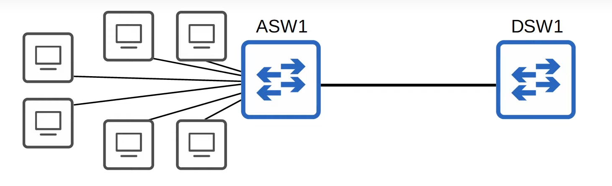
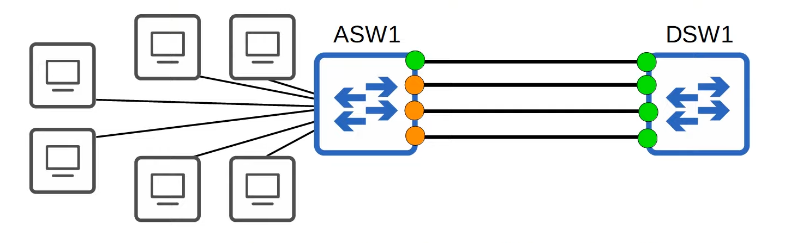
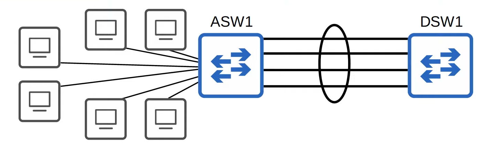
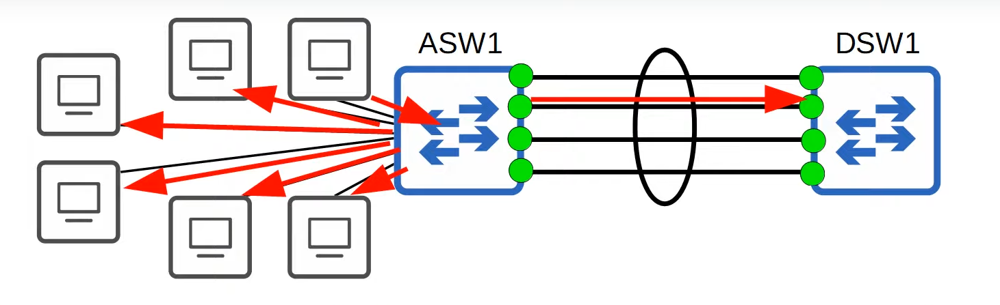
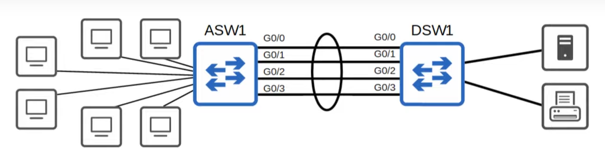
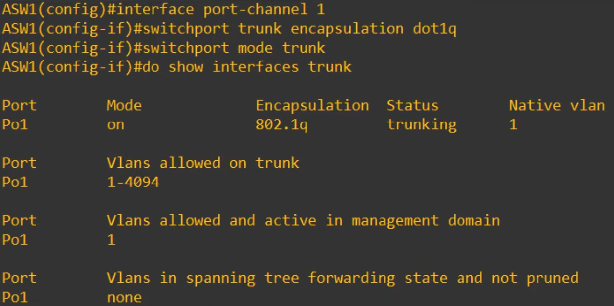
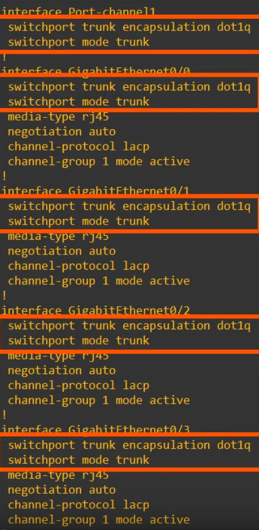
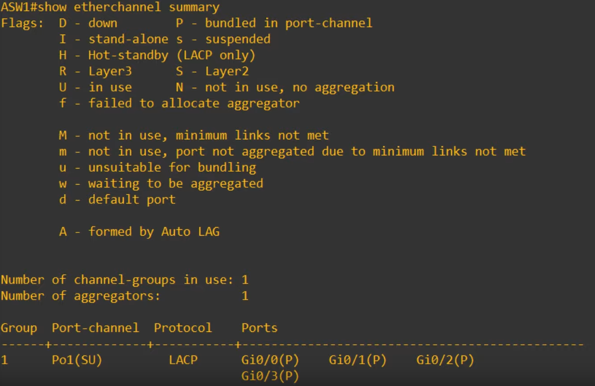
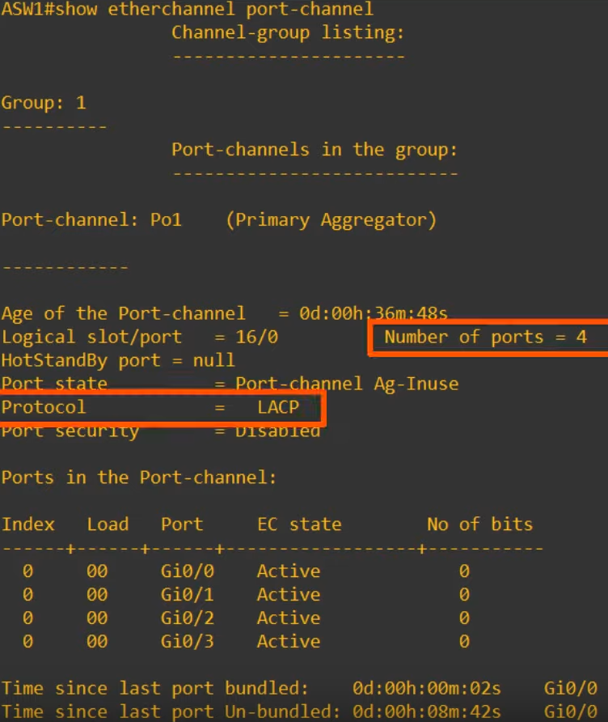
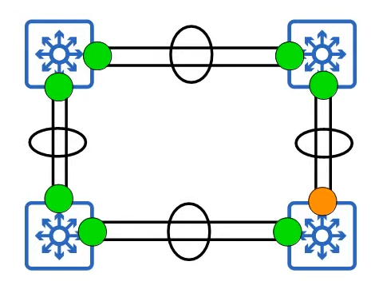

# Day 23 - EtherChannel

## EtherChannel

### Why do we need it?



- Terminology:
    - **ASW1** = Access Layer Switch, a switch that end hosts connect to.
    - **DSW1** = Distribution Layer Switch, a switch that access layer switches connect to.

- However, the **network** gets **congested**, so the network manager decided that he should add another link to increase the bandwidth, so  it can support all of the end hosts. 

- The network is still congested with 2 links, so a 3rd one is added.

- When the bandwidth of the interfaces connected to end hosts is greater than the bandwidth of the connection to the distribution switch(es), this is called **oversubscription**. Some oversubscription is acceptable, but too much will cause congestion.


- The network is still congested with 3 links, so a 4rd one is added. Why is this the case??



- That's right, it's all about **STP**:
    - **If you connect two switches together with multiple links, all except one will be disabled** by the spanning tree.
    - **If all** of ASW1's **interfaces were forwarding**, Layer 2 loops would form between ASW1 and DSW1, leading to **broadcast storms**.
    - Other links will be unused unless the active link fails. In that case, one of the inactive links will start forwarding.

- Having this said, it's good to have redundant links in case of link failure, however it's a waste of bandwidth to have this much, since only one of them will be active at a time.

- By putting these interfaces into one, EtherChannel can solve this problem!


### Intro - EtherChannel



- An EtherChannel is represented as a **circle around interfaces that are grouped together**.

- EtherChannel groups **multiple interfaces** together to **act as a single interface**.
- **STP will treat** this **group as** a **single interface**.

- This won't cause a L2 loop because this group behaves as if it is a single link.
    - e.g. if one PC sends an unknown frame do ASW1, all the other PC's (except the sender) will receive it and DSW1 will one receive one frame:

    

- Some other names for an EtherChannel are:
    - **Port Channel**
    - **LAG (Link Aggregation Group)**

- Traffic using the EtherChannel will be **load balanced among the physical interfaces in the group**. An algorithm is used to determine which traffic will use the physical interface.

### Load-Balancing

- EtherChannel **load balances based on "flows"**
- **Flow:** communication between two nodes in the network
- **Frames in the same flow** will be **forwarded** using the **same physical interface**.
    - If frames in the same flow were forwarded using different physical interfaces, some frames may arrive at the destination out of order, which can cause problems.

- You can change the inputs in the interface selection calculation.
- Inputs that can be used:
    - Source MAC 
    - Destination MAC 
    - Source and Destination MAC
    - Source IP
    - Destination IP
    - Source and Destination IP

- `note`: this methods depend a lot on the switch model

### EtherChannel Load-Balancing Verification and Configuration 

```
ASW1# show etherchannel load-balance
EtherChannel Load-Balancing Configuration:
        src-dst-ip

EtherChannel Load-Balacing Addresses Used Per-Protocol:
Non-IP: Source XOR Destination MAC address
  IPV4: Source XOR Destination IP address
  IPV6: Source XOR Destination IP address

ASW1# conf t
ASW1(config)# port-channel load-balance src-dst-mac
ASW1(config)# do show etherchannel load-balance
EtherChannel Load-Balancing Configuration:
        src-dst-mac

EtherChannel Load-Balacing Addresses Used Per-Protocol:
Non-IP: Source XOR Destination MAC address
  IPV4: Source XOR Destination MAC address
  IPV6: Source XOR Destination MAC address
```

- `show etherchannel load-balance` - show the load balacing method being used
- `port-channel load-balance method` - configure the load balancing

### EtherChannel Configuration

- There are three method of EtherChannel configuration on Cisco switches:
    - **PAgP (Port Aggregation Protocol)** 
        - Cisco Proprietary Protocol
        - Dynamically negotiates the creation/maintenance of the EtherChannel (like DTP does for trunks)
        - Runs only on Cisco systems

    - **LACP (Link Aggregation Control Protocol)**
        - Industry standard protocol (IEEE 802.3ad)
        - Dynamically negotiates the creation/maintenance of the EtherChannel (like DTP does for trunks)
        - Doesn't run only on Cisco systems (so, it is the preferrable method)

    - **Static EtherChannel**
        - A protocol isn't used to determine if an EtherChannel should be formed.
        - Interfaces are statically configured to form an EtherChannel.

- Up to **8 interfaces can be formed into a single EtherChannel** (LACP allows **up to 16, but only 8 will be active**, the **other 8** will be in **standby mode**, waiting for an active interface to fail).


#### Example:



##### PAgP Config

```
ASW1(config)# interface range g0/0 - 3
ASW1(config)# channel-group 1 mode ?
    active      Enable LACP unconditionally
    auto        Enable PAgP only if a PAgP device is detected
    desirable   Enable PAgP unconditionally      
    on          Enable EtherChannel only
    passive     Enable LACP only if a LACP device is detected

ASW1(config-if-range)# channel-group 1 mode desirable
Creating a port-channel interface Port-channel 1
```

- `do show ip interface brief` will display the newly create Port-channel 1 and it's stauts/protocol as up/up.

- `channel-group <number> mode <mode>` is used to configure the EtherChannel, but the name of the virtual interface that is created is Port-channel

- The **channel-group number has to match for member interfaces on the same switch**. However, it **doesn't have to match the channel group number on the other switch**. 
    - **channel-group 1 on ASW1** **can form** an **EtherChannel with channel-group 2 on DSW1**

- Just like DTP:
    - auto + auto = no EtherChannel
    - auto + desirable = EtherChannel
    - desirable + desirable = EtherChannel

##### LACP Config

```
ASW1(config)# interface range g0/0 - 3
ASW1(config)# channel-group 1 mode ?
    active      Enable LACP unconditionally
    auto        Enable PAgP only if a PAgP device is detected
    desirable   Enable PAgP unconditionally      
    on          Enable EtherChannel only
    passive     Enable LACP only if a LACP device is detected

ASW1(config-if-range)# channel-group 1 mode active
Creating a port-channel interface Port-channel 1
```

- Just like DTP:
    - passive + passive = no EtherChannel
    - active + passive = EtherChannel
    - active + active = EtherChannel

##### Static

```
ASW1(config)# interface range g0/0 - 3
ASW1(config)# channel-group 1 mode ?
    active      Enable LACP unconditionally
    auto        Enable PAgP only if a PAgP device is detected
    desirable   Enable PAgP unconditionally      
    on          Enable EtherChannel only
    passive     Enable LACP only if a LACP device is detected

ASW1(config-if-range)# channel-group 1 mode on
Creating a port-channel interface Port-channel 1
```

- **On mode only works with on mode** (**on + desirable** or **on + active** will not work)


##### Others

- `channel protocol <lacp/pagp>` also lets you manually configure the EtherChannel.
    - After doing this configuration you must be careful issuing `channel-group <group> mode <mode>` because if the protocol is a mismatch, the command will fail.

---

- After doing the previous steps, you can configure the interface as you normally would:


#### Configuration


#### Running Config (after the previous configuration)


- Notice that the configuration is not only on the Port-channel1 interface, but also on the other interfaces.

### EtherChannel Requirements

- **Member interfaces must have matching configurations**.
    - Same duplex (full/half)
    - Same speed
    - Same switchport mode(access/trunk)
    - Same allowed VLANs/native VLAN (for trunk interfaces)

- **If** an **interface's configurations do not match the others**, it **will be excluded from the EtherChannel**.


### EtherChannel Verification

- `show etherchannel summary`

    

- In the bottom part we can see a list of the PortChannel interfaces on the switch.

- Po1(SU):
    - Layer 2 Channel
    - In Use

- Next to the ports we have the letter P, which means that those ports are probably bundled in the port-channel.

- If you `shutdown` the interface, the **Port-channel Po1** will have the **SD flags (suspended, down)** and probably, the **ports**, will have the **letter D (down)**

- If after that you enable the port-channel again and change 1 of the interfaces' mode to acess (mismatching the others), that interface will have an **s (suspended)**

- You can also use `show etherchannel port-channel`:

    

- This command shows the number of active ports, the protocol in-use, etc.
- You can also find the channel-group mode (`EC state`), which you cannot find in `show etherchannel summary`
    - In this case it is **Active** because we have used the `channel-group 1 mode active` previously


- Spanning Tree displays everything as it would normally and in the interface list of `show spanning-tree` it lists the Po1, not the individual interfaces (as expected).

### Layer 3 EtherChannel

- Using L3 EtherChannel is easier and tends to be more common, because we don't have to deal with L2 loops and STP blocking EtherChannel interfaces, like in the following image:

    

#### Configuring an L3 EtherChannel

```
ASW1(config)# int range g0/0 - 3
ASW1(config-if-range)# no switchport
ASW1(config-if-range)# channel-group 1 mode active
Creating a port-channel interface Port-Channel 1
``` 

```
ASW1(config-if-range)# int po1
ASW1(config-if)# ip address 10.0.0.1 255.255.255.252
``` 

- In the input of `show etherchannel summary`, Port-Channel1 will have the RU flags (Layer3 and in use)

- Now ASW1 and DSW1 are like 2 routers connected together (in L3), and STP is not running on the connection between them, however, traffic is still being load balanced between them.

## Commands Review

- `SW(config)# port-channel load-balance <mode>` - Configures the EtherChannel load-balancing method on the switch.

- `SW(config)# show etherchannel load-balance` - Displays information about the load-balancing settings.

- `SW(config-if)# channel-group <number> mode {desirable|auto|active|passive|on}` - Configures an interface to be part of an EtherChannel.

- `SW# show etherchannel summary` - displays a summary of EtherChannels on the switch.

- `SW# show etherchannel port-channel` - displays information about the virtual port-channel interfaces on the switch.