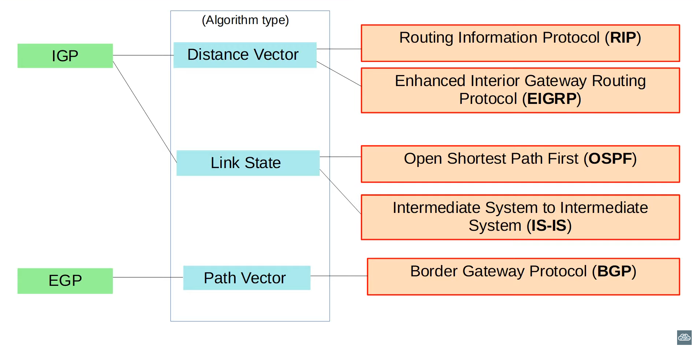
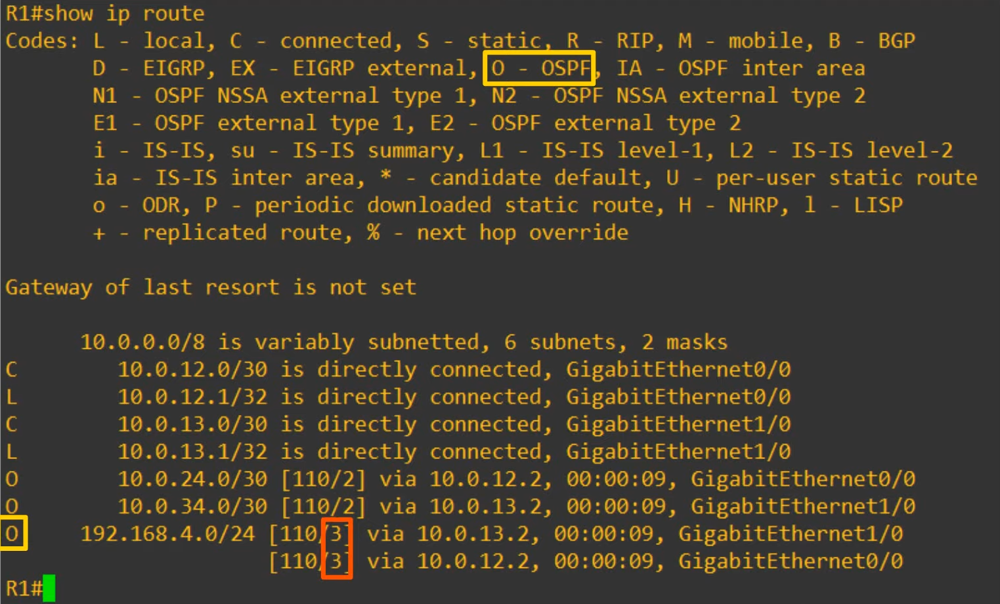

# Day 24 - Dynamic Routing


## Dynamic Routing

-   **Network Route:** A route to a network/subnet (mask length < /32)
-   **Host Route:** A route to a specific host (/32 mask)

-   Routers can use **dynamic routing protocols** to a**dvertise information about the routes they know to other routers**.
-   They **form "adjacencies"/"neighbor relationships"/"neighborships"** with adjacent routers to exchange this information.
-   **If multiple routes to a destination are learned**, the **router determines** which route is **superior** and **adds** it **to the routing table**. It uses the "metric" of the route to decide which is superior (**lower metric = superior**).

## Types of Dynamic Routing Protocols

-   Dynamic Routing Protocols can be divided into two main categories:
    -   **IGP (Interior Gateway Protocol)**
        -   Used to share routes **within a single Autonomous System (AS)**, which is a single organization (e.g. company)
    -   **EGP (Exterior Gateway Protocol)**
        -   Used to share routes **between different autonomous systems**



### Distance Vector Protocols

-   Distance Vector Protocols were **invented before link state protocols.**
-   Early examples are **RIPv1** and Cisco's proprietary protocol **IGRP** (which was upgraded to **EIGRP**)
-   Distance Vector Protocols **operate by sending the following to their directly connected neighbors**:
    -   their **known destination networks**
    -   their **metric to reach their known destination networks**
-   This method of sharing route information is often called **"routing by rumor"**

    -   This is because the **router doesn't know about the network beyond its neighbors**. It **only knows the information that its neighbors tell it**.

-   Called **"distance vector" because the routers only learn the "distance" (metric) and "vector" (direction, the next hop router) of each route**.

### Link State Protocols

-   When using a link state routing, **every router creates a "connectivity map" of the network**
-   To allow this, **each router advertises information about its interfaces** (connected networks) **to its neighbors**. These advertisements are **passed along to other routers**, untill **all routers in the network develop** the **same map of the network**.
-   **Each router** **independently** **uses** this **map** to **calculate the best routes to** each **destination**.
-   Link State Protocols **use more resources (CPU) on the router**, becase more information is shared.
-   However, link state protocols tend to be **faster in reacting to changes in the network** **than distance vector protocols**.

## Dynamic Routing Protocol Metrics

-   A **router's route table contains** the **best route to each destination network it knows about**.
-   If a router is using a dynamic routing protocol learns two different routes to the same destination, how does it determine which is "best"?
    -   It **uses the metric value of the routes to determine which is best**. A **lower metric is better**.
-   **Each routing protocol** **uses** a **different metric** to determine which route is the best.
-   If a router learns two (or more) routes via the **same routing protocol** to the **same destination** (same network address, same subnet mask) with the **same metric**, both will be added to the routing table. **Traffic will be load-balanced over both routes**.

    

    -   **O** stands for a route which was dynamically learned by **OSPF**
    -   The **values in red** (3 and 3) are the cost, which is the same
    -   Since the cost is the same we have an **ECMP (Equal Cost Multi-Path)**
    -   On the left side of the cost, we have **AD (Administrative Distance)** (110 and 110)

-   **NOTE:** If configuring static routes, cost will be 0 in all of them.

| IGP       | Metric                                         | Explanation                                                                                                                                                                         |
| --------- | ---------------------------------------------- | ----------------------------------------------------------------------------------------------------------------------------------------------------------------------------------- |
| **RIP**   | Hop Count                                      | Each router in the path counts as one "hop" The total metric is the total number of hops to the destination. **Links of all speeds are equal.**                                     |
| **EIGRP** | Metric based on bandwidth & delay (by default) | Complex formula that can take into account many values. By default, the **bandwidth of the slowest link in the route** and the **total delay of all links in the route** are used   |
| **OSPF**  | Cost                                           | The **cost of each link is calculated based on bandwidth**. The **total metric is the total cost of each link in the route**.                                                       |
| **IS-IS** | Cost                                           | The **total metric is the total cost of each link in the route**. The **cost of each link is not automatically calculated by default**. All links have a **cost of 10 by default**. |

## Administrative Distance

-   **In most cases a company will only use a single IGP** - usually OSPF or EIGRP.
-   However, **in some rare cases they might use two**. For example, if two companies connect their networks to share information, two different routing protocols might be in use.
-   Metric is used to compare routes learned via the same routing protocol.
-   Different routing protocols use totally different metrics, so they cannot be compared.
-   For example, an OSPF route to 192.168.4.0/24 might have a metric of 30, while an EIGRP route to the same destination migh have a metric of 33280. Whicch route is better? Which route should the router put in the routing table?
-   The **Administrative Distance (AD) is used to detemine which routing protocol is preferred**.
-   A **lower AD is preferred**, and **indicates** that the **routing protocol is considered more "trustworthy"** (more likely to select good routes).

| Route protocol/Type     | Administrative Distance (AD) |
| ----------------------- | ---------------------------- |
| **Directly Connected**  | 0                            |
| **Static**              | 1                            |
| **External BPG (eBGP)** | 20                           |
| **EIGRP**               | 90                           |
| **IGRP**                | 100                          |
| **OSPF**                | 110                          |
| **IS-IS**               | 115                          |
| **RIP**                 | 120                          |
| **EIGRP (external)**    | 170                          |
| **Internal BGP (iBGP)** | 200                          |
| **Unusable Route**      | 255                          |

-   "If the administrative distance is 255, the router does not believe the source of that route and does not install the route in the routing table"


- So, **metric is used to compare routes learned from the same routing protocol**.
- However, **before comparing metrics**, **AD is used to select the best route**.

- You can change the AD of a routing protocol 

- You can also change the AD of a static route:

```
R1(config)# ip route 10.0.0.0 255.0.0.0 10.0.13.2 ?
    <1-255>     Distance metric for this route
    multicast   multicast route
    name        Specify the name of the next hop
    permanent   permanent route
    tag         Set tag for this route
    track       Install route depending on tracked item
    <cr>

R1(config)# ip route 10.0.0.0 255.0.0.0 10.0.13.2 100
%% Configured the route with the add of 100

R1(config)# do show ip route

....

S       10.0.0.0/8 [100/0] via 10.0.13.2

....
```

- **By changing the AD of a static route, you can make it less preferred than routes learned by a dynamic routing protocol to the same destination** (make sure the AD is higher than the routing protocol's AD!).

- This is called **floating static route**.

- The **route will be inactive** (not in the routing table) **unless** the **route learned by the dynamic protocol is removed** (for example, the remote router stops advertising it for some reason, or an interface failure causes an adjacency with a neighbor to be lost).