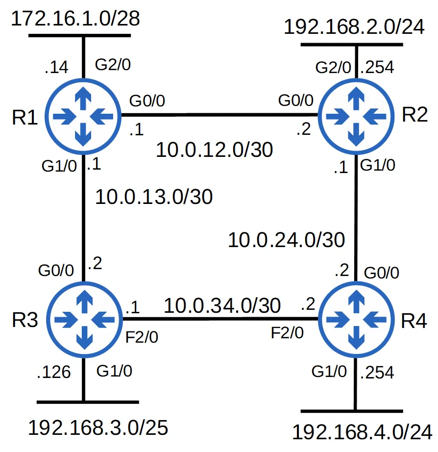
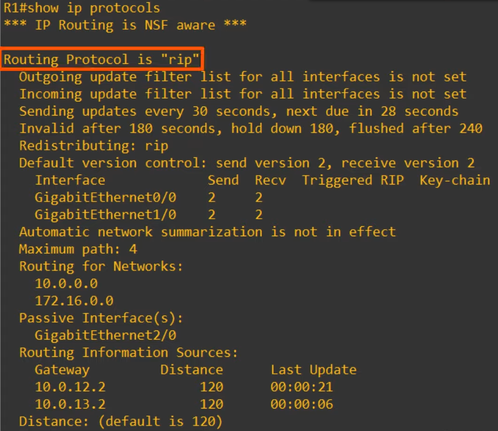
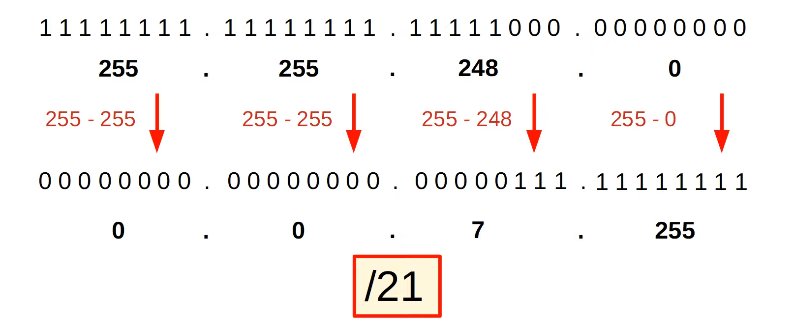
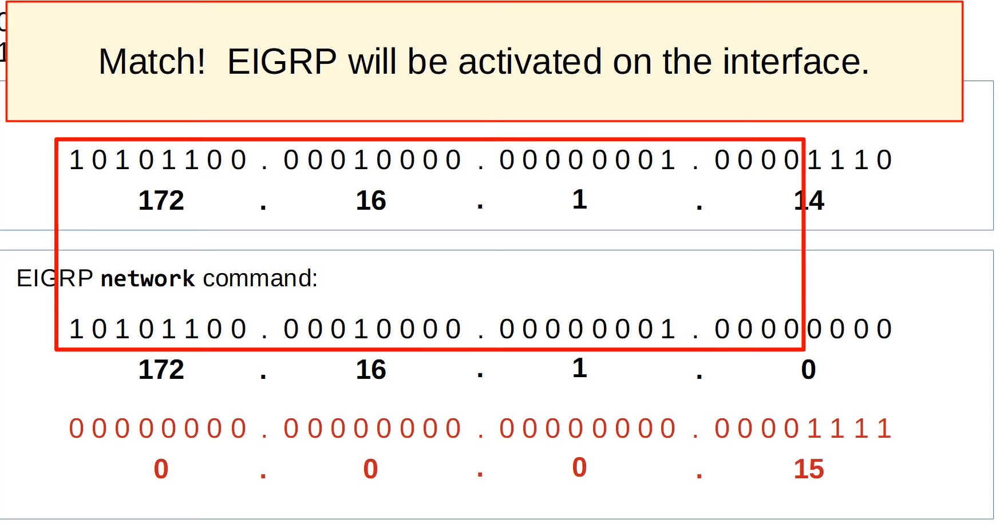
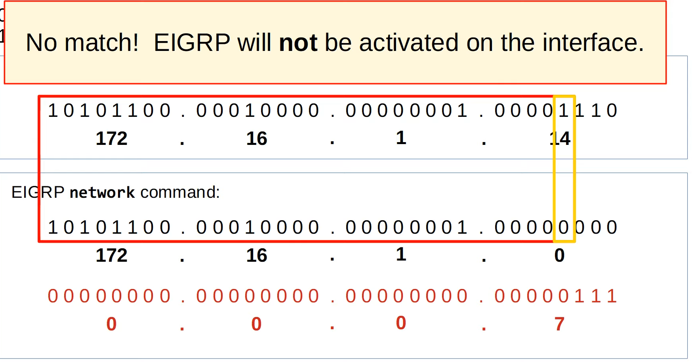
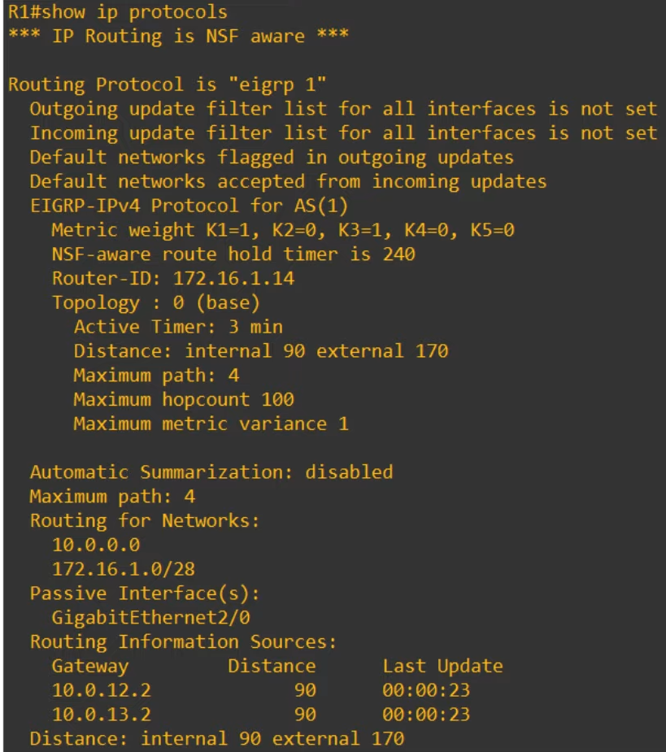
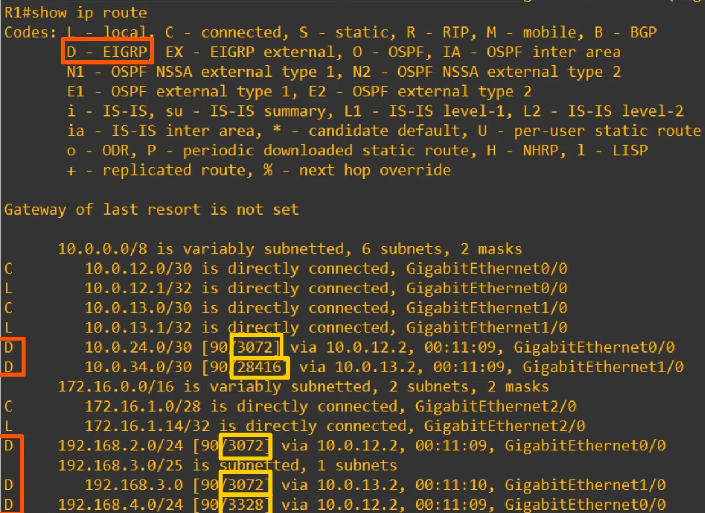
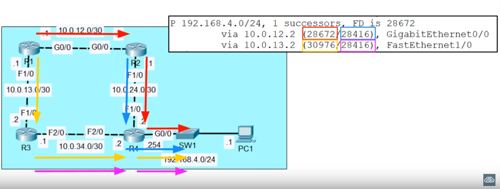
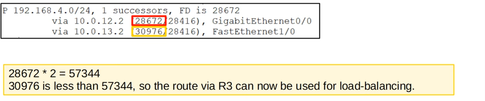

# Day 25 - RIP & EIGRP

## Routing Information Protocol (RIP)

- **Distance Vector IGP** (uses routing-by-rumour to learn/share routes)
- **Uses hop count as its metric**. One router = one hop (bandwidth is irrelevant)
- The **maximum hop count is 15** (anything more than that is considered unreachable)
- Has **3 versions**:
    - RIPv1 and RIPv2, used for IPv4
    - RIPng (RIP Next Generation), used for IPv6
- Uses **two message types**:
    - **Request:** To ask RIP-enabled neighbor routers to send their routing tables.
    - **Response:** To send the local router's routing table to neighboring routers.
- By default, **RIP-enabled routers** will **share** their **routing table every 30 seconds**.
    - This can cause problems in networks with lots of routers, since these can clog up the network.

### RIPv1
- **only advertises classful addresses** (Class A, Class B, Class C)
- **doesn't support VLSM, CIDR**
- **doesn't include subnet mask information** in advertisements (Response Messages)
    - 10.1.0.0/24 will become 10.0.0.0 (Class A address, so assumed to be /8)
    - 172.16.192.0/18 will become 172.16.0.0/16 (Class B address, so assumed to be /16)
    - 192.168.1.4/30 will become 192.168.1.0 (Class C address, so assumed to be /24)
- messages are **broadcast to 255.255.255.255**
    - so, all routers receive the messages

### RIPv2
- **supports VLSM, CIDR**
- **includes subnet masks information** in advertisements
- messages are **multicast to 224.0.0.9**
    - **Broadcast** messages are **delivered to all devices on the local network**
    - **Multicast** messages are **delivered only to devices that have joined that specific multicast group**

### RIP Config

```
R1(config)# router rip
R1(config-router)# version 2
R1(config-router)# no auto-summary 
R1(config-router)# network 10.0.0.0
R1(config-router)# network 172.16.0.0
```

- `no autosummary` - auto-summary is on by default and it automatically converts the networks the router advertises to classful networks
- The RIP `network` command is classful, it will automatically convert to classful networks.
- For example, even if you enter the command `network 10.0.12.0`, it will be converted to `network 10.0.0.0` (a class A network).
- There is no need to enter the network mask.

## Network Command

- The network command tells the router to:_
    - **look for interfaces with an IP address** that is **in the specific range**.
    - **activate RIP on the interfaces** that fall **in that range**.
    - **form ajacencies** **with connected RIP neighbors**.
    - **advertise** the **network prefix of the interface**
        - NOT the prefix in the network command

- The OSPF and EIGRP network commands operate in the same way.

### Example:



#### `R1(config-router)# network 10.0.0.0`

1) Because the network command is classful, 10.0.0.0 is assumed to be 10.0.0.0/8.
2) R1 will look for any interfaces with an IP address that matches 10.0.0.0/8 (because if is /8 it only needs to match the first 8 bits)
3) 10.0.12.1 and 10.0.13.1 both match, so RIP is activated on G0/0 and G1/0.
4) R1 forms adjacencies with its neighbors R2 and R3.
5) R1 advertises 10.0.12.0/30 and 10.0.13.0/300 (NOT 10.0.0.0/8) to its RIP neighbors.

- **Note:** The `network` command doesn't tell the router which networks to advertise. It tells the router which interfaces to activate RIP on, and then the router will advertise the network prefix of those interfaces.

#### `R1(config-router)# network 172.16.0.0`

1) Because the network command is classful, 172.16.0.0 is assumed to be 172.16.0.0/16.
2) R1 will look for any interfaces with an IP address that matches 172.16.0.0/16.
3) 172.16.1.14 matches, so R1 will activate RIP on G2/0.
4) There are no RIP neighbors connected to G2/0, so no new adjacencies are formed.
5) R1 advertises 172.16.1.0/28 (NOT 172.16.0.0/16) to its RIP neighbors.

- **Note:** Although there are no RIP neighbors connected to G2/0, **R1 will continuously send RIP advertisements out of G2/0**. This is unnecessary traffic, so G2/0 should be configured as a **passive interface**.


### Passive Interface

#### `R1(config-router)# passive-interface g2/0'`

- The `passive-interface` command **tells the router to stop sending RIP advertisements out of the specified interface** (G2/0).

- However, the **router will continue to advertise the network prefix of the interface** (172.16.1.0/28) **to its RIP neighbors** (R2, R3).

- You should **always use** this command **on interfaces which don't have any RIP neighbors**.

- **EIGRP and OSPF** both **have** the same **passive interface functionality**, using the same command.

### `R1(config-router)# default-information originate`

Configures Routing Protocol to propagate the default route (0.0.0.0/0) to its neighbors if it is present in the routing tables.

### `R1# show ip protocols`



- **Maximum Path** refers to ECMP load balancing (by default RIP will insert 4 paths to the same destination into the routing table, if they have the same metric)
    - to change this you can run `maximum paths <number of paths>`:
        ```
        R1(config-router)# maximum-paths ?
            <1-32>  Number of paths
        
        R1(config-router)# maximum-paths 8
        ```

- **Routing for Networks** advertises the Networks used in the network command (not the actual networks that RIP is advertising)

- **Passive Interfaces** are the interfaces which won't send advertisements

- **Routing Information Sources** you can see R1's RIP neighbors (R2 and R3)

- **Distance** states the administrative distance of RIP (default: 120)
    - To change it you can run `distance <new adm dist>`
        ```
        R1(config-router)# distance ?
            <1-255>     Administrative distance

        R1(config-router)# distance 85
        ```

## Exterior Gateway Routing Protocol (EIGRP)

- Was Cisco proprietary, but CIsco has now published it openly so other vendors can implement it on their equipment.

- Considered an **"advanced"/"hybrid" distance vector routing protocol**

- **Much faster than RIP** in **reacting to changes in the network**.

- **Does not have the 15 "hop-count" limit of RIP**.

- Sends **messages using multicast address 224.0.0.10**.

- Is the **only IGP that can perform unequal-cost load-balancing** (by default it performs ECMP load-balancing over 4 paths like RIP)

### Configuration


```
R1(config)# eigrp 1
R1(config-router)# no auto-summary
R1(config-router)# passive-interface g2/0
R1(config-router)# network 10.0.0.0
R1(config-router)# network 172.16.1.0 0.0.0.15
```

- `router eigrp <AS Number>`
    - The **AS (Autonomous System) number must match between routers**, or they will not form an adjacency and share route information.
- `auto-summary` might be enabled or disabled by default depending on the router/IOS version. If it's enabled, desable it.
- The `network` command will assume a classful address if you don't specify the mask.
    - note: as rip, you are not advertising the network, but instead activating ports that are on the interfaces contained on that network (e.g. g0/0 and g0/1).
- In EIGRP you **can specify the network mask** in the `network command`.
- EIGRP uses a **wildcard mask** instead of a regular subnet mask.

    

## Wildcard Masks

- A wildcard mask is basically an **inverted subnet mask**.
- All 1's in the subnet mask are 0's in the equivalent wildcard mask. All 0's in the subnet mask are 1's in the equivalent wilcard mask:

```
/24: 

11111111 . 11111111 . 11111111 . 00000000
 (255)   .   (255)  .  (255)   .    (0)

                    |
                    V

00000000 . 00000000 . 00000000 . 11111111
 (0)   .   (0)  .  (0)   .    (255)
```

- A shortcut is to **subtract each octet of the subnet mask from 255**:



### Why? - Wildcard Masks

- **0** in the wildcard mask => **must match**
- **1** in the wildcard mask => **don't have to match**

So, for example:

R1 G2/0 IP address: 172.16.1.14
    - Which in binary is `101011.00010000.00000001.00001110`

- `network 172.16.1.0 0.0.0.15`:



#### Example 2




### `R1# show ip protocols`



- EIGRP uses **interface bandwidth** an **delay by default**: Those are the **K1** and the **K3** in the **Metric Weight field**

- **Router-ID**: in EIGRP and OSPF each router has an **unique Router-ID** which identifies it within the AS.
    - Router-ID is not actually an IP Address (it is just a 32 bit number configured in a dotted decimal format). To configure it you can do the following:
        ```
        R1(config-router)# eigrp router-id ?
            A.B.C.D     EIGRP Router-ID in IP address format

        R1(config-router)# eigrp router-id 1.1.1.1
        ```

- **Router ID order of priority**:
    1) **Manual Configuration**.
    2) **Highest IP** address on a **loopback interface**.
    3) **Highest IP** address on a **physical interface**.

- EIGRP has two separate AD values:
    - **90** for Internal Routes (normal EIGRP routes)
    - **170** for External Routes (routes from outside EIGRP which are then inserted into EIGRP)


### `show ip route`



- EIGRP is represented with a **D** in the routing table.
- The costs are bigger than values seen in other routing protocols (therefore it is **harder to understand the metric**)

# Lab Video

## Configuring Loopback interfaces

- `SW1(config)# interface loopback <loopback interface number>`: creates a loopback interface 

- The **loopback interface should be made a passive interface** so that EIGRP messages are not sent out of it (waste of resources)


## Others

- `do show ip eigrp neighbors` show the eigrp neighbors
    - Shows the interface they are connected to and some other info.

- `do show ip route eigrp`: filters the routes learnt by eigrp

- `do show ip eigrp topology` - here you can see more information about the routes learnt by eigrp other than the ones only present on the routing table.

## EIGRP Metric

- By default EIGRP uses **bandwidth** and **delay** to calculate metric.

- ([K1 * Bandwidth + (K2 * bandwidth) / (256 - load) + K3 * delay] * [K5 / (reliability + K4)]) * 256

- The **default K values are**:
    - K1 = 1
    - K2 = 0
    - K3 = 1
    - K4 = 0
    - K5 = 0

- You can simplify the formula like this: `metric = bandwidth + delay`
    - `Bandwidth` (of the slowest link) + `delay` (of all links)

## EIGRP Terminology

- **Feasible Distance** = This router's metric value to the route's destination.
- **Reported Distance** (aka **Advertised Distance**) = The neighbor's metric value to the route's destination. 

    

    - In the **left** you can see the **feasible distances** of both paths
    - In the **right** you can see the **reported distances** of both paths

- **Successor** = the route with the lowest metric to the destination (the best route)
    - in this case it's the route through R2

- **Feasible Successor** = an alternate route to the destination (not the best route), which meets the feasibility condition.
    - in this case it's the route through R3

#### Feasibility Condition

- A route is considered a **feasible successor** if it's **reported distance** is **lower than the successor route's feasible distance**.
    - e.g. 28416 is less than 28672, so the route via R3 is a feasible successor.

## EIGRP Unequal-Cost-Load-Balancing

```
R1# show ip protocols

Routing protocol is "eigrp 100"
    ....
    EIGRP maximum metric variance 1
```

- **Variance 1** = only ECMP (Equal-Cost-Multi-Path) load-balancing will be performed.

- `R1(config-router)# variance <metric variance multiplier>`
    - **Variance 2 = feasible successor** routes with an Feasible Distance up to 2x the successor route's Feasible Distance can be used to load balance.



- **NOTE:** EIGRP will only perform unequal-cost load-balancing over feasible successor routes. If a route doesn't meet the feasibility requirement it will NEVER be selected for load-balancing, regardless of the variance.