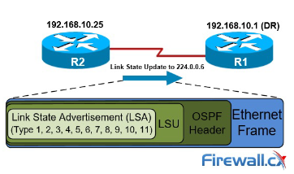
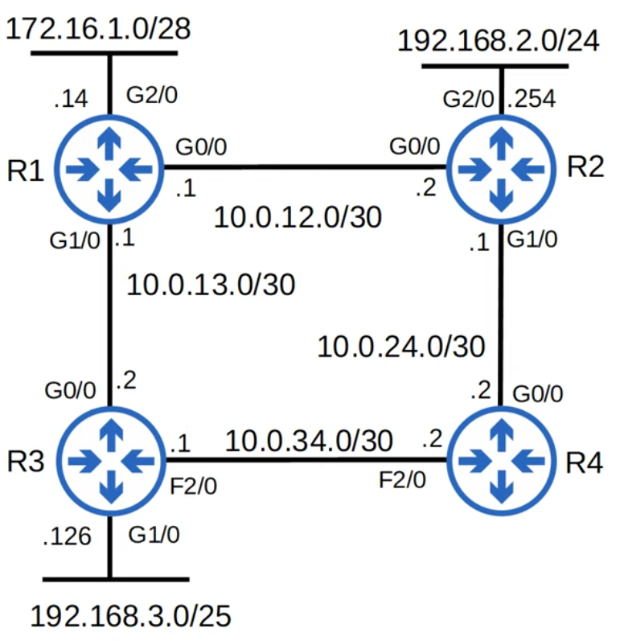
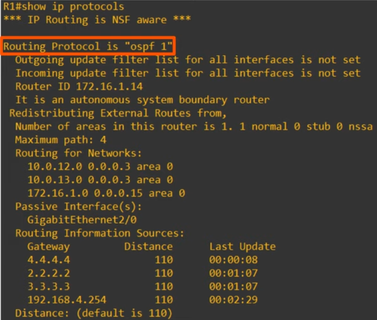

# Day 26 - OSPF (Part 1)

## Revision - Link State Routing Protocols

- When using a link state routing protocol, every router creates a connectivity map of the network.
- To allow this, each router advertises information about its interfaces (connected networks) to its neighbors. These advertisements are passed along to other routers, until all rouers in the network develop the same map of the network.
- Each router independently uses this map to calculate the best routes to each destination.
- Link State protocols use more resources (CPU) on the router, because more information is shared.
- However, link state protocols tend to be faster in reacting to changes in the network than distance vector protocols.

## OSPF (Open Shortest Path First)

-   Uses **Shortest Path First (Dijkstras Algorithm)**

- OSPF has **3 versions**:
    - OSPFv1 (1989): Old, not in use anymore
    - OSPFv1 (1998): Used for IPv4
    - OSPFv1 (2008): Used for IPv6 (can also be used for IPv4, but usually v2 is used)

-   Router store information about the network in **LSAs (Link State Advertisements)**, which are organized in a structure called the **LSDB (Link State Database)**.



-   Routers will **flood LSAs until all routers in the OSPF area develop the same map of the network (LSDB)**.

### LSA Flooding


- All of the routers are OSPF neighbors, they have the same LSDB and the network is stable.
- OSPF is enabled on R4's G1/0 interface.

1) R4 creates an LSA to tell its neigbors about te network on G1/0:

    ```
    LSA
    RID: 4.4.4.4
    IP: 192.168.4.0
    Cost: 1
    ```

    - Remember, the RID will be assigned according to the following criteria: manually assigned > highest ip address on a loopback interface > highest ip address on a physical interface

2) The LSA is flooded throughout the network until all routers have received it.
    - This results in all routers sharing the same LSDB.

3) Each router then uses the SPF algorithm to calculate its best route to 192.168.4.0/24

- **Note:**  Each LSA has an aging timer (30 min by default). The LSA will be flooded again after the timer expires.

### OSPF Steps - Basic

-   In OSPF, there are three main steps in the process of sharing LSAs and determining the best route to each destination in the network.

-   **1. Become neighbors:** two routers running OSPF on the same link agree to form a neighbour relationship.

-   **2. Exchange LSDB information:** The neighbour routers swap their LSDB information with each other. Essentially they change LSAs present in their LSDB.

-   **3. Store LSAs in the LSDB** once all of the lsas have been flooded (the goal is to have every router with the same info in their lsdb).

-   **3. Calculate the best routes**: Each router chooses the best routes to add to its routing table based on the learned LSDB information. This is made by running SPF (aka Dijkstras).

### OSPF Areas

- OSPF uses **areas** to **divide up the network**.
- **Small networks can be single-area without** any **negative effects** on performance.
- **In larger networks**, a **single-area design can have negative effects**:
    - the SPF algorithm takes **more time to calculate routes**.
    - the SPF algorithm requires exponentially **more processing power** on the routers.
    - the larger LSDB **takes up more memory on routers**.
    - any **small change in the network causes every router to flood LSAs and run the SPF algorithm again**.

- By dividing a large OSPF network into several smaller areas, you can avoid the above negative effects.

- An **area is a set of routers and links that share the same LSDB**.
- The **backbone are (area 0)** is **an area that all other areas must connect to**.
- Routers with **all interfaces in the same area** are called **internal routers**.
- Routers with **interfaces in multiple areas** are called **area border routers**.
    - ABRs maintain a **separate LSDB for each area they connect to**. It is recommended that you **connect an ABR to a maximum of 2 areas**. Connecting an ABR to 3+ areas can overburden the router.
- **Routers connected to the backbone area** (area 0) are called **backbone routers**.
- An **intra-area route** is a **route to a destination inside the same OSPF area**.
- An **inter-area route** is a **route to a destination in a different OSPF area**.

#### OSPF Area Rules

- **OSPF Areas** should be **contiguous**.
- **All OSPF areas** must have **at least one ABR connected to the backbone area**.
- OSPF **interfaces in the same subnet must be in the same area**.
    - otherwise, the interfaces won't become OSPF neighbors.

### Basic OSPF Configuration


```
R1(config)# router ospf ?
    <1-65535>   Process ID

R1(config)# router ospf 1
R1(config-router)# network 10.0.12.0 0.0.0.3 area 0
R1(config-router)# network 10.0.13.0 0.0.0.3 area 0
R1(config-router)# network 172.16.1.0 0.0.0.15 area 0 
```

- The OSPF *process ID* is **locally significant**.
    - Routers with different process IDs can become OSPF neighbors.

- The OSPF `network` command **requires** you **to specify the area**.

##### `Network` command recap

- The `network` command tell OSPF to:
    - look for any interfaces with an IP address contained in the range specified in the `network` command.
    - activate ospf on the interface in the specified area.
- The router will then try to become OSPF neighbors with other OSPF-activated neighbors routers.

##### `passive-interface` command recap

- The `passive-interface` command tells the router to stop sending OSPF "hello" messages out of the interface.
- However, the router will continue to send LSAs informing it's neighbors about the subnet configured on the interface.
- You should always use this command on interfaces which don't have any OSPF neighbors.

##### `default-information originate`
This command is used to **advertise a default route into OSPF**.
    - This will cause the router to create a new LSA and flood it.

The `default-information originate` command configures OSPF to inject a router's default external route into OSPF. Additionally, if you issue either the `default-information originate` command or a `redistribute` network command in OSPF router configuration mode, Cisco IOS automatically considers the router an ASBR. An ASBR redistributes routes from other routing protocols into the OSPF domain.

##### `redistribute connected`

Redistributes all of the router's connected routers.

##### `show ip protocols`



- An **autonomous system boundary router** (ASBR) is an OSPF Router that connects the OSPF network to an external network.

- R1 is connected to the internet. By using the `default-information originate` command, R1 becomes an ASBR.

- You can see the number of areas the router is in (in this case is one, since it is a single area ospf setup).

- Maximum path is the same as in EIGRP: for load balancing.
    - Unlike EIGRP, OSPF does not support unequal cost load balacing, however it supports ECMP load-balacing over a maximum number of 4 paths by default.
    - To change the number of paths use `maximum-paths <number of paths>` with the number of paths possible being between 1 and 32.

##### `distance <Administrative Distance>`

The command `distance <1-255>` is used to change the administrative distance of a routing protocol.

##### `maximum-paths <Number of Paths>`

- To change the number of paths use `maximum-paths <number of paths>` with the number of paths possible being between 1 and 32.

##### `router-id <A.B.C.D>`

- The change will only take effect **after reloading the router** or **running `clear ip ospf process`**
    - **Note:** running `clear ip ospf process` in a production router is probably a bad idea since it will delete all the ospf routes during a short period of time, therefore causing connectivity issues.

-   Router id order of priority:
    -   **1)** Manual configuration.
    -   **2)** Highest IP address on a loopback interface.
    -   **3)** Highest IP address on a physical interface.

### Hello Packets

A HELLO packet is a special data packet (message) that is sent out periodically from a router to establish and confirm network adjacency relationships to other routers in the Open Shortest Path First (OSPF) communications protocol. On networks capable of broadcast or Multicast transmission, a HELLO packet can be sent from one router to all other routers simultaneously to discover neighboring routes.

OSPF networks are made up of many interconnected routers. These routers are connected on their interfaces. The HELLO packet is the method for routers to announce to each other that they share an interface.

Without the use of a HELLO packet, each router would need to have its connections to other routers manually configured. Once routers successfully exchange HELLO packets, they can automatically establish adjacency and can begin to route data between them.

An hello packet contains the **router ID** and its **already known neighbors**.

After a router receives an hello message, before becoming neighbors, the router runs some very specific checks to check if they can become neighbors:

-   The area ID must be the same
-   The connecting links between the routers must be on the same subnet
-   The hello and dead timers must be the same (the dead timer is how long a router will wait without hearing an hello message, before assuming that router is dead)
-   Authentication and stub area flag must match
-   Routers must use unique router IDs

If all of these pass, router 2 moves to an `init state` and sends an hello message to router 1 with its router ID and router 1 as a known neighbor (this allows router 1 to move to the `2-way state`).

Then router one sends another hello message listing router 2 as a known neighbor, which then allows router 2 to move to the `2-way state` too.

-   Once the exchange process starts, both routers enter the `exstart state`. At this point, the routers select a slave and a master

### DRs and BDRs

If there is no hierarchy, if a link goes down a router announces it to all of its neighbours. Each of their neighbours does the same and quickly this gets out of hand (**doesn't scale properly**).

- For this there is a **DR** and **BDR**.

- The DR and BDR are **elected** based on the **highest OSPF priority**.
    - **Priority** is set to **1 by default**.
    - **If** the **priority ties**, then the **election is based** on the **highest router ID**.
    - When when the same segment, routers will only become full neighbors with DRs and BDRs (the other neighbors will stay in the 2-way state) => **this means every router will ignore updates unless it comes from the DR!**

#### DR (Designated Router)

- **Role:** The DR is a special router elected among OSPF routers on a multi-access network (like Ethernet).
- **Purpose:** It reduces the amount of routing protocol traffic and simplifies the process of sharing routing information.
- **Function:** The DR collects and distribtues OSPF routing information to and from all routers in the network segment. This way, instead of every router talking to every other router (which would be inefficient), all routers talk to the DR


#### BDR (Backup Designated Router)

- **Role:** The BDR serves as a standby to the DR.
- **Purpose:** It ensures continuity and reliability. If the DR fails, the BDR takes over its duties without the need for a new election process.
- **Function:** The BDR listens to the OSPF traffic just like the DR and is ready ot become the DR if the current DR fails.

### OSPF states

Let's assume there are 2 routers (router 1 and router 2). Router 1 sends an hello packet to router 2 with its router ID and a list of its already known neighbors. Router 2 runs some checks in order to see if they can become neighbors and, if these checks pass, router 2 sends another hello packet to router 1 with its router id and the list of its neighbors (with router 1 in it). This makes router 1 enter a `2-way state`. After this, router 1 sends another hello message to router 2 listing it as a known neihgbor and router 2 can enter this `2-way state` too.

Once the exchange process starts, both router enter the `exstart state`. At this point, the routers select a slave and a master (based on the router ID). The master will constrol the sequence numbers and start the exchange process (with both routers being on the `exchange state`).

While on the `exchange state`, both routers send a list of their LSAs (this is called a database description aka **DBD**).

After this they go to a `loading state`, where each router will look at the DBD and request any information it doesn't have. This happens to prevent loops, by asking for information rather than just firing out updates.

The request the router makes when he sees a LSA it doesn't have on the DBD is called a **Link State Request (LSR)**. When the other router respondes, it sends a **Link State Update (LSU)**. When the router receives the LSU it sends an **LSAck**. When the exchange of information has happened both routers enter the `full neighbor state`.

`Note:` This example is of a Point-to-Point network. On a broadcast network, routers will only form a full neighbor relationship with DRs and BDRs.

### Cost Calculation

-   OSPF calculates the best routes by using a **metric** called **cost**.

-   **Cost:** Value given to a link based on the bandwidth of that interface.
    -   Cost = Reference bandwidth / Interface bandwidth

| Interface    | Default Bandwidth | Cost |
| ------------ | ----------------- | ---- |
| Serial       | 1,544 Kbps        | 64   |
| Ethernet     | 10,000 Kbps       | 10   |
| FastEthernet | 100,000 Kbps      | 1    |

### OSPF Areas

-   OSPF uses **areas** to **divide up the network**

-   An **area** is a **set of routers and links that share the same LSDB**.

-   Small networks can be singe-area without any negative effects on performance.

-   In larger networks, a single-area design can have negative effects:

    -   the SPF algorithm takes more time to calculate routes.
    -   the SPF algorithm requires exponentially more processing power on the routes.
    -   the larger LSDB takes up more memory on the routers.
    -   any small change in the network causes every router to flood LSAs and run the SPF algorithm again.

-   By dividing a large OSPF network into several smaller areas, you can avoid the above negative effects.

#### Concepts

-   **Area:** set of routers and links that share the same LSDB.

-   **Backbone Area (area 0):** area that all other areas must connect to.

-   **Internal Routers:** outers with all interfaces in the same area.

-   **Area Border Routers (ABRs):** routers with interfaces in multiple areas.

    -   ABRs maintain a separate LSDB for each area they are connected to. It is recommended that you connect an ABR to a maximum of 2 areas. Connecting an ABR to 3+ areas can overburden the router.

-   **Backbone Routers:** routers connected to the backbone area (area 0).

-   **Intra-area route:** route to a destination inside the same OSPF area.

-   **Inter-area route:** route to a destination in a different OSPF area.

-   **Autonomous System Boundary Router (ASBR):** OSPF router that connects the OSPF network to an external network

#### Rules

-   OSPF **areas should be contiguous** (each individual area should be connected, and not divided).

    -   if there are non-contiguous areas, they should be made into a different area.

-   **All** OSPF **areas** **must have** at least **one ABR connected to the backbone area**.

-   OSPF **interfaces in the same subnet** **must be in** the **same area**.

    -   if they are not, they won't become OSPF neighbors and won't excahnge information about the networks they know about.

-   OSPF sends hello messages to tell other routers about itself

-   The **passive-interface** command tells the router to stop sending OSPF "hello" messages out of the interface.

-   However, the route will continue to send LSAs informing its neighbors about the subnet condigured on the interface.

-   Single-area OSPF can use any area number (not only 0), although it is not a common practice.

