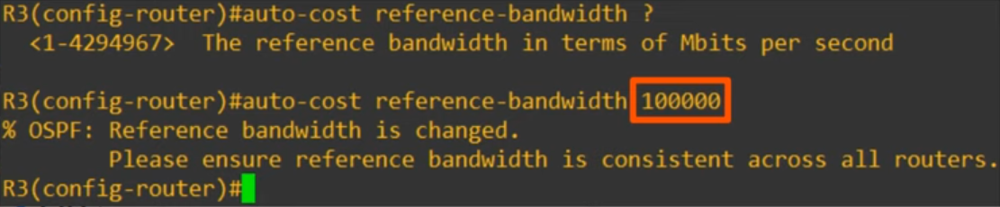
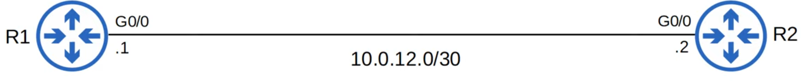
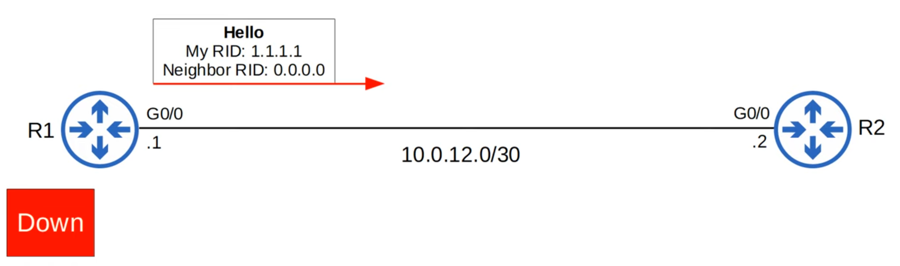
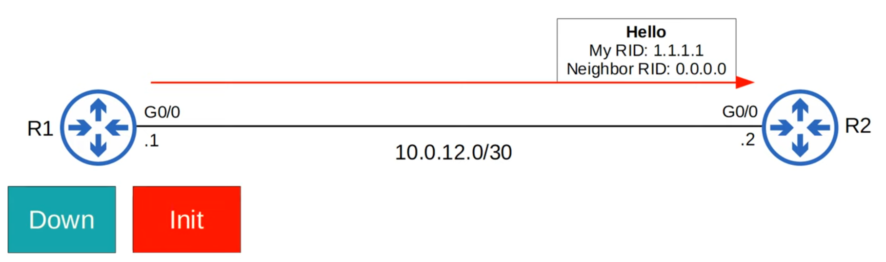
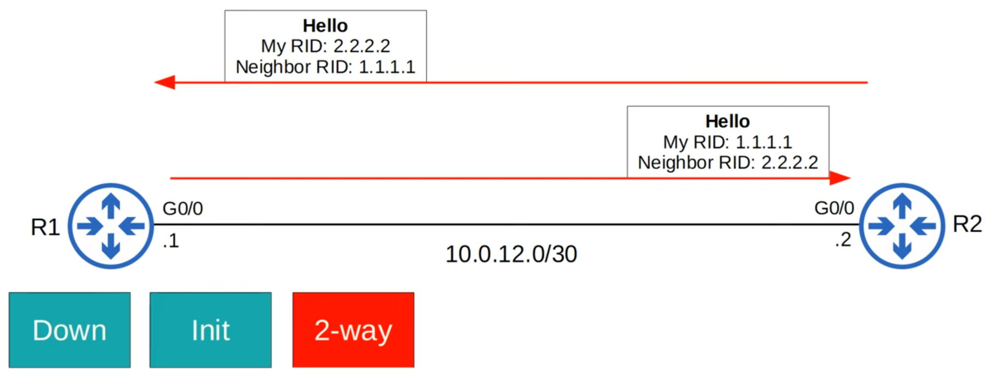
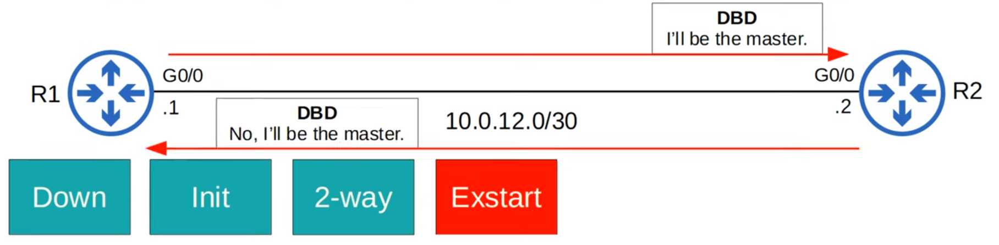
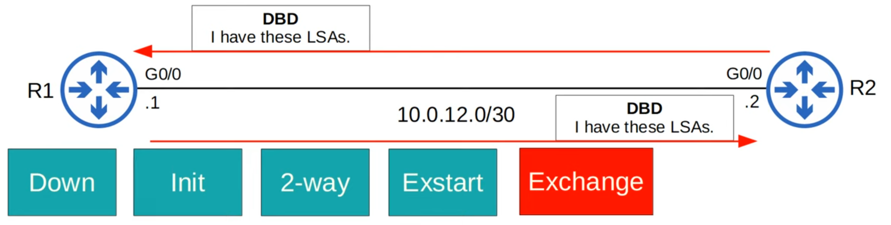
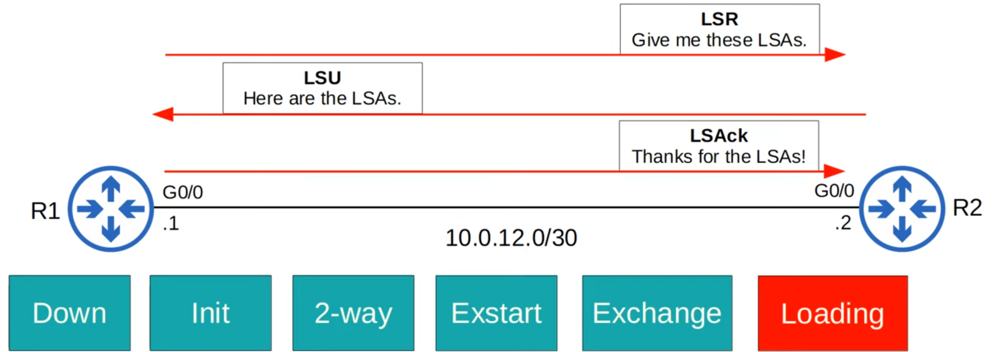
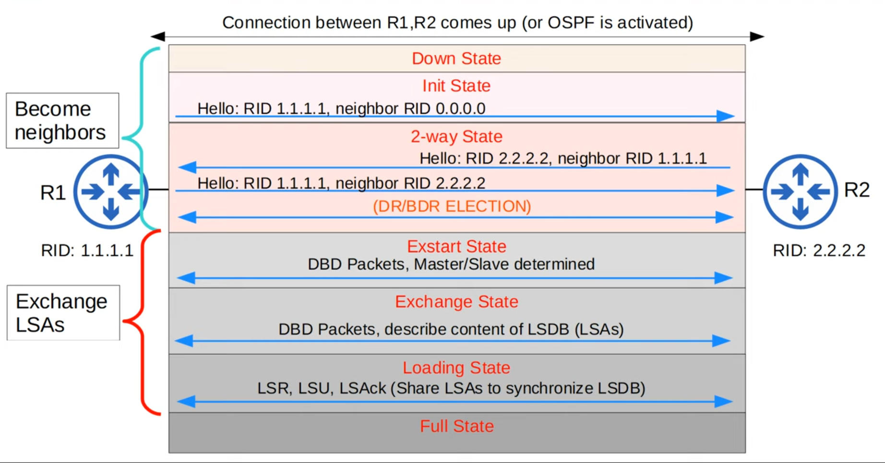

# Day 27 - OSPF (Part 2)

## OSPF Cost

-   **OSPF metric** is called **cost**.
-   It is automatically **calculated based on the bandwidth (speed) of the interface**.
-   It is calculated by **dividing a reference bandwidth value by the interface's bandwidth**.
-   The **default reference bandwidth is 100 mbps**:

    -   **Reference:** 100 mbps / **Interface:** 10 mbps = **cost of 10**
    -   **Reference:** 100 mbps / **Interface:** 100 mbps = **cost of 1**
    -   **Reference:** 100 mbps / **Interface:** 1000 mbps = **cost of 1**
    -   **Reference:** 100 mbps / **Interface:** 10000 mbps = **cost of 1**

-   All **values less than 1 will be converted to 1**.
-   Therefore, **FastEthernet, GigabitEthernet, 10GigEthernet, etc. are equal an all have a cost of 1 by default**.

-   **Note:** to see the cost of an interface you can run the command `show ip ospf interface <interface number>`

-   The OSPF **cost to a destination** is the **total cost of the "outgoing/exit interfaces"**.

-   **Loopback interfaces** have a **cost of 1**.

#### `auto-cost reference-bandwidth <1-4294967>`

-   You can (AND SHOULD!!) change the reference bandwidth with this command: `R1(config-router)# auto-cost reference-bandwidth <megabits-per-second>`

    

    -   100000/100 = cost of 1000 for FastEthernet
    -   100000/1000 = cost of 100 for GigabitEthernet

-   You should configure a **reference bandwidth greater than the fastest links in your network** (to allow for future upgrades).

-   You should configure the **same reference bandwidth on all OSPF routers in the network**.

#### `ip ospf cost <1-65535>`

-   Manually changes the cost of the interface.
-   Takes precedence over the default cost.

---

-   One more option to change the OSPF cost of an interface is to change the bandwidth of the interface with the `bandwidth` command.
-   The formula to calculate OSPF cost is `reference bandwidth /  interface bandwidth`
-   Although the bandwidth matches the interface speed by default, changing the interface bandwidth **doesn't actually change the speed at which the interface operates**.
-   The bandwidth is just a value that is used to calculate the OSPF cost, EIGRP metric, etc.
-   To change the speed at which the interface operates, use the `speed` command.
-   Because the bandwidth value is used in other calculations, it is not recommended to change this value to alter the interface's OSPF cost.
-   It is recommended that you change the reference bandwidth, and then use the `ip ospf cost` command to change the cost of individual interfaces if you want.

```
R1(config-if)# bandwidth ?
    <1-10000000>    Bandwidth in kilobits
    inherit         Specify how bandwidth is inherited.
    qos-reference   Reference bandwidth for QOS test.
    receive         Specify receive-side bandwidth.
```

### OSPF Cost summary

-   Three ways to modify the OSPF cost:

1. **Change** the **reference bandwidth**:
    - `R1(config-router)# auto-cost reference-bandwidth <megabits-per-second>`
2. **Manual Configuration**:
    - `R1(config-if)# ip ospf cost <cost`
3. **Change** the **interface bandwidth**:
    - `R1(config-if)# bandwidth <kilobits-per-second> `

-   `show ip ospf interface brief` gives a convenient overview of each ospf interface on the router:


## OSPF Neighbors

-   Making sure that routers become OSPF neighbors is the main task in configuring and troubleshooting OSPF.
-   Once the routers become neighbors, they automatically do the work of sharing network information, calculating routes, etc.
-   When OSPF is activated on an interface, the router starts sending OSPF hello messages out of the interface at regular intervals (determined by the **hello timer**). These are used to introduce the router to potential OSPF neighbors.
-   The **default hello timer** is **10 seconds** on an Ethernet connection.
-   **Hello messages** are **multicast to 224.0.0.5** (multicast address for all OSPF routers).
-   **OSPF messages** are **encapsulated in an IP header**, with a **value of 89 in the protocol field**.

### OSPF Neighbor States



#### Down State

(assuming OSPF is activated on R2's G0/0 interface)

-   OSPF is activated on R1's G0/0 interface.

1. It **sends** an **OSPF hello message to 224.0.0.5**.
2. It **doesn't know about any OSPF neighbors** yet, so the **current neighbor state is down**.



#### Init State



1. When **R2** receives the Hello packet, it **will add an entry for R1 to its OSPF neighbor table**.
2. **In R2's neighbor table**, the relationship with **R1 is** now **in the Init state**.
    - **Init State =** Hello packet received, but own router ID is not in the Hello packet

#### Two-Way State



1. **R2 will send a Hello Packet containing** the **RID of both routers**.

    - **R1** will **insert R2 into** its **OSPF neighbor table in** the **2-way state**.

2. **R1 will send another Hello message**, this time **containing R2's RID**.
    - Now **both routers** are **in** the **2-way state**.

-   The **2-way state means** the **router has received a Hello packet with** its **own RID in it**.
-   **If both routers reach the 2-way state**, it means that **all of the conditions have been met** for them **to become OSPF neighbors**. **They are** now **ready to share LSAs to build a common LSDB**.
-   In some network types, a DR (Designated Router) and BDR (Backup Designated Router) will be elected at this point.

#### Exstart State



1. The two routers will now prepare to exchange information about their LSDB.

-   Before that, they have to choose which one will start the exchange.
    -   They will do this in the **Exstart state**.

2. The **router with the higher RID** will become the **Master** and **initiate the exchange**.
    - The **router with the lower RID** will become the **Slave**.

-   To decide the Master and Slave, they exchange DBD (Database Description) packets.

#### Exchange State



-   In the **Exchange state**, the **routers exchange DBDs** which **contain a list of the LSAs in their LSDB**.

-   These **DBDs do not include detailed information about the LSA**, just basic information.

-   The **routers compare** the **information in the DBD they received to** the **information in their own LSDB** **to determine which LSAs** they must **receive from** their **neighbor**.

#### Loading State



-   In the loading state, **routers send Link State Requests (LSR)** messages to request that their neighbors send them any LSAs they don't have.
-   **LSAs** are **sent** **in Link State update (LSU) messages**
-   The **routers send LSAck messages** to acknowledge that they received the LSAs.

#### Full State

-   In the Full State, the routers have a **full OSPF adjacency** and **identical LSDBs**.
-   **They continue to send and listen for Hello packets** (**every 10 seconds by default**) to maintain the neighbor adjacency.
-   **Every time a Hello packet is received**, the **Dead timer (40 seconds by default) is reset**.
-   **If** the **Dead timer counts down to 0 and no Hello message is received**, the **neighbor is removed**.
-   The **routers will continue to share LSAs as the network changes** to make sure each router has a complete and accurate map of the network (LSDB).

#### Resume

-   In OSPF, there are **three main steps in the process of sharing LSAs and determining the best route to each destination in the network**:
    1. **Become neighbors** with other routers connected to the same segment.
    2. **Exchange LSAs** with neighbor routers.
    3. **Calculate the best routes** to each destination, and insert them into the routing table.



### OSPF Message Type Chart

| Type | Name | Purpose |
| ---- | ---- | ------- |
| 1 | **Hello** | Neighbor discovery and maintenance.|
| 2 | **Database Description (DBD)** | Summary of the LSDB of the router. Used to check if the LSDB of each router is the same.|
| 3 | **Link-State Request (LSR)** | Request specific LSAs from the neighbor.|
| 4 | **Link-State Update (LSU)** | Sends specific LSAs to the neighbor.|
| 5 | **Link-State Acknowledgement (LSA)** | Used to acknowledge that the router received a message.|

### OSPF Configuration

- You can activate OSPF directly on an interface with this command:
    - `R1(config-if)# ip ospf <process-id> area <area>`
    

- Configure ALL interfaces as OSPF passive interfaces:
    - `R1(config-router)# passive-interface default`

- Then configure specific interfaces as active:
    - `R1(config-router)# no passive-interface <int-id>`

## Review

#### OSPF Metric (Cost)

- `Reference bandwidth / Interface bandwidth` = cost (values less than 1 are converted to 1)

- Default reference bandwidth = 100 mbps

- Modify the reference bandwidth: `R1(config-router)# auto-cost reference-bandwidth <megabits-per-second>`

- Manually configure the cost of an interface: `R1(config-router)# ip ospf cost <cost>`

- Modify the interface bandwidth: `R1(config-if)# bandwidth <kilobits-per-second`.

- Total cost of outgoing interfaces = metric of route.

#### Becoming OSPF Neighbors


#### Metric OSPF Configurations

- Activate OSPF directly on an interface: `R1(config-if)# ip ospf <process-id> area <area-id>`

- Configure all interfaces as passive by default: `R1(config-router)# passive-interface default`