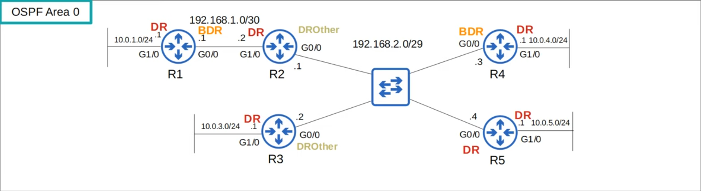

# Day 27 - OSPF (Part 3)

## Loopback Interface

-   A loopback interface is a **virtual interface in the router**.
-   It is **always up/up** (unless you manually shut it down)
-   It is **not dependent on a physical interface**.
-   So, it provides a **consistent IP address that can be used to reach/identify the router**.

## OSPF Network Types

-   The OSPF _network type_ refers to the type of connection between OSPF neighbors (Ethernet, etc.)

-   There are three main OSPF network types:
    -   **Broadcast**
        -   enabled by default on **Ethernet** and **FDDI** (Fiber Distributed Data Interfaces) interfaces
    -   **Point-to-point**
        -   enabled by default on **PPP** (Point-to-Point Protocol) and **HDLC** (High-Level Data Link Control) interfaces
    -   **Non-Broadcast**
        -   enabled by default on **Frame Relay** and **X.25** interfaces

### Broadcast Network Type



-   Enabled on **Ethernet** and **FDDI** interfaces by default.
-   Routers dynamically discover neighbors by sending/listening for OSPF Hello messages using multicast address 224.0.0.5.
-   A **DR (Designated Router)** and **BDR (Backup Designated Router)** must be **elected on each subnet** (only DR if there no OSPF neighbors, i.e. R1's G1/0 interface)
-   Routers which aren't the DR or BDR become a **DROther**.

#### DR/BDR Election

-   The DR/BDR election order of priority:

    1. Highest **OSPF Interface priority**
    2. Highest **OSPF Router ID**

-   _First place_ becomes the **DR** for the subnet.
-   _Second place_ becomes the **BDR**.

-   The **default OSPF interface priority** is **1 on all interfaces**.


-   To change the DR/BDR you can change the OSPF interface priority with the command `ip ospf priority <0-255>`

    -   **Note:** if you set the OSPF interface priority to 0, the router CANNOT be the DR/BDR for the subnet.

-   **NOTE:** The **DR/BDR election is non-preemptive**. Once the DR/BDR are selected, they will keep their role until OSPF is reset, the interface fails/is shut down, etc.

-   When the **DR goes down**, the **BDR becomes the new DR**. Then an **election is held for the next BDR**.

-   In the broadcast network type, **routers will only form a full OSPF adjacency with the DR and BDR** of the segment.
-   Therefore, **routers exchange LSAs with the DR and BDR**. **DROthers will not exchange LSAs with each other**.
-   **All routers will still have the same LSDB**, but this **reduces the amount of LSAs flooding the network**.

-   **Messages to the DR/BDR** are **multicast using address 224.0.0.6**.

-   The **DR and BDR will form a FULL adjacency with ALL routers in the subnet**. **DROthers will form a FULL adjacency only with the DR/BDR**.


-   **Nbrs F/C** show the number of `full-adjacencies/total count of neighbors`

### Point-to-Point Network Type

-   Enabled on **serial interfaces** using the **PPP** or **HDLC** encapsulations by default.
-   Routers dynamically discover neighbors by sending/listening for OSPF Hello messages using multicast address 224.0.0.5.
-   A **DR and BDR** are **not elected**.
-   These encapsulations are used for point-to-point connections, so there's no point in doing the election.
-   The two routers will form a Full adjacency with each other.

#### Serial Interfaces


-   One side of a serial connection function as **DCE (Data Communications Equipment)**
-   The other side functions as **DTE (Data Terminal Equipment)**
-   The **DCE side needs to specify the clock rate (speed) of the connection**.

-   **Ethernet interfaces use the `speed` command** to configure the interface's operating speed. **Serial interfaces use the `clock rate` command**.


-   The **default encapsulation on a serial interface is HDLC**.

    -   actually cHDLC (Cisco HDLC)

    

-   To change encapsulation to PPP you can run the command `encapsulation PPP` in interface-configuration mode.
    -   If you change the encapsulation, it must match on both ends or the interface will go down.


##### Summary

-   The **default encapsulation is HDLC**.
-   You can configure PPP encapsulation with this command:
    -   `R1(config-if)# encapsulation ppp`
-   One side is DCE, one side is DTE.
-   Identify which side is DCE/DTE:
    -   `R1# show controller <interface-id>`
-   You must configure the clock rate on the DCE side:
    -   `R1(config-if)# clock rate <bits-per-second>`

### Manually configure OSPF network type

-   You can configure the OSPF network type on an interface with `ip ospf network <type>`.
    -   For example, if two routers are directly connected with an Ethernet link, there is no need for a DR/BDR. You can configure the point-to-point network type in this case.
    -   **Note:** not all network types work on all link types (e.g. a serial link cannot use the broadcast network type).

### Broadcast vs Point-to-Point Chart

| Broadcast                                    | Point-to-point                                   |
| -------------------------------------------- | ------------------------------------------------ |
| Default on **Ethernet**, **FDDI** interfaces | Default on **HDLC**, **PPP** (serial) interfaces |
| DR/BDR elected                               | No DR/BDR                                        |
| Neighbors dynamically discovered             | Neighbors dynamically discovered                 |
| Default timers: Hello 10, Dead 40            | Default timers: Hello 10, Dead 40                |


### OSPF Neighbor requirements

1) Area number must match

2) Interfaces must be in the same subnet

3) OSPF process must not be shutdown

4) OSPF Router IDs must be unique

5) Hello and Dead timers must match

6) Authentication settings must match

    ```
    R2(config-if)# ip ospf authentication-key jeremy
    R2(config-if)# ip ospf authentication
    ```

7) IP MTU setting must match
    - Can become OSPF neighbors, but OSPF doesn't operate properly.
    - To change mtu run the `ip mtu <68-1500>` command in interface configuration mode.

8) OSPF network type must match
    - Can become OSPF neighbors, but OSPF doesn't operate properly.


## OSPF LSA Types

- The OSPF LSDB is made up of LSAs.
- There are 11 types of LSAs, but only 3 you should be aware for CCNA:
    - Type 1 (Router LSA)
    - Type 2 (Network LSA)
    - Type 5 (AS External LSA)

### Type 1 (Router LSA)
- **Every OSPF router generates** this type of LSA.
- It **identifies the router** **using** its **router ID**.
- It also **lists networks attached to the router's OSPF-activated interfaces**.


### Type 2 (Network LSA)
- Generated by the DR of each *multi-access* network (e.g. the broadcast network type).
- Lists the routers which are attached to the multi-access network.


### Type 5 (AS External LSA)
- Generated by ASBRs to describe routes to destinations outside of the AS (OSPF domain).