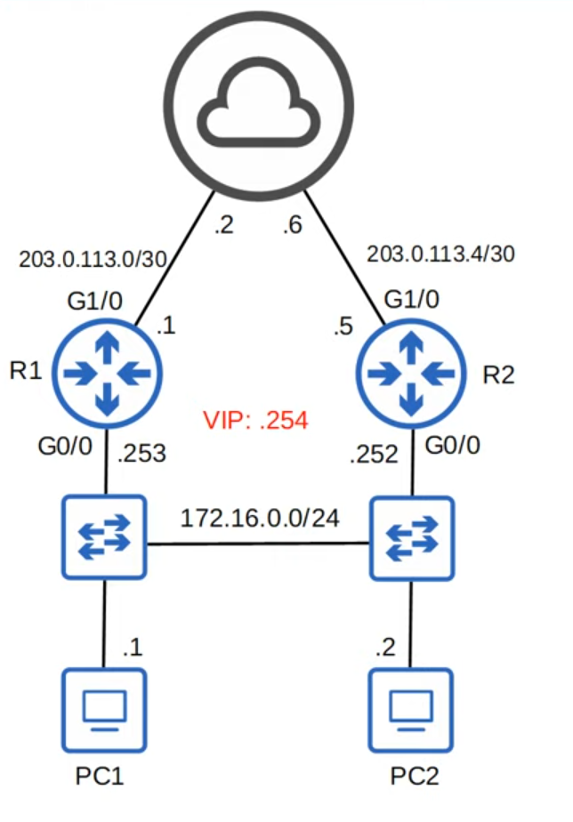

# Day 29 - First Hop Redundancy Protocols

## FHRP

A first hop redundancy protocol (FHRP) is a computer networking protocol which is designed to protect the default gateway used on a subnetwork by allowing two or more routers to provide backup for that address; in the event of failure of an active router, the backup router will take over the address, usually within a few seconds.

-   **Gratuitous ARP:** ARP replies sent without being requested (no ARP request message was received).

    -   the frames are broadcast do FFFF.FFFF.FFFF (normal ARP replies are unicast)

-   FHRPs are **non-preemptive**. The current active router will not automatically give up its role, even if the former active router returns.
    -   **Note:** you can change this setting to make R1 _preempt_ R2 and take back its active role automatically.

---

-   A **virtual IP** is configured on the two routers, and a **virtual MAC** is generated for the virtual IP (each FHRP uses a different format for the virtual MAC).
-   An **active router and a standby router are elected**. (different FHRPs use different terms).
-   **End hosts** in the network are **configured to use** the **virtual IP as** their **default gateway**.
-   The **active router replies to ARP requests using the virtual MAC** address, so **traffic destined for other networks will be sent to it**.
-   **If the active router fails, the standby becomes the next active router**. The **new active router will send gratuitous ARP messages** so that **switches will update their MAC address tables**. **It** now **functions as the default gateway**.
-   **If** the **old active router comes back online**, by default **it won't take back its role as the active router**. **It will become the standby router**.
-   You can configure _preemption_, so that the old active router does take back its old rate.

---

### HSRP (Hot Standby Router Protocol)

-   Cisco Proprietary
-   An **active** and **standby** router are elected.
-   There are two versions: **version 1** and **version 2**.

    -   Version 2 adds IPv6 support and increases the number of groups that can be configured.

-   Multicast IPv4 addres:

    -   **V1:** 224.0.0.2
    -   **V2:** 224.0.0.102

-   Virtual MAC address:

    -   **V1:** 0000.0c07.acXX (XX = HSRP group number)
    -   **V2:** 0000.0c9f.fXXX (XXX = HSRP group number)

-   In a situation with multiple subnets/VLANs, you can configure a different active router in each subnet/VLAN to load balance.

### VRRP (Virtual Router Redundancy Protocol)

-   Open Standard
-   A **master** and **backup** router are elected
-   Multicast IPv4 address: 224.0.0.18
-   Virtual MAC address: 0000.5e00.01XX (XX = VRRP group number)
-   In a situation with multiple subnets/VLANs, you can configure a different master router in each subnet/VLAN to load balance.


### GLBP (Gateway Load Balancing Protocol)

- Cisco Proprietary
- **Load balances among multiple routers within a single subnet**.
- An **AVG (Active Virtual Gateway)** is elected
- **Up to four** **AVFs (Active Virtual Forwarders)** are **assigned by the AVG** (the AVG itself can be an AVF too).
- Each **AVF acts as the default gateway for a portion of the hosts** **in** the **subnet**.
- Multicast IPv4 address: 224.0.0.102
- Virtual MAC address: 0007.b400.XXYY (**XX** = GLBP group number, **YY** = AVF number)

### HSRP/VRRP/GLBP Chart

<table border=1>
    <tr>
        <th>
            FHRP
        </th>
        <th>
            Terminology
        </th>
        <th>
            Multicast IP
        </th>
        <th>
            Virtual MAC
        </th>
        <th>
            Cisco Proprietary
        </th>
    </tr>
    <tr>
        <td>
            <b>HSRP</b>
        </td>
        <td>
            Active/Standby
        </td>
        <td>
            v1: 224.0.0.2 </br>
            v2: 224.0.0.102
        </td>
        <td>
            v1: 0000.0c07.acXX</br>
            v2: 0000.0c9f.fXXX
        </td>
        <td>
            Yes
        </td>
    </tr>
    <tr>
        <td>
            <b>VRRP</b>
        </td>
        <td>
            Master/Slave
        </td>
        <td>
            224.0.0.18
        </td>
        <td>
            0000.5e00.01XX
        </td>
        <td>
            No
        </td>
    </tr>    <tr>
        <td>
            <b>GLBP</b>
        </td>
        <td>
            AVG/AVF
        </td>
        <td>
            224.0.0.102
        </td>
        <td>
            0007.b400.XXYY
        </td>
        <td>
            Yes
        </td>
    </tr>
</table>


### HSRP Configuration (not on CCNA)



```
R1(config)# interface g0/0
R1(config-if)# standby ?
    <0-255>         group number
    authentication  Authentication
    bfd             Enable HSRP BFD
    ...
R1(config-if)# standby version 2
R1(config-if)# standby ?
    <0-4095>         group number
    authentication   Authentication
    ...


R1(config-if)# standby 1 ?
    authentication  Authentication
    follow          Name of HSRP group to follow
    ip              Enable HSRP IPv4 and set the virtual IP address
    ipv6            Enable HSRP IPv6
    mac-address     Virtual MAC address
    name            Redundancy name string
    preempt         Overthrow lower priority Active routers
    priority        Priority level
    timers          Hello and hold timers
    track           Priority tracking   


R1(config-if)# standby 1 ip 182.16.0.254
R1(config-if)# standby 1 priority 200
R1(config-if)# standby 1 preempt


R2(config-if)# standby version 2
R2(config-if)# standby 1 ip 172.16.0.254
R2(config-if)# standby 1 priority 50
R2(config-if)# standby 1 preempt

```

- Group number must match between the two routers

- The **active router** is determined in this order:
    1) Highest priority (default 100)
    2) Highest IP address

- **Preempt** causes the router to take the role of active router, even if another router already has the role.

- **HSRP version 1 and 2** are **not compatible**.
    - If R1 uses version 2, R2 must use version 2 also.

#### Overview

- `(config-if)# standby version 2`
- `(config-if)# standby <group-number> ip <virtual-ip>`
- `(config-if)# standby <group-number> priority <priority>`
- `(config-if)# standby <group-number> preempt`