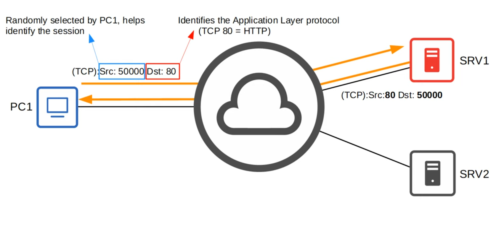
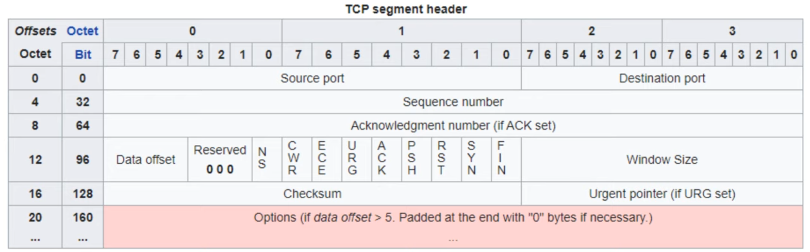
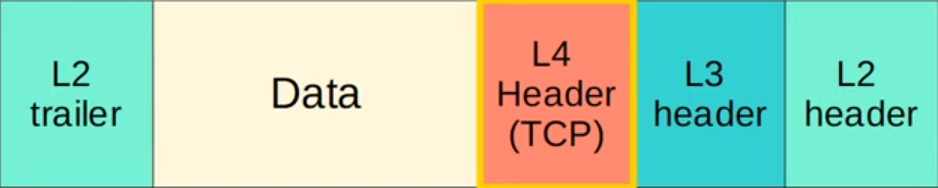
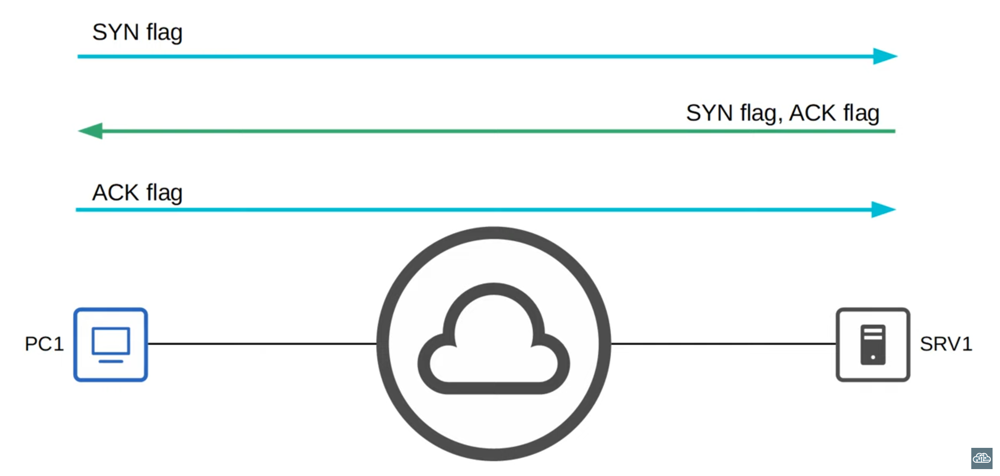
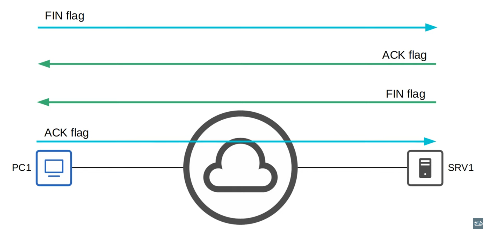
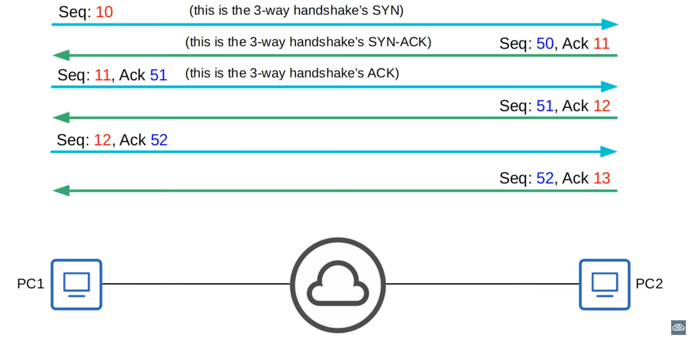
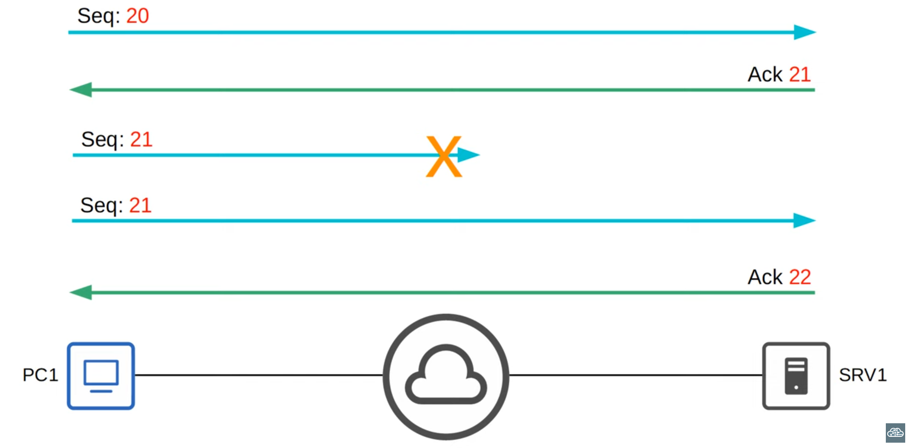
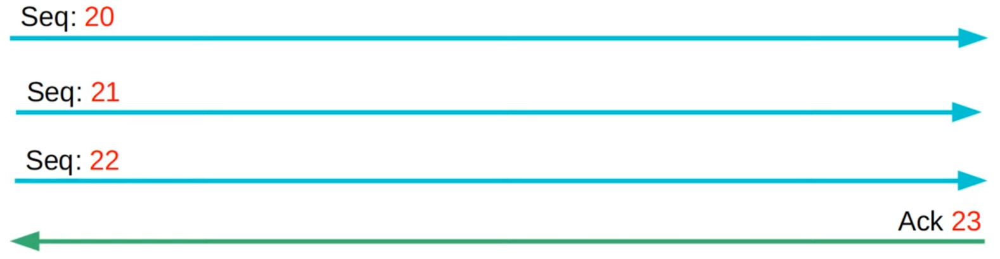
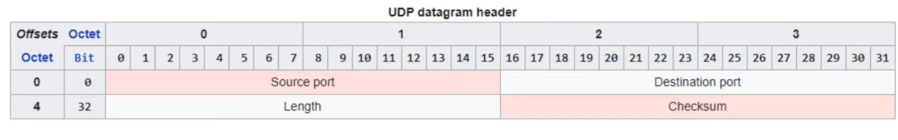

# Day 30 - TCP & UDP

## Functions of Layer 4 (Transport Layer)

- Provides transparent transfer of data between end hosts.
- Provides (or doesn't provide) various services to applications:
    - Reliable data transfer
    - Error recovery
    - Data sequencing
    - Flow control
- Provides Layer 4 addressing (port numbers)
    - Identify the Application Layer Protocol
    - Provides session multiplexing
    - **Note:** NOT the physical interfaces/ports on network devices

### Port Numbers / Session Multiplexing

- A session is an exchange of data between two or more communicating devices

- As many communications may be *multiplexed*, since you can just change the *Src* port and/or the *Dst* port, depending on the use case.

- The following ranges have been designated by IANA (Internet Assigned Numbers Authority):
    - **Well-known** port numbers: 0-1023
        - These are used for major protocols (e.g. HTTP, SSH, FTP, etc.) and are strictly regulated
    - **Registered** port numbers: 1024-49151
        - Registration is required to use these (although they are not as strict as ports 0-1023)
    - **Ephemeral/private/dynamic** port numbers: 49152-65535
        - Hosts use these range when selecting a random source port

## TCP (Transmission Control Protocol)

- TCP is **connection-oriented**:
    - Before actually sending data to the destination host, the two hosts communicate to establish a connection. Once the connection is established, the data exchange begins.
- TCP provides **reliable communication**:
    - The destination host must acknowledge that it received each TCP segment.
    - If a segment isn't acknowledged, it is sent again.
- TCP provides **Sequencing**:
    - Sequence numbers in the TCP header allow destination hosts to put segments in the correct order, even if they arrive out of order.
- TCP provides **flow control**:
    - The destination host can tell the source host to increase/decrease the rate at which data is sent.

### TCP Header

- 16 bits = 2^16 = **65536 available port numbers**
- **Sequence numbers** and **Acknowledgements** number fields are used to **provide sequencing and reliable communication**.
- Flag bits:
    - **ACK, SYN and FIN** are used to **establish and terminate connections**.
- **Window size** field is used for **flow control**

#### Establishing Connections: Three-Way Handshake

#### Terminate Connections: Four-Way Handshake

#### Sequencing / Acknowledgement

- Hosts set a **random initial sequence number**.
- **Forward acknowledgement** is **used to indicate the sequence number of the next segment the host expects to receive**.

- **If** a **segemnt isn't acknowledged**, it is **sent again**:

#### TCP Flow Control: Window Size

- Acknowledging every single segment, no matter what size, is inneficient.
- The TCP header's **Window Size field allows more data to be sent before an acknowledgement is required**.

- A **Sliding Window** can be used to dynamically adjust how large the window size is.

- **Note:** All these examples use very simple Seq. Numbers. In real world sitatuions the seq. numbers are much larger and do not increase by 1 with each message, however, since CCNA doesn't require a really in-depth knowledge of TCP, it is not in this resumes.

## UDP (User Datagram Protocol)

- UDP is **not connection-oriented** (it is **connectionless**).
    - The sending host does not establish a connection with the destination host before sending data. The data is simply sent.

- UDP **does not provide a reliable communication**.
    - When UDP is used, acknowledgements are not sent for received segments. If a segment is lost, UDP has no mechanism to re-transmit it. Segments are sent best-effort.

- UDP **does not provide sequencing**.
    - There is no sequence number field in the UDP header. If segments arrive out of order, UDP has no mechanism to put them back in order.

- UDP **does not provide flow control**.
    - UDP has no mechanism like TCP's window size to control the flow of data.

## TCP vs UDP

- TCP provides more features than UDP, but at the cost of additional overhead.
- For applications that require reliable communications (e.g. downloading a file), TCP is preferred.
- For applications like real.time voice and video, UDP is preferred.
- There are some applications that use UDP, but provide reliability etc. within the application itself.
- Some applications use both TCP and UDP, depending on the situation.

| TCP | UDP |
| --- | --- |
| Connection-oriented | Connectionless |
| Reliable | Unreliable |
| Sequencing | No sequencing |
| Flow control | No flow control |
| Use for downloads, file sharing, etc. | Used for VoIP, live video, etc. |

## Important Port Numbers

### TCP
- FTP Data - 20
- FTP Control - 21
- SSH - 22
- Telnet - 23
- SMTP - 25
- HTTP - 80
- POP3 - 110
- HTTPS - 443

### UDP
- DHCP server - 67
- DHCP client - 68
- TFTP - 69
- SNMP agent - 161
- SNMP manager - 162
- Syslog - 514

### TCP & UDP

- DNS - 53