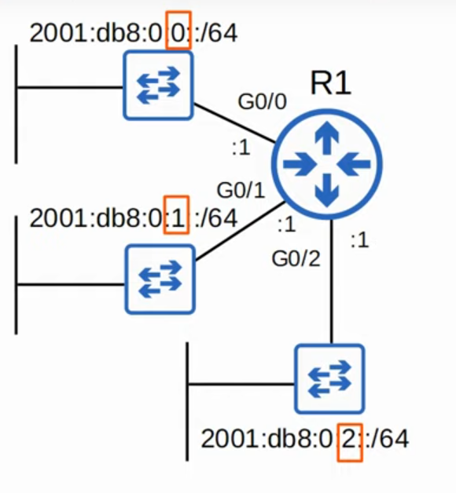

# Day 31 - IPv6 Part 1

## Why IPv6?

- The main reason is that there simply aren't enough IPv4 address available!
- VLSM, private IPv4 addresses and NAT have been used to conserve the use of IPv4 address space.
- Those are short-term solutions.
- The long-term solution is IPv6.

- IPv4 address assignments are controlled by IANA (Internet Assigned Numbers Authority)

- IANA distributes IPv4 address space to various RIRs (Regional Internet Registries), which then assign them to companies that need them.

## IPv6

- An **IPv6** address is **128 bits**.

- Every additional bit **doubles** the number of possible addresses. 

- Written in hexadecimal

### Shortening (abbreviating) IPv6 addresses

- **Leading 0s** can be removed:

2001:**0**DB8:**000**A:**00**1B:20A1:**00**20:**00**80:34BD => 2001:DB8:A:1B:20A1:20:80:34BD

- **Consecutive quartets of all 0s** can be replaced with a double colon (::)

....0000:0000:0000.... => ....::....

- **Consecutive quartets of 0s can only be abbreviated once in an IPv6 address**

### Expanding shortened IPv6 addresses

- **Put leading 0s where needed** (all quartets should have 4 hexadecimal characters)

- If a double colon is used, replace it with all-0 quartets. Make sure there are **8 quartets in total**

### Finding the IPv6 prefix (global unicast addresses)

- Typically, an **enterprise requesting IPv6 addresses** from their ISP will **receive a /48 block**.
- Typically, **IPv6 subnets use a /64** prefix length.
- That means an enterprise has **16 bits to use to make subnets**.
- The **remaining 64 bits** can be used for **hosts**.

### Configuring IPv6 addresses

- `ipv6 unicast-routing` - Allows the router to perform IPv6 routing

- Most of the commands are the same as in IPv4, but with the `ipv6` command instead of `ip`

- `show ipv6 interface brief`

