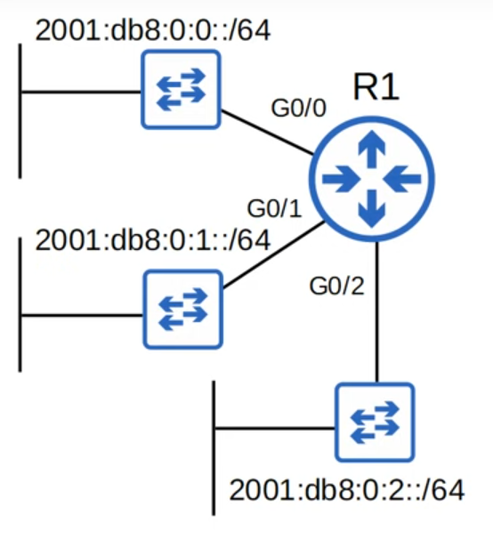
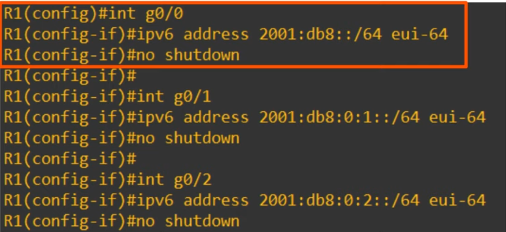
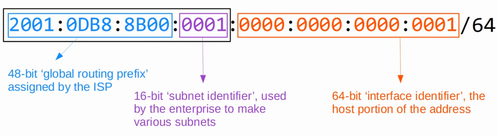
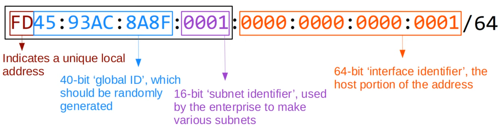
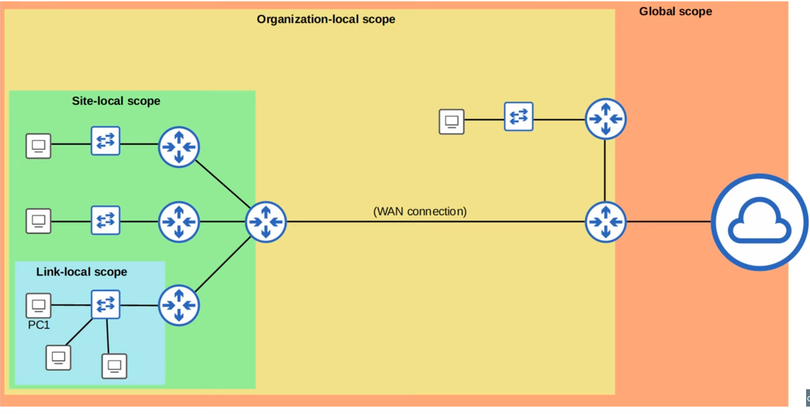
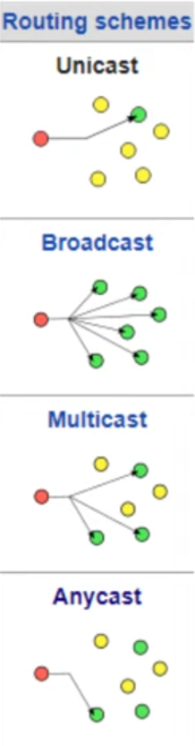
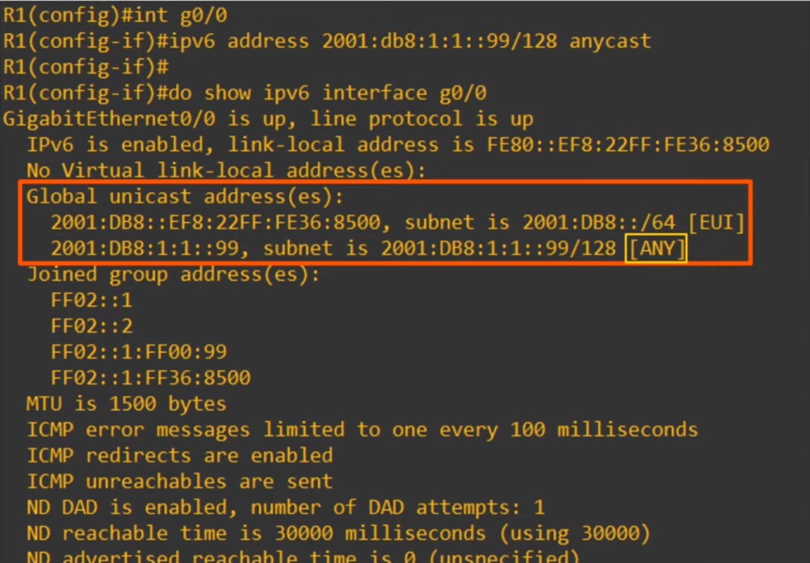

# Day 31 - IPv6 Part 2

## Configuring IPv6 addresses (EUI-64)

-   EUI stands for **Extended Unique Identifier**
-   (Modified) **EUI-64 is a method of converting a MAC address (48 bits) into a 64-bit interface identifier**.
-   This **interface identifier** **can become the _host portion_** of a /64 IPv6 address.

-   How to convert the MAC address:
    1. Divide the MAC address in half
    2. Insert **FFFE** in the middle
    3. Invert the 7th bit

## Global Unicast Address

-   GLobal Unicast Ipv6 addresses are **public addresses** which can be used over the internet.
-   Must register to use them. Because they are public addresses, it is expected that they are gloablly unique.
-   Originally defined as the 2000::/3 (2000:: to 3FFF:FFFF:...)
-   Now defined as all addresses which aren't reserved for other purposes

## Unique Local Addresses

-   Unique local IPv6 addresses are **private addresses** which **cannot be used over the internet**.
-   You **do not need to register to use them**. They can be used freely within internal networks and don't need to be globally unique. Can't be routed over the Internt.
    -   The global ID should be unique so that addresses don't overlap when companies merge.
-   Uses the address block FC00::/7 (FC00:: to FDFF:FFFF:....)
-   However, a later update requires the 8th bit to be set to 1, so the **first two digits must be FD**.

## Link Local Addresses

-   Link-local IPv6 addresses are **automatically generated on IPv6-enabled interfaces**.
-   Use command `ipv6 enable` on an interface to enable IPv6 on an interface.
-   Uses the address block **FE80::/10** (FE80:: to FEBF:FFFF:....)
-   However, the standard states that the 54 bits after FE80/10 should be all 0s, so you won't see link local addresses beginning with FE9, FEA or FEB. Only FE8.
-   The **interface ID** is **generated using EUI-64 rules**.
-   Link-local means that these addresses are used for communication within a single link (subnet).
    -   Routers **will not route packets with a link-local destination IPV6 address**
-   Common uses of link-local addresses:
    -   routing protocol peerings (OSPFv3 uses link-local addresses for neighbor adjacencies)
    -   next-hop addresses for static routes
    -   _Neighbor Discovery Protocol_ (NDP, IPv6's replacement for ARP) uses link-local addresses function

## Multicast Addresses

-   **Unicast** addresses are one-to-one.
-   **Broadcast** addresses are one-to-all.
-   **Multicast** addresses are one-to-many.

-   IPv6 uses range **FF00::/8** for multicast (FF00:: to FFFF:FFFF:...)
-   **IPv6 doesn't use broadcast**

| Purpose                                    | IPv6 Address | IPv4 Address |
| ------------------------------------------ | ------------ | ------------ |
| **All nodes/hosts (functions like broadcast)** | FF02::1      | 224.0.0.1    |
| **All routers**                                | FF02::2      | 224.0.0.2    |
| **All OSPF routers**                           | FF02::5      | 224.0.0.5    |
| **All OSPF DRs/BDrs**                          | FF02::6      | 224.0.0.6    |
| **All RIP routers**                            | FF02::9      | 224.0.0.9    |
| **All EIGRP routers**                         | FF02::A      | 224.0.0.10   |

## Multicast Address Scopes

- IPv6 defines multiple multicast 'scopes' which indicate how far the packet should be forwarded.
- The addresses in the previous slide all uses the 'link-local' scope (FF02), which stays in the local subnet.
- IPv6 multicast scopes:
    - **Interface-local (FF01)**: The packet doesn't leave the local device. Can be used to send traffic to a service within the local device.
    - **Link-local (FF02)**: The packet remains in the local subnet. Routers will not route the packet between subnets.
    - **Site-local (FF05)**: The packet can be forwarded by routers. Should be limited to a single physical location (not forwarded over a WAN).
    - **Organization-local (FF08)**: Wider in scope than site-local (an entire company/organization)-
    - **Global (FF0E)**: No boundaries. Possible to be routed over the internet.

## Anycast

- Anycast is a new feature of IPv6.
- Anycast is **'one-to-one-of-many'**.
- Multiple routers are configured with the same IPv6 address:
    - They use a routing protocol to advertise the address.
    - When hosts send packets to that destination address, routers will forward it to the nearest router configured with that IP address (based on routing metric).

- There is no specific address range for anycast addresses. use a regular unicast address (global unicast, unique local) and specify it as anycast address:
    - `R1(config-if)# ipv6 address 2001:db8:1:1::99/128 anycast`

## Other IPv6 addresses

- `::` = The unspecified IPv6 address
    - Can be used when a device doesn't yet know its IPv6 address
    - IPv6 **default routes are configured to ::/0**
    - IPv4 equivalent is 0.0.0.0

- `::1` = The loopback address
    - Used to **test the protocol stack on the local device**.
    - Messages sent to this address are **processed within the local device**, but **not sent to other devices**.
    - IPv4 equivalent: 127.0.0.0/8 address range