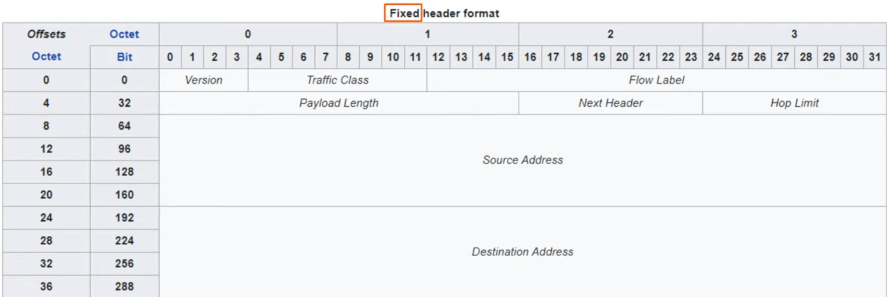
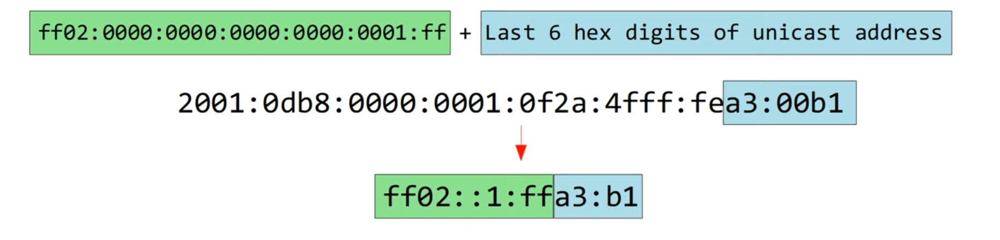
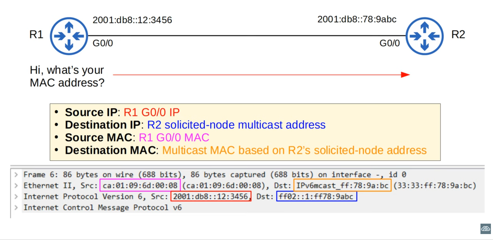
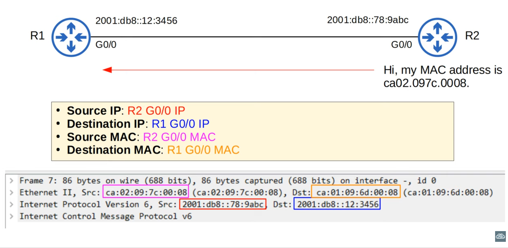
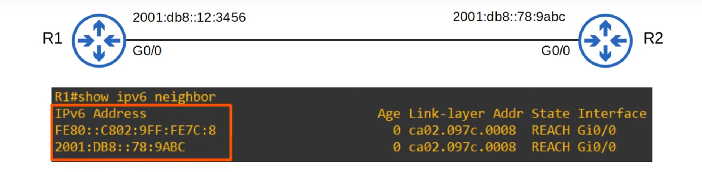
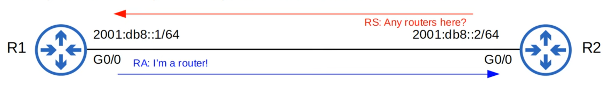
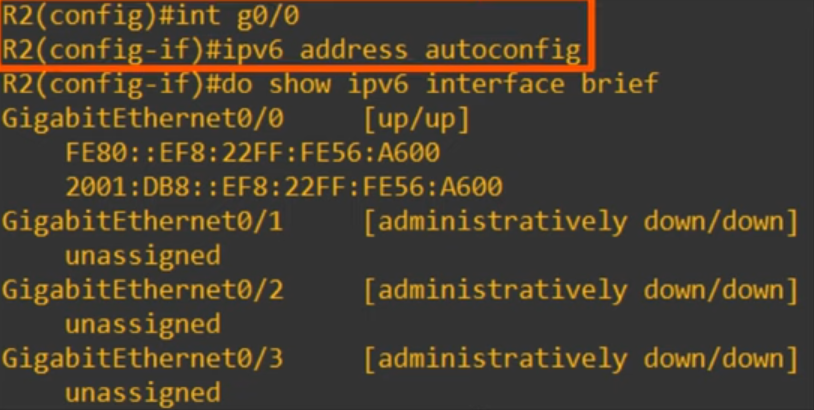

# Day 31 - IPv6 Part 3

## IPv6 Address representation

- Leading 0s must be removed.
- :: must be used to shorten the longest string of all-0 quartets.
- If there are two equal-length choices for the ::, use :: to shorten the one on the left.
- Hexadecimal characters must be written using lower-case, not upper case.

- **Note:** even cisco doesn't follow this rfc, so  it should be fine not to follow it strictly.

## IPv6 Header

- **Version:**
    - 4 bits
    - Indicates the version of IP that is used
    - Fixed value of 6 (0b0110) to indicate IPv6

- **Traffic:**
    - 8 bits
    - Used for QoS (Quality of Service), to indicate high-priority traffic.
    - For example, IP phone traffic, live video calls, etc. will have a Traffic Class value which gives them priority over other traffic.

- **Flow Label:**
    - 20 bits
    - Used to identify specific traffic flows (communication between a specific source and a destination)

- **Payload:**
    - 16 bits
    - Indicates the length of the payload (the encapsulated Layer 4 segment) **in bytes**.
    - The length of the IPv6 header itself isn't included because it's always 40 bytes.

- **Next Header:**
    - 8 bits
    - Indicates the type of the *next header* (header of the encapsulated segment), for example TCP or UDP.
    - Same function as the IPv4 header's *Protocol* field.

- **Hop Limit:**
    - 8 bits
    - The value in this field is decremented by 1 by each router that forwards it. If it reaches 0, the packet is discarded.
    - Same function as the IPv4's hedaer TTL field.

- **Src/Destination Address:**
    - 128 bits each
    - Self-explaining

## Solicited-Node Multicast Address

- An IPv6 solicited-node multicast address is calculated from a unicast address.

## Neighbor Discovery Protocol

- Neighbor Discovery Protocol (NDP) is a **protocol used with IPv6**.
- It has various functions, and one of those functions is to **replace ARP**, which is no longer used in IPv6.
- The ARP-like function of NDP uses ICMPv6 and solicited-node multicast addresses to **learn the MAC addresses of other hosts**.
- **Two message types** are used:
    1) **Neigbor Solicitation (NS) = ICMPv6 Type 135**
    2) **Neighbor Advertisement (NA) = ICMPv6 Type 136**

 
### Neighbor Solicitation (NS)

### Neighbor Advertisement (NA)

### IPv6 Neighbor Table

- You can view the neighbor table with `show ipv6 neighbor`

- **IPv6 Address:** contains the global unicast address and the link local address
- **Age:** How long ago R1 received traffic (in minutes)
- **Link-layer Addr:** shows the mac address
- **Interface:** shows the interface this ip was learnt on

### Router Solicitation/Advertisement

- Another function of NDP allows hosts to **automatically discover routers on the local network**.

- **Two messages** are used for this process:
    1) **Router Solicitation (RS) = ICMPv6 Type 133**
        - Sent to multicast address FF02::2 (all routers).
        - Asks all routers on the local link to identify themselves.
        - Sent when an interface is enabled/host is connected to the network.
    2) **Router Advertisement (RA) = ICMPv6 Type 134**
        - Sent to multicast address FF02::1 (all nodes)
        - The router announces its presence, as well as other information about the link.
        - These messages are sent in response to RS messages.
        - They are also sent preiodically, even if the router hasn't received an RS.

    

- e.g.: hosts can learn there default gateway from it.

## SLAAC (Stateless Address Auto-Configuration)

- Hosts use RS/RA messages to learn the IPv6 prefix of the local link (ie. 2001:db8::/64), and then **automatically generate an IPv6 address**.

- Using the `ipv6 address prefix/prefix-length eui-64`command, you need to manually enter the prefix.

- Using the `ipv6 address autoconfig` command, you don't need to enter the prefix. The **device uses NDP to learn the prefix used on the local link**.

- The device will use EUI-64 to generate the interface ID, or it will be randomly generated (depending on the device/maker).

### Duplicate Address Detection (DAD)

- **Duplicate Address Detection (DAD) allows hosts to check if other devices on the local link are using the same IPv6 address**.
- Any time an **IPv6-enabled interface intializes** (`no shutdown` command), or an **IPv6 address is configured on an interface** (by any method: manual, SLAAC, etc.), it **performs DAD**.
- DAD uses **two messages** you learned earlier: **NS** and **NA**.
    - The host will **send an NS to its own IPv6 address**. **If it doesn't get a reply**, it knows the **address is unique**.
    - If it gets a reply, it means abnother host on the network is already using the address.

## IPv6 Static Routing

- IPv6 routing works the same as IPv4 routing.
- However, the two processes are separate on the router and the two routing tables are separate as well.
- IPv4 routing is enabled by default.
- IPv6 routing is disabled by default , and must be enabled with `ipv6 unicast-routing`.
- If IPv6 routing is disabled, the router will be able to send and receive IPv6 traffic, but will not route IPv6 traffic (=will not forward it between networks).

- A **connected network route** is automatically added for each connected network.
- A **local host route** is automatically added for each address configured on the router.
- Routes for link-local addresses are not added to the routing table.

- `ipv6 route destination/prefix length {next-hop | exit-interface [next-hop]} [ad]`

    #### Directly attached static route
    - Only the exit interface is specified
    - `ipv6 route destination/prefix length exit-interface`
    - In IPv6 you **can't use directly attached static routes if the interface is an Ethernet interface.**

    #### Recursive static route
    - Only the next hop is specified
    - `ipv6 route destination/prefix length next-hop`
    - It requires a recursive lookup in the routing table.

    #### Fully specified static route
    - Only the next hop is specified
    - `ipv6 route destination/prefix length exit-interface next-hop`

- If you want to specify a link-local address as the next-hop, you'll have to specify both the interface and the next-hop in the route.