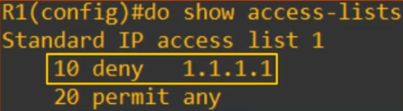
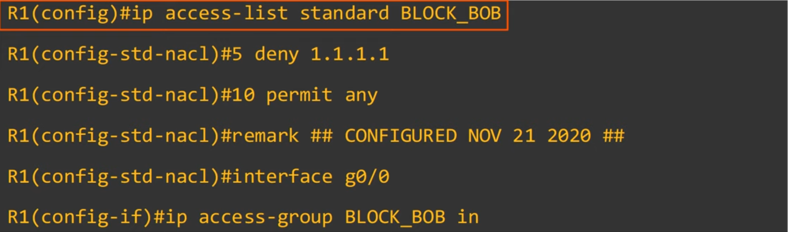

## Day 34 - Standard Access Control Lists

## What are ACLs?

- ACLs (Access Control Lists) have multiple uses.
- In day 34 and 35, we will focus on ACLs from a security perspective.
- ACLs function as a **packet filter**, instructing the router to **permit or discard specific traffic**.
- ACLs can filter traffic based on source/destination IP addresses, source/destination Layer 4 ports, etc.

- ACLs are **configured globally on the router** (global config mode).
- The are an **ordered sequence of ACEs (Access Control Entries)**.

## How do ACLs work

- **Configuring an ACL in global config mode will not make the ACL take effect**.
- The ACL **must be applied to an interface**. 
- ACLs are applied either **inbound or outbound**.
-  ACLs are **made up of one or more ACEs**.
- When the router checks a packet against the ACL, it processes the ACEs in order, from **top to bottom**.
- **If the packet matches one of the ACEs** in the ACL, the router takes the action and stops processing the ACL. **All entries below** the matching entry **will be ignored**.

- A **maximum of one ACL** can be **applied to a single interface per direction** (inbound/outbound).

### Implicit deny

- By default if no ACE is matched, the traffic is denied:
- There is an implicit deny at the end of all ACLs.
    - `(3: if source IP = any, then deny)`
- The implicit deny tells the router to deny all traffic that doesn't match any of the configured entries in the ACL.

## ACL Types

- **Standard ACLS:** Match based on **Source IP address only**
    - **Standard Numbered ACLs**
    - **Standard Named ACLs**

- **Extended ACLS:** Match based on **Source/Destination IP, Source/Destination port**, etc.
    - **Extended Numbered ACLs**
    - **Extended Named ACLs**

### Standard Numbered ACLs

- Standard ACLs match traffic based only on the source IP address of the packet.
- Numbered ACLs are **identified with a number** (ie. ACL 1, ACL 2, etc.).
- Different types of ACLs have a **different range of numbers that can be used**.
    - **Standard ACLs** can use **1-99** and **1300-1999**.
- The basic command to configure a standard numbered ACL is:
    - **`R1(config)# access-list <number> {deny | permit} <ip> <wildcard-mask>`**

- **`R1(config)# access-list 1 deny 1.1.1.1 0.0.0.0`**: denies 1.1.1.1/32
- **`R1(config)# access-list 1 deny 1.1.1.1`**: denies 1.1.1.1/32
- **`R1(config)# access-list 1 deny host 1.1.1.1`**: denies 1.1.1.1/32
- **`R1(config)# access-list 1 permit any`**: allows any traffic
- **`R1(config)# access-list 1 permit 0.0.0.0 255.255.255.255`**: allows any traffic
- **`R1(config)# access-list 1 remark ## BLOCK BOB FROM ACCOUNTING ##`**: note for the ACL

- You can run `show access-lists` in privileged-exec mode. 

    - 10 and 20 are the priorities (low priority -> better) 

- `show ip access lists` does the same, but only with ip access lists

- **Apply ACL to interface**:
    - **`R1(config-if)# ip access-group number {int|out}`**

- **Rule of thumb:** Standard ACLs should be applied as close to the interface as possible

### Standard Named ACLs

- Standard ACLs **match traffic** based only on the **source IP address of the packet**.
- Named ACLs are **identified with a name** (ie. 'BLOC K_BOB')
- Standard named ACLs are configured by entering 'standard named ACL config mode', and then configuring each entry within that config mode.
- **`R1(config)# ip access-list standard <acl-name>`**
- **`R1(config-std-nacl)# [entry number] {deny | permit} <ip> <wildcard-mask>`**

- `show running-config | section access-list` displays all of the ACL.