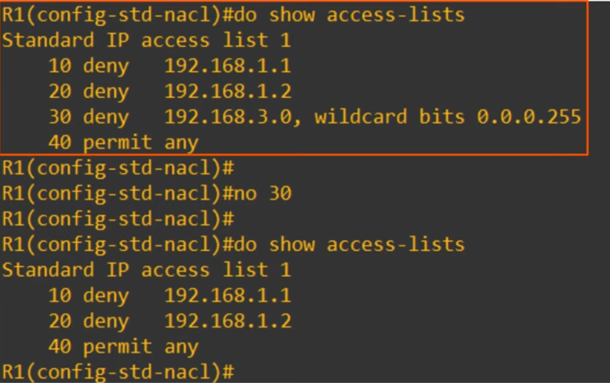
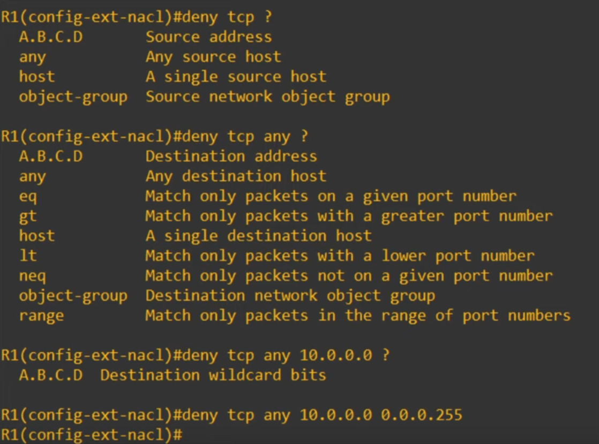

## Day 35 - Extended ACLs

## Advantages of named ACL config mode

- You can easily delete individual entries in the ACL with `no <entry-number>`.

    

    - When configuring/editing numbered ACLs from global config mode **you can't delete individual entries, you can only delete the entire ACL!**.

- You can insert new entries in between other entries by specifying sequence number.
    - `R1(config-stf-nacl)# 30 deny 192.168.2.0 0.0.0.255`

## Resequencing ACLs

- There is a resequencing function that helps edit ACLs.
- The command is **`ip access-list resequence <acl-id> <starting-seq-number> <increment>`**


## Extended ACLs

- Extended ACLs function mostly the same as standard ACLs.
- They can be numbered or named just like standard ACLs.
    - **Numbered ACLs** use the following **ranges**: **100-199, 2000-2699**.
- They are **processed** from **top to bottom**, just like standard ACLs.
- However, **they can match traffic based on more parameters**, so they are more precise (and more complex) than standard ACLs.
- We will focus on matching based on these main parameters: **Layer 4 protocol/port**, **source address** and **destination address**.

- **`R1(config)# access-list <number> [permit | deny] <protocol> <src-ip> <dest-ip>`**
    > **`R1(config)# ip access-list extended {name | number}`**
    >**`R1(config)# [seq-num] [permit | deny] <protocol> <src-ip> <dest-ip>`**

## Matching the protocol


- e.g.:
    - 1: ICMP
    - 2: TCP
    - 17: UDP
    - 88: EIGRP
    - 89: OSPF

## Matching the source/destination IP address



- This ACL denies all packets that encapsulate a TCP segment from any source to destination 10.0.0.0/24.

- In extended ACLs, to specify a /32 source or destination you have to use the **host option or specify the wildcard mask**. **You can't just write the address without either one of those**.


## Matching the TCP/UDP port numbers

- When matching TCP/UDP, you can optionally specify the source and/or destination port numbers to match.

- **`R1(config-ext-nacl)# deny tcp <scr-ip> CMP <src-port-num> <dest-ip> CMP dst-port-num`**

    - **eq 80** = equal to port 80
    - **gt 80** = greater than 80 (81 or greater)
    - **lt 80** =  less than 80 (79 or less)
    - **neq 80** = NOT 80
    - **range 80 100** = from port 80 to port 100

    ```
    TCP
        - FTP data (20)
        - FTP control (21)
        - SSH (22)
        - Telnet (23)
        - SMTP (25)
        - HTTP (80)
        - POP3 (110)
        - HTTPS (443)

    UDP
        - DHCP server (67)
        - DHCP client (68)
        - TFTP (69)
        - SNMP agent (161)
        - SNMP client (162)
        - Syslog (514)

    TCP & UDP
        - DNS (53)
    ```

- **Note:** If you specify the protocol, source IP, source port, destination IP, destination port, etc., a packet must match ALL of those values to match the ACL entry. Even if it matches all except one of the parameters, the packet won't match that entry of the ACL.

- **IMPORTANT:** Extended ACLs should be applied as close to the source as possible, to limit how far the packets travel in the network before being denied.
    - Standard ACLs are less specific, so if they are applied close to the source, there is a risk of blocking more traffic than intended.