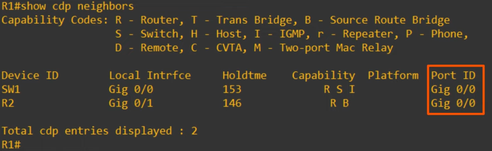
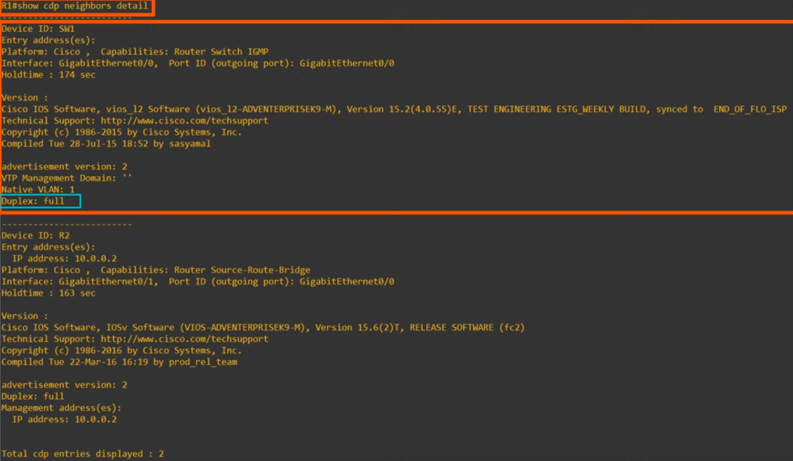
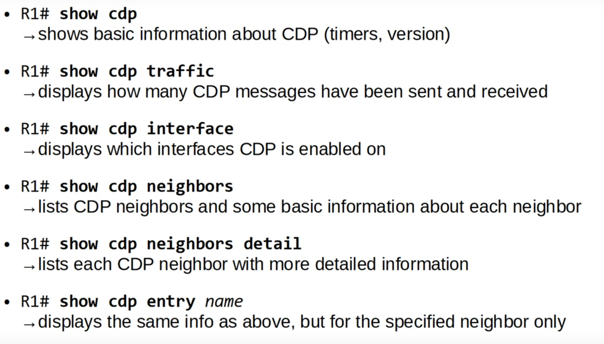

# Day 36 - CDP & LLDP

## Layer 2 Discovery Protocols

- **Layer 2 discovery protocols** such as CDP and LLDP share information with and discover information about neighboring (connected) devices.
- The shared information includes **host name**, **IP addresses**, **device type**, etc.
- **CDP** is a **Cisco proprietary** protocol.
- **LLDP** is an **industry standard protocol** (IEE 802.1AB)
- Because they share information about the devices in the network, they can be considered a security risk and are often not used. It is up to the network engineer/admin to decide if they want to use them in the network or not.

### Cisco Discovery Protocol

- CDP is a **Cisco proprietary** protocol.
- It is enabled on Cisco devices by default.
- CDP messages are periodically sent to **multicast MAC address 0100.0CCC.CCCC**.
- **When a device receives a CDP message**, it **processes and discards the message**. It does NOT forward it to other devices.
- By default CDP messages are **sent once every 60 seconds**.
- By default, the **CDP holdtime is 180 seconds**. If a message isn't received from a neighbor for 180 seconds the neighbor is removed from the CDP neighbor table.
- CDPv2 messages are sent by default.

- **`show cdp`**: shows the default timer, holdtime and cdp version
- **`show cdp traffic`**: tells how many cdp packets and cdp advertisements the device has sent and received.
- **`show cdp interface`**: shows cdp information about each interface. 

    

- To view additional info, such as the IOS version, vtp info, etc., run:
    - **`show cdp neighbor details`**

    

    - To view this detailed info for just one neighbor, run **`show cdp entry <name>`**

    #### CDP show commands summary

    

### CDP Configuration

- CDP is **globally enabled by default**
- CDP is also **enabled on each interface by default**.
- To enable/disable CDP globally:
    - **`R1(config)# [no] cdp run`**
- To enable/disable CDP on a specific interface:
    - **`R1(config-if)# [no] cdp enable`**
- Configure CDP timer:
    - **`R1(config)# cdp timer <seconds>`**
- Configure CDP holdtime:
    - **`R1(config)# cdp holdtime <seconds>`**
- Enable/disable CDPv2:
    - **`R1(config)# [no] cdp advertise-v2`**

### Link Layer Discovery Protocol (LLDP)

- LLDP is an **industry standard protocol** (IEEE 802.1AB).
- It is usually disabled on Cisco devices by default, so it must be manually enabled.
- A device can run CDP and LLDP at the same time.
- **LLDP messages** are periodically sent to **multicast address 0180.CC200.000E**.

- **When a device receives a LLDP message**, it **processes and discards the message**. It does NOT forward it to other devices.
- By default LLDP messages are **sent once every 30 seconds**.
- By default, the **LLDP holdtime is 120 seconds**. 
- LLDP has an additional timer called the 'reinitalization delay'. If LLDP is enabled (globally or on an interface), this timer will delay the actual initialization of LLDP (**2 seconds by default**).

#### LLDP Configuration Commands

- LLDP is usually **globally disabled by default**.
- LLDP is also disabled on each interface by default.
- To enable LLDP globally:
    - **`R1(config)# [no] lldp run`**
- To enable LLDP on specific interfaces (tx):
    - **`R1(config)# lldp transmit`**
- To enable LLDP on specific interfaces (rx):
    - **`R1(config)# lldp receive`**
- Configure the LLDP timer:
    - **`R1(config)# lldp timer <seconds>`**
- Configure the LLDP holdtime:
    - **`R1(config)# lldp holdtime <seconds>`**
- Configure the LLDP reinit:
    - **`R1(config)# lldp reinit <seconds>`**

#### LLDP show commands summary

- **`R1# show lldp`**
    - shows basic information about LLDP (timers, version)
- **`R1# show lldp traffic`**
    - displays how many LLDP messages have been sent and received.
- **`R1# show lldp interface`**
    - displays which interfaces LLDP tx/rx is enabled on
- **`R1# show lldp neighbors`**
    - lists LLDP neighbors and some basic information about each neighbor
- **`R1# show lldp neighbors details`**
    - lists each LLDP neighbor with more detailed information
- **`R1# show lldp entry <name>`**
    - displays the same info as above, but for the specified neighbor only.

- **Note:** it's the same as CDP n