# Day 37 - NTP

- All devices have an internatl clock (routers, switches, your pc, etc.)
- In Cisco IOS, you can view the time with the `show clock` command.

    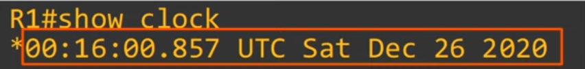
    - **Note:** The default time zone is UTC (Coordinated  Universal Time)

- If you use the `show clock detail` command, you can see the time source.
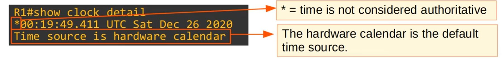

- The **internal hardware clock** of a device will **drift over time**, so, it is **not the ideal time source**.
- From a CCNA perspective, the most important reason to have an accurate time on a device is to have accurate logs for troubleshooting.
    - `show logging` displays the logs 

## Manual time configure

- You can manually configure the time on the device with the `clock set` command.

    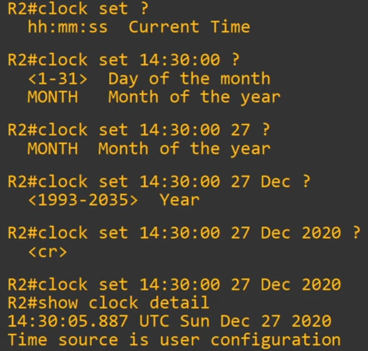

- **Note:** Although the hardware calendar (built-in clock) is the default time-source, the hardware clock and software clock are separate and can be configured separately.

## Hardware Clock (Calendar) Configuration

- TYpically you will want to synchronize the clock and calendar.

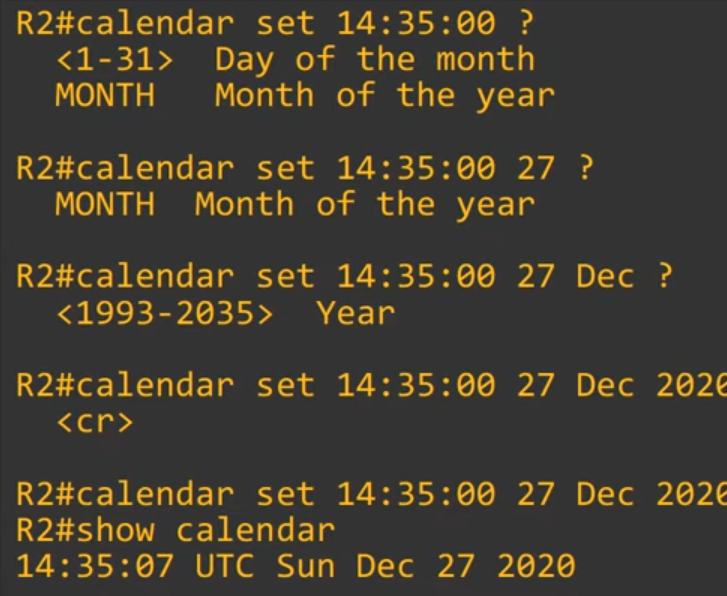

- Use the **`clock update-calendar`** to sync the calendar to the clock's time.
- Use the **`clock read-calendar`** to sync the clock to the calendar's time.

## Configuring the Time Zone

- You can configure the time zone with the **`clock timezone <name of time zone> <hours of offset from UTC>`**.
    - Hour offset must be between -23 and 23.

- Daylight Saving Time (Summer Time) - many countries adjust clocks in the summer

### Manual time configuration review

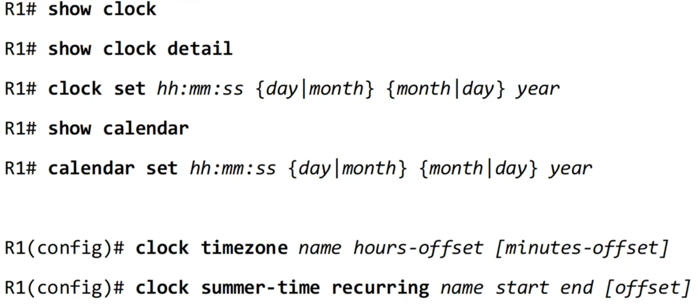

## Network Time Protocol

- Manually configuring the time on devices is not scalable
- The manually configured clocks will drift, resulting in inaccurate time.
- **NTP (Network Time Protocol) allows automatic syncing of time over a network**.
- NTP clients request the time from NTP servers.
- A **device can be** an **NTP server** **and** an NTP **client at the same time**.
- NTP allows accuracy of time within ~1 millisecond if the NTP server is in the same LAN, or within ~50 milliseconds if connecting to the NTP server over a WAN/the Internet.
- Some NTP servers are 'better' than others. **The 'distance' of an NTP server from the original reference clock** is called **stratum**.
- NTP uses **UDP port 123** to communicate.

### Reference Clocks

- A reference clock is usually a very accurate time device like an atomic clock or a GPS clock.
- Reference clocks are **Stratum 0** within the NTP hierarchy.
- **NTP server directly connected to reference clocks** are **stratum 1**.

    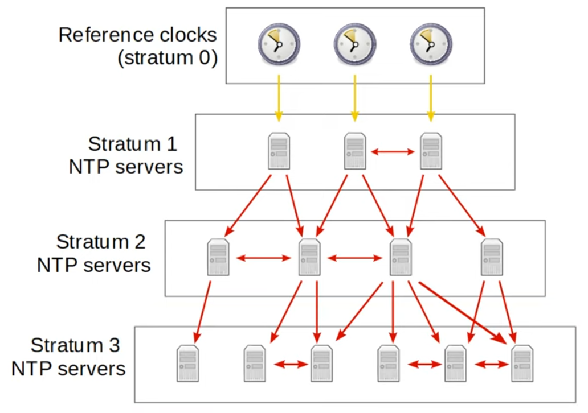

- **Stratum 15** is the **maximum**.

- **NTP servers which get their time directly from reference clocks** are also called **primary servers**.
- NTP server which get their time from other NTP servers are called **secondary servers**. They operate in server mode and client mode at the same time.

- Devices can also peer with devices at the same stratum to provide more accurate time.
    - This is also called **symmetric active** mode. 
    
- Cisco devices can operate in **three NTP modes**:
    - Server mode
    - Client mode
    - Symmetric active mode

- An NTP client can sync to multiple servers.

### NTP Configuration

- **`R1(config)# ntp server <server-ip> [prefer]`**
    - If you specify various, the best is chosen (unless you add the `prefer`)
    - If you add the prefer, the others will be backups.

- **`show ntp associations`**
    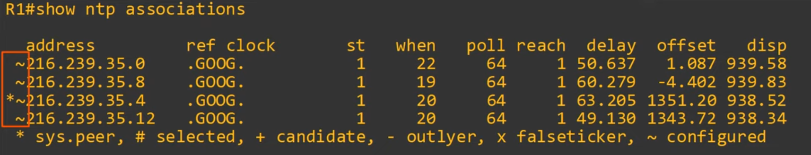

- **`show ntp status`**
    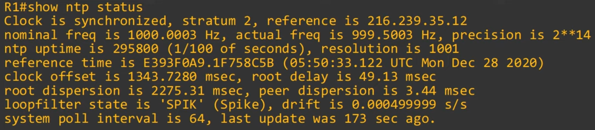

- **IMPORTANT:** NTP uses only the UTC timezone. You must configure the appropriate timezone on each device.

- **`ntp update-calendar`**: Configures the router to update the hardware clock (calendar) with the time learned via NTP.
    - The hardware clock tracks the date and time on the device even if it restarts, power is lost, etc. When the system is restarted, the hardware clock is used to initialize the software clock.

- **`ntp source <interface-id>`** to configure it as the source of all of its ntp messages.

    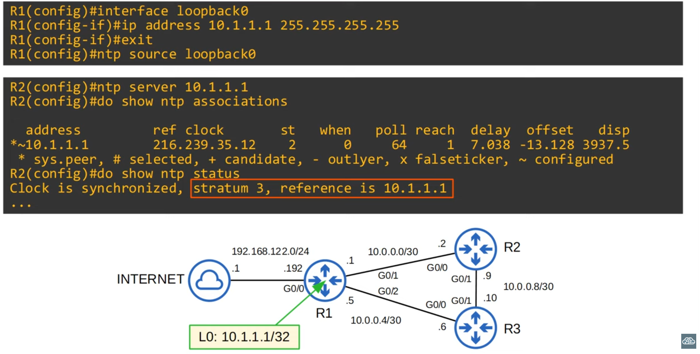

#### Configuring NTP server mode

- **`ntp master`** - configure the network device as a ntp server, so that others can sync to it without it being connected to another ntp server. It will get the default stratum number (9).

- The **default stratum of the ntp master command** is **8**.

#### Configuring NTP symmetric active mode

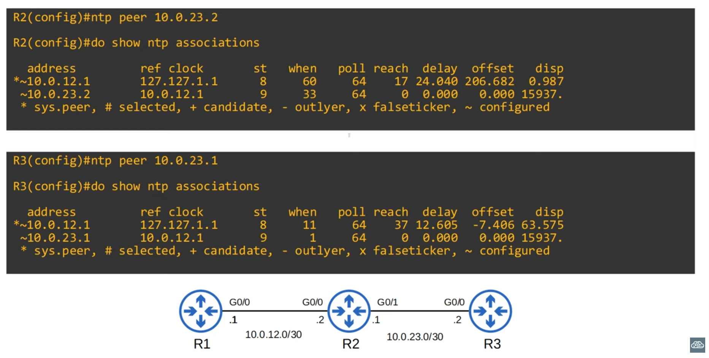

#### Configuring NTP Authentication

- NTP authentication can be configured, although it is optional.
- It allows NTP clients to ensure they only sync to the intended servers.
- To configure NTP authentication:

- **`ntp authenticate`**:  enable NTP authentication
- **`ntp authentication-key <key-number> md5 <key>`**: Create NTP authentication key(s)
- **`ntp trusted-key <key-number>`**: Specify the trusted key(s)
- **`ntp server <ip-address> key <key-number>`**: Specify which key to use for the server
    - This command isn't needed on the server

### NTP Commands - Review

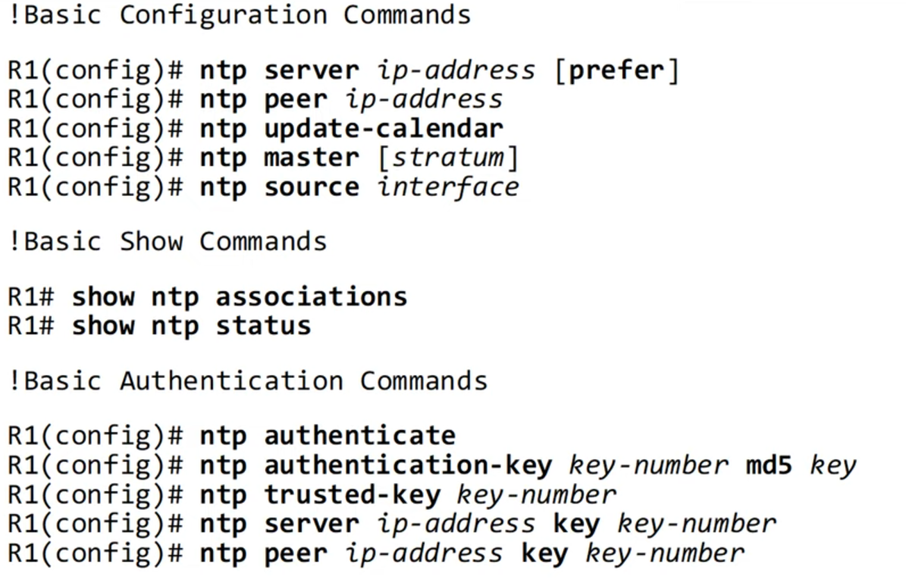