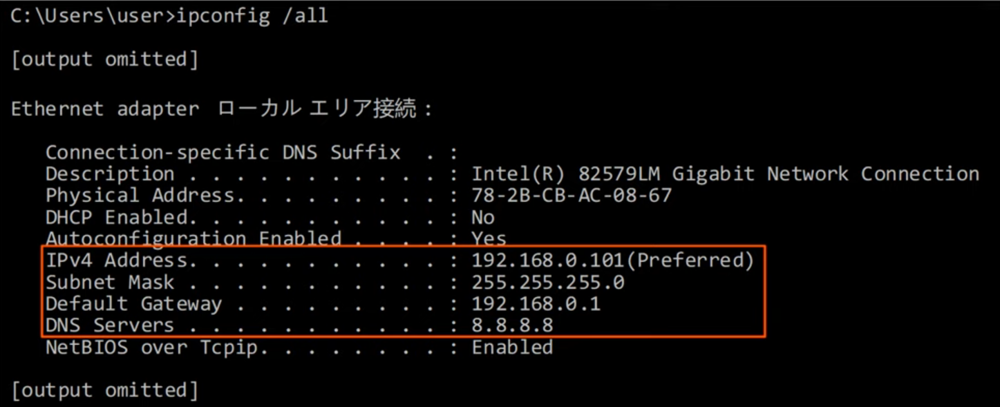
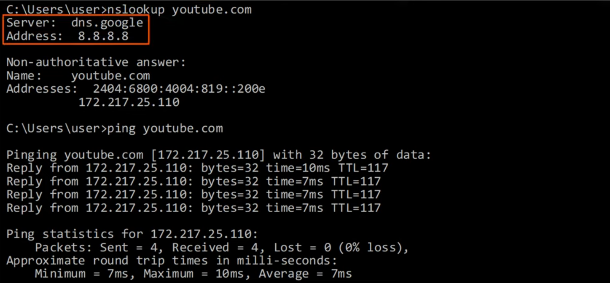
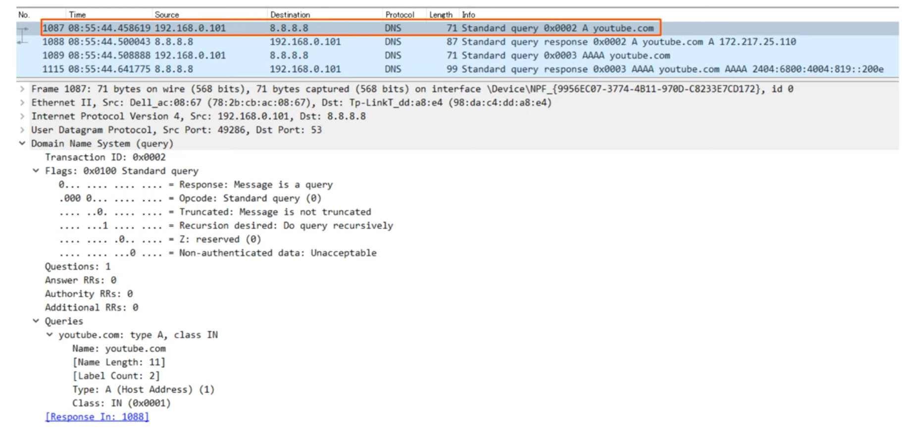
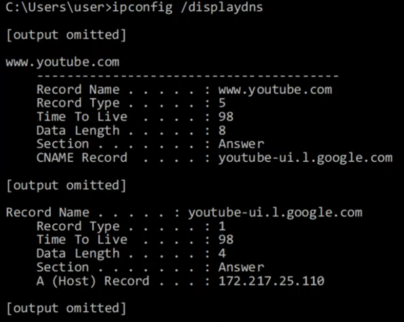
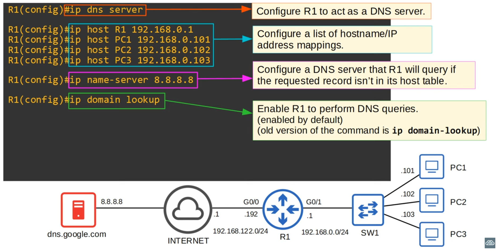
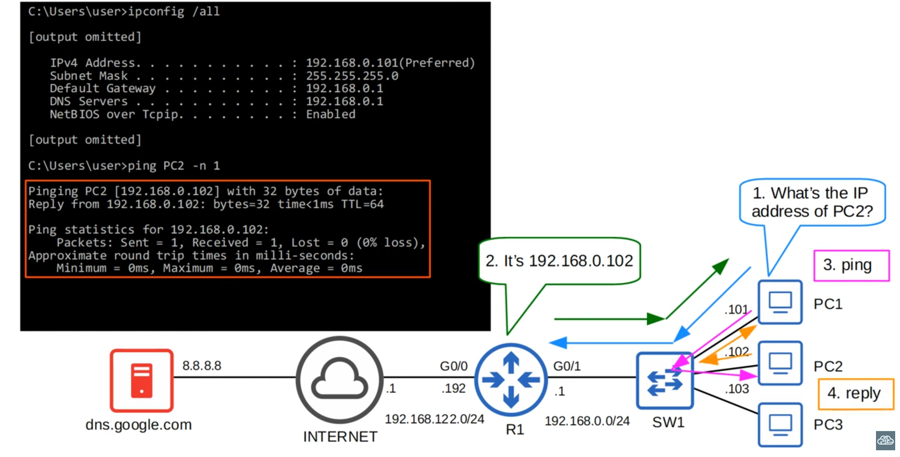
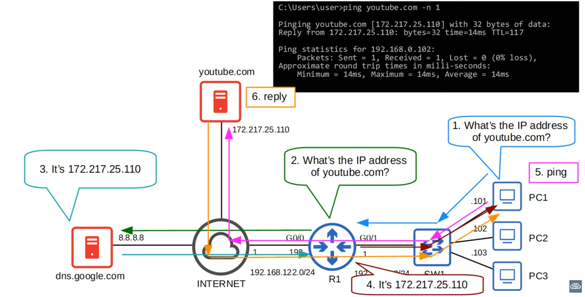
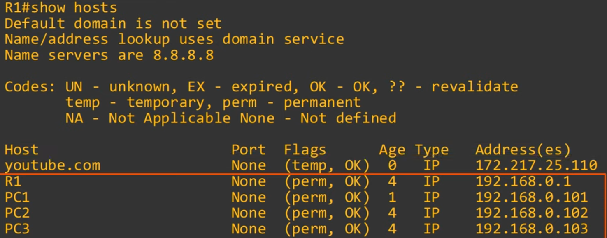
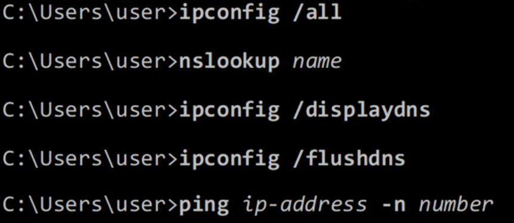
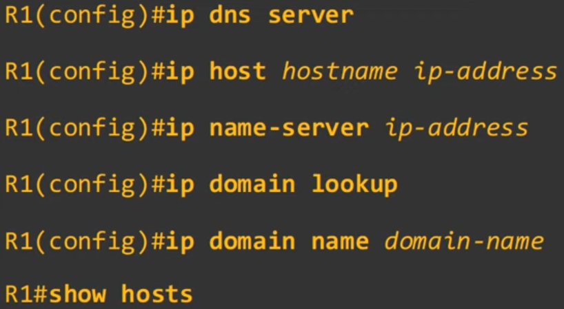

# Day 38 - DNS

- **DNS** is used to **resolve human-readable names (google.com) to IP address**.
- Machines such as PCs don't use names, they use addresses.
- **Names are much easier** for us **to use and remember** than IP addresses.
- When you type 'youtube.com' into a web browser, your device will ask a DNS server for the IP address of youtube.com.
- The DNS server(s) your device uses can be manually configured or learned via DHCP.

    
    - Hosts will usually learn which DNS server to use via DHCP, but in this case 8.8.8.8 was manually configured.

- Routers most times don't need dns configurations, since they only redirect traffic, however, a cisco router can act as a dns server.

### nslookup

### Wireshark

- **DNS A Record** are used to map names to IPv4 addresses
- **DNS AAAA Record** are used to map names to IPv6 addresses

- Standard **DNS queries/responses typically use UDP**. **TCP is used for DNS messages greater than 512 bytes**. In either case, **port 53 is used**.

## DNS Cache

- Devices will save the DNS server's responses to a local DNS cache. This means they don't have to query server every single time they want to access a particular destination.

- **`ipconfig /displaydns`** can be used to display the dns cache:

`

- CNAME (canonical name) maps a name to another name

. **`ipconfig /flushdns`** clears the dns cache

- `C\Windows\System32\drivers\etc\hosts` / `/etc/hosts`
    - this is not dns, it's an alternative that was used a long time ago before dns or in simple test cases.

## DNS in Cisco IOS

- For hosts in a network to use DNS, you don't need to configure DNS on the routers. They will simply forward the DNS messages like any other packets.
- However, a Cisco router can be configured as a DNS server, although it's rare.
    - If an internal DNS server is used, usually it's a Windows or Linux server.

- A cisco router can also be configured as a DNS client.

#### example 1

#### example 2

- You can use `show hosts` to see the configured and cached hosts on the dns server:

    

### COnfiguring a DNS client

- Configuring a dns client is easier than configuring a dns client.

You just need to run `ip name-server <dns-server>` followed by `ip domain lookup`.

Optionally you can:
- Configuring the default domain name.
- This will be automatically appended to any hostnames without a specified domain.
- ie. `ping pc1` will become `ping pc1.jeremysitlab.com`
- (old version of the command: `ip domain-name`)

## Command Review

#### Windows

#### Cisco IOS

