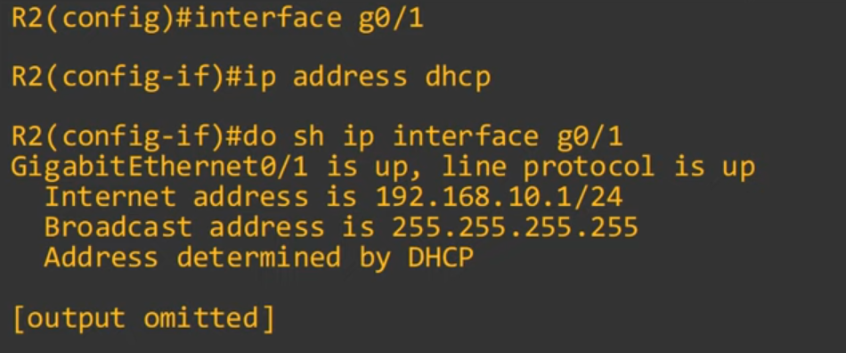

# Day 39 - DHCP

## The purpose of DHCP
- DHCP is used to **allow hosts to automatically/dynamically learn** vawrious aspects of their network configuration, such as **IP address, subnet mask, default gateway, DNS server**, etc. without manual/static configuration.
- It is an essential part of modern networks.
    - When you connect a phone/laptop to WiFi, do you ask the network admin which IP address, subnet mask, default gateway, etc. the phone/laptop should use?
- Typically **used for 'client devices'** such as workstations (PCs), phones, etc.
- Devices such as routers, servers, etc, are usually manually configured.
- In small networks (e.g. home networks) the router typically acts as the DHCP server for hosts in the LAN.
- In larger neworks, the DHCP server is usually a Windows/Linux server.


### **`ipconfig /all`**

- You can view various DHCP configs with `ipconfig /all`

    

- **(Preferred)** means that this PC was previously assigned this IP address by the DHCP server, so it asked to receive the same address again this time.
- DHCP server 'lease' IP address to clients. These leases are usually not permanent, and the client must give up the address at the end of the lease. 

### **`ipconfig /release`**

- Release the DHCP learned IP address


### **`ipconfig /renew`**


- This command uses four different messages:
    - DHCP Discover
    - DHCP Offer
    - DHCP Request
    - DHCP Acknowledge


#### DHCP D-O-R-A


### DHCP Relay

- Some network engineers might choose to configure each router to act as the DHCP server for its connected LANs.
- However, large enterprises often choose to use a c**entralized DHCP server**.
- If the server is centralized it won't receive the DHCP clients' broadcast DHCP messages (broadcast messages don't leave the local subnet).
- To fix this, **you can configure a router to act as a DHCP relay agent**.
- The router will forward the clients' broadcast DHCP messages to the remote DHCP server as unicast messages.

    


## DHCP Server Configuration

```
%% Specify a range of addresses that won't be given to DHCP clients %%
R1(config)# ip dhcp excluded-address 192.168.1.1 192.168.1.10

%% Create a DHCP pool %%
R1(config)# ip dhcp pool LAB_POOL

%% Specify the subnet of addresses to be assigned to clients (except the excluded addresses) %%
R1(dhcp-config)# network 192.168.1.0 /24

%% Specify the DNS server that DHCP clients should use %%
R1(dhcp-config)# dns-server 8.8.8.8

%% Specify the domain name of the network (ie. PC1 = pc1.jeremysitlab.com) %%
R1(dhcp-config)# domain-name jeremysitlab.com

%% Specify the default gateway %%
R1(dhcp-config)# default-router 192.168.1.1

%% Specify the lease time %%
%% lease <days> <hours> <minutes> %%
%% lease infinite %%
R1(dhcp-config)# lease 0 5 30
```

- `show ip dhcp binding` shows all the dhcp clients that are assigned dhcp address.

    

## DHCP Relay Agent Configuration

- Configure the interface connected to the subnet of the client devices.

- `ip helper address <ip-address>` configures the ip address of the DHCP server as the "helper" address.

    

## DHCP client

- `(config-if)# ip address dhcp` tells the router to use DHCP to learn its ip address



## Command Summary

