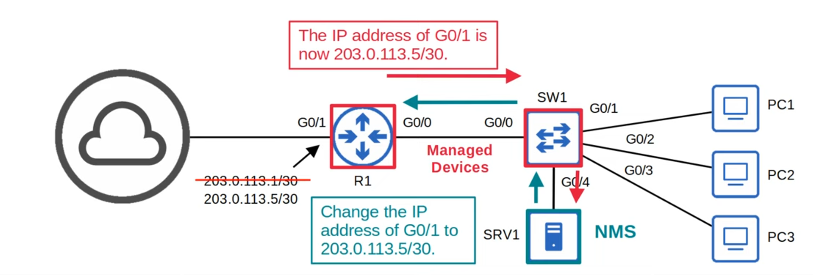

# Day 40 - SNMP

-   SNMP is an industry-standard framework and protocol that was originally released ion 1988.
-   SNMP can be used to **monitor the status of devices**, **make configuration changes**, etc.
-   There are two main types of devices in SNMP:
    1. **Managed Devices**
        - These are the devices being managed using SNMP.
        - For example, network devices like routers and switches.
    2. **Network Management Station (NMS)**
        - The device(s) managing the managed devices
        - aka **SNMP server**

## SNMP Operations

-   There are three main operations used in SNMP:
    1. **Managed devices** can **notify the NMS of events**.
    2. The NMS can **ask the managed devices for information about their current status**.
    3. The NMS can **tell the managed devices to change aspects of their configuration**.

## SNMP Components

### NMS (Network Management System)

-   **SNMP Manager**: software on the NMS that interacts with the managed devices.
    -   It receives notifications, sends requests for information, sends configuration changes, etc.
-   **SNMP Application**: provides an interface for the network admin to interact with.
    -   Displays alerts, statistics, charts, etc.

### Managed Devices

-   **SNMP Agents**: SNMP software running on the managed devices that interact with the SNMP Manager on the NMS.

    -   It sends notifications to/receives notifications from the NMS.

-   **Management Information Base (MIB)**: the structure that contains the variables that are managed by the SNMP.
    -   Each variable is identified with an Object ID (OID)
    -   Example variables: Interface status, traffic throughput, CPU usage, temperature, etc.

## SNMP OIDs

-   SNMP Object IDs are organized in a **hierarchical structure**.
    

## SNMP Versions

-   Many versions of SNMP have been proposed/developed, however, only **three major versions** have achieved wide-spread use:

-   **SNMPv1:**

    -   The original version of SNMP.

-   **SNMPv2c:**

    -   Allows the NMS to retrieve large amounts of information in a single requests, so it more efficient.
    -   'c' refers to the 'community strings' used as passwords in SNMPv1, removed from SNMPv2 and then added back for SNMPv2c.

-   **SNMPv3:**
    -   A much more secure version of SNMP that supports strong **encryption** and **authentication**.

## SNMP Message Types

| Message Class | Description | Messages |
| ------------- | ----------- | -------- |
| **Read** | Messages sent by the **NMS** to read information from the **managed devices** (ie. What's your current CPU usage %?) | Get   GetNext   GetBulk |
| **Write** | Messages sent by the **NMS** to change information on the **managed devices** (ie. change an IP address) | Set |
| **Notification** | Messages sent by the **managed devices** to alert te **NMS** of a particular event. (ie. interface going down) | Trap   Inform | 
| **Response** | Messages sent in response to a previous message/request | Response |

 
 

---

- **Get**:
    - A request sent from the manager to the agent to retrieve the value of a variable (OID), or multiple variables. The agent will send a Response message with the current value of each variable.

- **GetNext**:
    - A request sent from the manager to the agent to discover the available variables in the MIB.

- **GetBulk**:
    - A more efficient version of the GetNext command.

---

- **Set**:
    - A request from the manager to the agent to change the value of one or more variables. Then the agent will send a Response message with the new values.

---

- **Trap**:
    - A notification sent from the agent to the manager. The manager does not send a Response message to acknowledge that it received a Trap, so these messages are 'unreliable'.

- **Inform**:
    - A notification message that is acknowledge with a Response message.
    - Originally used for communications between managers, but later updates allow agents to send Inform messages to managers too.

## SNMPv2c Configuration

- In SNMPv1 and SNMPv2c, there is no encryption. The community and message contents are sent in plain-text. This is not secure, as the packets can easily be captured and read.

## Summary

- SNMP helps manage devices over a network.
- **Managed devices** are the devices being managed using SNMP, such as network devices (routers, switches, firewalls)
- **Network Management Stations (NMS)** are the SNMP 'servers' that manage the device.
    - NMS receives notifications from managed devices.
    - NMS changes settings on managed devices.
    - NMS checks status of managed devices.
- Variables such as interface status, temperature, traffic load, host name, etc. are stored in the Management Information Base (MIB) and identified using Object IDs (OIDs).
- Main SNMP versions: SNMPv1, SNMPv2c, SNMPv3.
- SNMP messagaes: Get, GetNext, GetBulk, Set, Trap, Inform, Response.