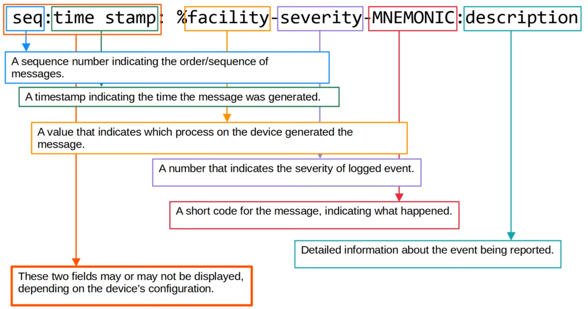
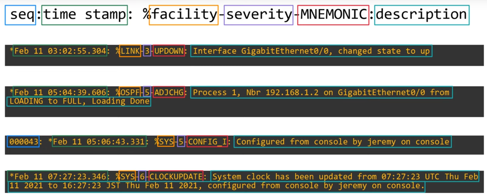
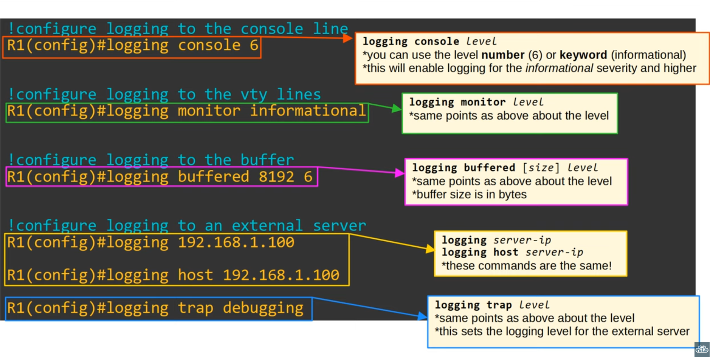
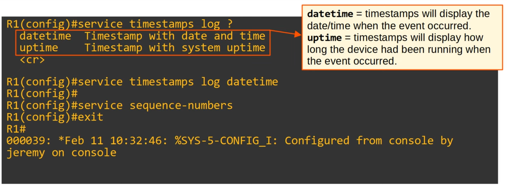
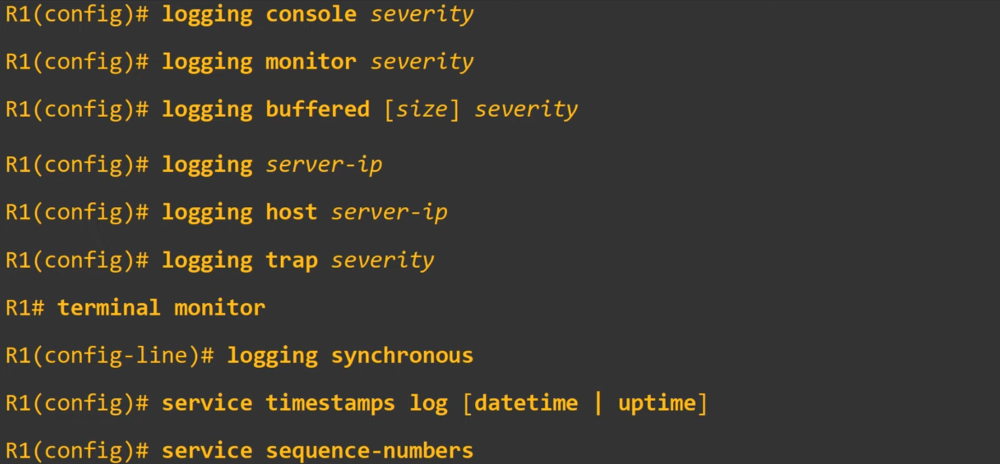

# Day 41 - Syslog

-   Syslog is an **industry standard protocol for message logging**.
-   On network devices, Syslog can be used to log events such as changes in interface status, changes in OSPF neighbor status, system restarts, etc.
-   The messages can be **displayed in the CLI**, saved in the **device's RAM**, or sent to an **external Syslog server** (e.g. logs after `no shut`).
-   Logs are **essential when troubleshooting issues**, **examining the cause of incidents**, etc.
-   Syslog and SNMP are both used for monitoring and troubleshooting of devices. They are complementary, but their functionalities are different.

## Syslog message format



### Examples




## Syslog Severity Levels

### Mnemonic: "**E**mergencies **A**re **C**ritical **E**ven **W**hen **N**obody **I**s **D**ead"

| Level | Keyword | Description |
| ----- | ------- | ----------- |
| **0** | **Emergy** | System is unusable |
| **1** | **Alert** | Action must be taken immediatly |
| **2** | **Critical** | Critical conditions |
| **3** | **Error** | Error conditions |
| **4** | **Warning** | Warning conditions |
| **5** | **Notice** | Normal but significant condition (**Notification**) |
| **6** | **Informational** | Informational messages |
| **7** | **Debugging** | Debug-level messages |

## Syslog Logging Locations

- **Console line:** Syslog messages will be displayed in the CLI when connected to the device via the console port. By default, all messages (level 0 - level 7) are displayed.

- **VTY lines:** Syslog messages will be displayed in the CLI when connected to the device via Telnet/SSH. (**Disabled by default**)

- **Buffer:** Syslog messages will be saved to RAM. By default, all messages (level 0 - level 7) are displayed.
    - You can view the messages with `show logging`.

- **External Server:** You can configure the device to send Syslog messages to an external server.
    - Syslog servers will listen for messages on **UDP port 514** 


## Syslog Configuration



### `terminal monitor`

- Even if `logging monitor <level>` is enabled, by default Syslog messages will not be displayed when connected via Telnet or SSH.

- For the messages to be displayed, you must use the following command:
    - `R1# terminal monitor`

- This command must be used **every time you connect to the device via Telnet or SSH**.


### `logging synchronous`

- By default, loggin messages displayed in the CLI while you are in the middle of typing a command will result in something weird (probably the log will interrupt the current command and you will continue writing right after the log).
- To prevent this, you should use the `logging synchronous` on the appropriate line.
    ```
    R1(config)# line console 0
    R1(config-line)# logging synchronous
    ```

- This will cause a new line to be printed if your typing is interrupted by a message.

### `service timestamps` / `service sequence-numbers`


## Summary - Commands




## Syslog vs SNMP

- Syslog and SNMP are both used for monitoring and troubleshooting of devices. They are complementary, but their funcitonalities are different.

- **Syslog** is used for **message logging**.
    - Events that occur within the system are categorized based on facility/severity and logged.
    - Used for system management, analysis, and troubleshooting.
    - Messages are sent from the devices to the server. The server can't actively pull information from the devices (like SNMP `Get`) or modify variables (like SNMP `Set`).

- **SNMP** is used to retrieve and organize information about the SNMP managed devices.
    - IP addresses, current interface status, temperature, CPU usage, etc.
    - SNMP servers can use `Get` to query the clients and `Set` to modify the variables on the clients.