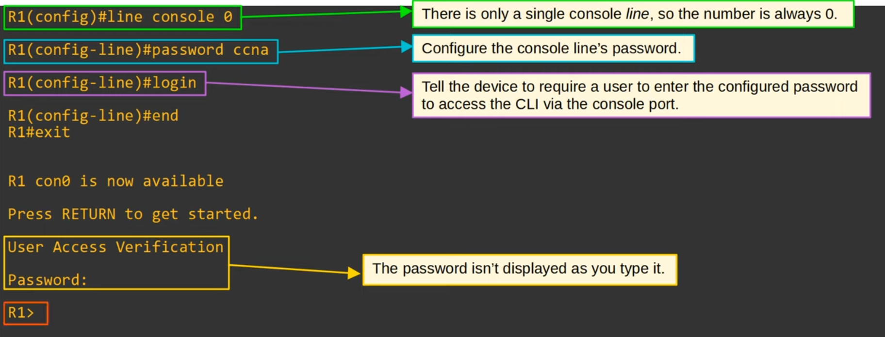
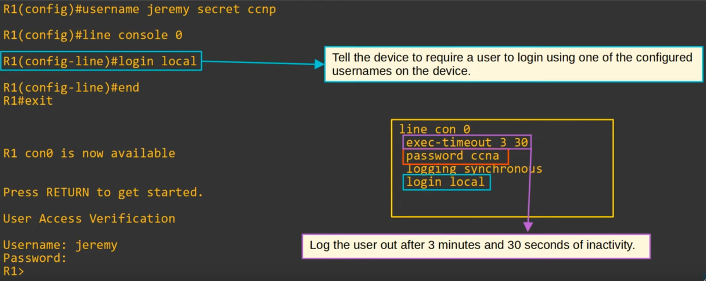
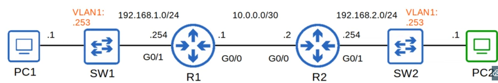
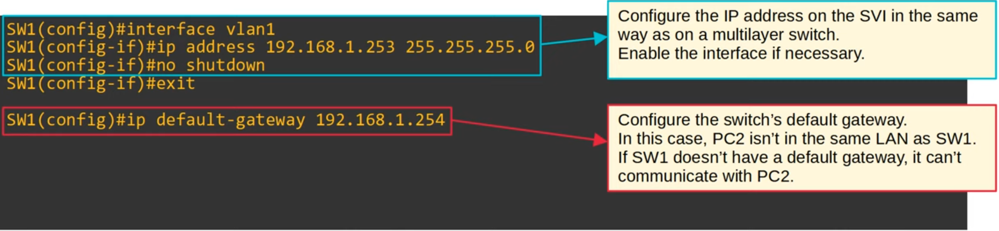
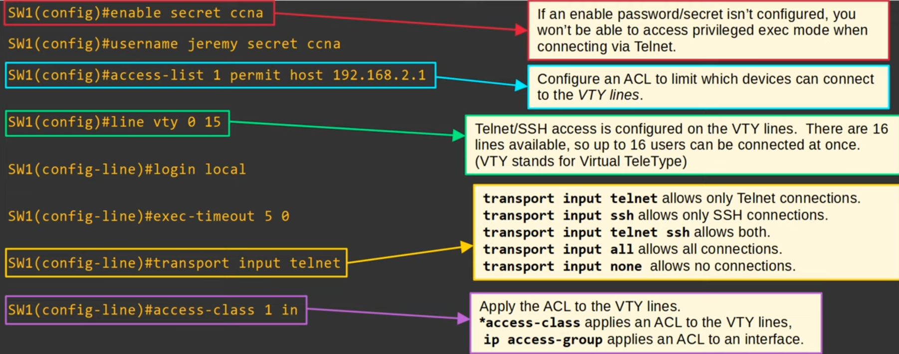
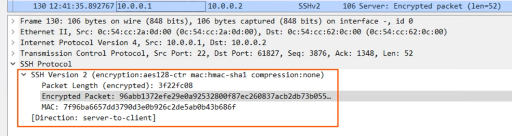
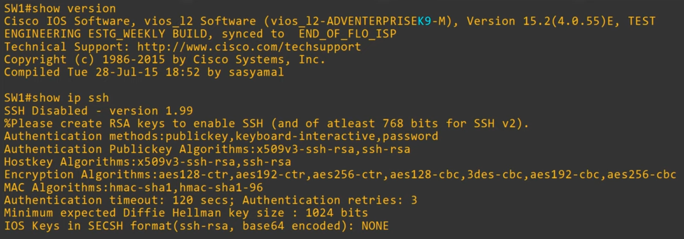
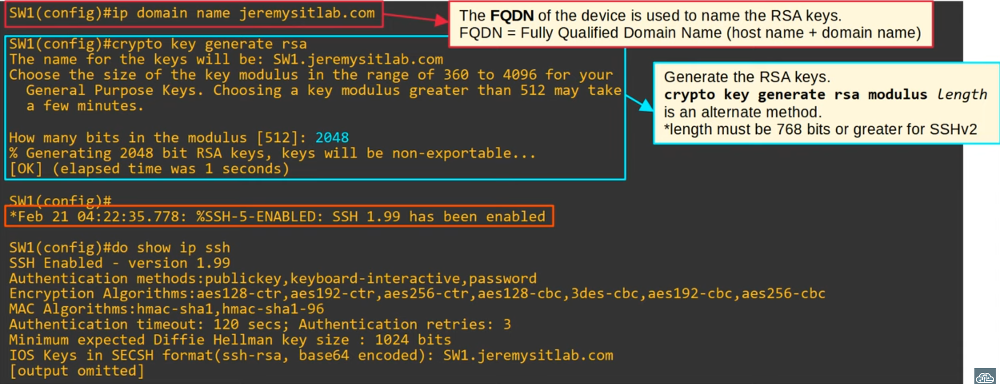
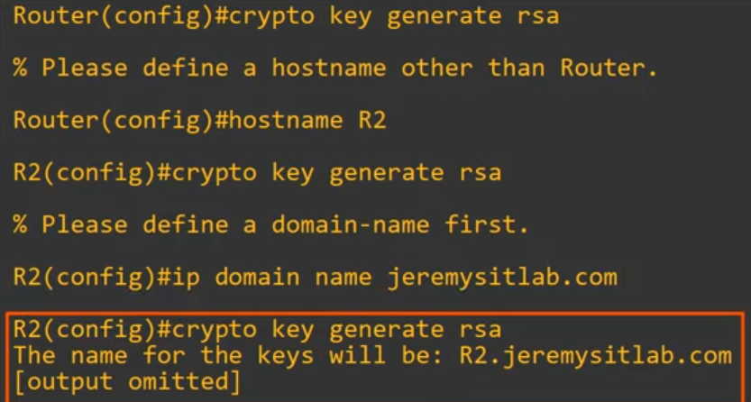
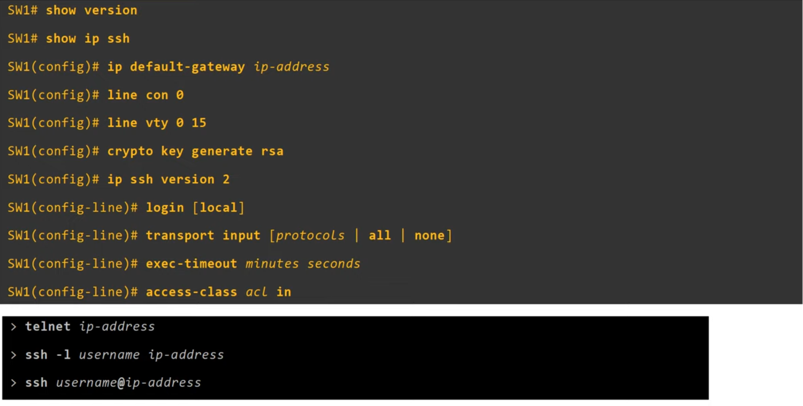

# Day 42 - SSH

## Console Port Security - login

- By default, **no password is needed** to **access the CLI** of a Cisco IOS device **via the console port**.

- You can configure a password on the console line.
    - A user will have to enter a password to access the CLI via the console port.

    


- Alternatively **you can configure the console line to require users to login using one of the configured usernames on the device**.

    

## Layer 2 Switch - Management IP

- Layer 2 switches don't perform packet routing and don't build a routing table. They aren't IP routing aware.
- However, you can assign an IP address to an SVI to allow remote connections to the CLI of the switch (using telnet or SSH).

    

    


## Telnet

- Telnet (Teletype Network) is a **protocol used to remotely access the CLI of a remote host**.
- Telnet was developed in 1969.
- Telnet has been **largely replaced by SSH**, which is more secure.
    - Telnet sends data in plaintext. No encryption!

- The telnet server listens for Telnet traffic on **TCP port 23**.

### Telnet - Configuration



## SSH (Secure Shell)

- SSH (Secure Shell) was developed in 1995 to replace less secure protocols like telnet.
- **SSHv2**, a **major revision of SSHv1**, was released in 2006.
- **If a device supports both versions**, it is said to run **'version 1.99'**.
- Provides security features such as **encryption and authentication**.

    

- The SSH server (the device being connected to) listens for SSH traffic on **TCP port 22**.

### Configuration [1]



- You can run `show version` and `show ip ssh` to view ssh version and support
- IOS images that **support SSH** will have **'K9'** in their name.
- **Cisco exports NPE (No Payload Encryption)** IOS images to countries that have restrictions on encryption technologies.
- NPE IOS images do not support cryptography features such as SSH.


## RSA Keys

- To enable and use SSH, you **must generate an RSA public and private key pair**.
- The keys are used for **data encryption/decryption, authentication**, etc.


### Configuration [2]

```
SW1(config)# enable secret ccna
SW1(config)# username jeremy secret ccna
SW1(config)# access-list 1 permit host 192.168.2.1

%% [optional] but recommended
%% restricts ssh to version 2 only
SW1(config)# ip ssh version 2

%% configure all vty lines, just like telnet
SW1(config)# line vty 0 15

%% enable local user authentication
%% (you cannot use login for SSH, only login local)
SW1(config-line)# login local

%% [optional] but recommended
%% configure exec timeout
SW1(config-line)# exec-timeout 5 0

%% best practice is to limit VTY line connections to SSH only
SW1(config-line)# transport input ssh

%% [optional] but recommended
%% apply the ACL to restrict VTY line connections
SW1(config-line)# access-class 1 in
```

1) Configure host name
    
2) Configure DNS domain name
3) Generate RSA key pair
4) Configure enable PW, username/PW
5) Enable SSHv2 (only)
6) Configure VTY lines

- **Connect:** `ssh -l <username> <ip-address>` OR `ssh <username>@<ip-address>`

## Command Summary

