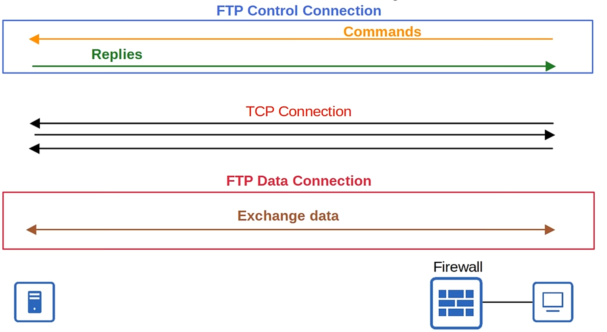

# Day 43 - FTP & TFTP 

- **FTP (File Transfer Protocol)** and **TFTP (Trivial File Transfer Protocol)** are industry standard protocols used to transfer files over a network.

- They both use a **client-server model**.
    - Clients can use FTP or TFTP to **copy files from a server**.
    - Clients can use FTP or TFTP to **copy files to a server**.

- As a network engineer, the most common use for FTP/TFTP is in the process of **upgrading the operating system of a network device**.
- You can use FTP/TFTP to download the newer version of IOS from a server, and then reboot the device with the new IOS image.
    1) Get the IOS image from Cisco.
    2) Put the IOS image on a server reachable by the device to be updated.
    3) Use FTP/TFTP to copy the file into the flash memory of a device.

## TFTP (Trivial File Transfer Protocol)
    
- TFTP was first standardized in 1981.
- Name 'Trivial' because it is simple and has only basic features compared to FTP.
    - Only allows a client to copy a file to or from a server.
- Was released after FTP, but is not a replacement for FTP. It is another tool to use when lightweight simplicity is more important than functionality.
- **No authentication** (username/PW), so servers will respond to all TFTP requests.
- **No encryption**, so all data is sent in plain text.
- Best used in a **controlled environment** to **transfer small files quickly**.
- TFTP servers listen on **UDP port 69**.
- UDP is connectionless and doesn't provide reliability with retransmissions, however, **TFTP has similar built-in features within the protocol itself**. 

### TFTP Reliability
- **Every TFTP data message is acknowledged**.
    - If the client is transferring a file to the server, the server will send ACK messages
    - If the server is transferring a file to the client, the client will send ACK messages

- Timers are used, and if an expected message isn't received in time, the waiting device will resend its previous message.
    

- TFTP uses 'lock-step' communication. The client and the server alternately send a message and then wait for a reply. (+retransmissions are sent as needed).

### TFTP Connections

- TFTP file transfers have three phases:
    1) **Connections:** TFTP client sends a request to the server, and the server responds back, initializing the connection.
    2) **Data transfer:** The client and server exchange TFTP messages. One sends data and the other sends acknowledgements.
    3) **Connection Termination:**  After the last data message has been sent, a final acknowledgement is sent to terminate the connection.

#### TFTP TID

- When the client sends the first message to the server, the destination port is UDP 69 and the source is a random ephemeral port.
- This random por is called a **Transfer Identifier (TID)** and identifies the data transfer.
- The server then also selects a random TID to use as the source port when it replies, not 69.
- When the client sends the next message, the destination port will be the server's TID, not 69.

## FTP (File Transfer Protocol)

- FTP was first standardized in 1971.
- FTP uses **TCP ports 20 and 21**.
- Usernames and passwords are used for authentication, however there is no encryption.
- For **greater security, FTPS (FTP over SSL/TLS)** can be used.
- **SSH File Transfer Protocol (SFTP)** can be also be used for **greater security**.
- **FTP is more complex than TFTP** and and allows not only file transfer, but **clients can also navigate file directories, add and remove, list files etc.**
- The client send FTP commands to the server to perform these functions.

### FTP Control Connections

- FTP uses **two types of connections**:
    - An **FTP control** connection (**TCP 21**) is established and used to **send FTP commands and replies**.
    - When files or data are to be transferred, separate **FTP data (TCP 20)** connections are established and terminated as needed.

    

### FTP Data Connections 

#### Active Mode

- The default method of establishing FTP data connections is **active mode**, in which the server initiates the TCP connection.

- **IMPORTANT:** In FTP active mode, the server intiates the data connection.

#### Passive Mode

- In FTP passive mode, the **client intiates the data connection**. This is often necessary when the client is behind a firewall, which could block the incoming connection from the server.

- Firewalls usually don't permit outside devices to intiate connections. In this case, FTP passive mode is used and the client (behind the firewall) initiates the TCP connection.

### FTP vs TFTP

## IOS File Systems

- A file system is a way of controlling how data is stored and retrieved.
- You can view the file systems of a Cisco IOS device with `show file systems`

- **disk:** Storage devices such as flash memory.
- **opaque:** Used for internal functions
- **nvram:** Internal NVRAM. The startup-config file is stored here.
- **network:** Represents external file systems, for example external FTP/TFTP servers. 

## Upgrading Cisco IOS

- You can view the current version of IOS with `show version`.
- You can view the contents of flash with `show flash`.

### Copying Files (TFTP)

### Booting the Image

- After this the file should appear in `show flash`

- And then you can boot the image:

- `boot system <filepath>`
    - If you don't use this command the router will use the first IOS file it finds in flash.

### Deleting the old image

- You can use `delete <filepath>` to delete the old image.

## Copying files (using FTP) 

- First of all configure the FTP username/password that the device will use when connecting to the FTP server.
    - `ip ftp username <username>`
    - `ip ftp password <password>`

- Then you run `copy ftp: flash:` and input all of the details, just like in tftp.

## Command Review

 