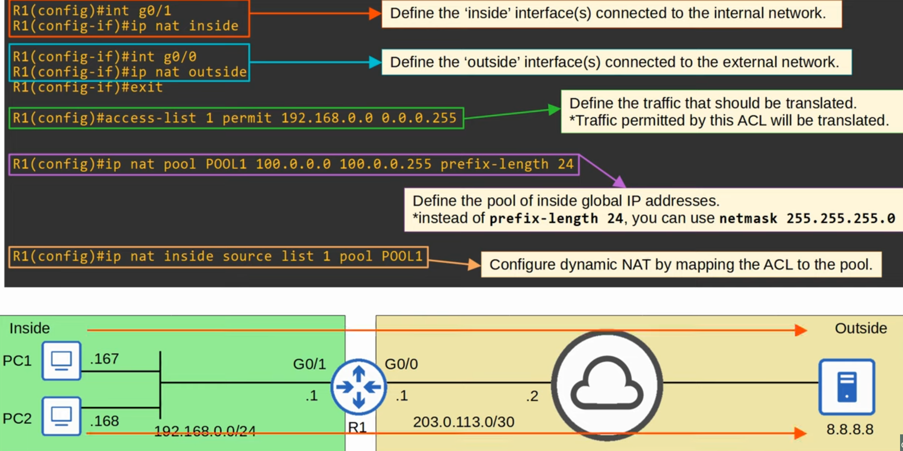
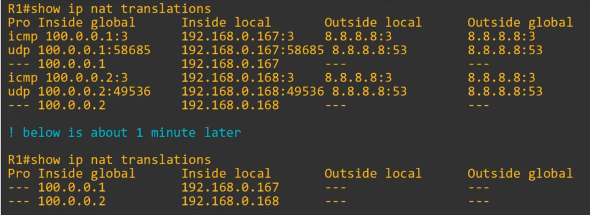
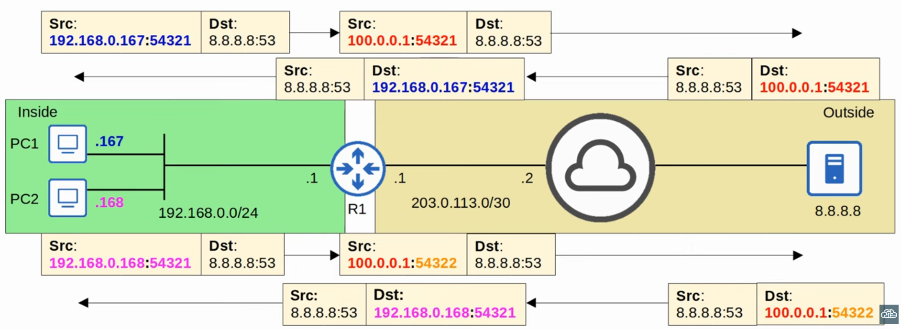
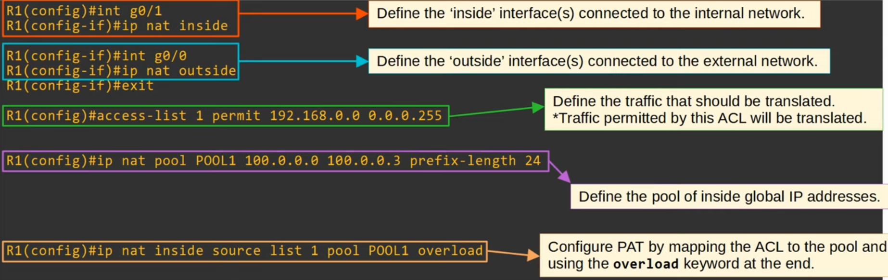
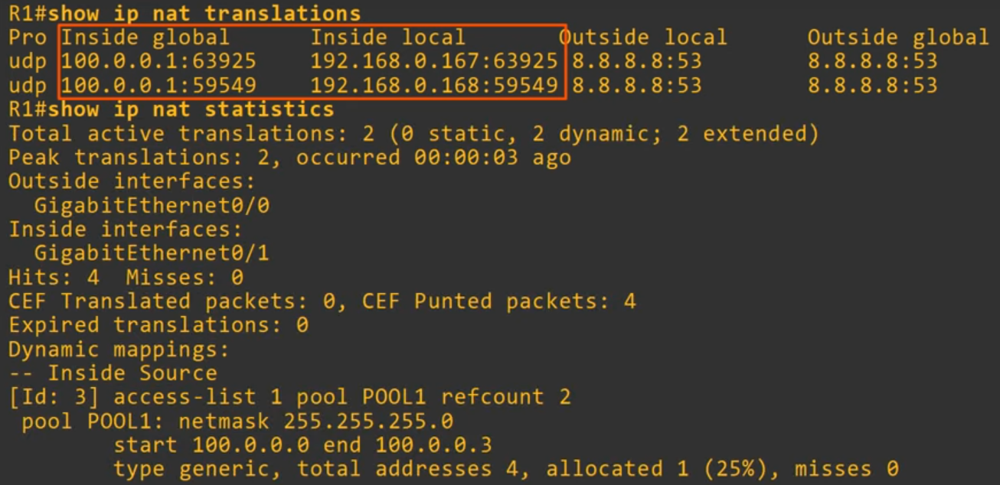
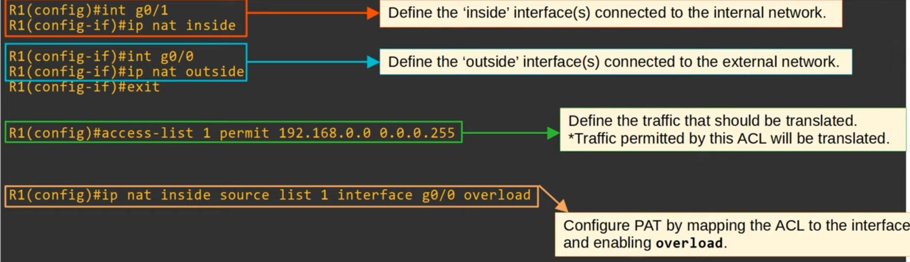
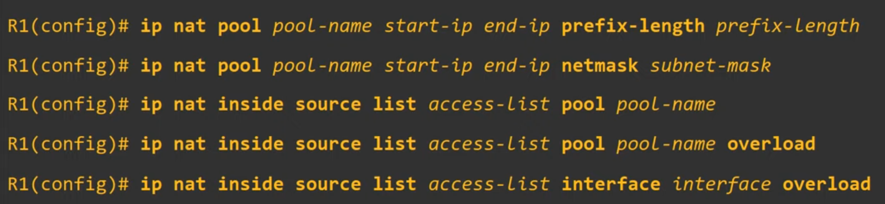

# Day 45 - NAT (Part 2)

- **One-to-one mapping** also **allows external hosts to access the internal host via the inside global address**.

## Dynamic NAT

- In dynamic NAT, the router dynamically maps inside local addresses to inside global addresses as needed.
- An ACL is used to identify which traffic should be translated:
    - **If** the **source IP is permitted** by the ACL, the **source IP will be translated**.
    - **If** the **source IP is denied** by the ACL, the **source IP will not be translated**.
        - **NOTE:** the traffic will not be dropped.
- A **NAT pool is used to define the available inside global addresses that can be used**.
- Although they are dynamically assigned, the **mappings are still one-to-one** (one inside local IP address per inside global IP address).
- **If there aren't enough inside global IP addresses available** (=all are currently being used), it is called **'NAT pool exhaustion'**.
    - If a packet from another inside host arrives and needs NAT but here are no available addresses, the router will drop the packet.
    - The host will be unable to access outside networks until one of the inside global IP addresses becomes available.
    - Dynamic NAT entries will time out automatically if not used, or you can clear them manually.

### Dynamic NAT - Configuration

- if the command `clear ip nat translation *` this entries will be cleared, since they are dynamic NAT.

- the generated entries with `---` will be clear by default after 24 hors (this value can be changed)

## PAT (NAT Overload)

- **PAT** (aka **NAT overload**) **translates both the IP address and the port number** (if necessary).
- **By using a unique port number for each communication flow**, a **single public IP address** can be **used by many different internal hosts**. (port number are 16 bits = over **65,000 available ports**).
- The router will keep track of which *inside local* address is using which *inside global* address and port.
- Because **many inside hosts can share a single public IP**, PAT is very useful for preserving public IP addresses, and it is used in networks all over the world,

 

### PAT - Configuration

- There will be no one-to-one mappings in `show ip nat translations`.

    

- You can configure PAT to use the public IP of the router's interface to be used in PAT:
    

## Command - Review

