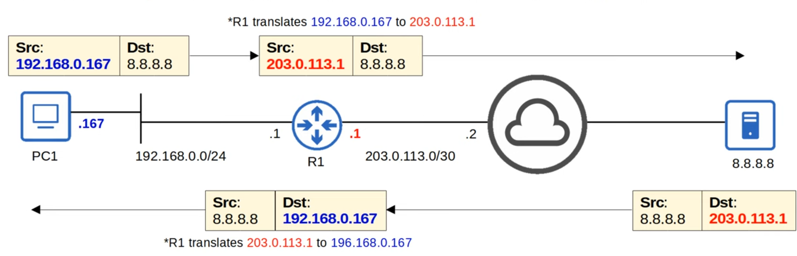
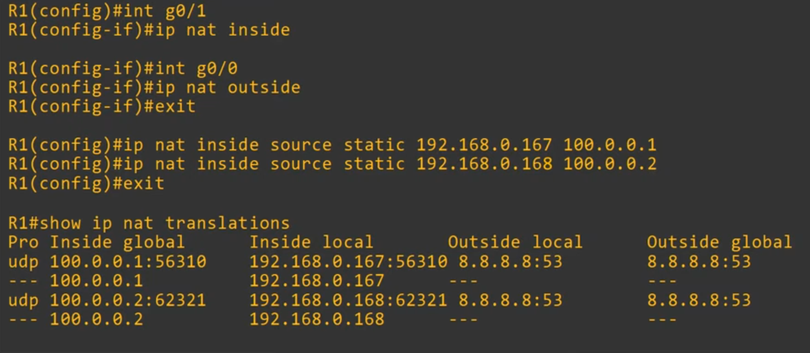
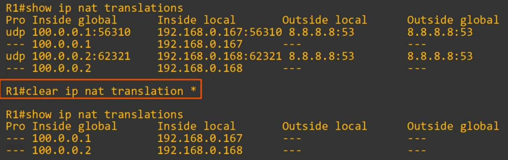
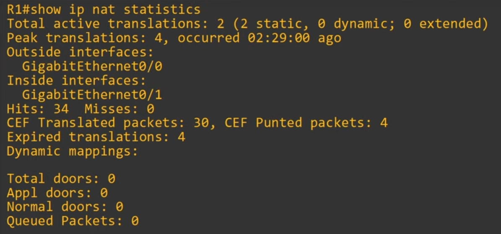
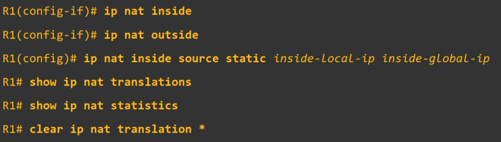

# Day 44 - NAT (Part 1)

## Private IPv4 Addresses (RFC 1918)

- IPv4 doesn't provide enough addresses for all devices that need an IP address in the modern world.
- The long-term solution is to switch to IPv6.
- There are three main short-term solutions:
    1) **CIDR**
    2) **Private IPv4 addresses**
    3) **NAT**

- RFC 1918 specifies the following IPv4 address ranges as private:
    - **10.0.0.0/8** (10.0.0.0 to 10.255.255.255) - **Class A**
    - **172.16.0.0/12** (172.16.0.0 to 172.31.255.255) - **Class B**
    - **192.168.0.0/16** (192.168.0.0 to 192.168.255.255) - **Class C**

- You are free to use these addresses in your networks. They **don't have to be globally unique**.

- Private IP addresses **cannot be used over the internet**.

- Two problems:
    - Duplicate addresses
    - Private IP addresses can't be used over the Internet, so the PCs can't be accessed over the Internet.

- Solution: NAT

## Network Address Translation (NAT)

- Network Address Translation (NAT) is used to **modify the source and/or destination IP addresses of packets**.
- There are various reasons to use NAT, but the most common reason is to **allow hosts with private IP addresses to communicate with other hosts over the Internet**.

    

## Static NAT

- Static NAT involves statically **configuring one-to-one mappings of private IP addresses to public IP addresses**.
- An **inside local IP address is mapped to an inside global IP address**. 
    - **Inside Local**
        - The IP address of the inside host from the perspective of the local network.
        - The IP address actually configured on the inside host, usually a private address.
    - **Inside Global**
        - The IP address of the inside host from the perspective of the outside hosts
        - The IP address of the inside host after NAT (usually a public address)
    - **Outside Local**
        - The IP address of the outside host, from the perspective of the local network.
    - **Outside Global**
        - The IP address of the outside host, from the perspective of the outside network.

- Unless **destination NAT** is used, these two addresses will be the same.

- **Inside/Outside** = Location of the host
- **Local/Global** = Perspective

- Static NAT allows devices with private IP addresses to communicate over the Internet. However, because it requires a one-to-one IP address mapping, it doesn't help preserve IP addresses.

## Static NAT Configuration

- `(config-if)# ip nat inside`: defines the inside interface(s) connected to the internal network
- `(config-if)# ip nat outside`: defines the outside interface(s) connected to the external network
- `ip nat inside source static <inside-local> <local-ip> <inside-global-ip>` configures the one-to-one IP address mappings.

### `clear ip nat translation *`

- static routes will be kept

### `show ip nat statistics`

## Command Review

