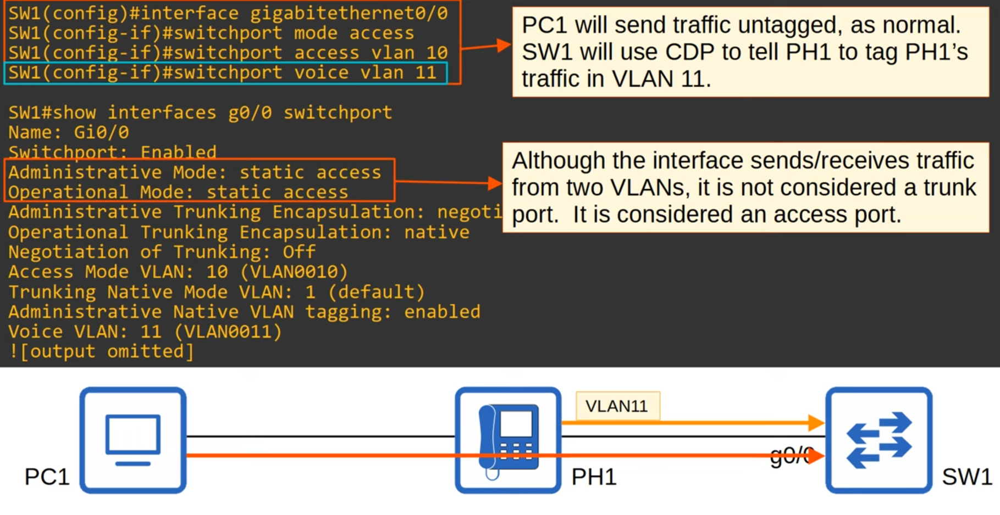
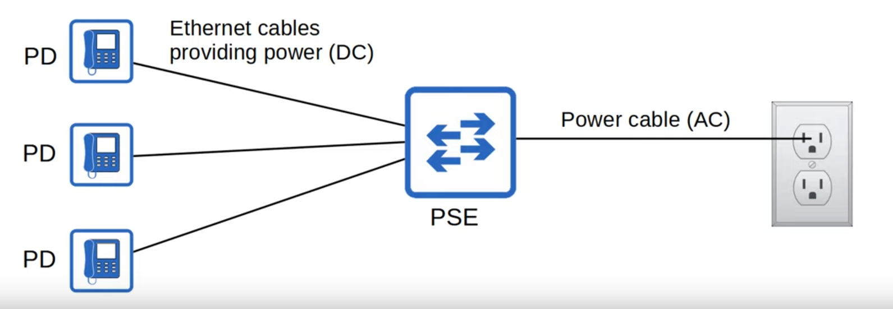
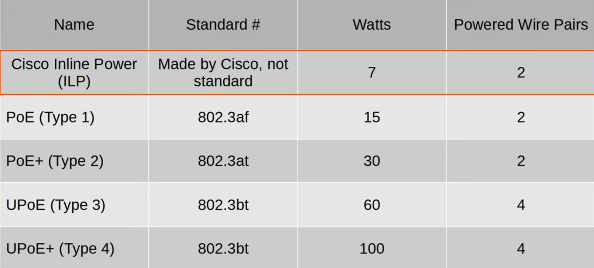
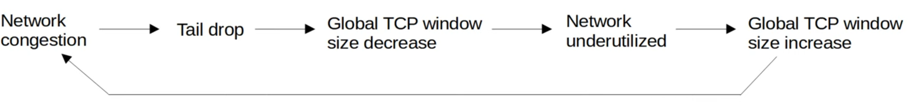

# Day 46 - Quality of Service

## IP Phones

- Traditional phones operate over the public switched telephone network (PSTN).
- Sometimes this is called POTS (Plain Old Telephone Service).
- IP phones use VoIP (Voice over IP) technologies to enable phone calls over an IP network, such as the Internet.
- IP phones are connected to a switch like any other end host.
- **IP phones** have an **internal 3-port switch**.
    - 1 port is the 'uplink' to the external
    - 1 port is the 'downlink' to the PC
    - 1 port connects internally to the phone itself.
- This allows the PC and the IP phone to share a single switch port. Traffic from the PC passes through the IP phone to the switch.
- It is recommended to **separate 'voice' traffic (from the IP phone) and 'data' traffic (from the PC)** by placing them in **separate VLANs**.
    - This can be accomplished by using a **voice VLAN**.
    - Traffic from the PC will be untagged, but traffic from the phone will be tagged with a VLAN ID.

## Voice VLAN

- Even though the interface is not trunk, you can do `show interfaces <interface-id> trunk`.

## Power Over Ethernet

- **PoE allows Power Sourcing Equipment (PSE) to provide power to Powered Devices (PD) over an Ethernet cable** 
- Typically the PSE is a switch and the PDs are IP phones, IP cameras, wireless access points, etc.
- The PSE receives AC power from the outlet, converts it to DC power and supplies that DC power to the PDs.

- Too much electrical current can damage electrical devices.
- PoE has a process to determine if a connected device needs power, and how much power it needs.
    - When a device is connected to a PoE-enabled port, the PSE (switch) sends low power signals, monitors the response and determines how much power the PD needs.
    - If the device needs power, the PSE supplies the power to allow the PD to boot.
    - The PSE continues to monitor the PD and supply the required amount of power (but not too much!).
- Power policing can be configured to prevent a PD from taking too much power.
- `power inline police` configures power policing with the default settings: disable the port and send Syslog message if a PD draws too much power.
    - equivalent to `power inline police action err-disable`
    - the interface will be put in an 'error-disabled' state and can be re-enabled with `shutdown` followed by `no shutdown`.
- `power inline police action log` does not shut down the interface if the PF draws too much power. It will restart the interface and send a syslog message.

## Quality of Service (QoS)

- Modern networks are typically converged networks in which IP phones, video traffic, regular traffic, regular data traffic, etc all share the same IP network.
- This enables cost savings as well as more advanced deatures for voie and video traffic, for example integrations with collaboration software (Cisco WebEx, Microsoft Teams, etc.).
- However, the different kinds of traffic now have to compete for bandwidth.
- QoS is a set of tools used by network devices to apply different treatment to different packets.

- **QoS is used to manage** the following characteristics of the network traffic:
    1) **Bandwidth:**
        - The overall capacity of the link, measured in bits per second (Kbps, Mbps, Gbps, etc.)
        - QoS tools allow you to reserve a certain amount of a link's bandwidth for specifc kinds of traffic (e.g. 20% voice traffic, 30% for specific kinds of data traffic, leaving 50% for all other traffic).
    2) **Delay:**
        - The amount of time it takes traffic to go from source to destination = **one-way delay**
        - The amount of time it takes traffic to go from source to destination and return = **two-way delay**
    3) **Jitter:**
        - The variation in one-way delay between packets sent by the same application
        - IP phones have a jitter buffer to provide a fixed delay to audio packets
    4) **Loss:**
        - The % capacity of packets sent that do not reach their destination.
        - Can be caused by faulty cables.
        - Can also be caused when a device's packet queues get full and the device starts discarding packets.

- The following standards are recommended for acceptable interactive audio (ie. phone call) quality:
    - **One-way delay:** 150 ms or less
    - **Jitter:** 30 ms or less
    - **Loss** 1% or less

### QoS - Queuing

- If a network device receives messages faster than it can forward them out of the appropriate interface, the messages are placed in a queue.
- By default, queued messages will be forwarded in a First In First Out (FIFO) manner
    - Messages will be sent in the order they are received.
- **If the queue is full new packets will be dropped**.
- This is called **tail drop**.

- *Tail drop* is harmful because it can lead to **TCP global synchronization**.
- **Review** of the **TCP sliding window**:
    - Hosts using TCP use the 'sliding window' to increase/decrease the rate at which they send traffic as needed.
    - When a packet is dropped it will be re-transmitted.
    - When a drop occurs, the sender will reduce the rate at which it sends traffic.
    - It will then gradually increase the rate again.

- When the queue fills up and tail drop occurs, all TCP hosts sending traffic will slow down the rate at which they send traffic.
- They will all then increase the rate at which they send traffic, which rapidly leads to dropped packets and the process repeats again.

#### Random Early Detection (RED)

- A solution to prevent tail drop and TCP global synchronization is **Random Early Detection** (RED).
- When the amount of traffic in the queue reaches a certain threshold, the device will start randomly dropping packets from select TCP flows.
- Those TCP flows that dropped packets will reduce the rate at which traffic is sent, but you will avoid global TCP synchronization, in which ALL TCP flows reduce and then increase the rate of transmission at the same time in waves.
- In standard RED, all kinds of traffic are treated the same.
- An improved version, **Weighted Random Early Detection** (WRED), allows you to control which packets are dropped depending on the traffic class.