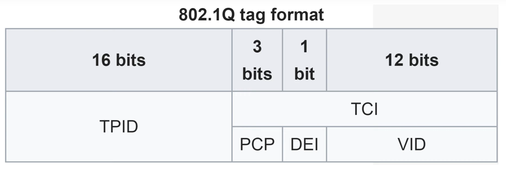
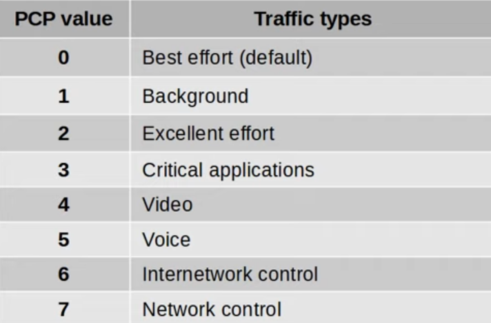
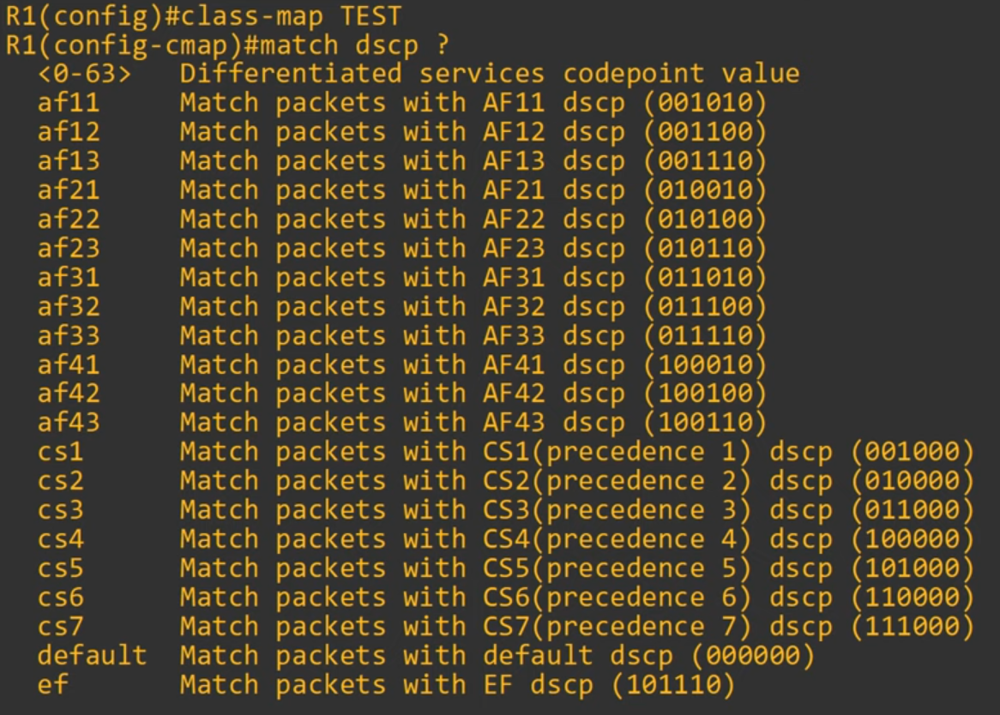
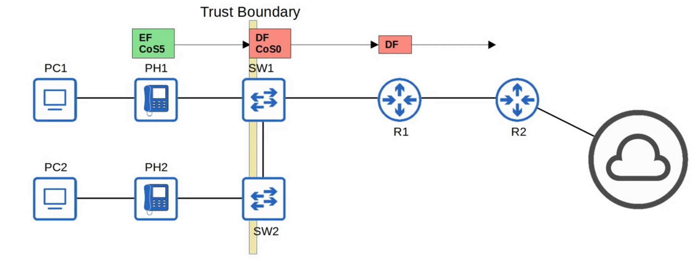

# Day 47 - QoS (Part 2)

## Classification

- The purpose of QoS it to give certain kinds of network traffic priority over others during congestion.
- **Classification organizes network traffic (packets) into traffic classes (categories)**.
- Classification is fundamental to QoS. To give priority to certain types of traffic, you have to identify which types of traffic to give priority to.
- There are **many methods of classifying traffic**. Some examples:
    - **An ACL**. Traffic which is permitted by the ACL will be given certain treatment. Other traffic wil not.
    - **NBAR (Network Based Application Recognition)** performs a deep packet inspection, looking beyond Layer 3 and Layer 4 information up to Layer 7 to identify the specific kind of traffic.
    - In the Layer 2 and Layer 3 headers there are specific fields used for this purpose.

- The PCP (Priority Code Point) field of the 802.1Q tag (in the Ethernet header) can be used to identify high/low priority traffic.
    - Only when there is a dot1q tag!

- The DSCP (Differentiated Services Code Point) field of the IP header can also be used to identify high/low priority traffic.

### PCP/CoS

- PCP is also known as CoS (Class of Service). Its use is defined by IEEE 802.1p.
- 3 bits = 8 possible values (2^3 = 8)

    - **Best effort** delivery means there is no guarantee that data is delivered or that it meets any QoS standard. This is regular traffic, not high-priority.
    - IP phones **mark** call signaling traffic (used to establish calls) as PCP3. They mark the actual voice traffic as PCP5.

- Because PCP is found in the dot1q header, it can only be used over the following connections:
    - Trunk links.
    - Access links with a voice VLAN.

### IP ToS Byte

#### IP Precedence (IPP)

- Standard IPP markingsa are similar to PCP:
    - **6 and 7** are reserver for **network control** traffic
    - **5** = voice
    - **4** = video
    - **3** = voice signaling
    - **0** = best effort

- With 6 and 7 reserved, **6 possible values remain**.
- Although 6 values is sufficient for many networks, the QoS requirements of some networks demand more flexibility.

#### DSCP

- RFC 2474 (1998) defines the DSCP field, and other *DiffServ* RFCs elaborate on its use.
- With IPP updated to DSCP, new standard markings had to be decided upon.
    - By having generally agreed upon standard markings for different kinds of traffic, QoS design & implementation is simplified, QoS works better between ISPs and enterprises, among other benefits.
- You should be aware of the following standard markings:
    - **Default Forwarding (DF)**: best effort traffic
    - **Expedited Forwarding (EF)**: low loss/latency/jitter traffic (usually voice)
    - **Assured Forwarding (AF)**: A set of 12 standard values
    - **Class Selector (CS)**: A set of 8 standard values, provided backward compatibility with IPP

    

### DF/EF (Default Forwarding / Expedited Forwarding)

- **DF (Default Forwarding)**:
    - DF is used for **best-effort traffic.**
    - The DSCP marking for DF is **0**.
    - **000000**

- **EF (Expedited Forwarding)**:
    - EF is used for **traffic that requires low loss/latency/jitter**.
    - The DSCP marking for EF is **46**.
    - **101110**

### AF (Assured Forwarding)

- AF (Assured Forwarding) defines four traffic classes. **All packets in a class have the same priority**.
- Within each class, there are three levels of drop precedence.
    - Higher drop precedence = more likely to drop the packet during congestion.

    - X: Decimal number of the class
    - Y: Decimal number of the drop precedence

- e.g. 001010 is AF11 (DSCP 10)

- **TIP:** To convert from AF value to DSCP value: `8X + 2Y`

### CS (Class Selector)

- CS (Class Selector) defines eight DSCP values for backward compatibility with IPP.
- The three bits that were added for DSCP are set to 0, and and the original IPP bits are used to make 8 values.

### RFC 4954

- RFC 4954 was developed with the help of Cisco to bring all of these values together and standardize their use.
- The RFC offers many specific recommendations, but here a few key ones:
    - Voice traffic: EF
    - Interactive video: AF4x
    - Streaming video: AF3x
    - High priority data: AF2x
    - Best effort: DF

## Trust Boundaries

- The trust boundary of a network defines where devices trust/don't trust the QoS markings of received messages.
- If the markings are trusted, the device will forward the message without changing the markings.
- If the markings aren't trusted, the device will change the markings according to the configured policy.

    
    

## Queuing/Congestion Management

- When a network device receives traffic at a faster rate than it can forward the traffic out of the appropriate interface, packets are placed in that interface's queue as they wait to be forwarded.
- When the queue becomes full, packets that don't fit in the queue are dropped (tail drop).
- RED and WRED drop packets early to avoid tail drop.

---

- An essential part of QoS is the use of multiple queues.
    - This is where classification plays a role. The device can match traffic based on various factors (for example the DSCP marking in the IP header) and then place it in the appropriate queue.
- However, the device is only able to forward one frame out of an interface at once, so a scheduler is used to decide which queue traffic is forwarded from next.
    - Prioritization allows the scheduler to give certain queues more priority than others.

- A common scheduling method is weighted round-robin.
    - **round-robin** = packets are taken from each queue in order, cyclically
    - **weighted** = more data is taken from high priority queues each time the scheduler reaches that queue

- **CBWFQ** (Class-Based Weighted Fair Queuing) is a popular method of scheduling using a weighted round-robin scheduler while guaranteeing each queue a certain percentage of the interfaces bandwidth during congestion.

    

- **Round-robin scheduling is not ideal for voice/video traffic**. Even if the voice/video traffic receives a guaranteed minimum amount of bandwidth, round-robin **can add delay and jitter because even the high priority queues have to wait their turn in the scheduler**.

#### LQQ (Low Latency Queuing)

- **LQQ (Low Latency Queuing) designates one (or more) queues as strict priority queues**.
    - This means that if there is traffic in the queue, the scheduler will alway take the next packet from that queue until it is empty.
- This is very effective for reducing the delay and jitter of voice/video traffic.
- However, it has the downside of **potentially starving other queues if there is always traffic** in the designated strict priority queue.
    - **Policing** can control the amount of traffic allowed in the strict priority queue so that it can't take all of the link's bandwidth.

## Shaping and Policing

- **Traffic shaping** and **policing** are both used to **control the rate of traffic**.
- **Shaping buffers traffic** **in a queue** **if the traffic rate goes over the configured rate**.
    - **Note:** policing also has the option of re-marking the traffic instead of dropping it.
- **Policing drops traffic if the traffic rate goes over the configured rate**.
    - *Burst* traffic over the configured rate is allowed for a short period of time.
    - This accommodates data applications which typically are bursty in nature. Instead of a constant stream of data, they send data in bursts.
    - The amount of burst traffic allowed is configurable.
- In both cases, classification can be used to allow for different rates for different kinds of traffic.

