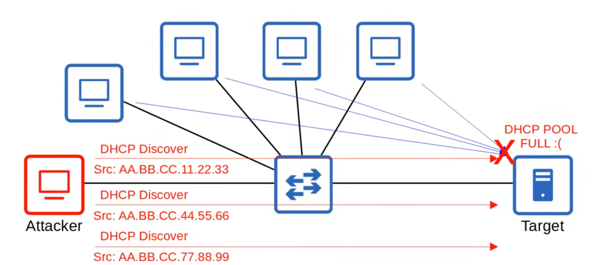
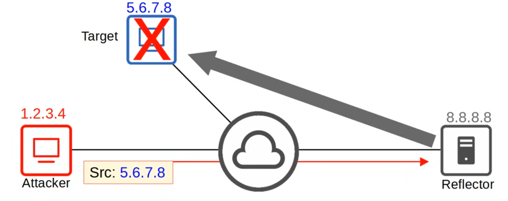
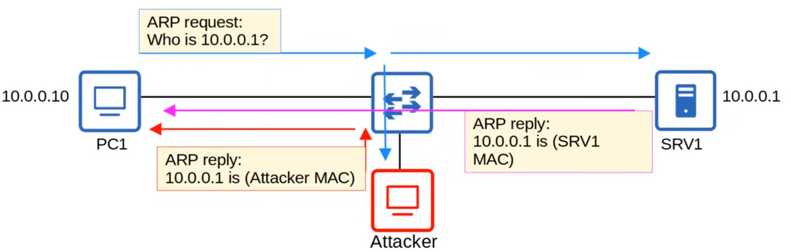
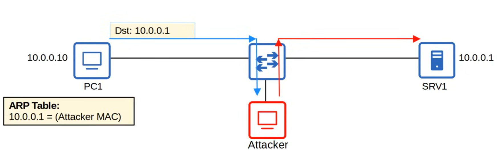
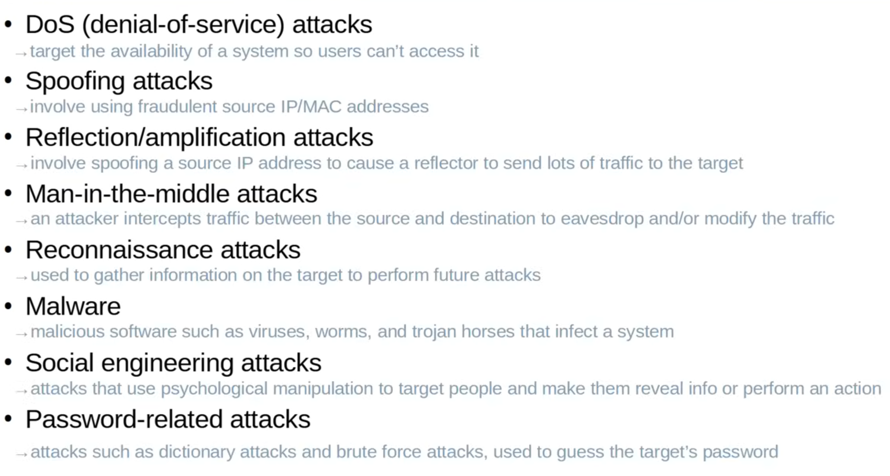

# Day 48 - Security Fundamentals 

## CIA Triad

- The principles of the **CIA Triad** form the foundation of security:
    - **C**onfidentiality:
        - Only authorized users should be able to access data.
        - Some information/data is public and can be accessed by anyone, some is secret and should only be accessed by specific people.

    - **I**ntegrity:
        - Data should not be tampered with (modified) by unauthorized users.
        - Data should be correct and authentic.
    
    - **A**vailability
        - The network/systems should be operational and accessible to authorized users.

- Attackers can threaten confidentiality, integrity and availability of an enterprise's systems and information.

## Vulnerability, Expoit, Threat, Mitigation

- A **vulnerability** is any potential weakness that can compromise the CIA of a system/info.
    - A potential weakness **isn't a problem on its own**.

- An **exploit** is something that can potentially be used to exploit the vulnerability.
    -  Something that can potentially be used as an exploit **isn't a problem on its own**.

- A **threat** is the potential of a vulnerability to be exploited.
    - A hacker exploiting a vulnerability in your system is a threat.

- A **mitigation technique** is something that can protect against threats.
    - Should be implemented everywhere a vulnerability can be exploites: client devices, servers, switches, routers, firewalls, etc.

## Common Attacks

### Denial-of-Service Attacks

- DoS attacks **threaten the availability of a system**.
- One common DoS attack is the **TCP SYN flood**.
    - TCP three-way handshake: SYN|SYN-ACK|ACK
    - The attacker sends countless TCP SYN messages to the target.
    - The target sends a SYN-ACK message in response to each SYN it receives.
    - The attacker never replies with the final ACK of the TCP three-way handshake.
    - The incomplete connections fill up the target's TCP connection table.
    - The attacker continues sending SYN messages.
    - The target is no longer able to make legitimate TCP connections.

- In a **DDoS (Distributed Denial-Of-Service)** attack, the attacker infects many target computers with malware and uses them all to initiate a denial-of-service attack, for example, a TCP SYN flood attack.
    - This group of infected computers is called a botnet.

### Spoofing Attacks

- To spoof an address is to use a fake source address (IP or MAC address).
- Numerous attacks involve spoofing, it's not a single kind of attack.
 An example is a **DHCP Exhaustion** attack.
 - An attacker uses spoofed MAC addresses to flood DHCP Discover messages.
 - The target server's DHCP pool becomes full, resulting in a denial-of-service to other devices.

### Reflection/Amplification Attacks

- In a reflection attack, the attacker sends traffic to a reflector and spoofs the source address of its packets using the target's IP address.
- The reflector (ie. a DNS server) sends the reply to the target's IP address.
- If the amount of traffic sent to the target is large enough, this can result in a DoS.
- A reflection attack becomes an **amplification** attack when the amount of traffic sent by the attacker is small, but it triggers a large amount of traffic to be sent from the reflector to the target.

### Man-in-the-middle Attack

- In a MiTM attack, the attacker places himself between the source and destination to eavesdrop on communication, or to modify traffic before it reaches the destination.
- A common example is **ARP spoofing**, also known as **ARP Poisoning**
    1) A host sends an ARP request, asking for the MAC address of another device
    2) The target of the request sends an ARP reply, informing the requester of its MAC address.
    3) The attacker waits and sends another ARP reply after the legitimate replier.
    4) If the attacker's ARP reply arrives last, it will overwrite the legitimate ARP entry in PC1's ARP table.
    5) In PC1's ARP table, the entry will have the attacker's malicious MAC address.
    6) When PC1 tries to send traffic to SRV1, it will be forwarded to the attacker instead.
    7) The attacker can inspect the messages, and then forward them to SRV1.
    8) The attacker can also modify the messages before forwarding them to SRV1.
    - This compromises the **confidenciality** and the **integrity** of communications ebtween PC1 and SRV1.
    
    

### Reconnaissance Attacks

- Reconnaissance attacks aren't attacks themselves, but they are used to gather information about a target which can be used for a future attack.
- This is often publicly available information.
    - ie. **nslookup** to learn the IP address of a site.
    - or a WHOIS query to learn email addresses, phone numbers, physical addresses, etc.

### Malware

- Malware (malicious software) refers to a variety of harmful programs that can infect a computer.

- **Viruses** infect other software ('host program'). The virus spreads as the software is shared by users. Typically they corrupt or modify files on the target computer.
- **Worms** do not require a host program. They are standalone malware and they are able to spread on their own, without user interaction. The spread of worms can congest the network, but the 'payload' of a worm can cause additional harm to the target devices.
- **Trojan Horses** are harmful software that is disguised as legitimate software. They are spread through user interaction such as opening email attachments, or downloading a file from the Internet.

- The aboves malware types can exploit various vulnerabilities to threaten any of the CIA of the target device.

### Social Engineering Attacks

- Social engineering attacks target the most vulnerable part of any system - people!
- They involve psychological manipulation to make the target reveal confidential information or perform some action.
- **Phishing** typically involves fraudulent emails that appear to come from a legitimate business and contain links to a fraudulent website that seems legitimate. Users are told to login to the fraudulent website, providing their login creedentials to the attacker.
    - **spear phishing** is a more targeted form of phishing, ie. aimed at employees of a certain company.
    - **whaling** is phishing targeted at high-profile individuals, ie. a company president.
- **Vishing** (voice phishing) is phishing performed over the phone.
- **Smishing** (SMS phishing) is phishing using SMS text messages.

- **Watering hole** attacks compromise sites that the target victim frequently visits. If a malicious link is placed on a website the target trusts, they might not hesitate to click it.
- **Tailgating** attacks involve entering restricted, secured areass by simply walking in behind an authorized person as they enter.

### Password-related attacks

- Most systems use a username/password combination to authenticate users.
- The username is oftem simply/easy to guess (for example the user's email address), and the strength and secrecy of the password is relied on to provide the necessary security.
- Attackers can learn a user's password via multiple methods:
    - Guessing
    - **Dictionary attack:** a program runs through a dictionary or list of common words/passwords to find the target's password.
    - **Brute force attack:** a program tries every possible combination of letters, numbers and special characters to find the target's password.

- Strong password should contain:
    - at least 8 characters (preferably more)
    - a mixture of uppercase and lowercase letters
    - a mixture of letters and numbers
    - one or more special characters (#@!? etc.)
    - should be changed regularly

## Common Attacks - Review

## Multi-factor authentication

- Multi-factor authentication involves providing more than just a username/password to prove your identity.
- It usually involves providing two of the following(=two-factor authentication):

-   **Something you know**
    - a username/password combination, a PIN, etc.

- **Something you have**
    - pressing a notification that appears on your phone, a badge that is scanned, etc.

- **Something you are**
    - biometrics such as a face scan, palm scan, fingerprint scan, retina scan, etc.

- Requiring multiple factors of authentication greatly increases the security. Even if attacker learns the target's password (something you know), they won't be able to login to the target's account.

## Digital Certificates

- Digital certificates are another form of authentication used to proven the identity of the holder of the certificate.
- They are used for websites to verify that the website being accessed is legitimate.
- Entities that want a certificate to prove their identity send a CSR (Certificate Signing Request) to a CA (Certificate Authority), which will generate and sign the cwertificate.

## Controlling and monitoring users with AAA

- **AAA (triple-A)** stands for **Authentication**, **Authorization** and **Accounting**.
- It is a framework for controlling and monitor users of a computer system (ie. a network).

- **Authentication** is the process of veryfing a user's identity.
    - logging in = authentication

- **Authorization** is the process of granting the user the appropriate access and permissions.
    - granting the user access to some files/services, restricting access to other files/services = authorization

- **Accounting** is the process of recording the user's activities on the system.
    - logging when a user makes a change to a file = accounting

- Enterprises typically use a AAA server to provide AAA services.
    - ISE (Identity Services Engine) is Cisco's AAA server.

- AAA servers usually support the following two AAA protocols:
    - **RADIUS**: an open standard protocol. Uses **UDP ports 1812 and 1813**
    - **TACACS+**: a Cisco proprietary protocol. Uses **TCP port 49**

## Security Program Elements

- **User awareness** programs are designed to make employees aware of potential security threats and risks.
    - e.g., a company might send out false phshing emails to make employees click a link and sign in with their login creds.

- **User training** programs are more formal than user awareness programs.
    - e.g., dedicate training sessions which educate users on the corporate security policies, how to create strong passwords, and how to avoid potential threats.

- **Physical access control** protects equipment and data from potential attackers by only allowing authorized users into protected areas such as network closets or data center floors.
    - e.g., multifactor locks can protect access to restricted areas in various ways.