# Day 49 - Port Security

- Port security is a **security feature of Cisco switches**.
- It allows you to **control which source MAC address(es) are allowed to enter the switchport**.
- If an unauthorized source MAC enters the port, an action will be taken.
    - The default action is to place the interface in an `err-disabled` state.

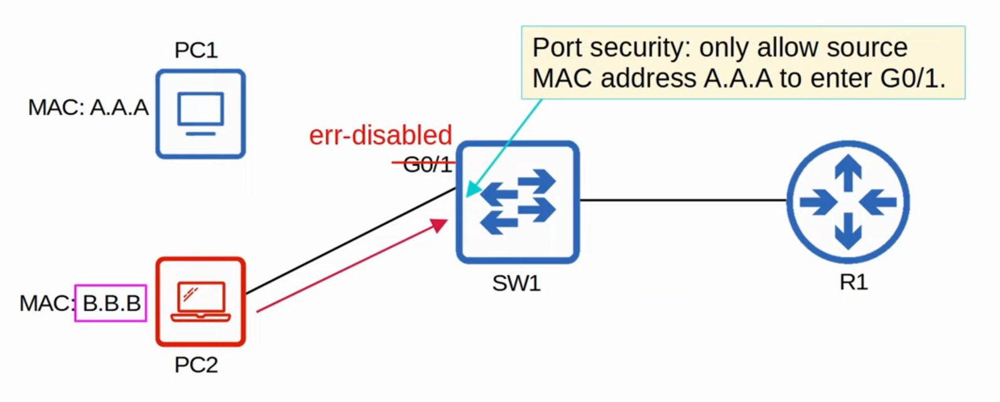

- When you enable port security on an interface with the default settings, one MAC address is allowed.
    - You can configure the allowed MAC address manually.
    - If you don't configure it manually, the switch will allow the first MAC address that enters the interface.
- You can change the maximum number of MAC addresses allowed.
- A combination of manually configured MAC addresses and dynamically learned addresses is possible.

## Why port security?

- Port security allows network admins to **control which devices are allowed to access the network**.
- However, **MAC address spoofing is a simple task**.
    - It's easy to configure a device to send frames with a different source MAC address.
- Rather than manually specifying the MAC addresses allowed on each port, **port security's ability to limit the number of MAC addresses allowed on an interface is more useful**.
- Think of the DHCP starvation attack:
    - the attacker spoofed thousands of fake MAC addresses.
    - the DHCP server assigned IP addresses to these fake MAC addresses, exhausting the DHCP pool.
    - the switch's MAC address table can also become full due to such an attack.
- Limiting the number of MAC addresses on an interface can protect against those attacks.

## Enabling Port Security

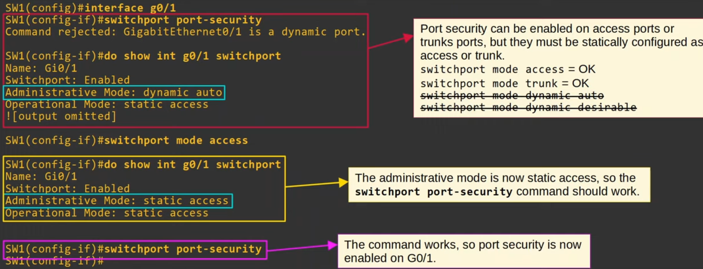

- When you simply use this command, it will configure port-security with the default settings.

- You can run the command **`show port-security interface <interface-id>`**:
    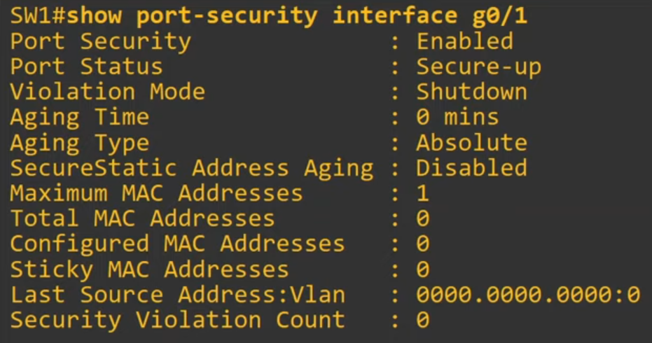

- If you do a ping, there will be changes:
    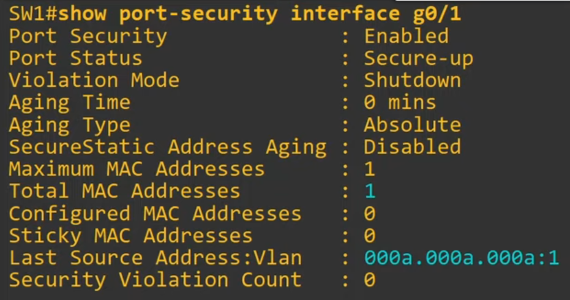

## Re-enabling an interface (manually)

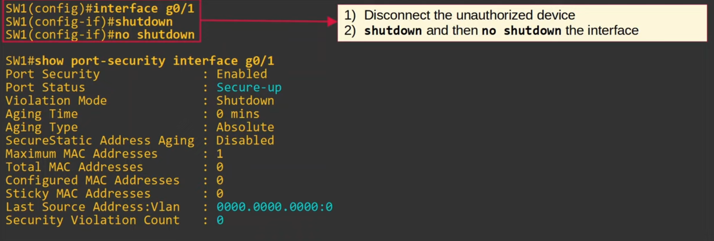

#### ErrDisable Recovery

- You can enable ErrDisable Recovery so that an interface is automatically re-enabled.
-There are various ErrDisable reasons:
    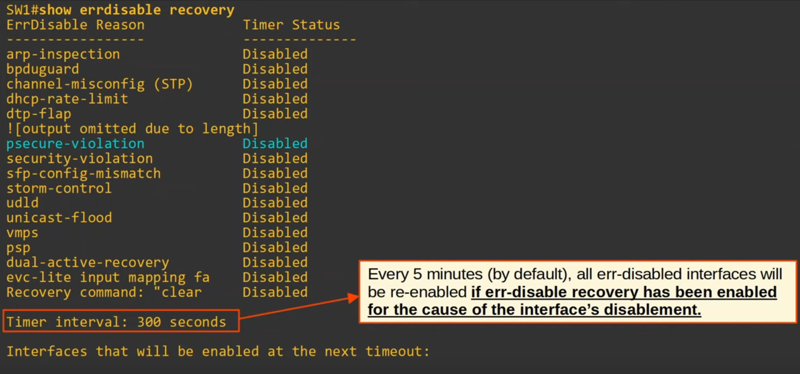
    - All of them are disabled by default

- To enable it you need to use the command **`errdisable recovery caus <reason>`**.
- You can also change the interval with **`errdisable recovery interval 180`**.

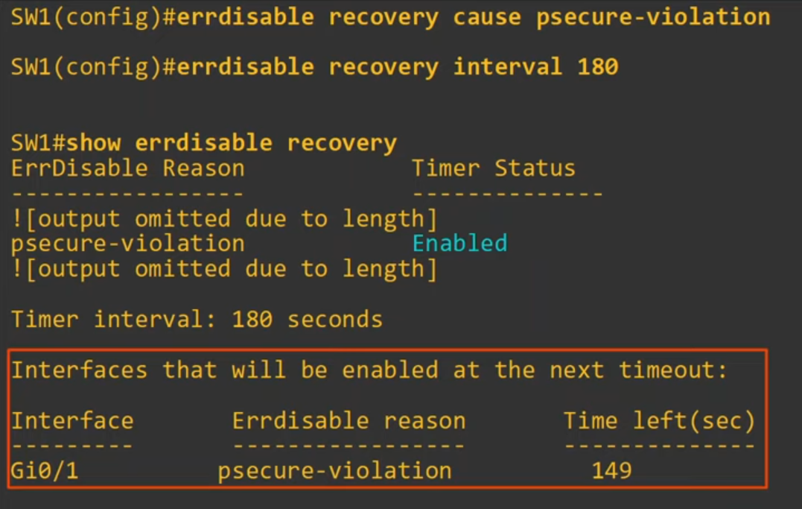

- ErrDisable Recovery is useless if you don't remove the device that caused the interface to enter the err-disabled state!

## Violation Modes

- There are three different violation modes that determine what the switch will do if an unauthorized frame enters an interface configured with port security

- **Shutdown**
    - Effectively **shuts down the port** by **placing it in an err-disabled state**.
    - Generates a Syslog and/or SNMP message when the interface is disabled.
    - The **violation counter is set to 1** when the interface is disabled.

- **Restrict**
    - The switch disards traffic from unatuhorized MAC addresses.
    - The **interface is not disabled**.
    - Generates a Syslog and/or SNMP message each time an unauthorized MAC address is detected.
    - The **violation counter** is **incremented by 1** **for each unauthorized frame**.

- **Protect**
    - The switch **disacards traffic from unatuhorized MAC addresses**.
    - The **interface is not disabled**.
    - It does not generate Syslog/SNMP messages for unauthorized traffic.
    - It **does not increments the violation counter**.

### Shutdown Mode

- This is the default mode

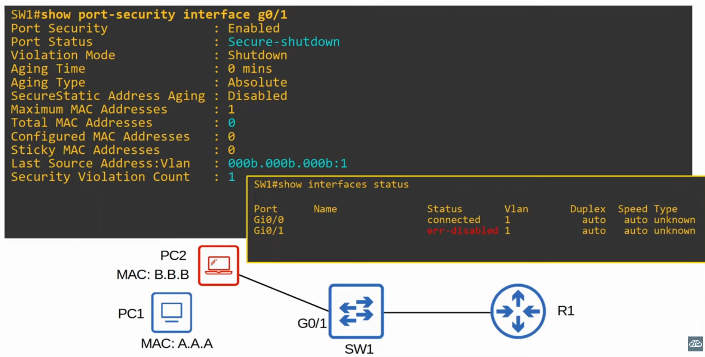

### Restrict Mode

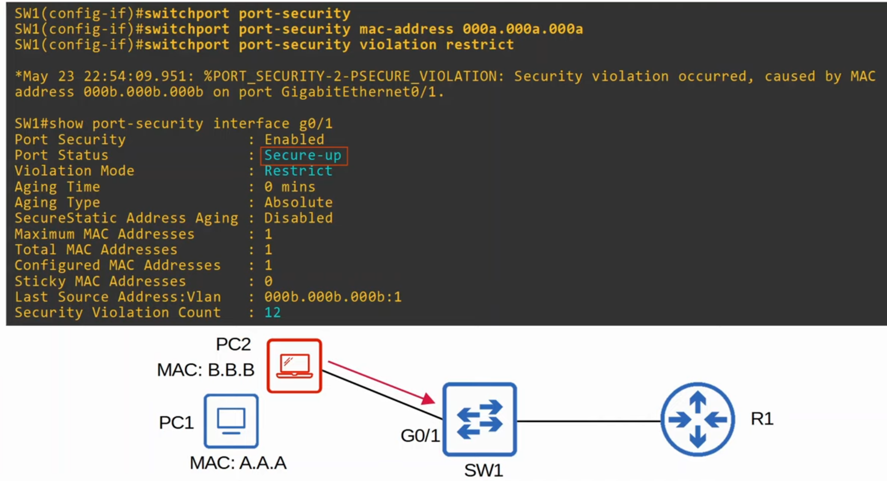

### Protect Mode

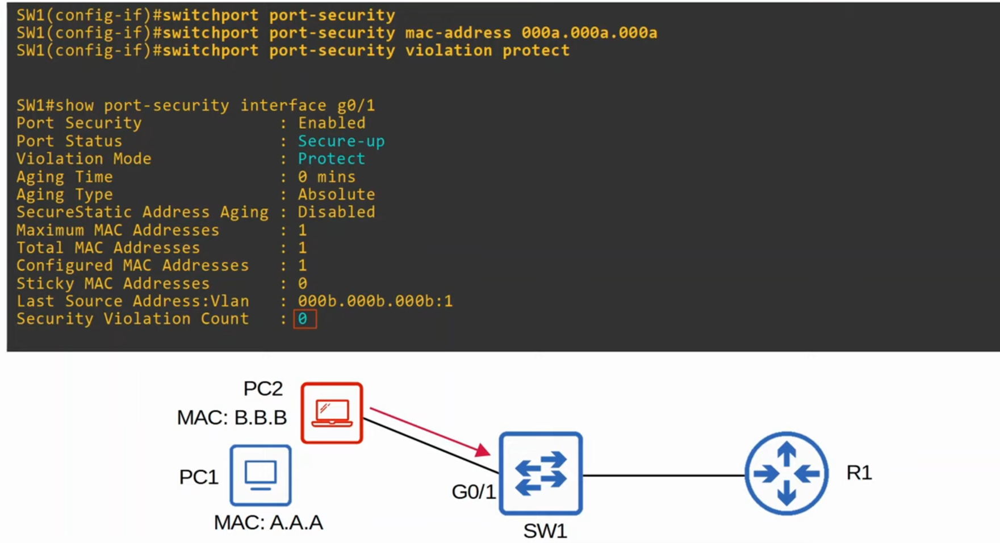

## Secured MAC address aging

- By default, secure MAC addresses will not 'age out' (Aging Time: 0 mins)
    - Can be configured with `switchport port-security aging time <minutes>`

- The default aging type is **Absolute**.
    - **Absolute**: After the secure MAC address is learned, the aging timer starts and the MAC is removed after the timer expires, even if the switch continues receiving frames from that source MAC address.
    - **Inactivity**: After the secure MAC address is learned, the aging timer starts but is reset every time a frame from that source MAC address is received on the interface.
    - Aging type is confugyres with `switchport port-security aging type {absolute | inactivity}`
- Secure Static MAC aging (addresses configured with `switchport port-security mac-address `x.x.x`) is disabled by default.
    - **Can be enabled** with **`switchport port-security aging static`**.

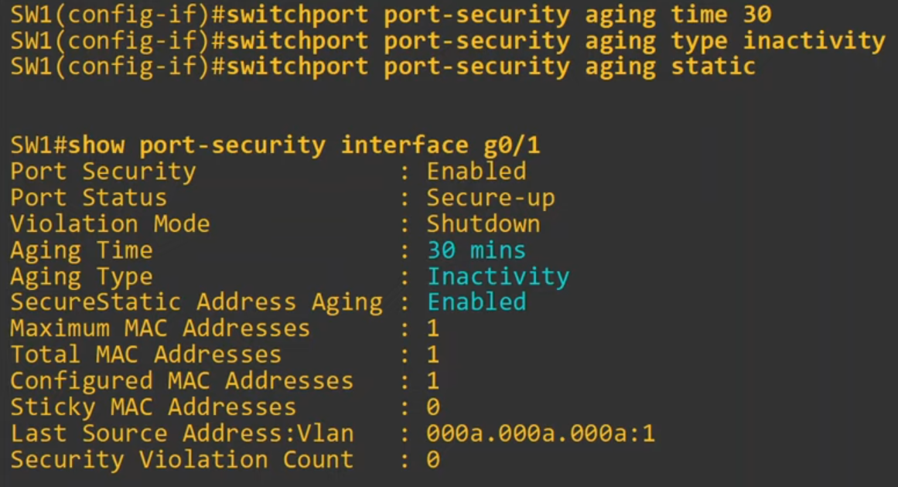

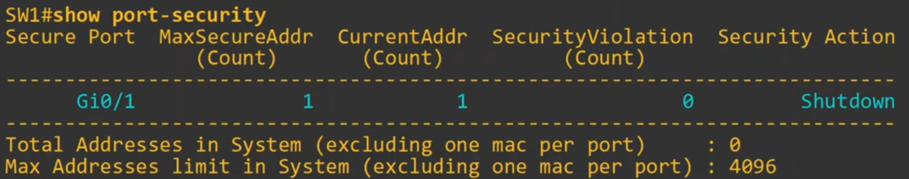

## Sticky Secure MAC Addresses

- Sticky secure MAC address learning can be enabled with the following command:
    - **`SW1(config-if)# switchport port-security mac-address sticky`**

- When enabled, dynamically-learned secure MAC addresses will be added to the running config like this:
    - **`switchport port-security mac-address sticky <mac-address>`**

- The sticky secure MAC addresses **will never age out**:
    - You need to save the running-config to the startup-config to make them truly permanent (or else they will not be kept if the switch restarts).

- When you issue the `switchport port-security mac-address sticky` command, all current dynamically-learned secure MAC addresses will be converted to sticky secure MAC addresses.

- If you issue the `no switchport port-security mac-address sticky` command, all current sticky secure MAC addresses will be converted to regular dynamically-learned secure MAC addresses.

## MAC Address Table

- Secure MAC addresses will be added to the MAC address table like any other MAC address.
    - **Sticky and Static** secure MAC addresses will have a type of **STATIC**.
    - **Dynamically-learned** secure MAC addresses will have a type of **DYNAMIC**.
    - Youc an view all secure MAC addresses with **`show mac address-table secure`**.

## Commands - Summary

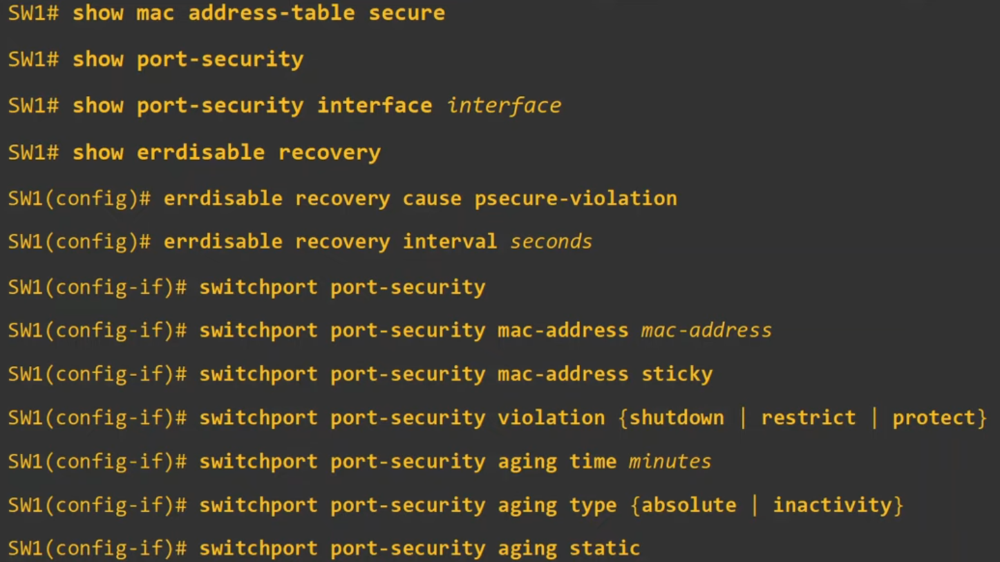