# Day 50 - DHCP Snooping

- DHCP Snooping is a **security feature of switches** that is used to **filter DHCP messages received on untrusted ports**.
- DHCP snooping **only filters DHCP messages**. Non-DHCP messages aren't affected.
- **All ports** are **untrusted by default**.
    - Usually **uplink ports** are configures as **trusted ports**, and **downlink ports** remain **untrusted**.

    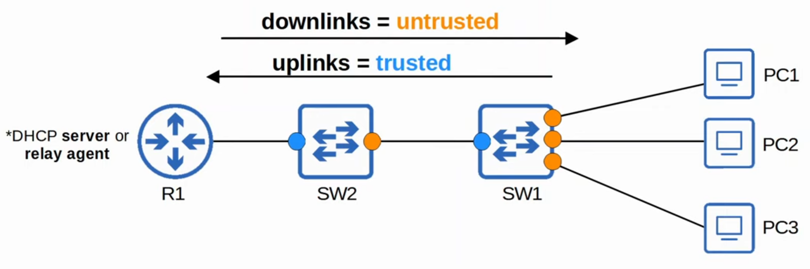

#### Example 1

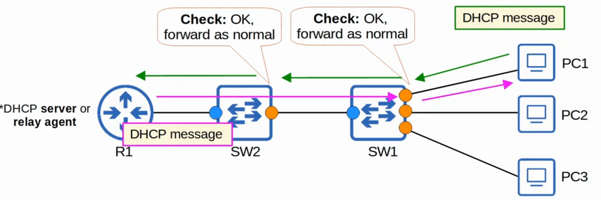

#### Example 2
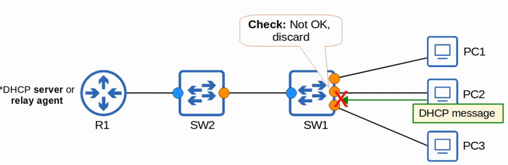

## DHCP Starvation - Review

- An example of a DHCP-based attack is a DHCP starvation attack.
- An attacker uses **spoofed MAC addresses** to **flood DHCP Discover Messages**.
- The target server's **DHCP pool becomes full**, resulting in a **denial-of-service** to other devices.

    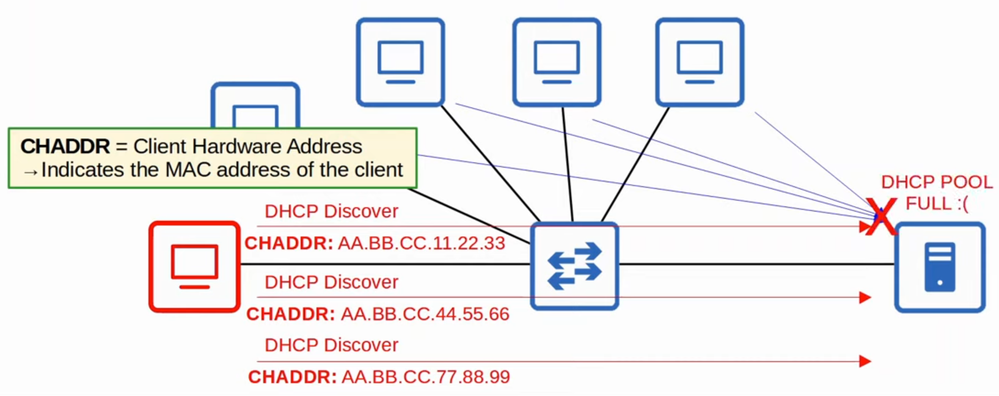

## DHCP Poisoning (MiTM)
 
- Similar to ARP poisoning, DHCP Poisoning can be used to perform a Man-in-the-Middle attack.
- A spurious DHCP server repliex to clients' DHCP Discover messages and assigns them IP addresses, but makes the client use the spurious server's IP as the default gateway.
    - Clients usually accept the first OFFER message they receive.
- This will cause the client to send traffic to the attacker instead of the legitimate default gateway.
- The attacker can then examine/modify the traffic before forwarding it to the legitimate default gateway.

## DHCP Messages

- When DHCP Snooping filters messages, it differentiates between DHCP Server messages and DHCP Client messages.
- Messages **sent by DHCP Servers**:
    - **OFFER**
    - **ACK**
    - **NAK** = Opposite of ACK, used to decline a client's REQUEST

- Messages **sent by DHCP Clients**:
    - **DISCOVER**
    - **REQUEST**
    - **RELEASE** = Used to tell the server that the client no longer needs its IP address.
    - **DECLINE** = Used to decline the IP address offered by a DHCP server.

## DHCP Snooping Operations

- If a **DHCP message** is **received on a trusted port**, **forward it as normal without inspection**.
- If a **DHCP message** is **received on an unstrusted port**, inspect it and act as follows:
    - If it is a **DHCP Server** message, **discard it**.
    - If it is a **DHCP Client** message, perform the following checks:
        - **DISCOVER/REQUEST messages**: Check if the frame's source MAC address and the DHCP message's CHADDR fields match.
            - **Match = forward**, **mismatch = discard**
        - **RELEASE/DECLINE messages**: Check if the **packet's source IP address** and the receiving interface **match the entry in the DHCP SNoopong Binding table**:
            - **Match = forward**, **mismatch = discard**

- When a **client successfully leases an IP address from a server**, create a **new entry in the DHCP Snooping Binding Table**.

### DHCP Snooping Config

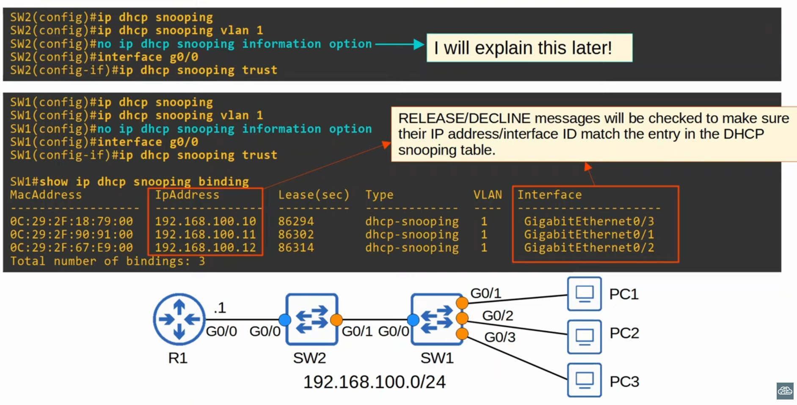

#### Rate-Limiting

- DHCP snooping can limit the rate at which DHCP messages are allowed to enter an interface.
- If the rate of DHCP messages crosses the configured limit, the interface is `err-disabled`.
- Like with Port Security, the **interface can be manually re-enabled**, or **automatically re-enabled** with errdisable recovery.

- You an run `ip dhcp snooping limit rate <message-no>` to choose the number of message than can be received per second without disabling the interface.

    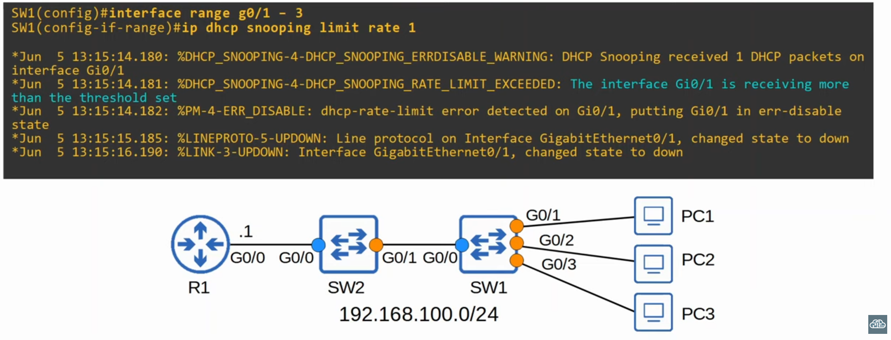

###### errdisable

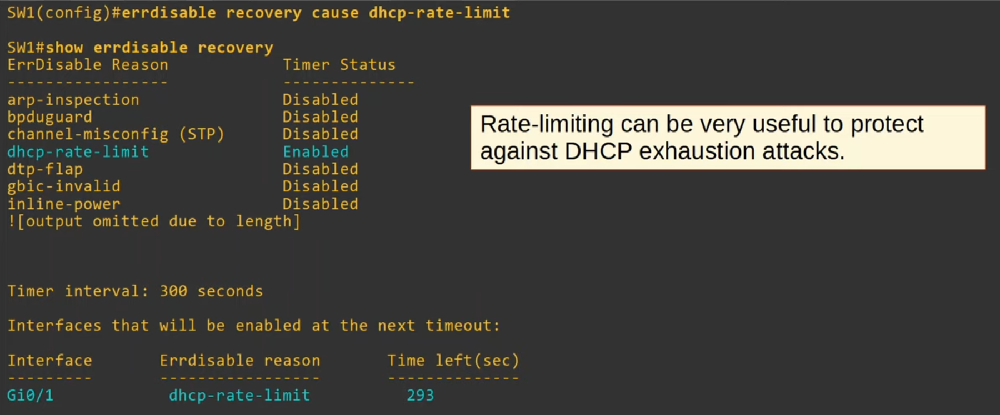

## DHCP Option 82 (Information Option)

- **Option 82**, also known as the **DHCP relay agent information option** is one of many DHCP options.
- It **provides additional information about which DHCP relay agent received the client's message, on which interface, in which VLAN, etc**.
- DHCP relay agents can add Option 82 to messages they forward to the remote DHCP Server.
- With DHCP snooping enabled, by **default Cisco switches will add Option 82 to DHCP messages they receive from clients**, **even if the switch isn't acting as a DHCP relay agent**.
- By default, **Cisco switches will drop DHCP messages with Option 82** that are **received on an untrusted port**.

    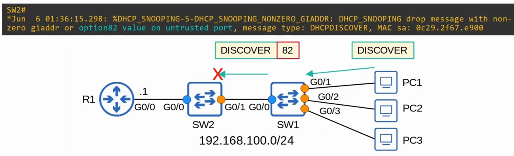

    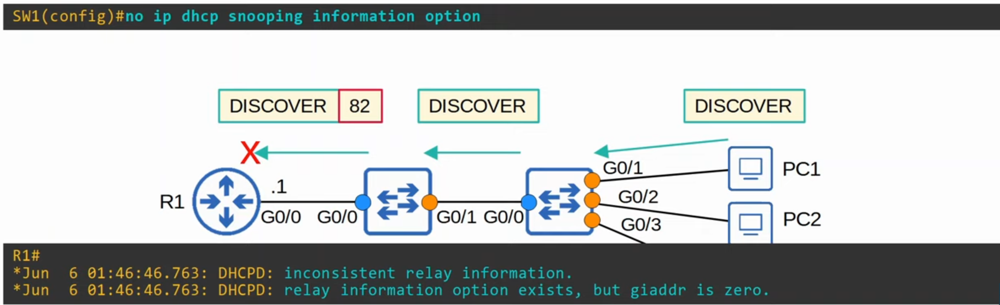

- If it wasn't sent by a relay agent it shouldn't have option 82

    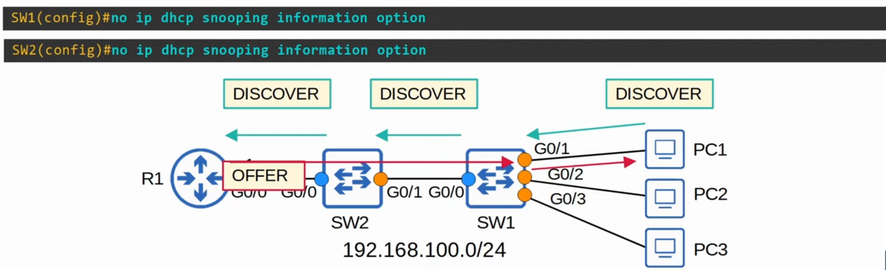

## Commands - Review

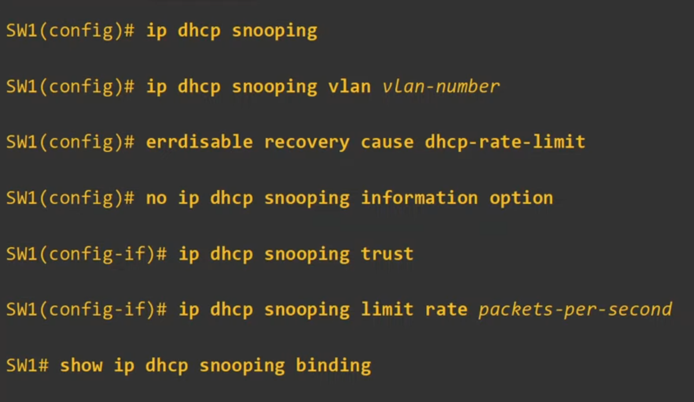