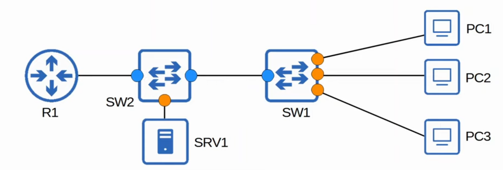
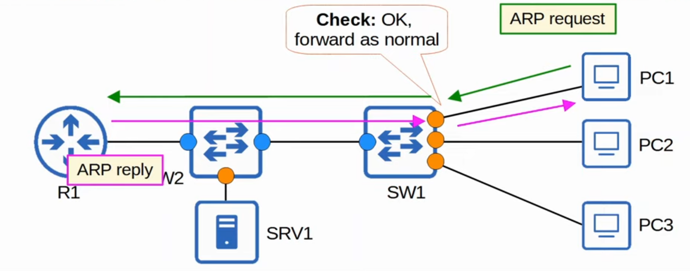
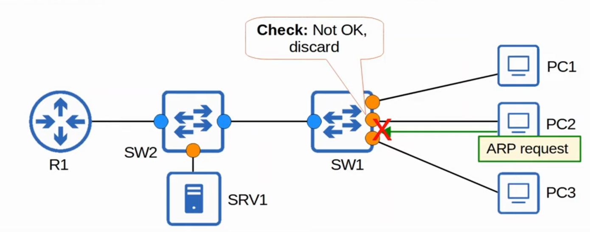
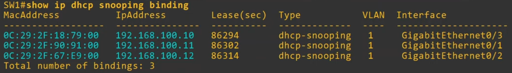
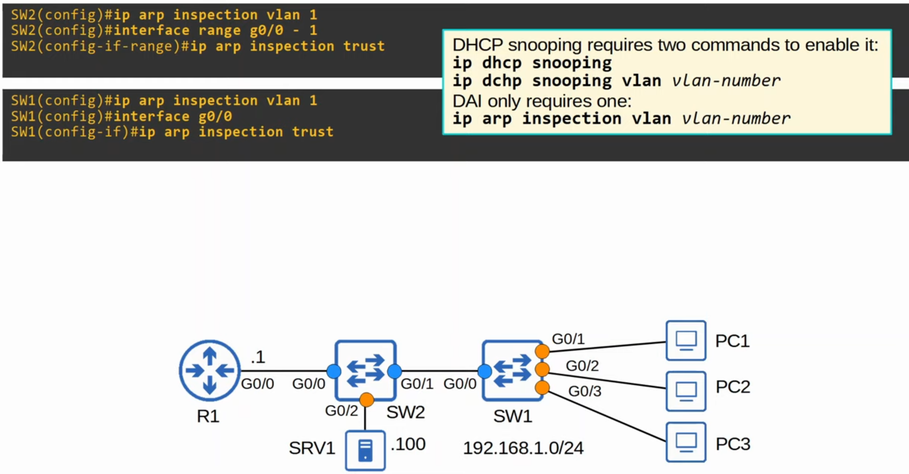
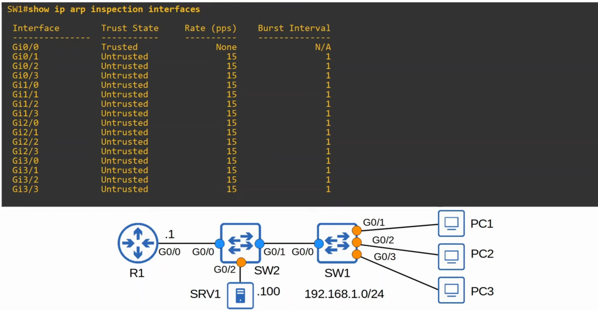
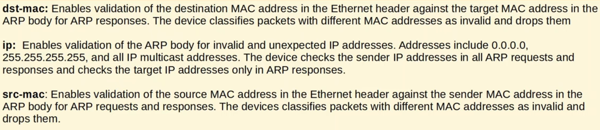
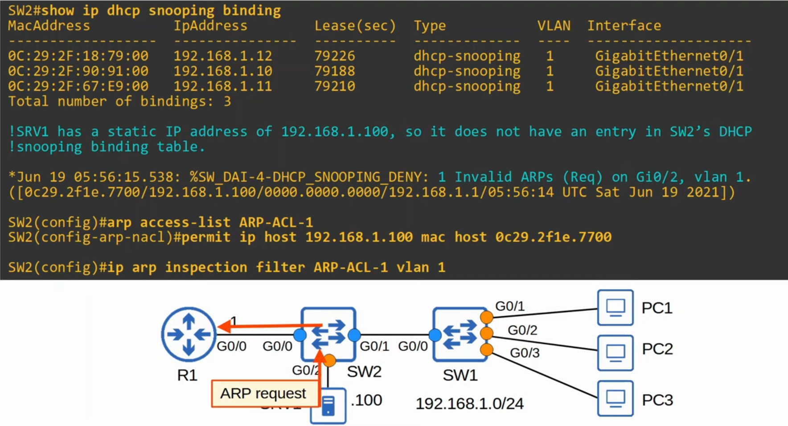
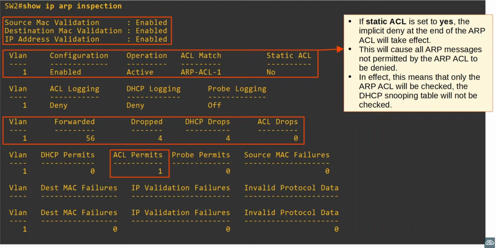
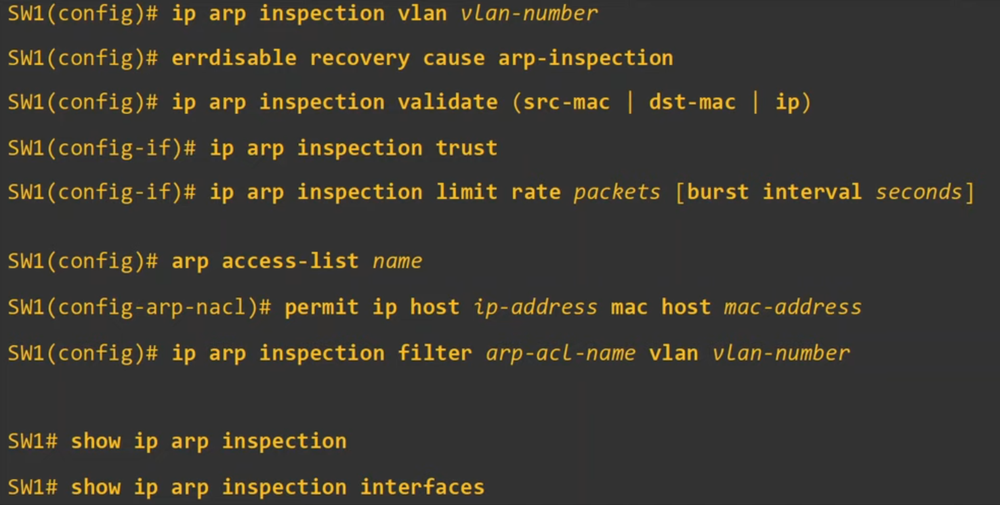

# Day 51 - Dynamic Arp Inspection

- DAI is a **security feature of switches** that is **used to filter ARP messages received on untrusted  ports**.

- DAI **only filters ARP messages**. Non-ARP messages aren't affected.

- **All ports are untrusted by default**.
    - Typically, all **ports connected to other network devices** (switches, routers) should be configured as **trust**, while **interfaces connected to end hosts** should remain **untrusted**.

    

#### DAI - Example 1

#### DAI - Example 2

## ARP Poisoning (Man-in-the-Middle)

- Similar to DHCP Poisoning, ARP Poisoning involves an **attacker manipulating target's ARP tables so traffic is sent to the attacker**.
- To do this, the **attacker can send gratuitous ARP messages using another device's IP address**.
- Other devices in ht network will receive the GARP and update their ARP tables, causing them to send traffic to the attacker instead of to the legitimate destination.

## Dynamic ARP Inspection Operations (DAI)

- DAI inspectes the **sender MAC** and the **sender IP** fields of ARP messages received on untrusted ports and checks if there is a matching entry in the DHCP snooping binding table.
    - **If** there is a **matching entry**, the **ARP message is forwarded normally**.
    - **If** there isn't a **matching entry**, the **ARP message is discarded**.
    

- **DAI doesn't inspect messages received on trusted ports**. They are forwarded as normally.
- **ARP ACLs** can be manually configured to **map IP addresses/MAC addresses for DAI to check**.
    - Useful for hosts that don't use DHCP.
- DAI can be configured to perform more in-depth checks, but these are optional
- Like DHCP snooping, **DAI also supports rate-limiting** to prevent attackers from overwhelming the switch with ARP messages.
    - DHCP snooping and DAI both require work from the switch's CPU.
    - Even if the attacker's messages are blocked, they can overload the switch CPU with ARP messages.

## DAI Configuration

### `show ip arp inspection interfaces`

- DAI rate limiting is enabled on untrusted ports by **default** with a **rate limit** of **15 packets per second**.
- It is **disabled on trusted ports by default**.
    - (*) DHCP snooping rate limiting is disabled on all interfaces by default

- DHCP snooping rate limiting is configured like this:
    - `x packets per second`
- The **DAI burst interval** allows you to configure rate limiting like this:
    - **`x packets per y seocnds`**

### DAI Rate Limiting

- **`ip arp inspection limit rate <rate-limit> burst interval <burst-interval>`**
    - (e.g. ip arp inspection limit rate 25 burst interval 2)

- The **burst interval is optional**. If you don't specify it, the **default is 1 second**.
- **If ARP messages are received faster than the specified rate**, the **interface will be err-disabled**. It can be re-enabled in two ways:
    1) `shutdown` and `no shutdown`
    2) `errdisable recovery cause arp-inspection`

### DAI Optional Checks

- **`SW1(config)# ip arp inspection validate {src-mac | dst-mac | ip}`**

    

- **You must enter all of the validation checks you want in a single command**. The order isn't signification and you can specify either one, two or three.

### ARP ACLs

#### `show ip arp inspection`

## Command Review

