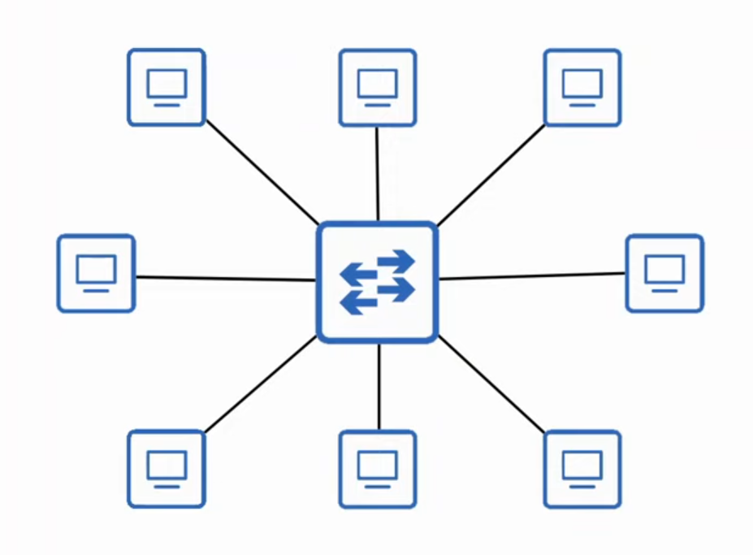
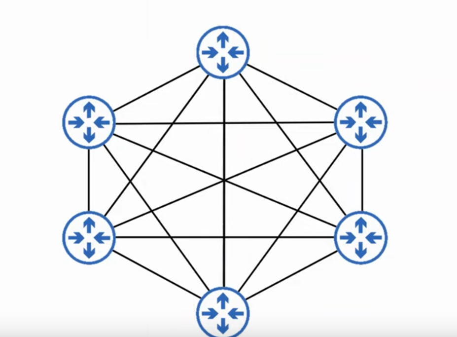
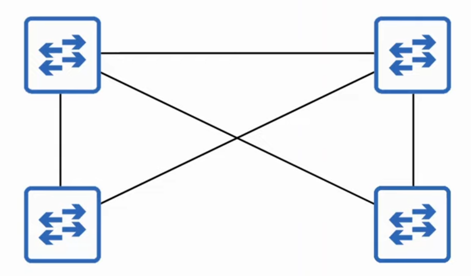
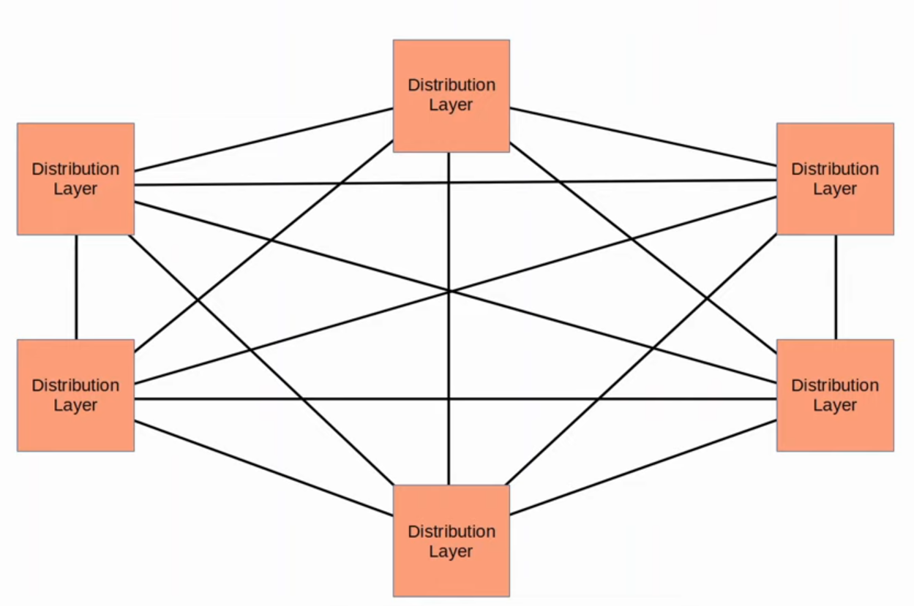
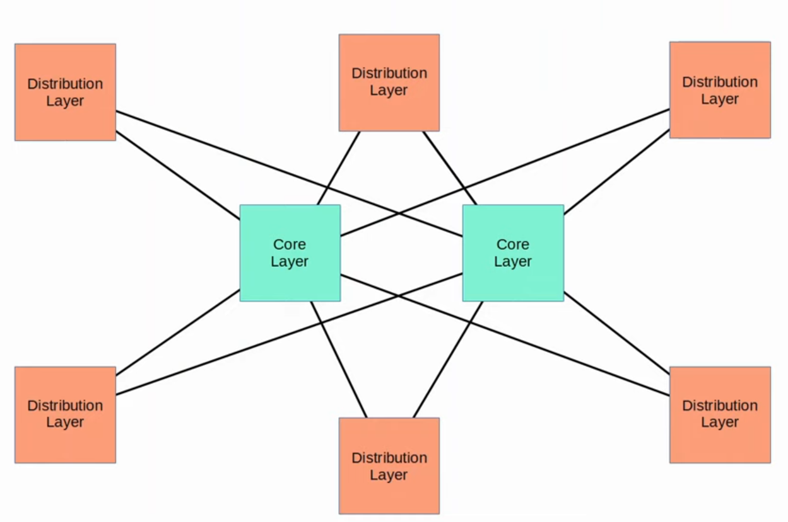
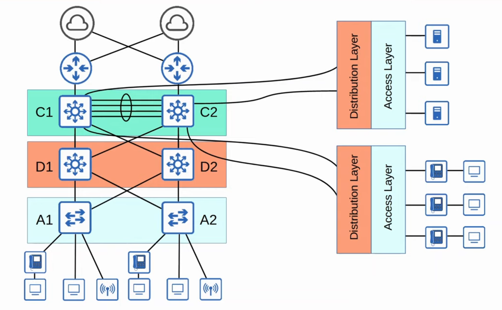
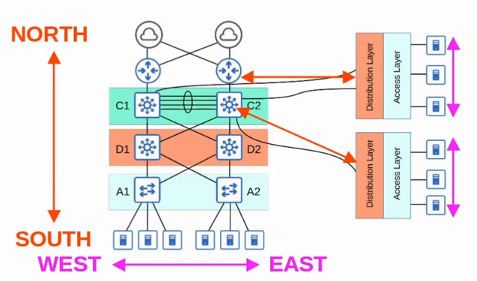
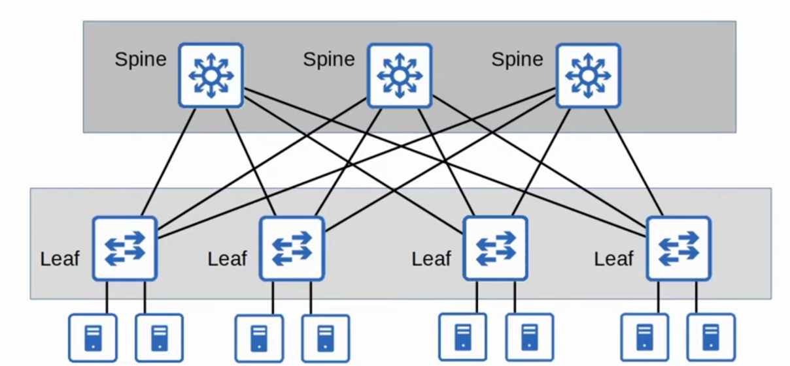
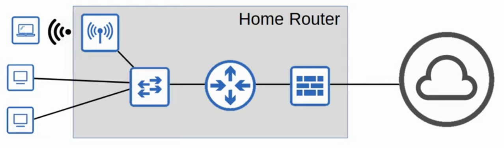

# Day 52 - LAN Architectures

- There are **standard best practices** for network design.
    - However there are few universal correct answers.
    - The answer to most general questions about network design is "it depends".

## Common Terminology

### Star

- **Start:** When **several devices** all **connect** **to one central device** we can draw them in a star shape like below, so this is often called a start topology.

    

### Full Mesh

- **Partial Mesh:** When each device is connected to each other device.

    

### Partial Mesh

- **Full Mesh:** When some devices are connected to each other, but not all.
    

## Two-Tier Campus LAN Design

- The two-tier LAN design consists of **two hierarchical layers**:
    - **Access Layer**
    - **Distribution Layer**

- Also called a 'Collapsed Core' design because it omits a layer that is found in the Three Tier design: the **Core Layer**

- **Access Layer**
    - the layer that end hosts connect to (PCs, printers, cameras, etc.)
    - typically Access Layer Switches have lots of ports for end hosts to connect to.
    - QoS marking is typically done here.
    - Security services like port security, DAI, etc. are typically performed here.
    - Switchports might be PoE-enabled for wireless APs, IP phones, etc.

- **Distribution Layer**
    - aggregates connections from the Access Layer Switches.
    - typically is the border between Layer 2 and Layer 3.
    - connects to services such as Internet, WAN, etc.

- **Note:** In a collapsed core design, the Distribution Layer is sometimes called the Core-Distribution Layer.
- Connections between Distribution Switches are Layer 3. Routing information can be shared via OSPF, for example.

---

- In large LAN networks with many Distribution Layer switches (e.g. in separate buildings), the number of connection required between Distribution Layer switches grow rapidly.

    

- To help **scale large LAN networks**, you can **add a Core Layer**.
    - Cisco recomends adding a Core Layer if there are more than three Distribution Layers in a single location.

    

## Three-Tier Campus LAN Design

- Thre three-tier LAN design consists of **three hierarchical layers**:
    - **Access Layer**
    - **Distribution Layer**
    - **Core Layer**

- **Core Layer:**
    - Connects Distribution Layers together in large LAN networks.
    - The **focus is speed** ('fast transport')
    - **CPU-intensive operations** such as security, QoS marking/classification, etc. **should be avoided at this layer**.
    - Connections are all Layer 3. No **spanning-tree**!
    - Should maintain connectivity throughout the LAN even if the device fails.

## Two/Three-tier LAN Designs - Review

- **Access Layer**
    - The layer that end hosts connect to (PCs, printers, scanners, cameras, etc.)
    - Typicaly Access Layer Switches have lots of ports for end hosts to connect to.
    - QoS marking is typically done here.
    - Security services like port security, DAI, etc. are typically performed here.
    - Switchports might be PoE-enabled for wireless APs, IP phones, etc.

- **Distribution Layer (aka Aggregation Layer)**
    - Aggregates connections from the Access Layer Switches.
    - Typically is the border between Layer 2 and 3 Switches.
    - Connects to services such as Internet, WAN, etc. (in a two-tier design)

- **Core Layer**
    - Connects Distribution Layers together in large LAN networks.
    - The focus is speed ('fast transport')
    - CPU-intensive operations such as security, QoS marking/classification, etc. should be avoided at this Layer.
    - Connections are all Layer 3. No spanning-tree!
    - Should maintain connectivity throughout the LAN even if devices fail.

## Spine-Leaf Architectures

- Data Centers are dedicated spaces/buildings used to store computer systems such as servers and network devices.
- **Traditional data center designs used a three-tier architecture** (Access-Distribution-Core) like we just covered.
- This worked well when most traffic in the data center was North-South.
    
- The traditional three-tier architecture led to bottlenecks in bandwidth as well as variability in the server-to-server latency depending on the path the traffic takes.
- **To solve this, Spine-Leaf architecture** (aka Clos Architecutre) **has become prominent in data centers**.

### Basic Rules

- There are some rules about Spine-Leaf architecture:
    - Every Leaf switch is connected to every Spine switch.
    - Every Spine switch is connected to every Leaf switch.
    - Leaf switches do not connect to other Leaf switches.
    - Spine switches do not connect to other Spine switches.
    - End hosts (servers etc.) only connect to Leaf switches.
- The path taken by traffic is randomly chosen to balance the traffic load among the Spine switches.
- Each server is separated by the same number of 'hops' (except those connected to the same Leaf), providing consistent latency for East-West traffic.
    

## SOHO Networks

- **Small Office/Home Office (SOHO)** refers to the **office of a small company, or a small home office with few devices**.
    - Doesn't have to be an actual home office, if your home has a network connected to the Internet it is considered a SOHO network.

- SOHO networks don't have a complex needs, so all networking functions are typically provided by a single device, often called a 'home router' or 'wireless router'.

- This one device can serve as a:
    - Router
    - Switch
    - Firewall
    - Wireless Access Point
    - Modem

    