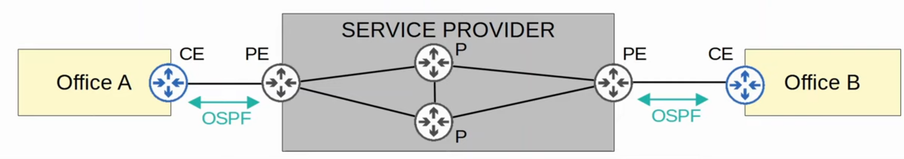
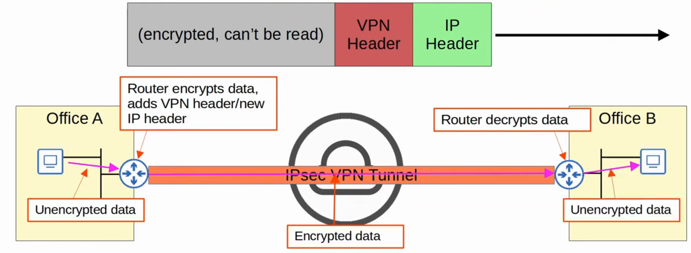

# Day 53 - WAN Architecture

- WAN stands for **Wide Area Network**.
- A WAN is a **network that extends over a large geographic area**.
- WANs are used to connect geographically separate LANs.
- Although the Internet itself can be considered a WAN, the term **WAN is typically used to refer to an enterprise's private connections that connect their office, data centers, and other sites together**.
- Over public/shared networks like the Internet, **VPNs (Virtual Private Networks) can be used create private WAN connections**.
- There have been many WAN technologies over the years. Depending on the location, some will be available and some will not be.
- Technologies which are considered 'legacy' (old) in one country might still be used in other countries.

## Leased Lines

- A **leased line** is a dedicated physical link, typically connecting two sites.
- Leased lines use serial connections (PPP or HDLC encapsulation).
- There are various standards that provide different speeds and different standards are available in different countries.
- Due to higher cost, higher installation lead time, and slower speeds of leased lines, Ethernet WAN technologies are becoming more popular

## MPLS

- **MPLS** stands for **'Multi Protocol Label Switching'**.
- Similar to the Internet, service providers' MPLS networks are **shared infrastructure** because **many customer enterprises connect to and share the same infrastructure** to make WAN connections.
- However, the *label switching* in the name of MPLS **allows VPNs to be created** over the MPLS infrastructure **through the use of labels**.
Some important **terms**:
    - **CE router** = **Customer Edge Router**
    - **PE router** = **Provider Edge Router**
    - **P router** = **Provider core Router**
- **When** the **PE router receives frames from the CE routers**, they **add a label to the frame**.
- These **labels are used to make forwarding decisions within the service provider network**, not the destination IP.

- The **CE routers do not use MPLS**, it is only **used by the PE/P routers**.
- When using a **Layer 3 MPLS VPN**, the the CE and PE routers peer using OSPF, for example, to share routing information.
- For example, in the diagram, Office A's CE will peer with one PE, and Office B's CE will peer with the other PE.
- Office A's CE will learn about Office B's routes via this OSPF peering, and Office B's CE will learn about Office A's routes too.

- When using a **Layer 2 MPLS VPN**, the CE and PE routers do not form peerings.
- The **service provider network** is **entirely transparent to the CE routers**.
- In effect, **it is like the two CE routers are directly connected**.
    - Their **WAN interfaces** will be **in the same subnet**.
- **If a routing protocol is used**, **the two CE routers will peer directly with each other**.

- Many **different technologies can be used to connect to a service provider's MPLS network for WAN service**.

## Internet Connections

- There are countless ways for an enterprise to connect to the Internet.
- For example, private WAN technologies such as leased lines and MPLS VPNs can be used to connect to a service provider's Internet infrastructure.
- In addition, technologies such as CATV and DSL commonly used by consumers (home Internet access) can also be used by an Enterprise.
- These days, for both enterprise and consumer Internet access, fiber optic Ethernet connections are growing in popularity due to the high speeds they provide over long distances.

### Digital Subscriber Line (DSL)

- **DSL provides Internet connectivity to customers over phone lines**, and can **share the same phone line that is already installed in most homes**.
- A DSL modem (modulator-demodulador) is required to convert data into a format suitable to be sent over the phone lines.
    - The modem might be a separate device, or it might be incorporated into the 'home router'.

### Cable Internet

- Cable Internet provides Internet access via the same CATV (Cable Television) lines used for TV service.

- Like DSL, a cable modem is required to convert data into a format suitable to be sent over the CATV cables.
    - Like a DSL modem, this can be a separate device or built into the home router.

## Redundant Internet Connections

## Internet VPNs

- Private WAN services such as leased lines and MPLS provide security because each customer's traffic is separated by using dedicated physicial connections (leased line) or by MPLS tags.
- When using the Internet as a WAN to connect sites together, there is no built-in security by default.
- To provide secure communications over the Internet, VPNs (Virtual Private Networks) are used.

### Site-to-Site VPNs (IPSec)
- A 'site-to-site' VPN is a **VPN between two devices** and is **used to connect two sites together** over the Internet.
- A VPN 'tunnel' is created between the two devices by encapsulating the original IP packet with a VPN header and a new IP header.
    - When using IPsec, the original packet is encrypted before being encapsulated with the new header.

- Let's summarize this process:
    1) The sending device combines the original packet and session key (encryption key) and runs them through an encryption formula.
    2) The sending device encapsulates the encrypted packet with a VPN header and a new IP header.
    3) The sending device sends the new packet to the device on the other side of the tunnel.
    4) The receiving device decrypts the data to get the original packet, and then forwards the original packet to its destination.

- In a 'site-to-site' VPN, a **tunnel is formed only between two tunnel endpoints** (e.g. the two routers connected to the Internet).

- All **other devices in each site don't need to create a VPN for themselves**. They can send unencrypted data to their site's router, which will encrypt it and forward it in the tunnel as described above.

#### Limitations to standard IPSec:

1) IPsec **doesn't support broadcast and multicast traffic**. This means that routing protocols such as OSPF can't be used over the tunnels because they rely on multicast traffic.
    - This **can be solved with 'GRE over IPSec'**
2) Configuring a full mesh of tunnels between many sites is a **labor-intensive task**.
    - This **can be solved with Cisco's DMVPN**.

### GRE over IPSec

- **GRE (Generic Routing Encapsulation)** **creates tunnels like IPSec**, however it **does not encrypt the original packet**, so it is **not secure**.
- However, it has the advantage of being **able to encapsulate a wide variety of Layer 3 protocols as well as broadcast and multicast messages**.
- To get the **flexibility of GRE with the security of IPSec**, **'GRE over IPSec'** can be used.
- The **original packet will be encapsulated by a GRE header and a new IP header,** and then the **GRE packet will be encrypted and encapsulated within an IPSec VPN headerand a new IP heder**

### DMVPN

- **DMVPN (Dynamic Multipoint VPN)** is a Cisco-developed solution that **allows routers to dynamically create a full mesh of IPsec tunnels** **without having to manually configure every single tunnel**.

    

- DMVPN provides the **configuration simplicity of hub-and-spoke** (each spoke router only needs one tunnel configured) and the **efficiency of direct spoke-to-spoke communication** (spoke routers can communicate directly without traffic passing through the hub).

### Remote-Access VPNs (TLS)

- Whereas site-to-site VPNs are used to make a point-to-point connection between two sites over the Internet, **remote-access VPNs are used to allow** end devices (PCs, mobile phones, etc.) to **access the company's internal resources securely over the Internet**.
- **Remote-access VPNs typically use TLS (Transport Security Layer)**
    - **TLS** is also what **provides security for HTTPS (HTTP Secure)**
    - **TLS** was **formerly known as SSL (Secure Sockets Layer)** and developed by Netscape, but it was renamed to TLS when it was standardized by the IETF.
- VPN client software (e.g. Cisco AnyConnect) is installed on end devices (e.g. company provided laptops that employees use to work from home).
- These **end devices** then **form secure tunnels to one of the company's routers/firewalls acting as a TLS server**.
- This allows the end users to securely access resources on the company's internal network without being directly connected to the company network.

## Site-to-Site vs Remote-Access VPN

- **Site-to-Site** VPNs typically use IPSec.
- **Remote-Access** VPNs typically use TLS.

 

- **Site-to-Site** VPNs provide service to many devices within the sites they are connecting.
- **Remote-Access** VPNs provide service to the one end device the VPN client software is installed on.

 

- **Site-to-Site** VPNs are typically used to permanently connect two sites over the Internet.
- **Remote-Access** VPNs are typically used to provide on-demand access for end devices that want to securely access company resource while connected to a network which is not secure.