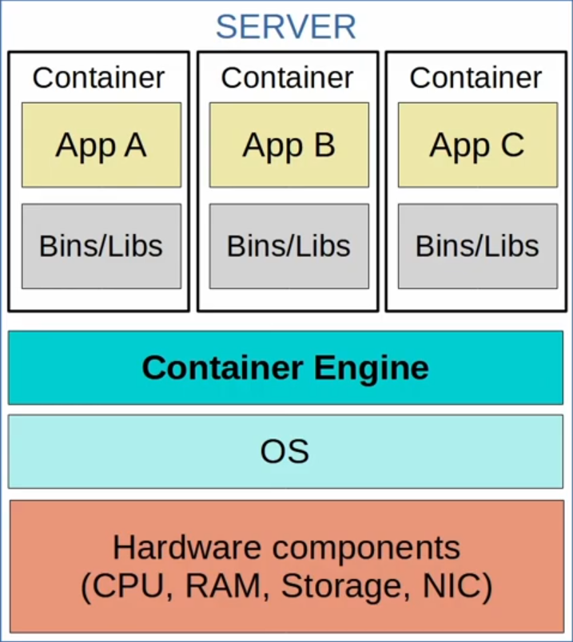

# Day 54 - Containers

## Virtual Machines - Review

- **Virtual Machines (VMs)** allow multiple OS's to run on a single physical server.
- A **Hypervisor** is used to manage and allocate hardware resources to each VM.
    - **Type 1** Hypervisors (aka **Native** or **Bare-metal**) run directly on top of hardware.
    - **Type 2** Hypervisors (aka **Hosted**) run on top of a Host OS (ie. Windows)

- **Type 1** Hypervisors are widely used in data center environments.
- **Type 2** Hypervisors are commonly used on personal devices.
    - ie. running a virtual network lab on your PC using Cisco Modeling Labs (CML).
- The OS in each VM can be the same or different (Windows, Linux, macOS, etc.)
- Bins/Lins are the software libraries/services needed by the Apps running in each VM.
- A VM allows its app/apps to run in an isolated environment, separate from the apps in other VMs.
- VMs are easy to create, delete, move, etc.
    - A VM can be easily saved and moved between different physical servers.

    

## Containers 

- **Containers** are software packages that contain an App and all dependencies (Bins/Libs in the diagram) for the contained App to run.
    - Multiple Apps can be run in a single container, but this is not this is not how containers are ususally used.
- Containers run on a **Container Engine** (ie. Docker Engine)
    - The container engine is run on a host OS (usually Linux)
- Containers are lightweight (small in size) and include only the dependencies required to run the specific App.
- A **Container Orchestrator** is a software platform for automating deployment, amanagement, scaling etc. of containers.
    - **Kubernetes** (originally designed by Google) is the most popular container orchestrator.
    - **Docker Swarm** is Docker's container orchestration tool.
- In small numbers manual operation is possible, but large-scale systems (ie. with Microservices) can require thousands of containers.

- Microservice Architecture is an approach to software architecture that divides a larger solution into smaller sparts (microservices).
    - Those microservices all run in containers that can be orchestrated by kubernetes (or another platform)

    

## VMs vs Containers

- **VMs** can take minutes to boot up as each VM runs its own OS.
- **Containers** can boot up in milliseconds.

 

- **VMs** take up more disk space (gigabytes).
- **Containers** take up very little disk space.

 

- **VMs** use more CPU/RAM resources (each VM must run its own OS)
- **Containers** use much fewer CPU/RAM resources (shared OS)

 

- **VMs** are portable and can move between physical systems running the same hypervisor.
- **Containers** are more portable; they are smaller, faster to boot up, and Docker containers can be run on nearly any container service.

 

- **VMs** are more isolated because each VM runs its own OS.
- **Containers** are less isolated because they all run on the same OS; if the OS crashes, all containers running on it are affected.

 

- There is a major movement towards the use of containers, especially with the rise of microservices, automation and DevOps (the combination of Software Development and IT Operations), but VMs are still widely used today.