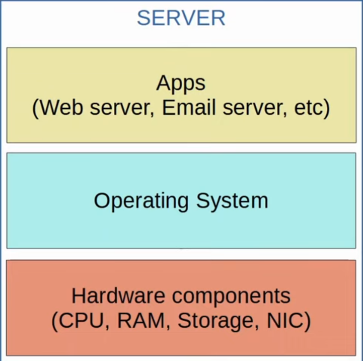
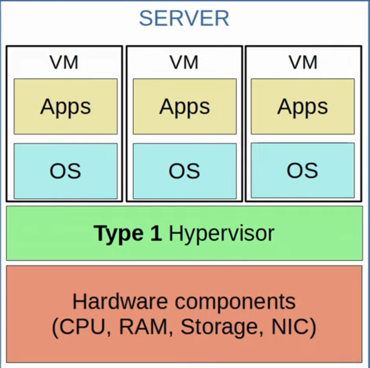
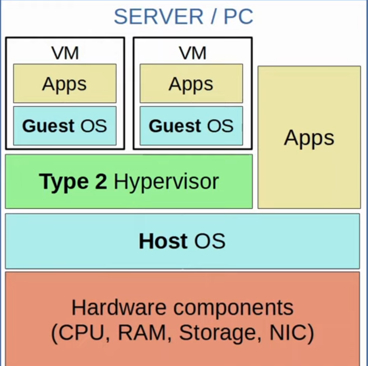
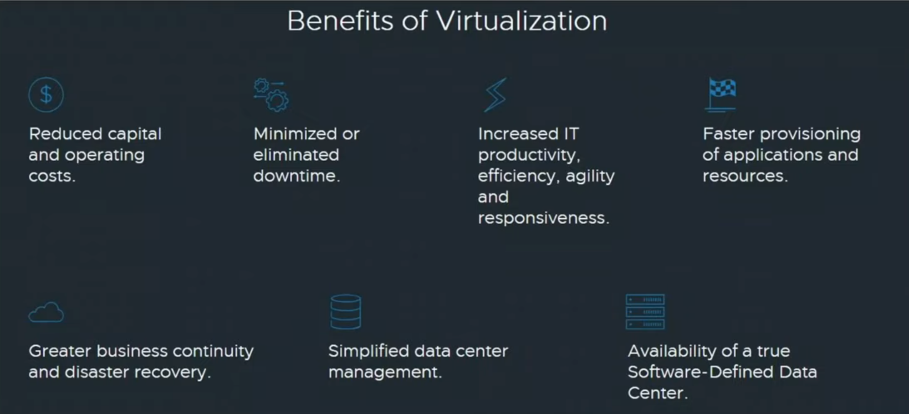
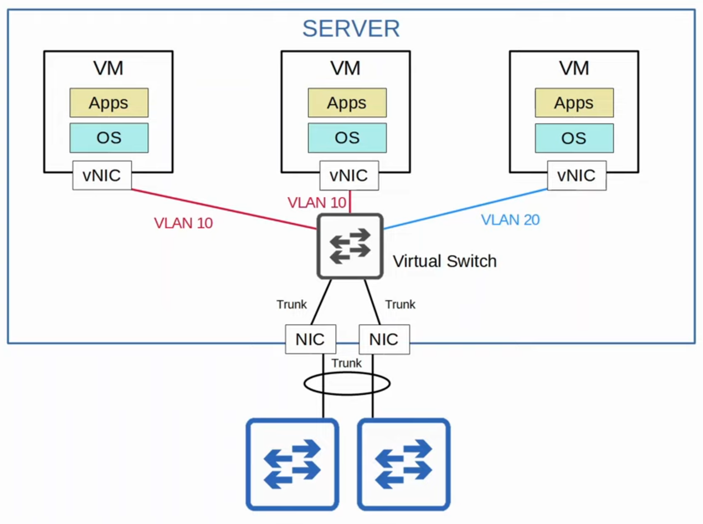
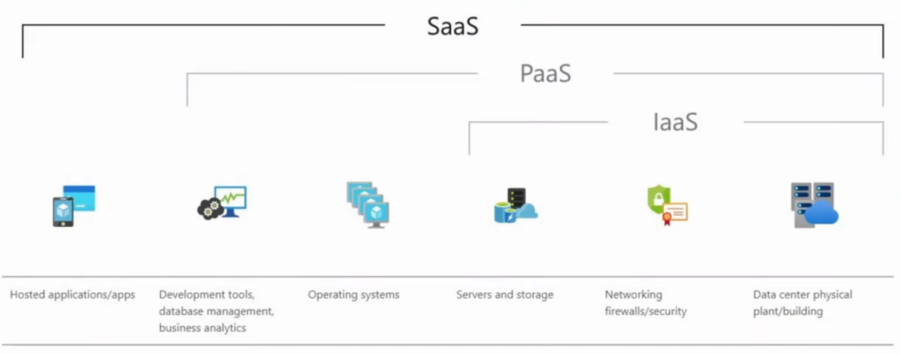
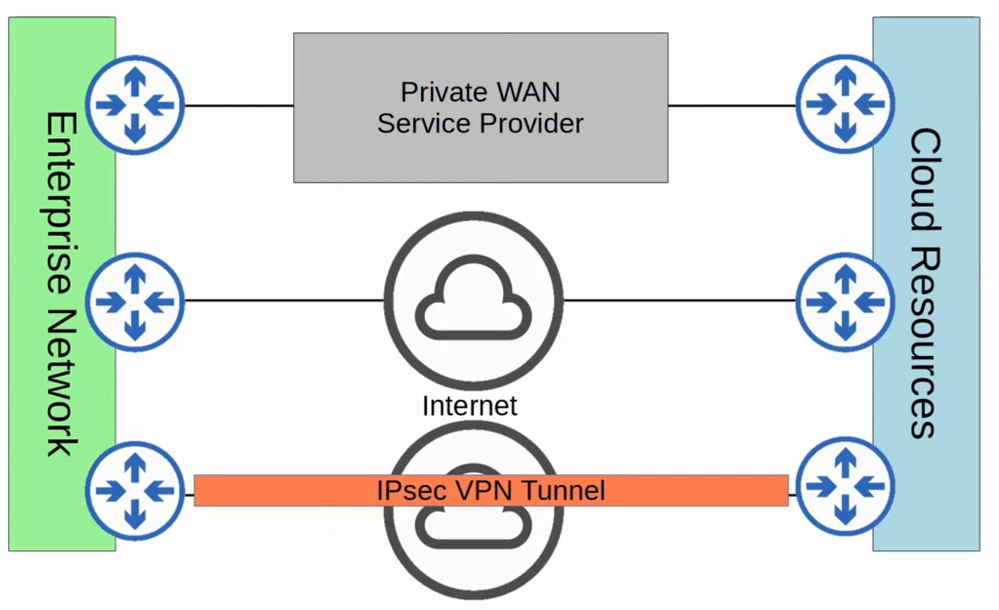

# Day 54 - Virtualization & Cloud

## Servers before Virtualization

- **Before virtualization** there was a **one-to-one relationship between a physical server and an Operating System**.
- In that OS, apps providing services such as a web server, email server, etc. would run.
- One physical server would be used for the web server, one for the email server, one for the DB server, etc.
- This is **inefficient** for multiple reasons:
    - Each physical server is **expensive and takes up space**, **power, etc**.
    - The **resources** on each physical server (CPU, RAM, Storage, NIC) are typically **under-used**.

    

## Virtualization (Type 1 Hypervisor)

- Virtualization allows us to break the one-to-one relationships of hardware to OS, allowing multiple OS's to run on a single physical server.
- Each instance is called a **VM (Virtual Machine)**.
- A **hypervisor** is used to **manage and allocate the hardware resources** (CPU, RAM, etc.) to each VM.
    - Another Name for a hypervisor is **VMM (Virtual Machine Monitor)**.
- The type of **hypervisor which runs directly on top of the hardware** is called a **Type 1 hypervisor** (e.g. VMware ESXi, Microsoft Hyper-V, etc.).
- **Type 1 Hypervisors** are **also called bare-metal** hypervisors because **they run directly on the hardware**.
- This is the type of hypervisor used in a data center environment.
    


## Virtualization (Type 2 Hypervisor)

- **Type 2 hypervisors run as a program on an OS like a regular computer program** (e.g. VMware Workstation, Oracle VirtualBox, etc.)
- The ***OS running directly on the hardware is called the Host OS**, and the **OS running in a VM is called a Guest OS**.
- **Another name** for a Type 2 hypervisor **is hosted hypervisor**.
- Although Type 2 hypervisor are rarely used in data center environments, they are **more common on personal-use devices**.
    

## Why Virtualization?

- **Partitioning**
    - Run **multiple operating systems on one physical machine**.
    - **Divide** system **resources** **between virtual machines**.

- **Isolation**
    - Provide **fault and security isolation at the hardware level**.
    - **Preserve performance** with **advanced resource controls**.

- **Encapsulation**
    - **Save the entire state** of a virtual machine **to files**.
    - **Move and copy virtual machines** as easily as moving and copying files.

- **Hardware Independence**
    - **Provision or migrate any virtal machine** **to any physical server**.

    

## Connecting VMs to the Network

- **VMs are connected to each other** **and** the **external network** **via** a **virtual switch running on the hypervisor**.
- Just like a regular physical switch, the **vSwitch's interfaces can operate as access or trunk ports and use VLANs to separate VMs at Layer 2**.
- **Interfaces on the vSwitch connect to the physical NIC** (or NICs) **of the server to communicate with the external network**.



## Cloud Services

- Traditional IT infra deployment were some combination:

- **On-Premises**
    - All servers, networks and other infra are located on company property.
    - All equipment is purchased and owned by the company using it.
    - The company is responsible for the necessary space, power and cooling.

- **Colocation**
    - Data centers that rent out space for customers to put their infra (servers, network devices, etc.)
    - The data center provides the space, eletricity and cooling.
    - The servers, network devices, etc. are still the responsibility of the end customer, although they are not located on the customer's premises.

- The American NIST (National Institute of Standards and Technology) defined cloud computing in [SP (Special Publication) 800-145](https://csrc.nist.gov/publications/detail/sp/800-145/final)
    ```
    "Cloud computing is a model for enabling ubiquitous, convenient, on-demand network access to a shared pool of configurable computing resources (e.g. networks, servers, storage, etc.) that can be rapidly provisioned and released with minimal management effort or service provider interaction. This cloud model is composed of fiove essential characteristics, three service models, and four deployment models."
    ```

## 5 Essential Characteristics

- **On-demand self-service**
- **Broad network access**
- **Resource pooling**
- **Rapid elasticity**
- **Measured service**

### On-demand self-service
- **"A consumer can unilaterally provision computing capabilities, such as server time and network storage, as needed automatically without requiring human interaction with each service provider."**


### Broad network access
- **"Capabilities are available over the network and accessed through standard mechanisms that promote use by heterogeneous thin or thick client platforms (e.g., mobile phones, tablets, laptops, and workstations)."**

### Resource pooling
- **"The provider’s computing resources are pooled to serve multiple consumers using a multi-tenant model, with different physical and virtual resources dynamically assigned and reassigned according to consumer demand. There is a sense of location independence in that the customer generally has no control or knowledge over the exact location of the provided resources but may be able to specify location at a higher level of abstraction (e.g., country, state, or datacenter). Examples of resources include storage, processing, memory, and network bandwidth."**

### Rapid elasticity
- **"Capabilities can be elastically provisioned and released, in some cases automatically, to scale rapidly outward and inward commensurate with demand. To the consumer, the capabilities available for provisioning often appear to be unlimited and can be appropriated in any quantity at any time."**


### Measured service
- **"Cloud systems automatically control and optimize resource use by leveraging a metering capability at some level of abstraction appropriate to the type of service (e.g., storage, processing, bandwidth, and active user accounts). Resource usage can be monitored, controlled, and reported, providing transparency for both the provider and consumer of the utilized service"**

## 3 Service Models



### Software as a Service (SaaS)
- **"The capability provided to the consumer is to use the provider’s applications running on a cloud infrastructure. The applications are accessible from various client devices through either a thin client interface, such as a web browser (e.g., web-based email), or a program interface. The consumer does not manage or control the underlying cloud infrastructure including network, servers, operating systems, storage, or even individual application capabilities, with the possible exception of limited user-specific application configuration settings."**

- **e.g.** Microsoft 365, Google G Suite.


### Platform as a Service (PaaS)
- **"The capability provided to the consumer is to deploy onto the cloud infrastructure consumer-created or acquired applications created using programming languages, libraries, services, and tools supported by the provider. The consumer does not manage or control the underlying cloud infrastructure including network, servers, operating systems, or storage, but has control over the deployed applications and possibly configuration settings for the application-hosting environment."**

- **e.g.** AWS Lambda, Google App Engine.


### Infrastructure as a Service (IaaS)
- **"The capability provided to the consumer is to provision processing, storage, networks, and other fundamental computing resources where the consumer is able to deploy and run arbitrary software, which can include operating systems and applications. The consumer does not manage or control the underlying cloud infrastructure but has control over operating systems, storage, and deployed applications; and possibly limited control of select networking components (e.g., host firewalls)."**

- **e.g.** Amazon EC2, Google Compute Engine.

## 4 Deployment Models

### Private Cloud
- **"The cloud infrastructure is provisioned for exclusive use by a single organization comprising multiple consumers (e.g., business units). It may be owned, managed, and operated by the organization, a third party, or some combination of them, and it may exist on or off premises."**

### Community Cloud
- **"The cloud infrastructure is provisioned for exclusive use by a specific community of consumers from organizations that have shared concerns (e.g., mission, security requirements, policy, and compliance considerations). It may be owned, managed, and operated by one or more of the organizations in the community, a third party, or some combination of them, and it may exist on or off premises."**

### Public Cloud
- **"The cloud infrastructure is provisioned for open use by the general public. It may be owned, managed, and operated by a business, academic, or government organization, or some combination of them. It exists on the premises of the cloud provider."**

### Hybrid Cloud
- **"The cloud infrastructure is a composition of two or more distinct cloud infrastructures (private, community, or public) that remain unique entities, but are bound together by standardized or proprietary technology that enables data and application portability (e.g., cloud bursting for load balancing between clouds)."**


## Benefits of Cloud Computing

- **Cost**
    - CapEx (Capital Exchanges) of buying hardware and software, setting up data centers, etc. are reduced and or eliminated.
- **Global Scale**
    - Cloud Services can scale globally at a rapid pace. Services can be set up and offered to customers from a geographic location close to them.
- **Speed/Agility**
    - Services are provided on demand, and vast amounts of resources can be provisioned within minutes.
- **Productivity**
    - Cloud services remove the need for many time-consuming tasks such as procuring physical servers, racking them, cabling, installing and updating operating systems, etc.
- **Reliability**
    - Backups in the cloud are very easy to perform. Data can be mirrored at multiple sites in different geographic locations to support disaster recovery.

## Connecting to the Cloud Resources

