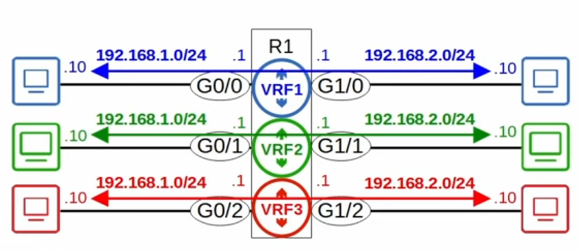

# Day 54 - VRF

- **Virtual Routing & Forwarding** is used to divide a single router into multiple virtual routers.
    - Similar to how VLANs are used to divide a single switch (LAN) into multiple virtual switches (VLANs)
- It does this by **allowing a router to build multiple separate routing tables**.
    - Interfaces (Layer 3 only) & routes are configured to be in a specific VRF (aka VRF Instance)
    - Router interfaces, SVIs & routed ports on multilayer switches can be configured in a VRF.

- Traffic in one VRF cannot be forwarded out of an interface in another VRF.
    - As an exception, *VRF Leaking* can be configured to allow traffic to pass between VRF's.

- **VRF** is commonly **used to facilitate MPLS**.
    - The kind of VRF we are talking about is **VRF-lite** (**VRF without MPLS**).

- VRF is **commonly used by service providers** to **allow one device to carry traffic from multiple customers**.
    - Each **customer's traffic is isolated** from the others.
    - **Customer IP addresses can overlap** without issues.

## VRF Configuration

- **Note:** `show ip route` displays the global routing table.
    - All of SPR1's interfaces are configured in VRFs, so nothing displays here.
    - You can have a mix of interfaces using and not using VRFs.

- To display the vrf routing table you must use the command **`show ip route vrf <VRF_NAME>`**.

- You can specify the device to ping with **`ping vrf <VRF_NAME> <ip_addr>`**

