# Day 55 - Wireless Fundamentals

## Wireless Networks

-   The **standards** we use **for wireless LANs** are defined in **IEEE 802.11**.
-   The term **Wi-Fi is a trademark of the Wi-Fi Alliance**, not directly connected to the IEEE.
-   The Wi-Fi Alliance tests and certifies equipment for 802.11 standards compliance interoperability with other devices.
-   However, Wi-Fi has become the common term that people use to refer to 802.11 wireless LANs.

-   Wireless networks have some issues that we need to deal with:
    1. All devices within range receive all frames, like devices connected to an Ethernet Hub.
        - **Privacy of data** within the LAN **is a greater concern**.
        - **CSMA/CA (Carrier Sense Multiple Access with Collision Avoidance)** is used to facilitate half-duplex communications.
    2. Wireless communications are regulated by various international and national bodies.
    3. Wireless signal coverage area must be considered.
        - Signal range.
        - Signal **absorption**, **reflection**, **refraction**, **diffraction** and **scattering**.
    4. Other devices using the same channels can cause interference
        - e.g. a wireless LAN in your neighbor's appartment.

#### Signal Absorption

-   **Absorption** happens when a wireless signal passes through a material and is converted into heat, weakening the original signal.
    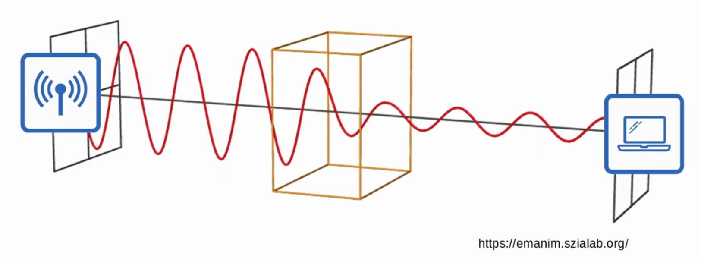

#### Signal Reflection

-   **Reflection** happens when a signal bounces off a material (e.g. metal)
    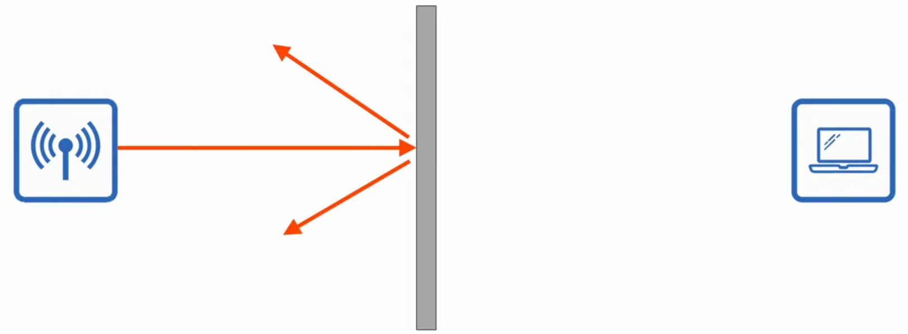
-   This is why Wi-Fi reception is usually poor in elevators. The signal bounces off the metal and very little penetrates into the elevator.

#### Signal Refraction

-   **Refraction** happens when a wave is bent when entering a medium where the signal travels at a different speed (e.g. glass and water can refract waves).
    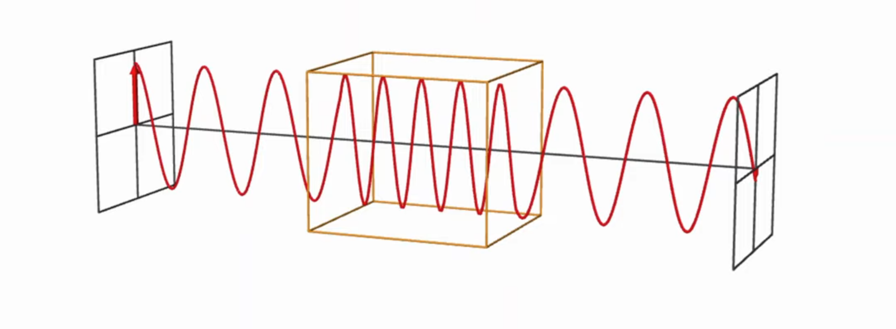

#### Signal Diffraction

-   **Diffraction** happens when a wave encounters an obstacle and travels around it.
    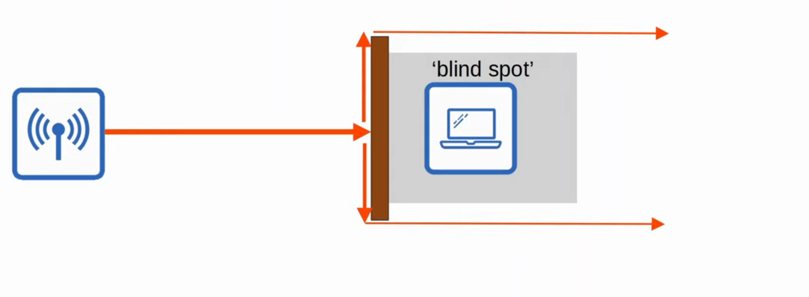

-   This can result in 'blind spots' behind the obstacle.

#### Signal Scattering

-   **Scattering** happens when a material causes a signal to scatter in all directions (e.g. dust, smog, uneven surfaces, etc. can cause scattering)
    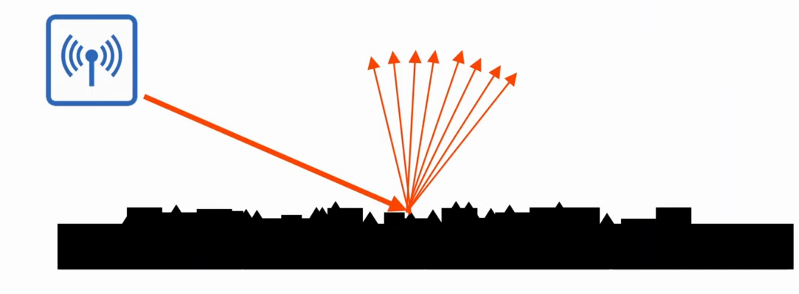

### Radio Frequence

-   To send wireless signals, the sender applies an alternating current to an antenna.

    -   This creates eletromagnetic fields which propagate out as waves.

-   Electromagnetic waves can be measured in multiple ways for example **amplitude** and **frequence**.

-   **Amplitude** is the maximum strength of the electric and magnetic fields.
    

-   **Frequency** measures the **number of up/down cycles per** a given **unit of time**.

-   The most common measurement of frequency is **Hertz**:
    -   Hz (Hertz) = cycles per second
    -   kHz (Kilohertz) = 1,000 cycles per second
    -   MHz (Megahertz) = 1,000,000 cycles per second
    -   GHz (Gigahertz) = 1,000,000,000 cycles per second
    -   THz (Terahertz) = 1,000,000,000,000 cycles per second

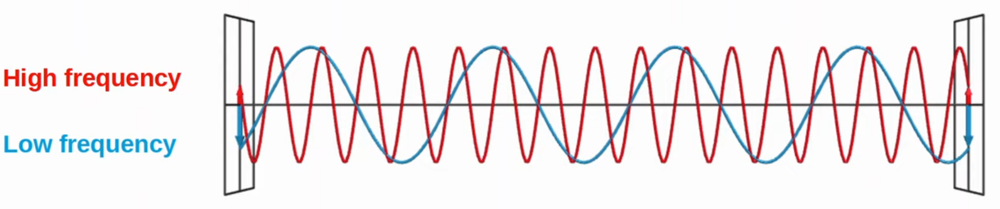

#### Example 1

-   Another important term is **period**, the amount of time of one cycle
    -   If the frequency is 4Hz, the period is 0.25 seconds

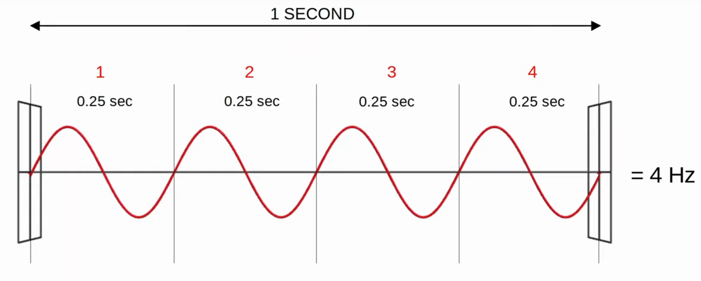

-   **Note:** `f = 1 / T`

-   The **visible frequency range** is about 400 THz to 790 THz.
-   The radio frequency range is from 30 Hz to 300 GHz and is used for many purposes.

    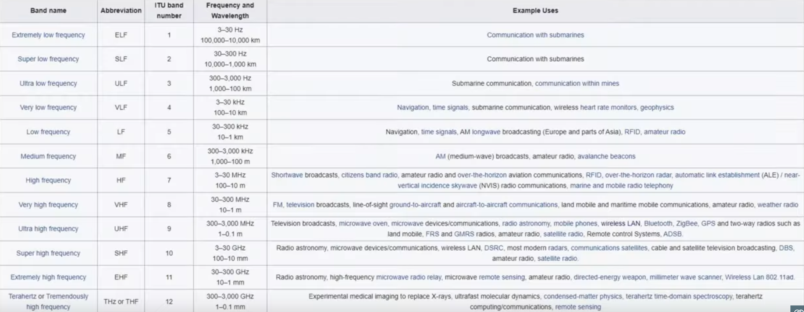

### Radio Frequence Bands

-   Wi-Fo uses two main bands (frequency ranges)

-   **2.4 GHz** to **2.4835 GHz**

    -   The actual range is 2.400 GHz to 2.4835 GHz

-   **5 GHz** band

    -   The actual range is from 5.160 GHz to 5.825 GHz
    -   Divided into four smaller bands

-   The **2.4 GHz band typically provides further reach in open space and better penetration of obstacles such as walls**.

    -   However, more devices tend to use the 2.4GHz band so **interference can be a bigger problem** compared to the 5 GHz band.

-   **Wi-Fi 6** (**802.11ax**) has expanded the spectrum range to include a band

### Channels

-   **Each band** is **divided** up **into** **multiple channels**.

    -   Devices are configured to transmit and receive traffic on one (or more) of this channels.

-   The 2.4GHz band is divided into several channels, each with a 22MHz range.

-   In a small wireless LAN with only a single AP, you can use any channel.
-   However, in larger WLANs with multiple APs, it's important that adjacent APs don't use overlapping channels. This helps avoid interference.
-   In the **2.4 GHz**, it is recommended to **use channels** **1**, **6** and **11**
    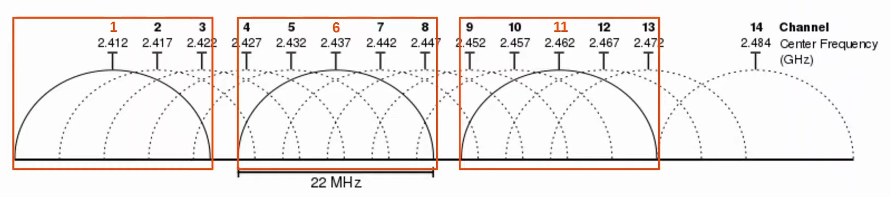

-   By using channels 1, 6 and 11, you can place APs in a 'honeycomb' pattern to provide complete coverage of an area withou interference between channels.

    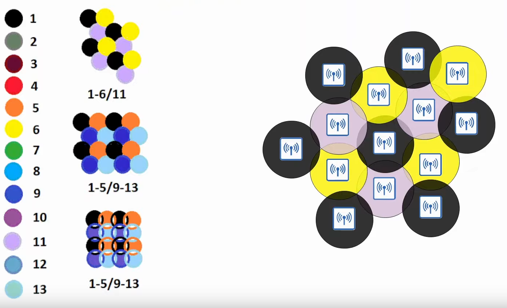

### 802.11 standards

| Standard | Frequencies | Max Data Rate (Theoretical) | Alternate Name |
| -------- | ----------- | --------------------------- | -------------- |
| 802.11   | 2.4 GHz     | 2 Mbps                      |                |
| 802.11b  | 2.4 GHz     | 11 Mbps                     |                |
| 802.11a  | 5 GHz       | 54 Mbps                     |                |
| 802.11g  | 2.4 GHz     | 54 Mbps                     |                |
| 802.11n  | 2.4/5 GHz   | 600 Mbps                    | Wi-Fi 4        |
| 802.11ac | 5 GHz       | 6.93 Gbps                   | Wi-Fi 5        |
| 802.11ax | 2.4/5/6 GHz | 4\*802.11ac                 | Wi-Fi 6        |

### Service Set

- 802.11 defines different kinds of **service sets** which are **groups of wireless network devices**.
- There are **three main types**:
    - **Independent**
    - **Infrastructure**
    - **Mesh**
- All devices in a service set share the same **SSID (service set identifier)**
- The **SSID is a human-readable name which identifies the service set**.
- The SSID **does not have to be unique**.
 
#### IBSS (Independent Basic Service Set)

- An **IBSS** is a **wireless network in which two or more wireless devices connect directly without using an AP** (Access Point).
- Also called an **ad hoc network**.
- Can be used for **file transfer** (e.g. AirDrop).
- Not scalable beyond a few devices.

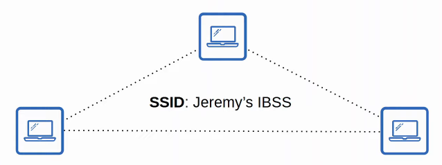

#### BSS (Basic Service Set)

- A **BSS (Basic Service Set)** is a kind of Infrastructure Service Set in which clients connect to each other via an **AP (Access Point)**, but not directly to each other.

- A **BSSID (Basic Service Set ID)** is used to identify the AP.
    - Other APs can use the same SSIF, but not the same BSSID.
    - The BSSID is the MAC address of the AP's radio.
- Wireless devices request to associate with the BSS.
- Wireless devices that have associated with the BSS are also called 'clients' or 'stations'.
- The **area around an AP where its signal is usable** is called a **BSA (Basic Service Area)**.
- **Clients** must **communicate via the AP**, not directly with each other.

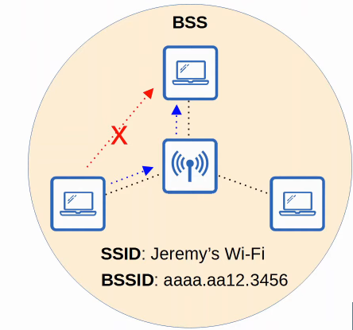

#### ESS (Extended Service Set)

- To **create larger wireless LANs** beyond the range of a single AP, we use an **ESS (Extended Service Set)**.
- **APs** with their own BSSs are **connected by a wired network**.
    - Each BSS uses the **same SSID**.
    - Each BSS has a **unique BSSID**.
    - Each BSS uses a **different channel** to avoid interference.

- Clients can pass between APs without having to reconnect providing a seamless Wi-Fi experience when moving between APs.
    - This is called **roaming**.
- The **BSAs should overlap about 10-15%**.

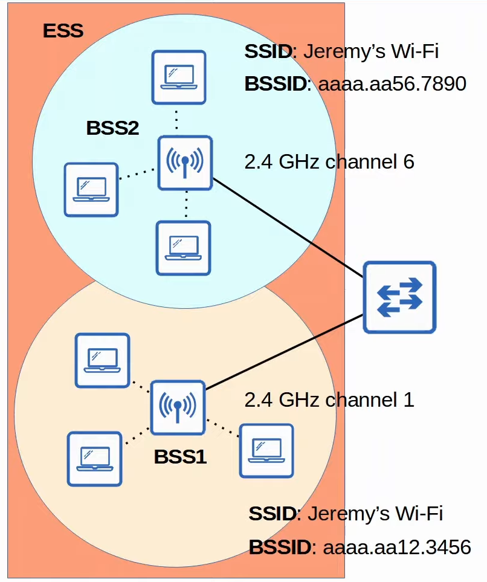

#### MBSS (Mesh Basic Service Set)

- An **MBSS (Mesh Basic Service Set)** can be used in situations where it's difficult to run an Ethernet connection to every AP.

- Mesh APs use two radios: one to provide a BSS to wireless clients and one to form a 'backhaul network' which is used to bridge traffuc from AP to AP.

- **At least one AP is connected to the wired network**, and it is called the **RAP (Root Access Point)**.
- The other Aps are called **MAP**s (**Mesh Access Points**).
- A **protocol is used to determine the best path through the mesh** (similar to how dynamic routing protocols are used to determine the best path to a destination).

### Distribution System

- Most wireless networks aren't standalone networks.
    - Rather they are a way for wireless clients to connect to the wired network infrastructure.

- In **802.11**, the **upstream wired network** is called the **DS (Distribution System)**
- In 802.11, the upstream wired network is called the **DS (Distribution System)**.
- Each wireless BSS or ESS is mapped to a VLAN in the wired network.

    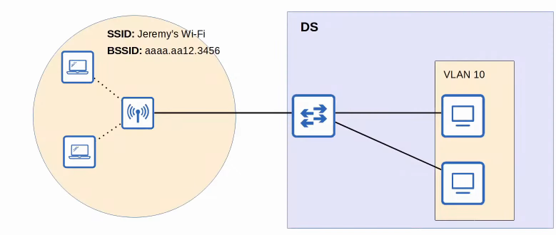

- It's possible for an AP to provide multiple wireless LANs, each with a unique SSID.
- Each WLAN is mapped to a separate VLAN and connected to the wired network via a trunk.
- Each WLAN uses a unique BSSID, usually by incrementing the last digit of the BSSID by one.

    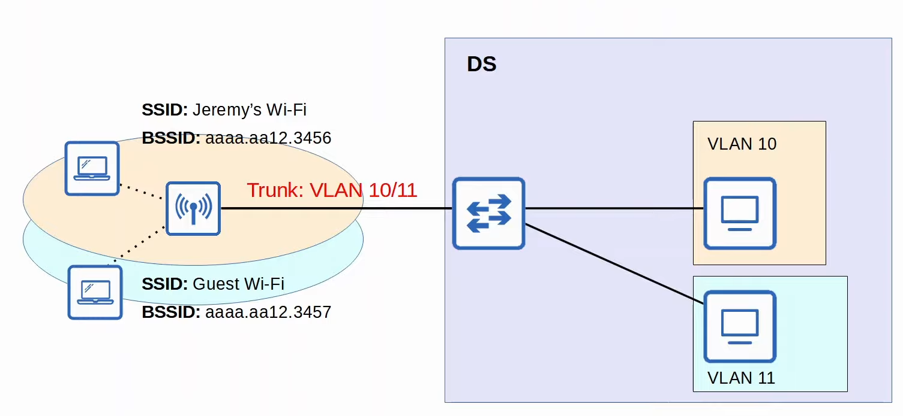

### Additional AP Operational Modes

- APs can operate in additional modes beyond the ones we've introduced so far.

#### Repeater Mode

- An AP in repeater mode **can be used to extend the range of a BSS**.
- The repeater will **simply retransmit any signal it receives from the AP**.
    - A repeater with a single radio must operate on the same channel as the AP, but this can drastically reduce the overall throughput on the channel.
    - A repeater with two radios can receive on one channel and then retransmit on another channel.

    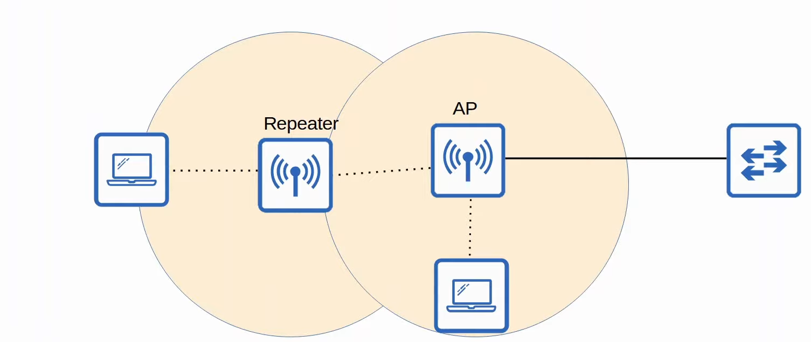

#### Workgroup Bridge (WGB)

- A workgroup bridge (WGB) **operates as a wireless client of another AP**, and can be used to **connect wired devices to the wireless network**.
- In the example below, PC1 does not have wireless capabilities and also does not have access to a wired connection to PC1.
- PC1 has a wired connection to the WGB, which has a wireless connection to the AP.

    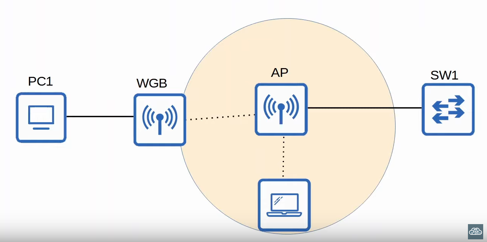

- There are **two kinds of WGBs**:
    - **Universal WGB (uWGB)**: is an 802.11 standard that allows one device to be bridged to the wireless network.
    - **WGB**: is a Cisco-proprietary version of the 802.11 standard that allows multiple wired clients to be bridged to the wireless network.

#### Outdoor Bridge

- An outdoor bridge can be used to **connect network over long distances without a physical cable connecting them**.
- The APs will use specialized antennas that focus most of the signal power in one direction, which **allows the wireless connection to be made over longer distances than normally possible**.
- The **connection can be point-to-point** as in the diagram below, or **point-to-multipoing** in which multiple sites connect to one central site.

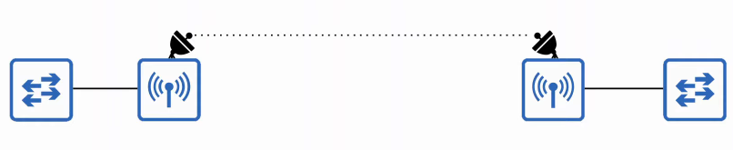

### Review

- **Wireless LANs** are defined **802.11**.
- Operates in **half duplex using CSMA/CD**.
- Wireless signals can be affectec by **absorption, reflection, refraction, diffraction and scattering**.
- Various aspects of waves can be measured, such as **amplitude, frequency** and **period**.
- **Frequency** is **measured in Hertz (Hz)**.
- **Wireless LANs** use **two frequency ranges**: the **2.4GHz** and the **5GHz**
    - **Wi-Fi 6 (802.11ax)** can use the **6GHz** range too.
- **Bands** are **divided into channels**.
- **5 GHz band** consists of **non-overlapping channels**.
- **2.4 GHz band channels overlap**. To **avoid overlapping**, use **channels 1, 6 and 11** (in North America).
- 802.11 standards (802.11b, 802.11a, etc.) and their frequencies/theoretical max data rates.
- **Service sets** are **groups of wireless devices**. **Three types**:
    - **Independent** (**IBSS**, also called **ad hoc**)
    - **Infrastructure** (**BSS**, **ESS**)
        - ***passing between APs in an ESS** is called **roaming**.
    - **Mesh** (**MBSS**)
- **Service sets** are **identified by** an **SSID** **(non-unique, human-readable)** and **BSSID** **(unique, MAC address of AP)**.
- The **area around an AP where its signal is usable** is called a **BSA**.
- The **upstream wired network** is called the **DS**.
- When **multiple WLANs are used**, **each** is **mapped to a separate VLAN on the wired network**.
- APs can also operate as a **repeater, workgroup bridge**, or **outdoor bridge**.

