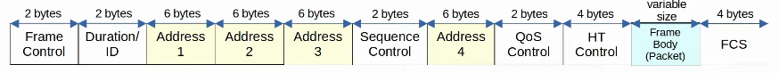
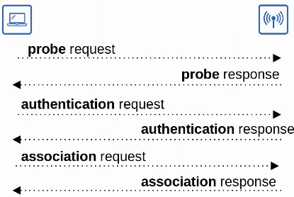
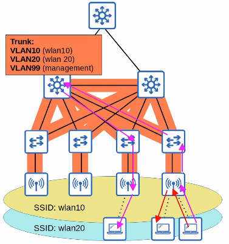
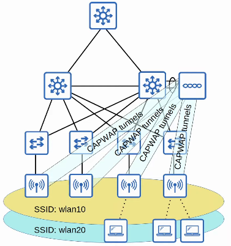
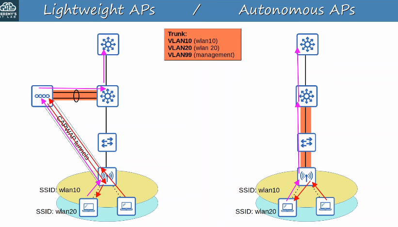
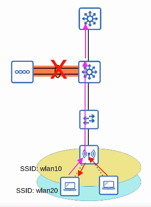

# Day 56 - Wireless Architectures

- 802.11 frames have a different format than 802.3 Ethernet frames.
- Depending on the 802.11 version and the message type, some fields migt not be present in the frame.
    - For example, not all messages use all 4 address fields.

---

- **Frame Control:** Provides information such as the message type and subtype.
- **Duration/ID:** Depending on the message type, this field can indicate:
    - the time (in microseconds) the channel will be dedicated for transmission of the frame.
    - an identifier for the association (connection).
- **Addresses:** Up to four addresses can be present in an 802.11 frame. Which addresses are present, and their order, depends on the message type:
    - **Destination Address (DA):** Final recipient of the frame.
    - **Source Address (SA):** Original sender of the frame.
    - **Receiver Address (RA):** Immediate recipient of the frame.
    - **Transmitter Address (TA):** Immediate sender of the frame.

- **Sequence Control:** Used to reassemble fragments and eliminate duplicate frames.
- **HT (High Throughput) Control:** Added in 802.11n to enable High Throughput operations.
    - **802.11n** is also known as **'High Throughput' (HT) Wi-Fi**.
    - **802.11ac** is also known as 'Very High Throughput' (VHT) Wi-Fi.
- **FCS (Frame Check Sequence):** Same as in an Ethernet frame, used to check for errors.

## 802.11 Association Process

- Access Points bridge traffic between wireless stations and other devices.
- For a station to send traffic through the AP it must be associated with the AP.
- There are **three 802.11 connection states**.
    - Not authenticated, not associated.
    - Authenticated, not associated.
    - Authenticated and associated.
- The **station must be authenticated and associated to the AP to send trafic through it**.

    

- There are two ways a station an scan for a BSS:
    - **Active Scanning:** The **station sends probe requests and listens for a probe response** **from** an **AP**.

    - **Passive Scanning:** The **station listens for beacon messages from** an **AP**.
        - **Beacon messages** are **sent periodically** by APs to advertise BSS.

## 802.11 Message Types

- There are **three 802.11 message types**.

- **Management:** used to manage the BSS.
    - Beacon
    - Probe request, probe response
    - Authentication
    - Association request, association response

- **Control:** Used to contol access to the medium (radio frequency). Assists with delivery of management and data frames.
    - RTS (Request to Send)
    - CTS (Clear to Send)
    - ACK

- **Data:** Used to send actual data packets.

## Autonomous APs

- There are **three main wireless AP deployment methods**:
    - **Authonomous**
    - **Lightweight**
    - **Cloud-based**

- **Autonomous APs** are **self-contained systems** that **don't rely on a WLC**.
- **Autonomous APs** are **configured individually**.
    - Can be configured by **console cable (CLI)**, **telnet/SSH (CLI)** or **HTTP/HTTPS web connection (GUI)**.
    - An **IP address** **for remote management** should be configured.
    - The **RF parameters** must be **manually configured** (transmit power, channel, etc.)
    - **Security policies** are **handled individually** **by each AP**.
    - **QoS rules etc.** are **configured individually on each AP**.

- There is **no central monitoring or management of APs**.

- Autonomous APs **connect to wired network with a trunk link**.
- **Data traffic from wireless clients has a very direct path to the entire network**. This is considered **bad practice**.
    - Large broadcast domains.
    - Spanning tree will disable links.
    - Adding/deleting VLANs is very labor-intensive.

- Autonomous APs can be used in small networks, but they are **not viable in medium to large networks**.
    - Large networks can have thousands of APs.

- Autonomous APs can also function in modes covered in the previous video: Repeater, Outdoor Bridge, Workgroup Bridge.

## Lightweight APs

- The functions of an AP can be split between the AP and a **Wireless LAN Controller (WLC)**.
- Lightweight APs handle 'real-time' operations like transmitting/receiving RF traffic, encryption/decryption of traffic, sending out beacons/probes, etc.
- **Other functions** are **carried out by a WLC** (e.g. RF management, security/QoS management, client authentication, client association/roaming management, etc.)
- This is called **split-MAC architecture**.
- The **WLC is also used to centrally configure the lightweight APs**.
- The WLC can be located in the same subnet/VLAN as the ligtweight APs it manages, or in a different subnet/VLAN.
- The WLC and the lightweight APs **authenticate each oter using digital certificates installed on each device** (X.905 standard certificates).
    - This ensures that only authorized APs can join the network.

- The WLC and lightweight APs use a protocol called **CAPWAP (Control And Provisioning Of Wireless Access Points)** to communicate.
    - Based on an older protocol called LWAPP (Lightweight Access Point Protocol)
- **Two tunnels** are **created between each AP and the WLC**
    - **Control Tunel** (**UDP port 5246**): 
        - Used to **configure the APs** and **control/manage operations**. 
        - **All traffic** in this tunnel is **encrypted by default**
    - **Data Tunel** (**UDP port 5247**):
        - **All traffic from wireless clients** is **sent through this tunnel to the WLC**. 
            - It **does not go directly to the wired network.**
        - Traffic in this tunnel is **not encrypted by default**, but you can configure it to be encrypted with DTLS (Datagram Transport Layer Security).

- Because all traffic from wireless clients is tunneled to the WLC with CAPWAP, **APs connect to switch access ports, not trunk access ports**.

### Autonomous vs Lightweight APs

### Benefits of Lightweight APs

- There are some key benefits to split-MAC architecture, here are a few:
    - **Scalability:** With a WLC (or multiple in very large networks) it's much simpler to build and support a network with thousands of APs.
    - **Dynamic channel assignment:** The WLC can automatically select which channel each AP should use.
    - **Transmit power optimization:** The WLC can automatically set the appropriate transmit power for each AP.
    - **Self-healing wireless coverage:** When an AP stops functioning, the WLC can increase the transmit power of nearby APs to avoid coverage holes.
    - **Seamless roaming:** Clients can roam between APs with no noticeable delay.
    - **Client load balancing:** If a client is in range of two APs, the WLC can associate the client with the least-used  AP, to balance the load among APs.
    - **Security/QoS management:** Central management of security and QoS policies ensures consistency across the network.

### Modes

- Lightweight APs can be configured to operate in various modes:

- **Local:** This is the default mode where the AP offers a BSS (more multiple BSSs) for clients to associate with.

- **FlexConnect:** Like a lightweight AP in Local mode, it offers one or more BSSs for clients to associate with. However, FlexConnect allows the AP to locally switch traffic between the wired and wireless network if the tunnels to the WLC go down.

    

- **Sniffer:** The AP does not offer a BSS for clients. It is dedicated to receiving 802.11 frames to detect rogue devices. If a client is found to be a rogue device, an AP can send de-authentication messages to disassociate the rogue device from the AP.

- **Rogue Detector:** The AP does not even use its radio. It listens to traffic on the wired network only, but it receives a list of suspected rogue clients and AP MAC addresses from the WLC. By listening to ARP messages on the wired network and correlating it with with the information it receives from the WLC, it can detect rogue devices.

- **SE-Connect (Spectrum Expert Connect):** The AP does not offer a BSS for clients. It is dedicated to RF spectrum analysis on all channels. It can send information to software such as Cisco Spectrum Expert on a PC to collect and analyze data.

- **Bridge/Mesh:** Like the autonomous AP's Outdoor Bridge, the lightweight AP can be a dedicated bridge between sites, for example, over long distances. A mesh can be made between the access points.

- **Flex plus Bridge:** Adds FlexConnect functionality to the Bridge/Mesh mode. Allows wireless access points to locally forward traffic even if connectivity to the WLC is lost.

## Cloud Based APs

- Cloud-Based AP architecture is in between autonomous AP and split-MAC architecture.
    - Autonomous APs that are centrally managed in the cloud.

- Cisco Meraki is a popular cloud-based Wi-Fi solution.

- The Meraki dashboard can be usde to configure APs, monitor the network, generate performance reports, etc.
    - Meraki also tells each AP which channel to use, what transmit power, etc.
- However, data traffic is not sent to the cloud. It is sent directly to the wired network like when using autonomous APs.
    - Only management/control traffic is sent to the cloud.

## WLC Deployments

In a split-MAC architecture, there are four main WLC deployment models:
- **Unified:** The WLC is a hardware appliance in a central location of the network.
    - A unified WLC can support **up to 6000 APs**.
    - If more than 6000 APs are needed, additional WLCs can be added to the network.
- **Cloud-based:** The WLC is a VM running on a server, usually in a private cloud in a data center. This is not the same as the cloud-based AP architecture discussed previously.
    - Cloud-based WLCs can typically support **up to 3000 APs**.
    - If more than 3000 APs are needed, more WLCs can be deployed.
- **Embedded:** The WLC is integrated within a switch.
    - An embedded WLC can support **up to about 200 APs**.
    - If more than 200 APs are needed, more switches with embedded WLCs can be added.
- **Mobility Expres:** The WLC is integrated within an AP.
    - A mobility express wlc can support **up to 100 aps**
    - If more than 100 APs are needed, more mobility express WLCs can be deployed.

