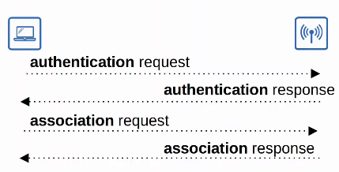
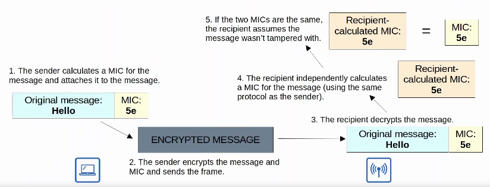
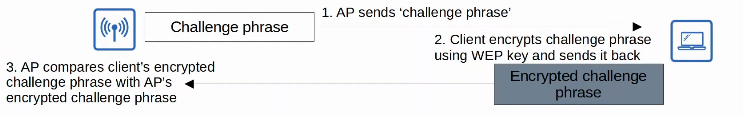
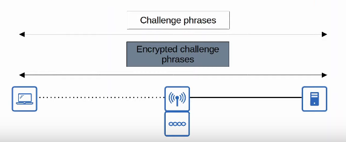
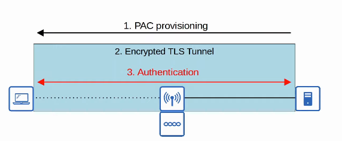
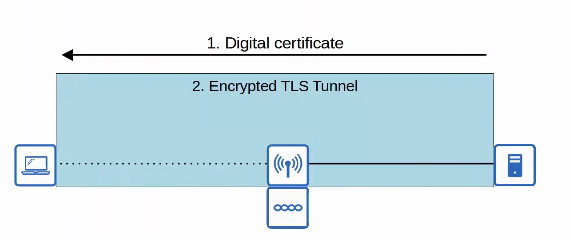
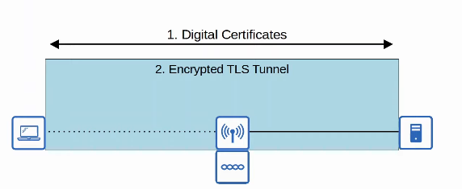
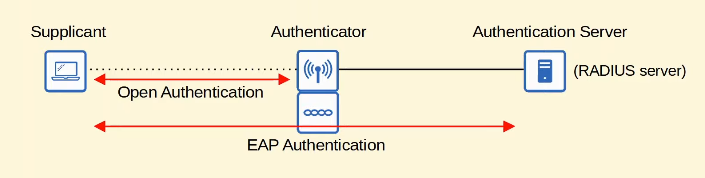

# Day 57 - Wireless Security

- Although security is important in all networks, it is even more essential in wireless networks.
- Because wireless signals arenot contained within a wire, any device within range of the signal can receive the traffic.
- In wired networks, traffic is often only encrypted when sent over an untrusted network such as the internet.
- In wireless networks, it is very important to encrypt traffic sent between the wireless clients and the AP.

### Authentication

- All clients must be authenticated before they can associate with an AP.
- In a coporate setting, only trusted users/devices should be given access to the network.
    - In corporate settings, a separate SSID which doesn't have access to the corporate network can be provided for guest users.
- Ideally, clients should also authenticate the AP to avoid associating with a malicious AP.
- There are multiple ways to authenticate:
    - Password
    - Username/Password
    - Certificates

    

### Encryption

- Traffic sent between the clients and APs should be encrypted so that it can't be read by anyone except the AP and the client.
- There are many possible protocols that can be used to encrypt traffic.
- All devices on the WLAN will use the same protocol, however each client will use a unique encryption/decryption key so that other devices can't read its traffic.
- A 'group key' is used by the AP to encrypt traffic that it wants to send to all of its clients.
    - All of the clients associated with the AP keep that key so they can decrypt the traffic.

### Integrity

- Integrity ensures that a message is not modified by a third-party. The message that is sent by the source host should be the same as the message that is received by the destination host.
- A **MIC (Message Integrity Check)** is added to messages to help protect their integrity.
    

## Authentication Methods

- The original 802.11 standard included two options for authentication:
    - **Open Authentication:**
        - The client sends an authentication request, and the AP accepts it. No questions asked!
        - This is clearly **not a secure authentication method**.
        - After the client is authenticated an associated with the AP, it's possible to require the user to authenticate via other methods before access to the network is granted (ie. Starbuck's WiFi).
    - **WEP (Wired Equivalent Privacy):**
        - WEP is used to provide both **authentication and encryption of wireless traffic**.
        - For encryption, WEP uses the **RC4 algorithm**.
        - WEP is a **'shared-key' protocol**, requiring the sender and receiver to have the same key.
        - **WEP keys** can be **40 bits or 104 bits in length**.
        - The above keys are combined with a 24-bit 'IV' (Initialization Vector) to bring the total length to 64 bits or 128 bits.
        - WEP encryption is **not secure** and **can easily be cracked**.
        - WEP can be used for authentication like the following:
            
    - **EAP (Extensible Authentication Protocol):**
        - EAP is an **authentication framework**.
        - It defines a standard set of authentication functions that are used by the various EAP Methods.
        - There are various EAP methods: LEAP, EAP-FAST, PEAP, and EAP-TLS, etc.
        - EAP is **integrated with 802.1X**, which provides port-based network access control.
    -  **LEAP (Lightweight EAP)**
        - **LEAP** was **developed by Cisco** as an **improvement over WEP**.
        - **Clients** must **provide a username and password to authenticate**
        - In addition, **mutual authentication** is **provided by both the client and server sending a challenge to each other**.
        - **Dynamic WEP keys** are used, meaning that the WEP keys are changed frequently.
        - Like WEP, LEAP is considered **vulnerable** and should not be used anymore.
            

    - **EAP-FAST (EAP Flexible Authentication via Secure Tunneling):**
        - EAP-Fast was also **developed by Cisco**.
        - Consists of **three phases**:
            1) A **PAC (Protected Access Credential)** is generated and passed from the server to the client.
            2) A secure TLS tunnel is established between the client and authentication server.
            3) Inside of the secure (encrypted) TLS tunnel, the client and server communicate further to authenticate/authorize the client.
                

    - **PEAP (Protected EAP):**
        - Like EAP-FAST, PEAP involves establishing a secure TLS tunnel between the client and server.
        - Instead of a PAC, the **server has a digital certificate**.
        - This certificate is also used to establish a **TLS tunnel**.
        - Because only the server provides a certificate for authentication, the client must still be authenticated within the secure tunnel, for example by using MS-CHAP (Microsoft Challenge-Handshake Authentication Protocol)
            

    - **EAP-TLS (EAP Transport Layer Security):**
        - Whereas PEAP only requires the AS to have a certificate, EAP-TLS **requires a certificate on the AS and on every single client**.
        - EAP-TLS is the **most secure wireless authentication method**, but it is more **difficult to implement** than PEAP because every client device needs a certificate.
        - Because the client and server authenticate each other with digital certificates, there is no need to authenticate the client within the TLS tunnel.
        - The TLS tunnel is still used to exchange encryption key information.

        
    
    - 
#### 802.1x

- 802.1x is used to limit network access for clients connected to a LAN or WLAN until they authenticate.
- There are **three main entities** in 802.1X:
    - **Supplicant:** The device that wants to connect to the network.
    - **Authenticator:** The device that provides access to the network.
    - **Authentication Service (AS):** The device that receives client credentials and permits/denies access.

    

## Encryption and Integrity Methods

### TKIP (Temporal Key Integrity Protocol)

- WEP was found to be vulnerable, but wireless hardware at the time was built to use WEP.
- A temporary solution was needed until a new standard was created and new hardware was built.
- TKIP adds various **security features**:
    - A **MIC (Message Integrity Check)** is added ti oritect the integrity of messages.
    - A **Key mixing algorithm** is used to create a unique **WEP key for every frame**. 
    - The **Initialization Vector** is **doubled from 24 to 48 bits**, making brute-force attacks much more difficult.
    - The **MIC includes the sender MAC address to identify te frame's sender**.
    - A **timestamp is added to the MIC** to **prevent replay attacks**. 
        - Replay attacks involve re-sending a frame that has already been transmitted.
    - A **TKIP sequence number** is used to **keep track of frame sent from from each source MAC address**. This also protects against replay attacks.

- TKIP is **used in WPA version 1**.

### CCMP (Counter/CBC-MAC Protocol)

- CCMP was **developed after TKIP** and is **more secure**.
- It is **used in WPA2**.
- To use CCMP, it **must be supported by the device's hardware**. Old hardware built only to use WEP/TKIP cannot use CCMP.
- CCMP consists of two different algorithms to provide encryption and MIC.
    1) **AES (Advanced Encryption Standard) counter mode** encryption
        - AES is the most secure encryption protocol currently available. It is widely used over the world.
        - There are multiple modes of operation for AES. CCMP uses 'counter mode'
    2) **CBC-MAC (Cipher Block Chaining Message Authentication Code)** is used as a MIC to ensure integrity of messages.

### GCMP (Galois/Counter Mode Protocol)

- GCMP is **more secure and more efficient than CCMP**.
- Its increaded efficiency allows **higher data throughput than CCMP**.
- It is **used in WPA3**.
- GCMP **consists of two algorithms**:
    1) **AES counter mode** encryption.
    2) **GMAC (Galois Message Authentication Code)** is used as a MIC to ensure the integrity of messages.

## WiFi Protected Access

- The Wi-Fi alliance has developed three WPA certifications for wireless devices:
    - WPA
    - WPA2
    - WPA3
- To be WPA-certified, equipment must be tested in authorized testing labs.
- All of the above support **two authentication modes**:
    - **Personal Mode:** A pre-shared key (PSK) is used for authentication. When you connect a home Wi-Fi network, enter the password and are authenticated, that is **personal** mode.
        - common in small networks  (e.g. SOHO networks)
        - The PSK itself isn't sent over the air. A **four-way handshake** is used for authentication, and the PSK is usde to generate the encryption keys.
    - **Enterprise Mode:** 802.1X is used with an authentication server (e.g. RADIUS server).
        - No specific EAP method is specified, so all are supported (PEAP, EAP-TLS, etc.)

- The **WPA** certification was developed after WEP was proven to be vulnerable and includes the following protocols:
    - TKIP (based on WEP) provides encryption/MIC.
    - 802.1X authentication (Enterprise mode) or PSK (Personal Mode).

- **WPA2** was released in 2004 and includes the following protocols:
    - **CCMP** provides encryption/MIC.
    - **802.1X authentication (Enterprise mode)** or **PSK (Personal mode)**

- **WPA3** was released in 2018 and includes the following protocols:
    - **GCMP** provides encryption/MIC.
    - **802.1X authentication (Enterprise mode)** or **PSK (Personal mode)**
    - WPA3 also provides **several additional security features**, for example:
        - **PMF (Protected Management Frames)**, protecting 802.11 management frames from eavesdropping/forging.
        - **SAE (Simultaneous Authentication of Equals)** protects the four-way handshake when using personal mode authentication.
        - **Forward secrecy** prevents data from being decrypted after it has been transmitted over the air. So, an attacker can't capture wireless frames and then try to decrypt them later.