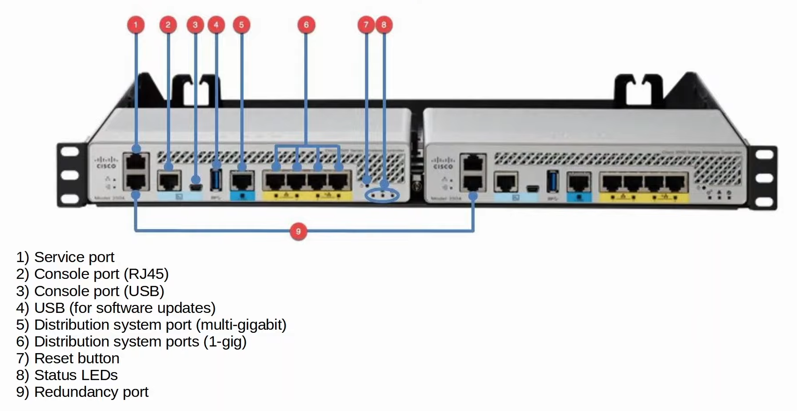

# Day 58 - Wireless Configuration

- WLCs only support static LAG (no PAgP or LACP).   
- **Option 43** can be used to **tell the IP address of their WLC**.
    - not always necessary since the APs and WLC are in the same subnet. The WLC will hear the APs broadcast CAPWAP discovery messages.
    - `SW1(dhcp-config)#option 43 ip <ip-addr>`

- WLC initial setup is made via a wizard

## WLC Ports/Interfaces

- WLC **ports** are the **physical ports that cables connect to**.
- WLC **interfaces** are the **logical interfaces within the WLC** (ie. SVIs on a switch).
- WLCs have a few different kinds of **ports**:
    - **Service port:** A dedicated management port. Used for out-of-band management. Must connect to a switch access port because it only supports one VLAN. This port can be used to connect to the device while it is booting, perform system recovery, etc.
    - **Distribution system port:** These are the standard network ports that connect to the 'distribution system' (wired network) and are used for data traffic. These ports usually connect to switch trunk ports, and if multiple distribution ports are used they can form a LAG.
    - **Console port:** This is a standard console port, either RJ45 or USB.
    - **Redundancy port:** This port is used to connect to another WLC to form a high availability (HA) pair.

    

- WLCs have a few different kinds of **interfaces**:
    - **Management interface:** Used for management traffic such as Telnet, SSH, HTTP, HTTPS, RADIUS authentication, NTP, Syslog, etc. CAPWAP tunnels are also formed to/from the WLC's management interface.
    - **Redundancy management interface:** When two WLCs are connected by their redundancy ports, one WLC is 'active' and the other is 'standby'. This interface can be used to connect to and manage the 'standby' WLC.
    - **Virtual interface:** This interface is used when communicating with wireless clients to relay DHCP requests, perform client web authentication, etc.
    - **Service port interface:** If the service port is used, this interface is bound to it and usde for out-of-band management.
    - **Dynamic interface:** These are the interfaces used to map a WLAN to a VLAN. For example, traffic from the 'Internal' WLAN will be sent to the wired network from the WLC's 'Internal' dynamic interference.

## WLC Configuration

- **Web authentication:** After the wireless clients gets an IP address and tries to access a web page, they will have to enter a username and password to authenticate.
- **Web Passthrough:** Similar to the above, but no username or password are required. A warning or statement is displayed and the client simply has to agree to gain access to the Internet.
- The Conditional and Splash Page web redirect options are similar, but additionally require 802.1X layer 2 authentication.
- **CPU ACLs** are used to limitaccess to the CPU of the WLC. This limits which devices will be able to connect to the WLC via Telnet/SSH, HTTP/HTTPS, retrieve SNMP information from the WLC, etc.